# Spring 初级

**今日目标**

> * 掌握Spring相关概念
> * 完成IOC/DI的入门案例编写
> * 掌握IOC的相关配置与使用
> * 掌握DI的相关配置与使用

## 1，内容介绍

对于一门新技术，我们需要从`为什么要学`、`学什么`以及`怎么学`这三个方向入手来学习。那对于Spring来说:

### 1.1 为什么要学?

* 从使用和占有率看

  * Spring在市场的占有率与使用率高

  * Spring在企业的技术选型命中率高

  * 所以说,Spring技术是JavaEE开发必备技能，企业开发技术选型命中率>==90%==

    

    **说明**:对于未使用Spring的项目一般都是些比较老的项目，大多都处于维护阶段。

* 从专业角度看

  * 随着时代发展，软件规模与功能都呈几何式增长，开发难度也在不断递增，该如何解决?
    * Spring可以==简化开发==，降低企业级开发的复杂性，使开发变得更简单快捷
  * 随着项目规模与功能的增长,遇到的问题就会增多，为了解决问题会引入更多的框架，这些框架如何协调工作?
    * Spring可以==框架整合==，高效整合其他技术，提高企业级应用开发与运行效率

  综上所述，==Spring是一款非常优秀而且功能强大的框架，不仅要学，而且还要学好。==

### 1.2 学什么?

从上面的介绍中，我们可以看到Spring框架主要的优势是在`简化开发`和`框架整合`上，至于如何实现就是咱们要学习Spring框架的主要内容:

* 简化开发: Spring框架中提供了两个大的核心技术，分别是:

  * ==IOC==
  * ==AOP==
    * ==事务处理==

   1.Spring的简化操作都是基于这两块内容,所以这也是Spring学习中最为重要的两个知识点。

   2.事务处理属于Spring中AOP的具体应用，可以简化项目中的事务管理，也是Spring技术中的一大亮点。

* 框架整合: Spring在框架整合这块已经做到了极致，它可以整合市面上几乎所有主流框架，比如:

  - ==MyBatis==
  - MyBatis-plus
  - Struts
  - Struts2
  - Hibernate
  - ……

  这些框架中，我们目前只学习了MyBatis，所以在Spring框架的学习中，主要是学习如何整合MyBatis。

  综上所述，对于Spring的学习，主要学习四块内容:

  ==(1)IOC,(2)整合Mybatis(IOC的具体应用)，(3)AOP,(4)声明式事务(AOP的具体应用)==

### 1.3 怎么学?

* 学习Spring框架设计思想
  * 对于Spring来说，它能迅速占领全球市场，不只是说它的某个功能比较强大，更重要是在它的`思想`上。
* 学习基础操作，思考操作与思想间的联系
  * 掌握了Spring的设计思想，然后就需要通过一些基础操作来思考操作与思想之间的关联关系
* 学习案例，熟练应用操作的同时，体会思想
  * 会了基础操作后，就需要通过大量案例来熟练掌握框架的具体应用，加深对设计思想的理解。

介绍完`为什么要学`、`学什么`和`怎么学`Spring框架后，大家需要重点掌握的是:

* Spring很优秀，需要认真重点的学习
* Spring的学习主线是IOC、AOP、声明式事务和整合MyBais

接下来，咱们就开始进入Spring框架的学习。

## 2，Spring相关概念

### 2.1 初识Spring

在这一节，主要通过以下两个点来了解下Spring:

#### 2.1.1 Spring家族

* 官网：https://spring.io，从官网我们可以大概了解到：

  * Spring能做什么:用以开发web、微服务以及分布式系统等,光这三块就已经占了JavaEE开发的九成多。
  * Spring并不是单一的一个技术，而是一个大家族，可以从官网的`Projects`中查看其包含的所有技术。

* Spring发展到今天已经形成了一种开发的生态圈,Spring提供了若干个项目,每个项目用于完成特定的功能。

  * Spring已形成了完整的生态圈，也就是说我们可以完全使用Spring技术完成整个项目的构建、设计与开发。

  * Spring有若干个项目，可以根据需要自行选择，把这些个项目组合起来，起了一个名称叫==全家桶==，如下图所示

    

    **说明:**

    图中的图标都代表什么含义，可以进入`https://spring.io/projects`网站进行对比查看。

    这些技术并不是所有的都需要学习，额外需要重点关注`Spring Framework`、`SpringBoot`和`SpringCloud`:

    

    * Spring Framework:Spring框架，是Spring中最早最核心的技术，也是所有其他技术的基础。
    * SpringBoot:Spring是来简化开发，而SpringBoot是来帮助Spring在简化的基础上能更快速进行开发。
    * SpringCloud:这个是用来做分布式之微服务架构的相关开发。

    除了上面的这三个技术外，还有很多其他的技术，也比较流行，如SpringData,SpringSecurity等，这些都可以被应用在我们的项目中。我们今天所学习的Spring其实指的是==Spring Framework==。

#### 2.1.2 了解Spring发展史

 接下来我们介绍下Spring Framework这个技术是如何来的呢?


Spring发展史

* IBM(IT公司-国际商业机器公司)在1997年提出了EJB思想,早期的JAVAEE开发大都基于该思想。
* Rod Johnson(Java和J2EE开发领域的专家)在2002年出版的`Expert One-on-One J2EE Design and Development`,书中有阐述在开发中使用EJB该如何做。
* Rod Johnson在2004年出版的`Expert One-on-One J2EE Development without EJB`,书中提出了比EJB思想更高效的实现方案，并且在同年将方案进行了具体的落地实现，这个实现就是Spring1.0。
* 随着时间推移，版本不断更新维护，目前最新的是Spring5
  * Spring1.0是纯配置文件开发
  * Spring2.0为了简化开发引入了注解开发，此时是配置文件加注解的开发方式
  * Spring3.0已经可以进行纯注解开发，使开发效率大幅提升，我们的课程会以注解开发为主
  * Spring4.0根据JDK的版本升级对个别API进行了调整
  * Spring5.0已经全面支持JDK8，现在Spring最新的是5系列所以建议大家把JDK安装成1.8版

本节介绍了Spring家族与Spring的发展史，需要大家重点掌握的是:

* 今天所学的Spring其实是Spring家族中的Spring Framework
* Spring Framework是Spring家族中其他框架的底层基础，学好Spring可以为其他Spring框架的学习打好基础

### 2.2 Spring系统架构

前面我们说spring指的是Spring Framework,那么它其中都包含哪些内容以及我们该如何学习这个框架?

针对这些问题，我们将从`系统架构图`和`课程学习路线`来进行说明:

#### 2.2.1 系统架构图

* Spring Framework是Spring生态圈中最基础的项目，是其他项目的根基。

* Spring Framework的发展也经历了很多版本的变更，每个版本都有相应的调整

  

* Spring Framework的5版本目前没有最新的架构图，而最新的是4版本，所以接下来主要研究的是4的架构图

  

  (1)核心层

  * Core Container:核心容器，这个模块是Spring最核心的模块，其他的都需要依赖该模块

  (2)AOP层

  * AOP:面向切面编程，它依赖核心层容器，目的是==在不改变原有代码的前提下对其进行功能增强==
  * Aspects:AOP是思想,Aspects是对AOP思想的具体实现

  (3)数据层

  * Data Access:数据访问，Spring全家桶中有对数据访问的具体实现技术
  * Data Integration:数据集成，Spring支持整合其他的数据层解决方案，比如Mybatis
  * Transactions:事务，Spring中事务管理是Spring AOP的一个具体实现，也是后期学习的重点内容

  (4)Web层

  * 这一层的内容将在SpringMVC框架具体学习

  (5)Test层

  * Spring主要整合了Junit来完成单元测试和集成测试

#### 2.2.2 课程学习路线

介绍完Spring的体系结构后，从中我们可以得出对于Spring的学习主要包含四部分内容，分别是:

* ==Spring的IOC/DI==
* ==Spring的AOP==
* ==AOP的具体应用,事务管理==
* ==IOC/DI的具体应用,整合Mybatis==


对于这节的内容，大家重点要记住的是Spring需要学习的四部分内容。接下来就从第一部分开始学起。

### 2.3 Spring核心概念

在Spring核心概念这部分内容中主要包含`IOC/DI`、`IOC容器`和`Bean`,那么问题就来了，这些都是什么呢?

#### 2.3.1 目前项目中的问题

要想解答这个问题，就需要先分析下目前咱们代码在编写过程中遇到的问题:


(1)业务层需要调用数据层的方法，就需要在业务层new数据层的对象

(2)如果数据层的实现类发生变化，那么业务层的代码也需要跟着改变，发生变更后，都需要进行编译打包和重部署

(3)所以，现在代码在编写的过程中存在的问题是：==耦合度偏高==

针对这个问题，该如何解决呢?


我们就想，如果能把框中的内容给去掉，不就可以降低依赖了么，但是又会引入新的问题，去掉以后程序能运行么?

答案肯定是不行，因为bookDao没有赋值为Null，强行运行就会出空指针异常。

所以现在的问题就是，业务层不想new对象，运行的时候又需要这个对象，该咋办呢?

针对这个问题，Spring就提出了一个解决方案:

* 使用对象时，在程序中不要主动使用new产生对象，转换为由==外部==提供对象

这种实现思就是Spring的一个核心概念

#### 2.3.2 IOC、IOC容器、Bean、DI

1. ==IOC（Inversion of Control）控制反转==

(1)什么是控制反转呢？

* 使用对象时，由主动new产生对象转换为由==外部==提供对象，此过程中对象创建控制权由程序转移到外部，此思想称为控制反转。
  * 业务层要用数据层的类对象，以前是自己`new`的
  * 现在自己不new了，交给`别人[外部]`来创建对象
  * `别人[外部]`就反转控制了数据层对象的创建权
  * 这种思想就是控制反转
  * 别人[外部]指定是什么呢?继续往下学

(2)Spring和IOC之间的关系是什么呢?

* Spring技术对IOC思想进行了实现
* Spring提供了一个容器，称为==IOC容器==，用来充当IOC思想中的"外部"
* IOC思想中的`别人[外部]`指的就是Spring的IOC容器

(3)IOC容器的作用以及内部存放的是什么?

* IOC容器负责对象的创建、初始化等一系列工作，其中包含了数据层和业务层的类对象
* 被创建或被管理的对象在IOC容器中统称为==Bean==
* IOC容器中放的就是一个个的Bean对象

(4)当IOC容器中创建好service和dao对象后，程序能正确执行么?

* 不行，因为service运行需要依赖dao对象
* IOC容器中虽然有service和dao对象
* 但是service对象和dao对象没有任何关系
* 需要把dao对象交给service,也就是说要绑定service和dao对象之间的关系

像这种在容器中建立对象与对象之间的绑定关系就要用到DI:

2. ==DI（Dependency Injection）依赖注入==


(1)什么是依赖注入呢?

* 在容器中建立bean与bean之间的依赖关系的整个过程，称为依赖注入
  * 业务层要用数据层的类对象，以前是自己`new`的
  * 现在自己不new了，靠`别人[外部其实指的就是IOC容器]`来给注入进来
  * 这种思想就是依赖注入

(2)IOC容器中哪些bean之间要建立依赖关系呢?

* 这个需要程序员根据业务需求提前建立好关系，如业务层需要依赖数据层，service就要和dao建立依赖关系

介绍完Spring的IOC和DI的概念后，我们会发现这两个概念的最终目标就是:==充分解耦==，具体实现靠:

* 使用IOC容器管理bean（IOC)
* 在IOC容器内将有依赖关系的bean进行关系绑定（DI）
* 最终结果为:使用对象时不仅可以直接从IOC容器中获取，并且获取到的bean已经绑定了所有的依赖关系.

#### 2.3.3 核心概念小结

这节比较重要，重点要理解`什么是IOC/DI思想`、`什么是IOC容器`和`什么是Bean`：

(1)什么IOC/DI思想?

* IOC:控制反转，控制反转的是对象的创建权
* DI:依赖注入，绑定对象与对象之间的依赖关系

(2)什么是IOC容器?

Spring创建了一个容器用来存放所创建的对象，这个容器就叫IOC容器

(3)什么是Bean?

容器中所存放的一个个对象就叫Bean或Bean对象

## 3，入门案例

介绍完Spring的核心概念后，接下来我们得思考一个问题就是，Spring到底是如何来实现IOC和DI的，那接下来就通过一些简单的入门案例，来演示下具体实现过程:

### 3.1 IOC入门案例

对于入门案例，我们得先`分析思路`然后再`代码实现`，

#### 3.1.1 入门案例思路分析

(1)Spring是使用容器来管理bean对象的，那么管什么? 

* 主要管理项目中所使用到的类对象，比如(Service和Dao)

(2)如何将被管理的对象告知IOC容器?

* 使用配置文件

(3)被管理的对象交给IOC容器，要想从容器中获取对象，就先得思考如何获取到IOC容器?

* Spring框架提供相应的接口

(4)IOC容器得到后，如何从容器中获取bean?

* 调用Spring框架提供对应接口中的方法

(5)使用Spring导入哪些坐标?

* 用别人的东西，就需要在pom.xml添加对应的依赖

#### 3.1.2 入门案例代码实现

> 需求分析:将BookServiceImpl和BookDaoImpl交给Spring管理，并从容器中获取对应的bean对象进行方法调用。
>
> 1.创建Maven的java项目
>
> 2.pom.xml添加Spring的依赖jar包
>
> 3.创建BookService,BookServiceImpl，BookDao和BookDaoImpl四个类
>
> 4.resources下添加spring配置文件，并完成bean的配置
>
> 5.使用Spring提供的接口完成IOC容器的创建
>
> 6.从容器中获取对象进行方法调用

##### 步骤1:创建Maven项目


##### 步骤2:添加Spring的依赖jar包

pom.xml

```xml
<dependencies>
    <dependency>
        <groupId>org.springframework</groupId>
        <artifactId>spring-context</artifactId>
        <version>5.2.10.RELEASE</version>
    </dependency>
    <dependency>
        <groupId>junit</groupId>
        <artifactId>junit</artifactId>
        <version>4.12</version>
        <scope>test</scope>
    </dependency>
</dependencies>
```

##### 步骤3:添加案例中需要的类

创建BookService,BookServiceImpl，BookDao和BookDaoImpl四个类

```java
public interface BookDao {
    public void save();
}
public class BookDaoImpl implements BookDao {
    public void save() {
        System.out.println("book dao save ...");
    }
}
public interface BookService {
    public void save();
}
public class BookServiceImpl implements BookService {
    private BookDao bookDao = new BookDaoImpl();
    public void save() {
        System.out.println("book service save ...");
        bookDao.save();
    }
}
```

##### 步骤4:添加spring配置文件

resources下添加spring配置文件applicationContext.xml，并完成bean的配置


##### 步骤5:在配置文件中完成bean的配置

```xml
<?xml version="1.0" encoding="UTF-8"?>
<beans xmlns="http://www.springframework.org/schema/beans"
       xmlns:xsi="http://www.w3.org/2001/XMLSchema-instance"
       xsi:schemaLocation="http://www.springframework.org/schema/beans http://www.springframework.org/schema/beans/spring-beans.xsd">
 
    <!--bean标签标示配置bean
    	id属性标示给bean起名字
    	class属性表示给bean定义类型
	-->
	<bean id="bookDao" class="com.itheima.dao.impl.BookDaoImpl"/>
    <bean id="bookService" class="com.itheima.service.impl.BookServiceImpl"/>

</beans>
```

**==注意事项：bean定义时id属性在同一个上下文中(配置文件)不能重复==**

##### 步骤6:获取IOC容器

使用Spring提供的接口完成IOC容器的创建，创建App类，编写main方法

```java
public class App {
    public static void main(String[] args) {
        //获取IOC容器
		ApplicationContext ctx = new ClassPathXmlApplicationContext("applicationContext.xml"); 
    }
}
```

##### 步骤7:从容器中获取对象进行方法调用

```java
public class App {
    public static void main(String[] args) {
        //获取IOC容器
		ApplicationContext ctx = new ClassPathXmlApplicationContext("applicationContext.xml"); 
//        BookDao bookDao = (BookDao) ctx.getBean("bookDao");
//        bookDao.save();
        BookService bookService = (BookService) ctx.getBean("bookService");
        bookService.save();
    }
}
```

##### 步骤8:运行程序

测试结果为：


Spring的IOC入门案例已经完成，但是在`BookServiceImpl`的类中依然存在`BookDaoImpl`对象的new操作，它们之间的耦合度还是比较高，这块该如何解决，就需要用到下面的`DI:依赖注入`。

### 3.2 DI入门案例

对于DI的入门案例，我们依然先`分析思路`然后再`代码实现`，

#### 3.2.1 入门案例思路分析

(1)要想实现依赖注入，必须要基于IOC管理Bean

- DI的入门案例要依赖于前面IOC的入门案例

(2)Service中使用new形式创建的Dao对象是否保留?

- 需要删除掉，最终要使用IOC容器中的bean对象

(3)Service中需要的Dao对象如何进入到Service中?

- 在Service中提供方法，让Spring的IOC容器可以通过该方法传入bean对象

(4)Service与Dao间的关系如何描述?

- 使用配置文件

#### 3.2.2 入门案例代码实现

> 需求:基于IOC入门案例，在BookServiceImpl类中删除new对象的方式，使用Spring的DI完成Dao层的注入
>
> 1.删除业务层中使用new的方式创建的dao对象
>
> 2.在业务层提供BookDao的setter方法
>
> 3.在配置文件中添加依赖注入的配置
>
> 4.运行程序调用方法

##### 步骤1: 去除代码中的new

在BookServiceImpl类中，删除业务层中使用new的方式创建的dao对象

```java
public class BookServiceImpl implements BookService {
    //删除业务层中使用new的方式创建的dao对象
    private BookDao bookDao;

    public void save() {
        System.out.println("book service save ...");
        bookDao.save();
    }
}
```

##### 步骤2:为属性提供setter方法

在BookServiceImpl类中,为BookDao提供setter方法

```java
public class BookServiceImpl implements BookService {
    //删除业务层中使用new的方式创建的dao对象
    private BookDao bookDao;

    public void save() {
        System.out.println("book service save ...");
        bookDao.save();
    }
    //提供对应的set方法
    public void setBookDao(BookDao bookDao) {
        this.bookDao = bookDao;
    }
}

```

##### 步骤3:修改配置完成注入

在配置文件中添加依赖注入的配置

```xml
<?xml version="1.0" encoding="UTF-8"?>
<beans xmlns="http://www.springframework.org/schema/beans"
       xmlns:xsi="http://www.w3.org/2001/XMLSchema-instance"
       xsi:schemaLocation="http://www.springframework.org/schema/beans http://www.springframework.org/schema/beans/spring-beans.xsd">
    <!--bean标签标示配置bean
    	id属性标示给bean起名字
    	class属性表示给bean定义类型
	-->
    <bean id="bookDao" class="com.itheima.dao.impl.BookDaoImpl"/>

    <bean id="bookService" class="com.itheima.service.impl.BookServiceImpl">
        <!--配置server与dao的关系-->
        <!--property标签表示配置当前bean的属性
        		name属性表示配置哪一个具体的属性
        		ref属性表示参照哪一个bean
		-->
        <property name="bookDao" ref="bookDao"/>
    </bean>

</beans>
```

==注意:配置中的两个bookDao的含义是不一样的==

* name="bookDao"中`bookDao`的作用是让Spring的IOC容器在获取到名称后，将首字母大写，前面加set找对应的`setBookDao()`方法进行对象注入
* ref="bookDao"中`bookDao`的作用是让Spring能在IOC容器中找到id为`bookDao`的Bean对象给`bookService`进行注入
* 综上所述，对应关系如下:


##### 步骤4:运行程序

运行，测试结果为：


## 4，IOC相关内容

通过前面两个案例，我们已经学习了`bean如何定义配置`，`DI如何定义配置`以及`容器对象如何获取`的内容，接下来主要是把这三块内容展开进行详细的讲解，深入的学习下这三部分的内容，首先是bean基础配置。

### 4.1 bean基础配置

对于bean的配置中，主要会讲解`bean基础配置`,`bean的别名配置`,`bean的作用范围配置`==(重点)==,这三部分内容：

#### 4.1.1 bean基础配置(id与class)

对于bean的基础配置，在前面的案例中已经使用过:

```
<bean id="" class=""/>
```

其中，bean标签的功能、使用方式以及id和class属性的作用，我们通过一张图来描述下


这其中需要大家重点掌握的是:==bean标签的id和class属性的使用==。

**思考：**

* class属性能不能写接口如`BookDao`的类全名呢?

答案肯定是不行，因为接口是没办法创建对象的。

* 前面提过为bean设置id时，id必须唯一，但是如果由于命名习惯而产生了分歧后，该如何解决?

在解决这个问题之前，我们需要准备下开发环境，对于开发环境我们可以有两种解决方案:

* 使用前面IOC和DI的案例

* 重新搭建一个新的案例环境,目的是方便大家查阅代码

  * 搭建的内容和前面的案例是一样的，内容如下：

    

#### 4.1.2 bean的name属性

环境准备好后，接下来就可以在这个环境的基础上来学习下bean的别名配置，

首先来看下别名的配置说明:


##### 步骤1：配置别名

打开spring的配置文件applicationContext.xml

```xml
<?xml version="1.0" encoding="UTF-8"?>
<beans xmlns="http://www.springframework.org/schema/beans"
       xmlns:xsi="http://www.w3.org/2001/XMLSchema-instance"
       xsi:schemaLocation="http://www.springframework.org/schema/beans http://www.springframework.org/schema/beans/spring-beans.xsd">

    <!--name:为bean指定别名，别名可以有多个，使用逗号，分号，空格进行分隔-->
    <bean id="bookService" name="service service4 bookEbi" class="com.itheima.service.impl.BookServiceImpl">
        <property name="bookDao" ref="bookDao"/>
    </bean>

    <!--scope：为bean设置作用范围，可选值为单例singloton，非单例prototype-->
    <bean id="bookDao" name="dao" class="com.itheima.dao.impl.BookDaoImpl"/>
</beans>
```

**说明:Ebi全称Enterprise Business Interface，翻译为企业业务接口**

##### 步骤2:根据名称容器中获取bean对象

```java
public class AppForName {
    public static void main(String[] args) {
        ApplicationContext ctx = new ClassPathXmlApplicationContext("applicationContext.xml");
        //此处根据bean标签的id属性和name属性的任意一个值来获取bean对象
        BookService bookService = (BookService) ctx.getBean("service4");
        bookService.save();
    }
}
```

##### 步骤3:运行程序

测试结果为：


==注意事项:==

* bean依赖注入的ref属性指定bean，必须在容器中存在

  

* 如果不存在,则会报错，如下:

  

  这个错误大家需要特别关注下:

  

  获取bean无论是通过id还是name获取，如果无法获取到，将抛出异常==NoSuchBeanDefinitionException==

#### 4.1.3 bean作用范围scope配置

关于bean的作用范围是bean属性配置的一个==重点==内容。

看到这个作用范围，我们就得思考bean的作用范围是来控制bean哪块内容的?

我们先来看下`bean作用范围的配置属性`:


##### 4.1.3.1 验证IOC容器中对象是否为单例

###### 验证思路

​	同一个bean获取两次，将对象打印到控制台，看打印出的地址值是否一致。

###### 具体实现

* 创建一个AppForScope的类，在其main方法中来验证

  ```java
  public class AppForScope {
      public static void main(String[] args) {
          ApplicationContext ctx = new 
              ClassPathXmlApplicationContext("applicationContext.xml");
  
          BookDao bookDao1 = (BookDao) ctx.getBean("bookDao");
          BookDao bookDao2 = (BookDao) ctx.getBean("bookDao");
          System.out.println(bookDao1);
          System.out.println(bookDao2);
      }
  }
  ```

* 打印，观察控制台的打印结果

  

* 结论:默认情况下，Spring创建的bean对象都是单例的

获取到结论后，问题就来了，那如果我想创建出来非单例的bean对象，该如何实现呢?

##### 4.1.3.2 配置bean为非单例

在Spring配置文件中，配置scope属性来实现bean的非单例创建

* 在Spring的配置文件中，修改`<bean>`的scope属性

  ```xml
  <bean id="bookDao" name="dao" class="com.itheima.dao.impl.BookDaoImpl" scope=""/>
  ```

* 将scope设置为`singleton`

  ```xml
  <bean id="bookDao" name="dao" class="com.itheima.dao.impl.BookDaoImpl" scope="singleton"/>
  ```

  运行AppForScope，打印看结果

  

* 将scope设置为`prototype`

  ```
  <bean id="bookDao" name="dao" class="com.itheima.dao.impl.BookDaoImpl" scope="prototype"/>
  ```

  运行AppForScope，打印看结果

  

* 结论，使用bean的`scope`属性可以控制bean的创建是否为单例：

  * `singleton`默认为单例
  * `prototype`为非单例

##### 4.1.3.3 scope使用后续思考

介绍完`scope`属性以后，我们来思考几个问题:

* 为什么bean默认为单例?
  * bean为单例的意思是在Spring的IOC容器中只会有该类的一个对象
  * bean对象只有一个就避免了对象的频繁创建与销毁，达到了bean对象的复用，性能高
* bean在容器中是单例的，会不会产生线程安全问题?
  * 如果对象是有状态对象，即该对象有成员变量可以用来存储数据的，
  * 因为所有请求线程共用一个bean对象，所以会存在线程安全问题。
  * 如果对象是无状态对象，即该对象没有成员变量没有进行数据存储的，
  * 因方法中的局部变量在方法调用完成后会被销毁，所以不会存在线程安全问题。
* 哪些bean对象适合交给容器进行管理?
  * 表现层对象
  * 业务层对象
  * 数据层对象
  * 工具对象
* 哪些bean对象不适合交给容器进行管理?
  * 封装实例的域对象，因为会引发线程安全问题，所以不适合。

#### 4.14 bean基础配置小结

关于bean的基础配置中，需要大家掌握以下属性:


### 4.2 bean实例化

对象已经能交给Spring的IOC容器来创建了，但是容器是如何来创建对象的呢?

就需要研究下`bean的实例化过程`，在这块内容中主要解决两部分内容，分别是

* bean是如何创建的
* 实例化bean的三种方式，`构造方法`,`静态工厂`和`实例工厂`

在讲解这三种创建方式之前，我们需要先确认一件事:

bean本质上就是对象，对象在new的时候会使用构造方法完成，那创建bean也是使用构造方法完成的。

基于这个知识点出发，我们来验证spring中bean的三种创建方式，

#### 4.2.1 环境准备

为了方便大家阅读代码，重新准备个开发环境，

* 创建一个Maven项目
* pom.xml添加依赖
* resources下添加spring的配置文件applicationContext.xml

这些步骤和前面的都一致，大家可以快速的拷贝即可，最终项目的结构如下:


#### 4.2.2 构造方法实例化

在上述的环境下，我们来研究下Spring中的第一种bean的创建方式`构造方法实例化`:

##### 步骤1:准备需要被创建的类

准备一个BookDao和BookDaoImpl类

```java
public interface BookDao {
    public void save();
}

public class BookDaoImpl implements BookDao {
    public void save() {
        System.out.println("book dao save ...");
    }

}
```

##### 步骤2:将类配置到Spring容器

```xml
<?xml version="1.0" encoding="UTF-8"?>
<beans xmlns="http://www.springframework.org/schema/beans"
       xmlns:xsi="http://www.w3.org/2001/XMLSchema-instance"
       xsi:schemaLocation="http://www.springframework.org/schema/beans http://www.springframework.org/schema/beans/spring-beans.xsd">

	<bean id="bookDao" class="com.itheima.dao.impl.BookDaoImpl"/>

</beans>
```

##### 步骤3:编写运行程序

```java
public class AppForInstanceBook {
    public static void main(String[] args) {
        ApplicationContext ctx = new 
            ClassPathXmlApplicationContext("applicationContext.xml");
        BookDao bookDao = (BookDao) ctx.getBean("bookDao");
        bookDao.save();

    }
}
```

##### 步骤4:类中提供构造函数测试

在BookDaoImpl类中添加一个无参构造函数，并打印一句话，方便观察结果。

```java
public class BookDaoImpl implements BookDao {
    public BookDaoImpl() {
        System.out.println("book dao constructor is running ....");
    }
    public void save() {
        System.out.println("book dao save ...");
    }

}
```

运行程序，如果控制台有打印构造函数中的输出，说明Spring容器在创建对象的时候也走的是构造函数


##### 步骤5:将构造函数改成private测试

```java
public class BookDaoImpl implements BookDao {
    private BookDaoImpl() {
        System.out.println("book dao constructor is running ....");
    }
    public void save() {
        System.out.println("book dao save ...");
    }

}
```

运行程序，能执行成功,说明内部走的依然是构造函数,能访问到类中的私有构造方法,显而易见Spring底层用的是反射


##### 步骤6:构造函数中添加一个参数测试

```java
public class BookDaoImpl implements BookDao {
    private BookDaoImpl(int i) {
        System.out.println("book dao constructor is running ....");
    }
    public void save() {
        System.out.println("book dao save ...");
    }

}
```

运行程序，

程序会报错，说明Spring底层使用的是类的无参构造方法。


#### 4.2.3 分析Spring的错误信息

接下来，我们主要研究下Spring的报错信息来学一学如阅读。

* 错误信息从下往上依次查看，因为上面的错误大都是对下面错误的一个包装，最核心错误是在最下面
* Caused by: java.lang.NoSuchMethodException: com.itheima.dao.impl.BookDaoImpl.`<init>`()
  * Caused by 翻译为`引起`，即出现错误的原因
  * java.lang.NoSuchMethodException:抛出的异常为`没有这样的方法异常`
  * com.itheima.dao.impl.BookDaoImpl.`<init>`():哪个类的哪个方法没有被找到导致的异常，`<init>`()指定是类的构造方法，即该类的无参构造方法

如果最后一行错误获取不到错误信息，接下来查看第二层:

Caused by: org.springframework.beans.BeanInstantiationException: Failed to instantiate [com.itheima.dao.impl.BookDaoImpl]: No default constructor found; nested exception is java.lang.NoSuchMethodException: com.itheima.dao.impl.BookDaoImpl.`<init>`()

* nested:嵌套的意思，后面的异常内容和最底层的异常是一致的
* Caused by: org.springframework.beans.BeanInstantiationException: Failed to instantiate [com.itheima.dao.impl.BookDaoImpl]: No default constructor found; 
  * Caused by: `引发`
  * BeanInstantiationException:翻译为`bean实例化异常`
  * No default constructor found:没有一个默认的构造函数被发现

看到这其实错误已经比较明显，给大家个练习，把倒数第三层的错误分析下吧:

Exception in thread "main" org.springframework.beans.factory.BeanCreationException: Error creating bean with name 'bookDao' defined in class path resource [applicationContext.xml]: Instantiation of bean failed; nested exception is org.springframework.beans.BeanInstantiationException: Failed to instantiate [com.itheima.dao.impl.BookDaoImpl]: No default constructor found; nested exception is java.lang.NoSuchMethodException: com.itheima.dao.impl.BookDaoImpl.`<init>`()。

至此，关于Spring的构造方法实例化就已经学习完了，因为每一个类默认都会提供一个无参构造函数，所以其实真正在使用这种方式的时候，我们什么也不需要做。这也是我们以后比较常用的一种方式。

#### 4.2.4 静态工厂实例化

接下来研究Spring中的第二种bean的创建方式`静态工厂实例化`:

##### 4.2.4.1 工厂方式创建bean

在讲这种方式之前，我们需要先回顾一个知识点是使用工厂来创建对象的方式:

(1)准备一个OrderDao和OrderDaoImpl类

```java
public interface OrderDao {
    public void save();
}

public class OrderDaoImpl implements OrderDao {
    public void save() {
        System.out.println("order dao save ...");
    }
}
```

(2)创建一个工厂类OrderDaoFactory并提供一个==静态方法==

```java
//静态工厂创建对象
public class OrderDaoFactory {
    public static OrderDao getOrderDao(){
        return new OrderDaoImpl();
    }
}
```

(3)编写AppForInstanceOrder运行类，在类中通过工厂获取对象

```java
public class AppForInstanceOrder {
    public static void main(String[] args) {
        //通过静态工厂创建对象
        OrderDao orderDao = OrderDaoFactory.getOrderDao();
        orderDao.save();
    }
}
```

(4)运行后，可以查看到结果


如果代码中对象是通过上面的这种方式来创建的，如何将其交给Spring来管理呢?

##### 4.2.4.2 静态工厂实例化

这就要用到Spring中的静态工厂实例化的知识了，具体实现步骤为:

(1)在spring的配置文件application.properties中添加以下内容:

```xml
<bean id="orderDao" class="com.itheima.factory.OrderDaoFactory" factory-method="getOrderDao"/>
```

class:工厂类的类全名

factory-mehod:具体工厂类中创建对象的方法名

对应关系如下图:


(2)在AppForInstanceOrder运行类，使用从IOC容器中获取bean的方法进行运行测试

```java
public class AppForInstanceOrder {
    public static void main(String[] args) {
        ApplicationContext ctx = new ClassPathXmlApplicationContext("applicationContext.xml");

        OrderDao orderDao = (OrderDao) ctx.getBean("orderDao");

        orderDao.save();

    }
}
```

(3)运行后，可以查看到结果


看到这，可能有人会问了，你这种方式在工厂类中不也是直接new对象的，和我自己直接new没什么太大的区别，而且静态工厂的方式反而更复杂，这种方式的意义是什么?

主要的原因是:

* 在工厂的静态方法中，我们除了new对象还可以做其他的一些业务操作，这些操作必不可少,如:

```java
public class OrderDaoFactory {
    public static OrderDao getOrderDao(){
        System.out.println("factory setup....");//模拟必要的业务操作
        return new OrderDaoImpl();
    }
}
```

之前new对象的方式就无法添加其他的业务内容，重新运行，查看结果:


介绍完静态工厂实例化后，这种方式一般是用来兼容早期的一些老系统，所以==了解为主==。

#### 4.2.5 实例工厂与FactoryBean

接下来继续来研究Spring的第三种bean的创建方式`实例工厂实例化`:

##### 4.2.3.1 环境准备

(1)准备一个UserDao和UserDaoImpl类

```java
public interface UserDao {
    public void save();
}

public class UserDaoImpl implements UserDao {

    public void save() {
        System.out.println("user dao save ...");
    }
}
```

(2)创建一个工厂类OrderDaoFactory并提供一个普通方法，注意此处和静态工厂的工厂类不一样的地方是方法不是静态方法

```java
public class UserDaoFactory {
    public UserDao getUserDao(){
        return new UserDaoImpl();
    }
}
```

(3)编写AppForInstanceUser运行类，在类中通过工厂获取对象

```java
public class AppForInstanceUser {
    public static void main(String[] args) {
        //创建实例工厂对象
        UserDaoFactory userDaoFactory = new UserDaoFactory();
        //通过实例工厂对象创建对象
        UserDao userDao = userDaoFactory.getUserDao();
        userDao.save();
}
```

(4)运行后，可以查看到结果


对于上面这种实例工厂的方式如何交给Spring管理呢?

##### 4.2.3.2 实例工厂实例化

具体实现步骤为:

(1)在spring的配置文件中添加以下内容:

```xml
<bean id="userFactory" class="com.itheima.factory.UserDaoFactory"/>
<bean id="userDao" factory-method="getUserDao" factory-bean="userFactory"/>
```

实例化工厂运行的顺序是:

* 创建实例化工厂对象,对应的是第一行配置

* 调用对象中的方法来创建bean，对应的是第二行配置

  * factory-bean:工厂的实例对象

  * factory-method:工厂对象中的具体创建对象的方法名,对应关系如下:

    

factory-mehod:具体工厂类中创建对象的方法名

(2)在AppForInstanceUser运行类，使用从IOC容器中获取bean的方法进行运行测试

```java
public class AppForInstanceUser {
    public static void main(String[] args) {
        ApplicationContext ctx = new 
            ClassPathXmlApplicationContext("applicationContext.xml");
        UserDao userDao = (UserDao) ctx.getBean("userDao");
        userDao.save();
    }
}
```

(3)运行后，可以查看到结果


实例工厂实例化的方式就已经介绍完了，配置的过程还是比较复杂，所以Spring为了简化这种配置方式就提供了一种叫`FactoryBean`的方式来简化开发。

##### 4.2.3.3 FactoryBean的使用

具体的使用步骤为:

(1)创建一个UserDaoFactoryBean的类，实现FactoryBean接口，重写接口的方法

```java
public class UserDaoFactoryBean implements FactoryBean<UserDao> {
    //代替原始实例工厂中创建对象的方法
    public UserDao getObject() throws Exception {
        return new UserDaoImpl();
    }
    //返回所创建类的Class对象
    public Class<?> getObjectType() {
        return UserDao.class;
    }
}
```

(2)在Spring的配置文件中进行配置

```xml
<bean id="userDao" class="com.itheima.factory.UserDaoFactoryBean"/>
```

(3)AppForInstanceUser运行类不用做任何修改，直接运行


这种方式在Spring去整合其他框架的时候会被用到，所以这种方式需要大家理解掌握。

查看源码会发现，FactoryBean接口其实会有三个方法，分别是:

```java
T getObject() throws Exception;

Class<?> getObjectType();

default boolean isSingleton() {
		return true;
}
```

方法一:getObject()，被重写后，在方法中进行对象的创建并返回

方法二:getObjectType(),被重写后，主要返回的是被创建类的Class对象

方法三:没有被重写，因为它已经给了默认值，从方法名中可以看出其作用是设置对象是否为单例，默认true，从意思上来看，我们猜想默认应该是单例，如何来验证呢?

思路很简单，就是从容器中获取该对象的多个值，打印到控制台，查看是否为同一个对象。

```java
public class AppForInstanceUser {
    public static void main(String[] args) {
        ApplicationContext ctx = new 
            ClassPathXmlApplicationContext("applicationContext.xml");
        UserDao userDao1 = (UserDao) ctx.getBean("userDao");
        UserDao userDao2 = (UserDao) ctx.getBean("userDao");
        System.out.println(userDao1);
        System.out.println(userDao2);
    }
}
```

打印结果，如下:


通过验证，会发现默认是单例，那如果想改成单例具体如何实现?

只需要将isSingleton()方法进行重写，修改返回为false，即可

```java
//FactoryBean创建对象
public class UserDaoFactoryBean implements FactoryBean<UserDao> {
    //代替原始实例工厂中创建对象的方法
    public UserDao getObject() throws Exception {
        return new UserDaoImpl();
    }

    public Class<?> getObjectType() {
        return UserDao.class;
    }

    public boolean isSingleton() {
        return false;
    }
}
```

重新运行AppForInstanceUser，查看结果


从结果中可以看出现在已经是非单例了，但是一般情况下我们都会采用单例，也就是采用默认即可。所以isSingleton()方法一般不需要进行重写。

#### 4.2.6 bean实例化小结

通过这一节的学习，需要掌握:

(1)bean是如何创建的呢?

```
构造方法
```

(2)Spring的IOC实例化对象的三种方式分别是:

* 构造方法(常用)
* 静态工厂(了解)
* 实例工厂(了解)
  * FactoryBean(实用)

这些方式中，重点掌握`构造方法`和`FactoryBean`即可。

需要注意的一点是，构造方法在类中默认会提供，但是如果重写了构造方法，默认的就会消失，在使用的过程中需要注意，如果需要重写构造方法，最好把默认的构造方法也重写下。

### 4.3 bean的生命周期

关于bean的相关知识还有最后一个是`bean的生命周期`,对于生命周期，我们主要围绕着`bean生命周期控制`来讲解:

* 首先理解下什么是生命周期?
  * 从创建到消亡的完整过程,例如人从出生到死亡的整个过程就是一个生命周期。
* bean生命周期是什么?
  * bean对象从创建到销毁的整体过程。
* bean生命周期控制是什么?
  * 在bean创建后到销毁前做一些事情。

现在我们面临的问题是如何在bean的创建之后和销毁之前把我们需要添加的内容添加进去。

#### 4.3.1 环境准备

还是老规矩，为了方便大家后期代码的阅读，我们重新搭建下环境:

- 创建一个Maven项目
- pom.xml添加依赖
- resources下添加spring的配置文件applicationContext.xml

这些步骤和前面的都一致，大家可以快速的拷贝即可，最终项目的结构如下:


(1)项目中添加BookDao、BookDaoImpl、BookService和BookServiceImpl类

```java
public interface BookDao {
    public void save();
}

public class BookDaoImpl implements BookDao {
    public void save() {
        System.out.println("book dao save ...");
    }
}

public interface BookService {
    public void save();
}

public class BookServiceImpl implements BookService{
    private BookDao bookDao;

    public void setBookDao(BookDao bookDao) {
        this.bookDao = bookDao;
    }

    public void save() {
        System.out.println("book service save ...");
        bookDao.save();
    }
}
```

(2)resources下提供spring的配置文件

```xml
<?xml version="1.0" encoding="UTF-8"?>
<beans xmlns="http://www.springframework.org/schema/beans"
       xmlns:xsi="http://www.w3.org/2001/XMLSchema-instance"
       xsi:schemaLocation="http://www.springframework.org/schema/beans http://www.springframework.org/schema/beans/spring-beans.xsd">

    <bean id="bookDao" class="com.itheima.dao.impl.BookDaoImpl"/>
</beans>
```

(3)编写AppForLifeCycle运行类，加载Spring的IOC容器，并从中获取对应的bean对象

```java
public class AppForLifeCycle {
    public static void main( String[] args ) {
        ApplicationContext ctx = new 
        	ClassPathXmlApplicationContext("applicationContext.xml");
        BookDao bookDao = (BookDao) ctx.getBean("bookDao");
        bookDao.save();
    }
}
```

#### 4.3.2 生命周期设置

接下来，在上面这个环境中来为BookDao添加生命周期的控制方法，具体的控制有两个阶段:

* bean创建之后，想要添加内容，比如用来初始化需要用到资源
* bean销毁之前，想要添加内容，比如用来释放用到的资源

##### 步骤1:添加初始化和销毁方法

针对这两个阶段，我们在BooDaoImpl类中分别添加两个方法，==方法名任意==

```java
public class BookDaoImpl implements BookDao {
    public void save() {
        System.out.println("book dao save ...");
    }
    //表示bean初始化对应的操作
    public void init(){
        System.out.println("init...");
    }
    //表示bean销毁前对应的操作
    public void destory(){
        System.out.println("destory...");
    }
}
```

##### 步骤2:配置生命周期

在配置文件添加配置，如下:

```xml
<bean id="bookDao" class="com.itheima.dao.impl.BookDaoImpl" init-method="init" destroy-method="destory"/>
```

##### 步骤3:运行程序

运行AppForLifeCycle打印结果为:


从结果中可以看出，init方法执行了，但是destroy方法却未执行，这是为什么呢?

* Spring的IOC容器是运行在JVM中
* 运行main方法后,JVM启动,Spring加载配置文件生成IOC容器,从容器获取bean对象，然后调方法执行
* main方法执行完后，JVM退出，这个时候IOC容器中的bean还没有来得及销毁就已经结束了
* 所以没有调用对应的destroy方法

知道了出现问题的原因，具体该如何解决呢?

#### 4.3.3 close关闭容器

* ApplicationContext中没有close方法

* 需要将ApplicationContext更换成ClassPathXmlApplicationContext

  ```java
  ClassPathXmlApplicationContext ctx = new 
      ClassPathXmlApplicationContext("applicationContext.xml");
  ```

* 调用ctx的close()方法

  ```
  ctx.close();
  ```

* 运行程序，就能执行destroy方法的内容

  

#### 4.3.4 注册钩子关闭容器

* 在容器未关闭之前，提前设置好回调函数，让JVM在退出之前回调此函数来关闭容器

* 调用ctx的registerShutdownHook()方法

  ```
  ctx.registerShutdownHook();
  ```

  **注意:**registerShutdownHook在ApplicationContext中也没有

* 运行后，查询打印结果

  

两种方式介绍完后，close和registerShutdownHook选哪个?

相同点:这两种都能用来关闭容器

不同点:close()是在调用的时候关闭，registerShutdownHook()是在JVM退出前调用关闭。

分析上面的实现过程，会发现添加初始化和销毁方法，即需要编码也需要配置，实现起来步骤比较多也比较乱。

Spring提供了两个接口来完成生命周期的控制，好处是可以不用再进行配置`init-method`和`destroy-method`

接下来在BookServiceImpl完成这两个接口的使用:

修改BookServiceImpl类，添加两个接口`InitializingBean`， `DisposableBean`并实现接口中的两个方法`afterPropertiesSet`和`destroy`

```java
public class BookServiceImpl implements BookService, InitializingBean, DisposableBean {
    private BookDao bookDao;
    public void setBookDao(BookDao bookDao) {
        this.bookDao = bookDao;
    }
    public void save() {
        System.out.println("book service save ...");
        bookDao.save(); 
    }
    public void destroy() throws Exception {
        System.out.println("service destroy");
    }
    public void afterPropertiesSet() throws Exception {
        System.out.println("service init");
    }
}
```

重新运行AppForLifeCycle类，


那第二种方式的实现，我们也介绍完了。

**小细节**

* 对于InitializingBean接口中的afterPropertiesSet方法，翻译过来为`属性设置之后`。

* 对于BookServiceImpl来说，bookDao是它的一个属性

* setBookDao方法是Spring的IOC容器为其注入属性的方法

* 思考:afterPropertiesSet和setBookDao谁先执行?

  * 从方法名分析，猜想应该是setBookDao方法先执行

  * 验证思路，在setBookDao方法中添加一句话

    ```java
    public void setBookDao(BookDao bookDao) {
            System.out.println("set .....");
            this.bookDao = bookDao;
        }
    
    ```

  * 重新运行AppForLifeCycle，打印结果如下:

    

    验证的结果和我们猜想的结果是一致的，所以初始化方法会在类中属性设置之后执行。

#### 4.3.5 bean生命周期小结

(1)关于Spring中对bean生命周期控制提供了两种方式:

* 在配置文件中的bean标签中添加`init-method`和`destroy-method`属性
* 类实现`InitializingBean`与`DisposableBean`接口，这种方式了解下即可。

(2)对于bean的生命周期控制在bean的整个生命周期中所处的位置如下:

* 初始化容器
  * 1.创建对象(内存分配)
  * 2.执行构造方法
  * 3.执行属性注入(set操作)
  * ==4.执行bean初始化方法==
* 使用bean
  * 1.执行业务操作
* 关闭/销毁容器
  * ==1.执行bean销毁方法==

(3)关闭容器的两种方式:

* ConfigurableApplicationContext是ApplicationContext的子类
  * close()方法
  * registerShutdownHook()方法

注：调用的是ConfigurableApplicationContext的方法，ApplicationContext并没有销毁的方法

## 5，DI相关内容

前面我们已经完成了bean相关操作的讲解，接下来就进入第二个大的模块`DI依赖注入`，首先来介绍下Spring中有哪些注入方式?

我们先来思考

* 向一个类中传递数据的方式有几种?
  * 普通方法(set方法)
  * 构造方法
* 依赖注入描述了在容器中建立bean与bean之间的依赖关系的过程，如果bean运行需要的是数字或字符串呢?
  * 引用类型
  * 简单类型(基本数据类型与String)

Spring就是基于上面这些知识点，为我们提供了两种注入方式，分别是:

* setter注入
  * 简单类型
  * ==引用类型==
* 构造器注入
  * 简单类型
  * 引用类型

依赖注入的方式已经介绍完，接下来挨个学习下:

### 5.1 setter注入

1. 对于setter方式注入引用类型的方式之前已经学习过，快速回顾下:

* 在bean中定义引用类型属性，并提供可访问的==set==方法

```java
public class BookServiceImpl implements BookService {
    private BookDao bookDao;
    public void setBookDao(BookDao bookDao) {
        this.bookDao = bookDao;
    }
}
```

* 配置中使用==property==标签==ref==属性注入引用类型对象

```xml
<bean id="bookService" class="com.itheima.service.impl.BookServiceImpl">
	<property name="bookDao" ref="bookDao"/>
</bean>

<bean id="bookDao" class="com.itheima.dao.imipl.BookDaoImpl"/>
```

#### 5.1.1 环境准备

为了更好的学习下面内容，我们依旧准备一个新环境:

- 创建一个Maven项目
- pom.xml添加依赖
- resources下添加spring的配置文件

这些步骤和前面的都一致，大家可以快速的拷贝即可，最终项目的结构如下:


(1)项目中添加BookDao、BookDaoImpl、UserDao、UserDaoImpl、BookService和BookServiceImpl类

```java
public interface BookDao {
    public void save();
}

public class BookDaoImpl implements BookDao {
    public void save() {
        System.out.println("book dao save ...");
    }
}
public interface UserDao {
    public void save();
}
public class UserDaoImpl implements UserDao {
    public void save() {
        System.out.println("user dao save ...");
    }
}

public interface BookService {
    public void save();
}

public class BookServiceImpl implements BookService{
    private BookDao bookDao;

    public void setBookDao(BookDao bookDao) {
        this.bookDao = bookDao;
    }

    public void save() {
        System.out.println("book service save ...");
        bookDao.save();
    }
}
```

(2)resources下提供spring的配置文件

```xml
<?xml version="1.0" encoding="UTF-8"?>
<beans xmlns="http://www.springframework.org/schema/beans"
       xmlns:xsi="http://www.w3.org/2001/XMLSchema-instance"
       xsi:schemaLocation="http://www.springframework.org/schema/beans http://www.springframework.org/schema/beans/spring-beans.xsd">

    <bean id="bookDao" class="com.itheima.dao.impl.BookDaoImpl"/>
    <bean id="bookService" class="com.itheima.service.impl.BookServiceImpl">
        <property name="bookDao" ref="bookDao"/>
    </bean>
</beans>
```

(3)编写AppForDISet运行类，加载Spring的IOC容器，并从中获取对应的bean对象

```java
public class AppForDISet {
    public static void main( String[] args ) {
        ApplicationContext ctx = new ClassPathXmlApplicationContext("applicationContext.xml");
        BookService bookService = (BookService) ctx.getBean("bookService");
        bookService.save();
    }
}
```

接下来，在上面这个环境中来完成setter注入的学习:

#### 5.1.2 注入引用数据类型

> 需求:在bookServiceImpl对象中注入userDao
>
> 1.在BookServiceImpl中声明userDao属性
>
> 2.为userDao属性提供setter方法
>
> 3.在配置文件中使用property标签注入

##### 步骤1:声明属性并提供setter方法

在BookServiceImpl中声明userDao属性，并提供setter方法

```java
public class BookServiceImpl implements BookService{
    private BookDao bookDao;
    private UserDao userDao;
    
    public void setUserDao(UserDao userDao) {
        this.userDao = userDao;
    }
    public void setBookDao(BookDao bookDao) {
        this.bookDao = bookDao;
    }

    public void save() {
        System.out.println("book service save ...");
        bookDao.save();
        userDao.save();
    }
}
```

##### 步骤2:配置文件中进行注入配置

在applicationContext.xml配置文件中使用property标签注入

```xml
<?xml version="1.0" encoding="UTF-8"?>
<beans xmlns="http://www.springframework.org/schema/beans"
       xmlns:xsi="http://www.w3.org/2001/XMLSchema-instance"
       xsi:schemaLocation="http://www.springframework.org/schema/beans http://www.springframework.org/schema/beans/spring-beans.xsd">

    <bean id="bookDao" class="com.itheima.dao.impl.BookDaoImpl"/>
    <bean id="userDao" class="com.itheima.dao.impl.UserDaoImpl"/>
    <bean id="bookService" class="com.itheima.service.impl.BookServiceImpl">
        <property name="bookDao" ref="bookDao"/>
        <property name="userDao" ref="userDao"/>
    </bean>
</beans>
```

##### 步骤3:运行程序

运行AppForDISet类，查看结果，说明userDao已经成功注入。


#### 5.1.3 注入简单数据类型

> 需求：给BookDaoImpl注入一些简单数据类型的数据
>
> 参考引用数据类型的注入，我们可以推出具体的步骤为:
>
> 1.在BookDaoImpl类中声明对应的简单数据类型的属性
>
> 2.为这些属性提供对应的setter方法
>
> 3.在applicationContext.xml中配置

**思考:**

引用类型使用的是`<property name="" ref=""/>`,简单数据类型还是使用ref么?

ref是指向Spring的IOC容器中的另一个bean对象的，对于简单数据类型，没有对应的bean对象，该如何配置?

##### 步骤1:声明属性并提供setter方法

在BookDaoImpl类中声明对应的简单数据类型的属性,并提供对应的setter方法

```java
public class BookDaoImpl implements BookDao {

    private String databaseName;
    private int connectionNum;

    public void setConnectionNum(int connectionNum) {
        this.connectionNum = connectionNum;
    }

    public void setDatabaseName(String databaseName) {
        this.databaseName = databaseName;
    }

    public void save() {
        System.out.println("book dao save ..."+databaseName+","+connectionNum);
    }
}
```

##### 步骤2:配置文件中进行注入配置

在applicationContext.xml配置文件中使用property标签注入

```xml
<?xml version="1.0" encoding="UTF-8"?>
<beans xmlns="http://www.springframework.org/schema/beans"
       xmlns:xsi="http://www.w3.org/2001/XMLSchema-instance"
       xsi:schemaLocation="http://www.springframework.org/schema/beans http://www.springframework.org/schema/beans/spring-beans.xsd">

    <bean id="bookDao" class="com.itheima.dao.impl.BookDaoImpl">
        <property name="databaseName" value="mysql"/>
     	<property name="connectionNum" value="10"/>
    </bean>
    <bean id="userDao" class="com.itheima.dao.impl.UserDaoImpl"/>
    <bean id="bookService" class="com.itheima.service.impl.BookServiceImpl">
        <property name="bookDao" ref="bookDao"/>
        <property name="userDao" ref="userDao"/>
    </bean>
</beans>
```

**说明:**

value:后面跟的是简单数据类型，对于参数类型，Spring在注入的时候会自动转换，但是不能写成

```xml
<property name="connectionNum" value="abc"/>
```

这样的话，spring在将`abc`转换成int类型的时候就会报错。

##### 步骤3:运行程序

运行AppForDISet类，查看结果，说明userDao已经成功注入。


**注意:**两个property注入标签的顺序可以任意。

对于setter注入方式的基本使用就已经介绍完了，

* 对于引用数据类型使用的是`<property name="" ref=""/>`
* 对于简单数据类型使用的是`<property name="" value=""/>`

### 5.2 构造器注入

#### 5.2.1 环境准备

构造器注入也就是构造方法注入，学习之前，还是先准备下环境:

- 创建一个Maven项目
- pom.xml添加依赖
- resources下添加spring的配置文件

这些步骤和前面的都一致，大家可以快速的拷贝即可，最终项目的结构如下:


(1)项目中添加BookDao、BookDaoImpl、UserDao、UserDaoImpl、BookService和BookServiceImpl类

```java
public interface BookDao {
    public void save();
}

public class BookDaoImpl implements BookDao {
    
    private String databaseName;
    private int connectionNum;
    
    public void save() {
        System.out.println("book dao save ...");
    }
}
public interface UserDao {
    public void save();
}
public class UserDaoImpl implements UserDao {
    public void save() {
        System.out.println("user dao save ...");
    }
}

public interface BookService {
    public void save();
}

public class BookServiceImpl implements BookService{
    private BookDao bookDao;

    public void setBookDao(BookDao bookDao) {
        this.bookDao = bookDao;
    }

    public void save() {
        System.out.println("book service save ...");
        bookDao.save();
    }
}
```

(2)resources下提供spring的配置文件

```xml
<?xml version="1.0" encoding="UTF-8"?>
<beans xmlns="http://www.springframework.org/schema/beans"
       xmlns:xsi="http://www.w3.org/2001/XMLSchema-instance"
       xsi:schemaLocation="http://www.springframework.org/schema/beans http://www.springframework.org/schema/beans/spring-beans.xsd">

    <bean id="bookDao" class="com.itheima.dao.impl.BookDaoImpl"/>
    <bean id="bookService" class="com.itheima.service.impl.BookServiceImpl">
        <property name="bookDao" ref="bookDao"/>
    </bean>
</beans>
```

(3)编写AppForDIConstructor运行类，加载Spring的IOC容器，并从中获取对应的bean对象

```java
public class AppForDIConstructor {
    public static void main( String[] args ) {
        ApplicationContext ctx = new ClassPathXmlApplicationContext("applicationContext.xml");
        BookService bookService = (BookService) ctx.getBean("bookService");
        bookService.save();
    }
}
```

#### 5.2.2 构造器注入引用数据类型

接下来，在上面这个环境中来完成构造器注入的学习:

> 需求：将BookServiceImpl类中的bookDao修改成使用构造器的方式注入。
>
> 1.将bookDao的setter方法删除掉
>
> 2.添加带有bookDao参数的构造方法
>
> 3.在applicationContext.xml中配置

##### 步骤1:删除setter方法并提供构造方法

在BookServiceImpl类中将bookDao的setter方法删除掉,并添加带有bookDao参数的构造方法

```java
public class BookServiceImpl implements BookService{
    private BookDao bookDao;

    public BookServiceImpl(BookDao bookDao) {
        this.bookDao = bookDao;
    }

    public void save() {
        System.out.println("book service save ...");
        bookDao.save();
    }
}
```

##### 步骤2:配置文件中进行配置构造方式注入

在applicationContext.xml中配置

```xml
<?xml version="1.0" encoding="UTF-8"?>
<beans xmlns="http://www.springframework.org/schema/beans"
       xmlns:xsi="http://www.w3.org/2001/XMLSchema-instance"
       xsi:schemaLocation="http://www.springframework.org/schema/beans http://www.springframework.org/schema/beans/spring-beans.xsd">

    <bean id="bookDao" class="com.itheima.dao.impl.BookDaoImpl"/>
    <bean id="bookService" class="com.itheima.service.impl.BookServiceImpl">
        <constructor-arg name="bookDao" ref="bookDao"/>
    </bean>
</beans>
```

**说明:**

标签<constructor-arg>中

* name属性对应的值为构造函数中方法形参的参数名，必须要保持一致。

* ref属性指向的是spring的IOC容器中其他bean对象。

##### 步骤3：运行程序

运行AppForDIConstructor类，查看结果，说明bookDao已经成功注入。


#### 5.2.3 构造器注入多个引用数据类型

> 需求:在BookServiceImpl使用构造函数注入多个引用数据类型，比如userDao
>
> 1.声明userDao属性
>
> 2.生成一个带有bookDao和userDao参数的构造函数
>
> 3.在applicationContext.xml中配置注入

##### 步骤1:提供多个属性的构造函数

在BookServiceImpl声明userDao并提供多个参数的构造函数

```java
public class BookServiceImpl implements BookService{
    private BookDao bookDao;
    private UserDao userDao;

    public BookServiceImpl(BookDao bookDao,UserDao userDao) {
        this.bookDao = bookDao;
        this.userDao = userDao;
    }

    public void save() {
        System.out.println("book service save ...");
        bookDao.save();
        userDao.save();
    }
}
```

步骤2:配置文件中配置多参数注入

在applicationContext.xml中配置注入

```xml
<?xml version="1.0" encoding="UTF-8"?>
<beans xmlns="http://www.springframework.org/schema/beans"
       xmlns:xsi="http://www.w3.org/2001/XMLSchema-instance"
       xsi:schemaLocation="http://www.springframework.org/schema/beans http://www.springframework.org/schema/beans/spring-beans.xsd">

    <bean id="bookDao" class="com.itheima.dao.impl.BookDaoImpl"/>
    <bean id="userDao" class="com.itheima.dao.impl.UserDaoImpl"/>
    <bean id="bookService" class="com.itheima.service.impl.BookServiceImpl">
        <constructor-arg name="bookDao" ref="bookDao"/>
        <constructor-arg name="userDao" ref="userDao"/>
    </bean>
</beans>
```

**说明:**这两个`<contructor-arg>`的配置顺序可以任意

##### 步骤3:运行程序

运行AppForDIConstructor类，查看结果，说明userDao已经成功注入。


#### 5.2.4 构造器注入多个简单数据类型

> 需求:在BookDaoImpl中，使用构造函数注入databaseName和connectionNum两个参数。
>
> 参考引用数据类型的注入，我们可以推出具体的步骤为:
>
> 1.提供一个包含这两个参数的构造方法
>
> 2.在applicationContext.xml中进行注入配置

##### 步骤1:添加多个简单属性并提供构造方法

修改BookDaoImpl类，添加构造方法

```java
public class BookDaoImpl implements BookDao {
    private String databaseName;
    private int connectionNum;

    public BookDaoImpl(String databaseName, int connectionNum) {
        this.databaseName = databaseName;
        this.connectionNum = connectionNum;
    }

    public void save() {
        System.out.println("book dao save ..."+databaseName+","+connectionNum);
    }
}
```

##### 步骤2:配置完成多个属性构造器注入

在applicationContext.xml中进行注入配置

```xml
<?xml version="1.0" encoding="UTF-8"?>
<beans xmlns="http://www.springframework.org/schema/beans"
       xmlns:xsi="http://www.w3.org/2001/XMLSchema-instance"
       xsi:schemaLocation="http://www.springframework.org/schema/beans http://www.springframework.org/schema/beans/spring-beans.xsd">

    <bean id="bookDao" class="com.itheima.dao.impl.BookDaoImpl">
        <constructor-arg name="databaseName" value="mysql"/>
        <constructor-arg name="connectionNum" value="666"/>
    </bean>
    <bean id="userDao" class="com.itheima.dao.impl.UserDaoImpl"/>
    <bean id="bookService" class="com.itheima.service.impl.BookServiceImpl">
        <constructor-arg name="bookDao" ref="bookDao"/>
        <constructor-arg name="userDao" ref="userDao"/>
    </bean>
</beans>
```

**说明:**这两个`<contructor-arg>`的配置顺序可以任意

##### 步骤3:运行程序

运行AppForDIConstructor类，查看结果


上面已经完成了构造函数注入的基本使用，但是会存在一些问题:


* 当构造函数中方法的参数名发生变化后，配置文件中的name属性也需要跟着变
* 这两块存在紧耦合，具体该如何解决?

在解决这个问题之前，需要提前说明的是，这个参数名发生变化的情况并不多，所以上面的还是比较主流的配置方式，下面介绍的，大家都以了解为主。

方式一:删除name属性，添加type属性，按照类型注入

```xml
<bean id="bookDao" class="com.itheima.dao.impl.BookDaoImpl">
    <constructor-arg type="int" value="10"/>
    <constructor-arg type="java.lang.String" value="mysql"/>
</bean>
```

* 这种方式可以解决构造函数形参名发生变化带来的耦合问题
* 但是如果构造方法参数中有类型相同的参数，这种方式就不太好实现了

方式二:删除type属性，添加index属性，按照索引下标注入，下标从0开始

```xml
<bean id="bookDao" class="com.itheima.dao.impl.BookDaoImpl">
    <constructor-arg index="1" value="100"/>
    <constructor-arg index="0" value="mysql"/>
</bean>
```

* 这种方式可以解决参数类型重复问题
* 但是如果构造方法参数顺序发生变化后，这种方式又带来了耦合问题

介绍完两种参数的注入方式，具体我们该如何选择呢?

1. 强制依赖使用构造器进行，使用setter注入有概率不进行注入导致null对象出现
   * 强制依赖指对象在创建的过程中必须要注入指定的参数
2. 可选依赖使用setter注入进行，灵活性强
   * 可选依赖指对象在创建过程中注入的参数可有可无
3. Spring框架倡导使用构造器，第三方框架内部大多数采用构造器注入的形式进行数据初始化，相对严谨
4. 如果有必要可以两者同时使用，使用构造器注入完成强制依赖的注入，使用setter注入完成可选依赖的注入
5. 实际开发过程中还要根据实际情况分析，如果受控对象没有提供setter方法就必须使用构造器注入
6. **==自己开发的模块推荐使用setter注入==**

这节中主要讲解的是Spring的依赖注入的实现方式:

* setter注入

  * 简单数据类型

    ```xml
    <bean ...>
    	<property name="" value=""/><!--name 参数或者实现类或者子类名 value 值-->
    </bean>
    ```

  * 引用数据类型

    ```xml
    <bean ...>
    	<property name="" ref=""/><!--name 参数或者实现类或者子类 ref 接口或者父类名-->
    </bean>
    ```

* 构造器注入

  * 简单数据类型

    ```xml
    <bean ...>
    	<constructor-arg name="" index="" type="" value=""/>
        <!--name 参数或者实现类或者子类 index 索引 type 数据类型 value 指定的值-->
     	<!-- 索引指的是该参数在传参列表中的位置 解除数据类型依赖-->
        <!-- 数据类型指的是该参数在传参列表中的类型 解除参数名依赖-->
    </bean>
    ```

  * 引用数据类型

    ```xml
    <bean ...>
    	<constructor-arg name="" index="" type="" ref=""/>
        <!--name 参数或者实现类或者子类 index 索引 type 数据类型 ref 接口或者父类名-->
     	<!-- 索引指的是该参数在传参列表中的位置 解除数据类型依赖-->
        <!-- 数据类型指的是该参数在传参列表中的类型 解除参数名依赖-->
    </bean>
    ```

* 依赖注入的方式选择上

  * 建议使用setter注入
  * 第三方技术根据情况选择

### 5.3 自动配置

前面花了大量的时间把Spring的注入去学习了下，总结起来就一个字==麻烦==。

问:麻烦在哪?

答:配置文件的编写配置上。

问:有更简单方式么?

答:有，自动配置

什么是自动配置以及如何实现自动配置，就是接下来要学习的内容：

#### 5.3.1 什么是依赖自动装配?

* IoC容器根据bean所依赖的资源在容器中自动查找并注入到bean中的过程称为自动装配

#### 5.3.2 自动装配方式有哪些?

* ==按类型（常用）==
* 按名称
* 按构造方法
* 不启用自动装配

#### 5.3.3 准备下案例环境

- 创建一个Maven项目
- pom.xml添加依赖
- resources下添加spring的配置文件

这些步骤和前面的都一致，大家可以快速的拷贝即可，最终项目的结构如下:


(1)项目中添加BookDao、BookDaoImpl、BookService和BookServiceImpl类

```java
public interface BookDao {
    public void save();
}

public class BookDaoImpl implements BookDao {
    
    private String databaseName;
    private int connectionNum;
    
    public void save() {
        System.out.println("book dao save ...");
    }
}
public interface BookService {
    public void save();
}

public class BookServiceImpl implements BookService{
    private BookDao bookDao;

    public void setBookDao(BookDao bookDao) {
        this.bookDao = bookDao;
    }

    public void save() {
        System.out.println("book service save ...");
        bookDao.save();
    }
}
```

(2)resources下提供spring的配置文件

```xml
<?xml version="1.0" encoding="UTF-8"?>
<beans xmlns="http://www.springframework.org/schema/beans"
       xmlns:xsi="http://www.w3.org/2001/XMLSchema-instance"
       xsi:schemaLocation="http://www.springframework.org/schema/beans http://www.springframework.org/schema/beans/spring-beans.xsd">

    <bean id="bookDao" class="com.itheima.dao.impl.BookDaoImpl"/>
    <bean id="bookService" class="com.itheima.service.impl.BookServiceImpl">
        <property name="bookDao" ref="bookDao"/>
    </bean>
</beans>
```

(3)编写AppForAutoware运行类，加载Spring的IOC容器，并从中获取对应的bean对象

```java
public class AppForAutoware {
    public static void main( String[] args ) {
        ApplicationContext ctx = new ClassPathXmlApplicationContext("applicationContext.xml");
        BookService bookService = (BookService) ctx.getBean("bookService");
        bookService.save();
    }
}
```

#### 5.3.4 完成自动装配的配置

接下来，在上面这个环境中来完成`自动装配`的学习:

自动装配只需要修改applicationContext.xml配置文件即可:

(1)将`<property>`标签删除

(2)在`<bean>`标签中添加autowire属性

首先来实现按照类型注入的配置

```xml
<?xml version="1.0" encoding="UTF-8"?>
<beans xmlns="http://www.springframework.org/schema/beans"
       xmlns:xsi="http://www.w3.org/2001/XMLSchema-instance"
       xsi:schemaLocation="http://www.springframework.org/schema/beans http://www.springframework.org/schema/beans/spring-beans.xsd">

    <bean class="com.itheima.dao.impl.BookDaoImpl"/>
    <!--autowire属性：开启自动装配，通常使用按类型装配-->
    <bean id="bookService" class="com.itheima.service.impl.BookServiceImpl" autowire="byType"/>

</beans>
```

==注意事项:==

* 需要注入属性的类中对应属性的setter方法不能省略
* 被注入的对象必须要被Spring的IOC容器管理
* 按照类型在Spring的IOC容器中如果找到多个对象，会报`NoUniqueBeanDefinitionException`

一个类型在IOC中有多个对象，还想要注入成功，这个时候就需要按照名称注入，配置方式为:

```xml
<?xml version="1.0" encoding="UTF-8"?>
<beans xmlns="http://www.springframework.org/schema/beans"
       xmlns:xsi="http://www.w3.org/2001/XMLSchema-instance"
       xsi:schemaLocation="http://www.springframework.org/schema/beans http://www.springframework.org/schema/beans/spring-beans.xsd">

    <bean class="com.itheima.dao.impl.BookDaoImpl"/>
    <!--autowire属性：开启自动装配，通常使用按类型装配-->
    <bean id="bookService" class="com.itheima.service.impl.BookServiceImpl" autowire="byName"/>

</beans>
```

==注意事项:==

* 按照名称注入中的名称指的是什么?

  

  * bookDao是private修饰的，外部类无法直接方法
  * 外部类只能通过属性的set方法进行访问
  * 对外部类来说，setBookDao方法名，去掉set后首字母小写是其属性名
    * 为什么是去掉set首字母小写?
    * 这个规则是set方法生成的默认规则，set方法的生成是把属性名首字母大写前面加set形成的方法名
  * 所以按照名称注入，其实是和对应的set方法有关，但是如果按照标准起名称，属性名和set对应的名是一致的

* 如果按照名称去找对应的bean对象，找不到则注入Null

* 当某一个类型在IOC容器中有多个对象，按照名称注入只找其指定名称对应的bean对象，不会报错 

两种方式介绍完后，以后用的更多的是==按照类型==注入。

最后对于依赖注入，需要注意一些其他的配置特征:

1. 自动装配用于引用类型依赖注入，不能对简单类型进行操作
2. 使用按类型装配时（byType）必须保障容器中相同类型的bean唯一，推荐使用
3. 使用按名称装配时（byName）必须保障容器中具有指定名称的bean，因变量名与配置耦合，不推荐使用
4. 自动装配优先级低于setter注入与构造器注入，同时出现时自动装配配置失效

### 5.4 集合注入

前面我们已经能完成引入数据类型和简单数据类型的注入，但是还有一种数据类型==集合==，集合中既可以装简单数据类型也可以装引用数据类型，对于集合，在Spring中该如何注入呢?

先来回顾下，常见的集合类型有哪些?

* 数组
* List
* Set
* Map
* Properties

针对不同的集合类型，该如何实现注入呢?

#### 5.4.1 环境准备

- 创建一个Maven项目
- pom.xml添加依赖
- resources下添加spring的配置文件applicationContext.xml

这些步骤和前面的都一致，大家可以快速的拷贝即可，最终项目的结构如下:


(1)项目中添加添加BookDao、BookDaoImpl类

```java
public interface BookDao {
    public void save();
}

public class BookDaoImpl implements BookDao {
    
public class BookDaoImpl implements BookDao {

    private int[] array;

    private List<String> list;

    private Set<String> set;

    private Map<String,String> map;

    private Properties properties;

     public void save() {
        System.out.println("book dao save ...");

        System.out.println("遍历数组:" + Arrays.toString(array));

        System.out.println("遍历List" + list);

        System.out.println("遍历Set" + set);

        System.out.println("遍历Map" + map);

        System.out.println("遍历Properties" + properties);
    }
	//setter....方法省略，自己使用工具生成
}
```

(2)resources下提供spring的配置文件，applicationContext.xml

```xml
<?xml version="1.0" encoding="UTF-8"?>
<beans xmlns="http://www.springframework.org/schema/beans"
       xmlns:xsi="http://www.w3.org/2001/XMLSchema-instance"
       xsi:schemaLocation="http://www.springframework.org/schema/beans http://www.springframework.org/schema/beans/spring-beans.xsd">

    <bean id="bookDao" class="com.itheima.dao.impl.BookDaoImpl"/>
</beans>
```

(3)编写AppForDICollection运行类，加载Spring的IOC容器，并从中获取对应的bean对象

```java
public class AppForDICollection {
    public static void main( String[] args ) {
        ApplicationContext ctx = new ClassPathXmlApplicationContext("applicationContext.xml");
        BookDao bookDao = (BookDao) ctx.getBean("bookDao");
        bookDao.save();
    }
}
```

接下来，在上面这个环境中来完成`集合注入`的学习:

下面的所以配置方式，都是在bookDao的bean标签中使用<property>进行注入

```xml
<?xml version="1.0" encoding="UTF-8"?>
<beans xmlns="http://www.springframework.org/schema/beans"
       xmlns:xsi="http://www.w3.org/2001/XMLSchema-instance"
       xsi:schemaLocation="http://www.springframework.org/schema/beans http://www.springframework.org/schema/beans/spring-beans.xsd">

    <bean id="bookDao" class="com.itheima.dao.impl.BookDaoImpl">
        
    </bean>
</beans>
```

#### 5.4.2 注入数组类型数据

```xml
<property name="array">
    <array>
        <value>100</value>
        <value>200</value>
        <value>300</value>
    </array>
</property>
```

#### 5.4.3 注入List类型数据

```xml
<property name="list">
    <list>
        <value>itcast</value>
        <value>itheima</value>
        <value>boxuegu</value>
        <value>chuanzhihui</value>
    </list>
</property>
```

#### 5.4.4 注入Set类型数据

```xml
<property name="set">
    <set>
        <value>itcast</value>
        <value>itheima</value>
        <value>boxuegu</value>
        <value>boxuegu</value>
    </set>
</property>
```

#### 5.4.5 注入Map类型数据

```xml
<property name="map">
    <map>
        <entry key="country" value="china"/>
        <entry key="province" value="henan"/>
        <entry key="city" value="kaifeng"/>
    </map>
</property>
```

#### 5.4.6 注入Properties类型数据

```xml
<property name="properties">
    <props>
        <prop key="country">china</prop>
        <prop key="province">henan</prop>
        <prop key="city">kaifeng</prop>
    </props>
</property>
```

配置完成后，运行下看结果:


**说明：**

* property标签表示setter方式注入，构造方式注入constructor-arg标签内部也可以写`<array>`、`<list>`、`<set>`、`<map>`、`<props>`标签
* List的底层也是通过数组实现的，所以`<list>`和`<array>`标签是可以混用
* 集合中要添加引用类型，只需要把`<value>`标签改成`<ref>`标签，这种方式用的比较少

# Spring中级

**今日目标**

> * 掌握IOC/DI配置管理第三方bean
> * 掌握IOC/DI的注解开发
> * 掌握IOC/DI注解管理第三方bean
> * 完成Spring与Mybatis及Junit的整合开发

## 1，IOC/DI配置管理第三方bean

前面所讲的知识点都是基于我们自己写的类，现在如果有需求让我们去管理第三方jar包中的类，该如何管理?

### 1.1 案例:数据源对象管理

在这一节中，我们将通过一个案例来学习下对于第三方bean该如何进行配置管理。

以后我们会用到很多第三方的bean,本次案例将使用咱们前面提到过的数据源`Druid(德鲁伊)`和`C3P0`来配置学习下。

#### 1.1.1 环境准备

学习之前，先来准备下案例环境:

* 创建一个Maven项目

  

* pom.xml添加依赖

  ```xml
  <dependencies>
      <dependency>
          <groupId>org.springframework</groupId>
          <artifactId>spring-context</artifactId>
          <version>5.2.10.RELEASE</version>
      </dependency>
  </dependencies>
  ```

* resources下添加spring的配置文件applicationContext.xml

  ```xml
  <?xml version="1.0" encoding="UTF-8"?>
  <beans xmlns="http://www.springframework.org/schema/beans"
         xmlns:xsi="http://www.w3.org/2001/XMLSchema-instance"
         xsi:schemaLocation="
              http://www.springframework.org/schema/beans
              http://www.springframework.org/schema/beans/spring-beans.xsd">
  
  </beans>
  ```

* 编写一个运行类App

  ```java
  public class App {
      public static void main(String[] args) {
          ApplicationContext ctx = new ClassPathXmlApplicationContext("applicationContext.xml");
      }
  }
  ```

#### 1.1.2 思路分析

在上述环境下，我们来对数据源进行配置管理，先来分析下思路:

> 需求:使用Spring的IOC容器来管理Druid连接池对象
>
> 1.使用第三方的技术，需要在pom.xml添加依赖
>
> 2.在配置文件中将【第三方的类】制作成一个bean，让IOC容器进行管理
>
> 3.数据库连接需要基础的四要素`驱动`、`连接`、`用户名`和`密码`，【如何注入】到对应的bean中
>
> 4.从IOC容器中获取对应的bean对象，将其打印到控制台查看结果

**思考:**

* 第三方的类指的是什么?
* 如何注入数据库连接四要素?

#### 1.1.3 实现Druid管理

带着这两个问题，把下面的案例实现下:

##### 步骤1:导入`druid`的依赖

pom.xml中添加依赖

```xml
<dependency>
    <groupId>com.alibaba</groupId>
    <artifactId>druid</artifactId>
    <version>1.1.16</version>
</dependency>
```

##### 步骤2:配置第三方bean

在applicationContext.xml配置文件中添加`DruidDataSource`的配置

```xml
<?xml version="1.0" encoding="UTF-8"?>
<beans xmlns="http://www.springframework.org/schema/beans"
       xmlns:xsi="http://www.w3.org/2001/XMLSchema-instance"
       xsi:schemaLocation="
            http://www.springframework.org/schema/beans
            http://www.springframework.org/schema/beans/spring-beans.xsd">
	<!--管理DruidDataSource对象-->
    <bean class="com.alibaba.druid.pool.DruidDataSource">
        <property name="driverClassName" value="com.mysql.jdbc.Driver"/>
        <property name="url" value="jdbc:mysql://localhost:3306/spring_db"/>
        <property name="username" value="root"/>
        <property name="password" value="root"/>
    </bean>
</beans>
```

**说明:**

* driverClassName:数据库驱动
* url:数据库连接地址
* username:数据库连接用户名
* password:数据库连接密码
* 数据库连接的四要素要和自己使用的数据库信息一致。

##### 步骤3:从IOC容器中获取对应的bean对象

```java
public class App {
    public static void main(String[] args) {
       ApplicationContext ctx = new ClassPathXmlApplicationContext("applicationContext.xml");
       DataSource dataSource = (DataSource) ctx.getBean("dataSource");
       System.out.println(dataSource);
    }
}
```

##### 步骤4:运行程序

打印如下结果: 说明第三方bean对象已经被spring的IOC容器进行管理


做完案例后，我们可以将刚才思考的两个问题答案说下:

- 第三方的类指的是什么?

  ```
  DruidDataSource
  ```

- 如何注入数据库连接四要素?

  ```
  setter注入
  ```

#### 1.1.4 实现C3P0管理

完成了DruidDataSource的管理，接下来我们再来加深下练习，这次我们来管理`C3P0`数据源，具体的实现步骤是什么呢?

>需求:使用Spring的IOC容器来管理C3P0连接池对象
>
>实现方案和上面基本一致，重点要关注管理的是哪个bean对象`?

##### 步骤1:导入`C3P0`的依赖

pom.xml中添加依赖

```xml
<dependency>
    <groupId>c3p0</groupId>
    <artifactId>c3p0</artifactId>
    <version>0.9.1.2</version>
</dependency>
```

**对于新的技术，不知道具体的坐标该如何查找?**

* 直接百度搜索

* 从mvn的仓库`https://mvnrepository.com/`中进行搜索

  

##### 步骤2:配置第三方bean

在applicationContext.xml配置文件中添加配置

```xml
<bean id="dataSource" class="com.mchange.v2.c3p0.ComboPooledDataSource">
    <property name="driverClass" value="com.mysql.jdbc.Driver"/>
    <property name="jdbcUrl" value="jdbc:mysql://localhost:3306/spring_db"/>
    <property name="user" value="root"/>
    <property name="password" value="root"/>
    <property name="maxPoolSize" value="1000"/>
</bean>
```

**==注意:==**

* ComboPooledDataSource的属性是通过setter方式进行注入
* 想注入属性就需要在ComboPooledDataSource类或其上层类中有提供属性对应的setter方法
* C3P0的四个属性和Druid的四个属性是不一样的

##### 步骤3:运行程序

程序会报错，错误如下


报的错为==ClassNotFoundException==,翻译出来是`类没有发现的异常`，具体的类为`com.mysql.jdbc.Driver`。错误的原因是缺少mysql的驱动包。

分析出错误的原因，具体的解决方案就比较简单，只需要在pom.xml把驱动包引入即可。

```xml
<dependency>
    <groupId>mysql</groupId>
    <artifactId>mysql-connector-java</artifactId>
    <version>5.1.47</version>
</dependency>
```

添加完mysql的驱动包以后，再次运行App,就可以打印出结果:


**注意：**

* 数据连接池在配置属性的时候，除了可以注入数据库连接四要素外还可以配置很多其他的属性，具体都有哪些属性用到的时候再去查，一般配置基础的四个，其他都有自己的默认值
* Druid和C3P0在没有导入mysql驱动包的前提下，一个没报错一个报错，说明Druid在初始化的时候没有去加载驱动，而C3P0刚好相反
* Druid程序运行虽然没有报错，但是当调用DruidDataSource的getConnection()方法获取连接的时候，也会报找不到驱动类的错误

### 1.2 加载properties文件

上节中我们已经完成两个数据源`druid`和`C3P0`的配置，但是其中包含了一些问题，我们来分析下:

* 这两个数据源中都使用到了一些固定的常量如数据库连接四要素，把这些值写在Spring的配置文件中不利于后期维护
* 需要将这些值提取到一个外部的properties配置文件中
* Spring框架如何从配置文件中读取属性值来配置就是接下来要解决的问题。

问题提出来后，具体该如何实现?

#### 1.2.1 第三方bean属性优化

##### 1.2.1.1 实现思路

> 需求:将数据库连接四要素提取到properties配置文件，spring来加载配置信息并使用这些信息来完成属性注入。
>
> 1.在resources下创建一个jdbc.properties(文件的名称可以任意)
>
> 2.将数据库连接四要素配置到配置文件中
>
> 3.在Spring的配置文件中加载properties文件
>
> 4.使用加载到的值实现属性注入
>
> 其中第3，4步骤是需要大家重点关注，具体是如何实现。

##### 1.2.1.2 实现步骤

###### 步骤1:准备properties配置文件

resources下创建一个jdbc.properties文件,并添加对应的属性键值对

```properties
jdbc.driver=com.mysql.jdbc.Driver
jdbc.url=jdbc:mysql://127.0.0.1:3306/spring_db
jdbc.username=root
jdbc.password=root
```

注：从其中加载username时会默认加载系统的用户名，如果要加载自己想要的则应在标签中加入

system-properties-mode="NEVER"

```xml
<!--1.开启context命名空间-->
<!--2.使用context空间加载properties文件-->
<context:property-placeholder location="jdbc.properties" system-properties-mode="NEVER"/>
<!--使用context空间加载两个properties文件-->
<context:property-placeholder location="jdbc.properties,jdbc2.properties" system-properties-mode="NEVER"/>
<!--classpath:*.properties  ：   设置加载当前工程类路径中的所有properties文件-->
<!--system-properties-mode属性：是否加载系统属性-->
<!--<context:property-placeholder location="*.properties" system-properties-mode="NEVER"/>-->
<!--classpath*:*.properties  ：  设置加载当前工程类路径和当前工程所依赖的所有jar包中的所有properties文件-->
<context:property-placeholder location="classpath*:*.properties" system-properties-mode="NEVER"/>
```

###### 步骤2:开启`context`命名空间

在applicationContext.xml中开`context`命名空间

```xml
<?xml version="1.0" encoding="UTF-8"?>
<beans xmlns="http://www.springframework.org/schema/beans"
       xmlns:xsi="http://www.w3.org/2001/XMLSchema-instance"
       xmlns:context="http://www.springframework.org/schema/context"
       xsi:schemaLocation="
            http://www.springframework.org/schema/beans
            http://www.springframework.org/schema/beans/spring-beans.xsd
            http://www.springframework.org/schema/context
            http://www.springframework.org/schema/context/spring-context.xsd">
</beans>
```

###### 步骤3:加载properties配置文件

在配置文件中使用`context`命名空间下的标签来加载properties配置文件

```xml
<context:property-placeholder location="jdbc.properties"/>
```

###### 步骤4:完成属性注入

使用`${key}`来读取properties配置文件中的内容并完成属性注入

```xml
<?xml version="1.0" encoding="UTF-8"?>
<beans xmlns="http://www.springframework.org/schema/beans"
       xmlns:xsi="http://www.w3.org/2001/XMLSchema-instance"
       xmlns:context="http://www.springframework.org/schema/context"
       xsi:schemaLocation="
            http://www.springframework.org/schema/beans
            http://www.springframework.org/schema/beans/spring-beans.xsd
            http://www.springframework.org/schema/context
            http://www.springframework.org/schema/context/spring-context.xsd">
    <!--使用属性占位符${}读取properties文件中的属性-->
	<!--说明：idea自动识别${}加载的属性值，需要手工点击才可以查阅原始书写格式-->
    <context:property-placeholder location="jdbc.properties"/>
    <bean id="dataSource" class="com.alibaba.druid.pool.DruidDataSource">
        <property name="driverClassName" value="${jdbc.driver}"/>
        <property name="url" value="${jdbc.url}"/>
        <property name="username" value="${jdbc.username}"/>
        <property name="password" value="${jdbc.password}"/>
    </bean>
</beans>
```

至此，读取外部properties配置文件中的内容就已经完成。

#### 1.2.2 读取单个属性

##### 1.2.2.1 实现思路

对于上面的案例，效果不是很明显，我们可以换个案例来演示下:

> 需求:从properties配置文件中读取key为name的值，并将其注入到BookDao中并在save方法中进行打印。
>
> 1.在项目中添加BookDao和BookDaoImpl类
>
> 2.为BookDaoImpl添加一个name属性并提供setter方法
>
> 3.在jdbc.properties中添加数据注入到bookDao中打印方便查询结果
>
> 4.在applicationContext.xml添加配置完成配置文件加载、属性注入(${key})

##### 1.2.2.2 实现步骤

###### 步骤1:在项目中添对应的类

BookDao和BookDaoImpl类，并在BookDaoImpl类中添加`name`属性与setter方法

```java
public interface BookDao {
    public void save();
}

public class BookDaoImpl implements BookDao {
    private String name;

    public void setName(String name) {
        this.name = name;
    }

    public void save() {
        System.out.println("book dao save ..." + name);
    }
}
```

###### 步骤2:完成配置文件的读取与注入

在applicationContext.xml添加配置，`bean的配置管理`、`读取外部properties`、`依赖注入`:

```xml
<?xml version="1.0" encoding="UTF-8"?>
<beans xmlns="http://www.springframework.org/schema/beans"
       xmlns:xsi="http://www.w3.org/2001/XMLSchema-instance"
       xmlns:context="http://www.springframework.org/schema/context"
       xsi:schemaLocation="
            http://www.springframework.org/schema/beans
            http://www.springframework.org/schema/beans/spring-beans.xsd
            http://www.springframework.org/schema/context
            http://www.springframework.org/schema/context/spring-context.xsd">
    
    <context:property-placeholder location="jdbc.properties"/>
    
    <bean id="bookDao" class="com.itheima.dao.impl.BookDaoImpl">
        <property name="name" value="${jdbc.driver}"/>
    </bean>
</beans>
```

###### 步骤3:运行程序

在App类中，从IOC容器中获取bookDao对象，调用方法，查看值是否已经被获取到并打印控制台

```java
public class App {
    public static void main(String[] args) throws Exception{
        ApplicationContext ctx = new ClassPathXmlApplicationContext("applicationContext.xml");
        BookDao bookDao = (BookDao) ctx.getBean("bookDao");
        bookDao.save();

    }
}
```


##### 1.2.2.3 注意事项

至此，读取properties配置文件中的内容就已经完成，但是在使用的时候，有些注意事项:

* 问题一:键值对的key为`username`引发的问题

  1.在properties中配置键值对的时候，如果key设置为`username`

  ```
  username=root666
  ```

  2.在applicationContext.xml注入该属性

  ```xml
  <?xml version="1.0" encoding="UTF-8"?>
  <beans xmlns="http://www.springframework.org/schema/beans"
         xmlns:xsi="http://www.w3.org/2001/XMLSchema-instance"
         xmlns:context="http://www.springframework.org/schema/context"
         xsi:schemaLocation="
              http://www.springframework.org/schema/beans
              http://www.springframework.org/schema/beans/spring-beans.xsd
              http://www.springframework.org/schema/context
              http://www.springframework.org/schema/context/spring-context.xsd">
      
      <context:property-placeholder location="jdbc.properties"/>
      
      <bean id="bookDao" class="com.itheima.dao.impl.BookDaoImpl">
          <property name="name" value="${username}"/>
      </bean>
  </beans>
  ```

  3.运行后，在控制台打印的却不是`root666`，而是自己电脑的用户名

  

  4.出现问题的原因是`<context:property-placeholder/>`标签会加载系统的环境变量，而且环境变量的值会被优先加载，如何查看系统的环境变量?

  ```java
  public static void main(String[] args) throws Exception{
      Map<String, String> env = System.getenv();
      System.out.println(env);
  }
  ```

  大家可以自行运行，在打印出来的结果中会有一个USERNAME=XXX[自己电脑的用户名称]

  5.解决方案

  ```xml
  <?xml version="1.0" encoding="UTF-8"?>
  <beans xmlns="http://www.springframework.org/schema/beans"
         xmlns:xsi="http://www.w3.org/2001/XMLSchema-instance"
         xmlns:context="http://www.springframework.org/schema/context"
         xsi:schemaLocation="
              http://www.springframework.org/schema/beans
              http://www.springframework.org/schema/beans/spring-beans.xsd
              http://www.springframework.org/schema/context
              http://www.springframework.org/schema/context/spring-context.xsd">
      
      <context:property-placeholder location="jdbc.properties" system-properties-mode="NEVER"/>
  </beans>
  ```

  system-properties-mode:设置为NEVER,表示不加载系统属性，就可以解决上述问题。

  当然还有一个解决方案就是避免使用`username`作为属性的`key`。

* 问题二:当有多个properties配置文件需要被加载，该如何配置?

  1.调整下配置文件的内容，在resources下添加`jdbc.properties`,`jdbc2.properties`,内容如下:

  jdbc.properties

  ```properties
  jdbc.driver=com.mysql.jdbc.Driver
  jdbc.url=jdbc:mysql://127.0.0.1:3306/spring_db
  jdbc.username=root
  jdbc.password=root
  ```

  jdbc2.properties

  ```properties
  username=root666
  ```

  2.修改applicationContext.xml

  ```xml
  <?xml version="1.0" encoding="UTF-8"?>
  <beans xmlns="http://www.springframework.org/schema/beans"
         xmlns:xsi="http://www.w3.org/2001/XMLSchema-instance"
         xmlns:context="http://www.springframework.org/schema/context"
         xsi:schemaLocation="
              http://www.springframework.org/schema/beans
              http://www.springframework.org/schema/beans/spring-beans.xsd
              http://www.springframework.org/schema/context
              http://www.springframework.org/schema/context/spring-context.xsd">
      <!--方式一 -->
      <context:property-placeholder location="jdbc.properties,jdbc2.properties" system-properties-mode="NEVER"/>
      <!--方式二-->
      <context:property-placeholder location="*.properties" system-properties-mode="NEVER"/>
      <!--方式三 -->
      <context:property-placeholder location="classpath:*.properties" system-properties-mode="NEVER"/>
      <!--方式四-->
      <context:property-placeholder location="classpath*:*.properties" system-properties-mode="NEVER"/>
  </beans>	
  ```

  **说明:**

  * 方式一:可以实现，如果配置文件多的话，每个都需要配置
  * 方式二:`*.properties`代表所有以properties结尾的文件都会被加载，可以解决方式一的问题，但是不标准
  * 方式三:标准的写法，`classpath:`代表的是从根路径下开始查找，但是只能查询当前项目的根路径
  * 方式四:不仅可以加载当前项目还可以加载当前项目所依赖的所有项目的根路径下的properties配置文件

#### 1.2.3 加载properties文件小结

  本节主要讲解的是properties配置文件的加载，需要掌握的内容有:

  * 如何开启`context`命名空间

    

  * 如何加载properties配置文件

    ```xml
    <context:property-placeholder location="" system-properties-mode="NEVER"/>
    ```

  * 如何在applicationContext.xml引入properties配置文件中的值

    ```
    ${key}
    ```

## 2，核心容器

前面已经完成bean与依赖注入的相关知识学习，接下来我们主要学习的是IOC容器中的==核心容器==。

这里所说的核心容器，大家可以把它简单的理解为`ApplicationContext`，前面虽然已经用到过，但是并没有系统的学习，接下来咱们从以下几个问题入手来学习下容器的相关知识:

* 如何创建容器?
* 创建好容器后，如何从容器中获取bean对象?
* 容器类的层次结构是什么?
* BeanFactory是什么?

### 2.1 环境准备

在学习和解决上述问题之前，先来准备下案例环境:

* 创建一个Maven项目

* pom.xml添加Spring的依赖

  ```xml
  <dependencies>
      <dependency>
          <groupId>org.springframework</groupId>
          <artifactId>spring-context</artifactId>
          <version>5.2.10.RELEASE</version>
      </dependency>
  </dependencies>
  ```

* resources下添加applicationContext.xml

  ```xml
  <?xml version="1.0" encoding="UTF-8"?>
  <beans xmlns="http://www.springframework.org/schema/beans"
         xmlns:xsi="http://www.w3.org/2001/XMLSchema-instance"
         xsi:schemaLocation="
              http://www.springframework.org/schema/beans http://www.springframework.org/schema/beans/spring-beans.xsd">
      <bean id="bookDao" class="com.itheima.dao.impl.BookDaoImpl"/>
  </beans>
  ```

* 添加BookDao和BookDaoImpl类

  ```java
  public interface BookDao {
      public void save();
  }
  public class BookDaoImpl implements BookDao {
      public void save() {
          System.out.println("book dao save ..." );
      }
  }
  ```

* 创建运行类App

  ```java
  public class App {
      public static void main(String[] args) {
          ApplicationContext ctx = new ClassPathXmlApplicationContext("applicationContext.xml");
          BookDao bookDao = (BookDao) ctx.getBean("bookDao");
          bookDao.save();
      }
  }
  ```

最终创建好的项目结构如下:


### 2.2 容器

#### 2.2.1 容器的创建方式

案例中创建`ApplicationContext`的方式为:

```java
ApplicationContext ctx = new ClassPathXmlApplicationContext("applicationContext.xml");
```

这种方式翻译为:==类路径下的XML配置文件==

除了上面这种方式，Spring还提供了另外一种创建方式为:

```java
ApplicationContext ctx = new FileSystemXmlApplicationContext("applicationContext.xml");
```

这种方式翻译为:==文件系统下的XML配置文件==

使用这种方式，运行，会出现如下错误:


从错误信息中能发现，这种方式是从项目路径下开始查找`applicationContext.xml`配置文件的，所以需要将其修改为:

```java
ApplicationContext ctx = new FileSystemXmlApplicationContext("D:\\workspace\\spring\\spring_10_container\\src\\main\\resources\\applicationContext.xml"); 
```

**说明:**大家练习的时候，写自己的具体路径。

这种方式虽能实现，但是当项目的位置发生变化后,代码也需要跟着改,耦合度较高,不推荐使用。

#### 2.2.2 Bean的三种获取方式

方式一，就是目前案例中获取的方式:

```java
BookDao bookDao = (BookDao) ctx.getBean("bookDao");
```

这种方式存在的问题是每次获取的时候都需要进行类型转换，有没有更简单的方式呢?

方式二：

```
BookDao bookDao = ctx.getBean("bookDao"，BookDao.class);
```

这种方式可以解决类型强转问题，但是参数又多加了一个，相对来说没有简化多少。

方式三:

```
BookDao bookDao = ctx.getBean(BookDao.class);
```

这种方式就类似我们之前所学习依赖注入中的按类型注入。必须要确保IOC容器中该类型对应的bean对象只能有一个。

#### 2.2.3 容器类层次结构

(1)在IDEA中双击`shift`,输入BeanFactory


(2)点击进入BeanFactory类，ctrl+h,就能查看到如下结构的层次关系


从图中可以看出，容器类也是从无到有根据需要一层层叠加上来的，大家重点理解下这种设计思想。

#### 2.2.4 BeanFactory的使用

使用BeanFactory来创建IOC容器的具体实现方式为:

```java
public class AppForBeanFactory {
    public static void main(String[] args) {
        Resource resources = new ClassPathResource("applicationContext.xml");
        BeanFactory bf = new XmlBeanFactory(resources);
        BookDao bookDao = bf.getBean(BookDao.class);
        bookDao.save();
    }
}
```

为了更好的看出`BeanFactory`和`ApplicationContext`之间的区别，在BookDaoImpl添加如下构造函数:

```java
public class BookDaoImpl implements BookDao {
    public BookDaoImpl() {
        System.out.println("constructor");
    }
    public void save() {
        System.out.println("book dao save ..." );
    }
}
```

如果不去获取bean对象，打印会发现：

* BeanFactory是延迟加载，只有在获取bean对象的时候才会去创建

* ApplicationContext是立即加载，容器加载的时候就会创建bean对象

* ApplicationContext要想成为延迟加载，只需要按照如下方式进行配置

  ```xml
  <?xml version="1.0" encoding="UTF-8"?>
  <beans xmlns="http://www.springframework.org/schema/beans"
         xmlns:xsi="http://www.w3.org/2001/XMLSchema-instance"
         xsi:schemaLocation="
              http://www.springframework.org/schema/beans http://www.springframework.org/schema/beans/spring-beans.xsd">
      <bean id="bookDao" class="com.itheima.dao.impl.BookDaoImpl"  lazy-init="true"/>
  </beans>
  ```

**小结**

这一节中所讲的知识点包括:

* 容器创建的两种方式

  * ClassPathXmlApplicationContext[掌握]
  * FileSystemXmlApplicationContext[知道即可]

* 获取Bean的三种方式

  * getBean("名称"):需要类型转换
  * getBean("名称",类型.class):多了一个参数
  * getBean(类型.class):容器中不能有多个该类的bean对象

  上述三种方式，各有各的优缺点，用哪个都可以。

* 容器类层次结构

  * 只需要知晓容器的最上级的父接口为 BeanFactory即可

* BeanFactory

  * 使用BeanFactory创建的容器是延迟加载
  * 使用ApplicationContext创建的容器是立即加载
  * 具体BeanFactory如何创建只需要了解即可。

### 2.2 核心容器总结

这节中没有新的知识点，只是对前面知识的一个大总结，共包含如下内容:

#### 2.2.1 容器相关

- BeanFactory是IoC容器的顶层接口，初始化BeanFactory对象时，加载的bean延迟加载
- ApplicationContext接口是Spring容器的核心接口，初始化时bean立即加载
- ApplicationContext接口提供基础的bean操作相关方法，通过其他接口扩展其功能
- ApplicationContext接口常用初始化类
  - **==ClassPathXmlApplicationContext(常用)==**
  - FileSystemXmlApplicationContext

#### 2.2.2 bean相关


其实整个配置中最常用的就两个属性==id==和==class==。

把scope、init-method、destroy-method框起来的原因是，后面注解在讲解的时候还会用到，所以大家对这三个属性关注下。

#### 2.2.3 依赖注入相关


## 3，IOC/DI注解开发

Spring的IOC/DI对应的配置开发就已经讲解完成，但是使用起来相对来说还是比较复杂的，复杂的地方在==配置文件==。

前面咱们聊Spring的时候说过，Spring可以简化代码的开发，到现在并没有体会到。

所以Spring到底是如何简化代码开发的呢?

要想真正简化开发，就需要用到Spring的注解开发，Spring对注解支持的版本历程:

* 2.0版开始支持注解
* 2.5版注解功能趋于完善
* 3.0版支持纯注解开发

关于注解开发，我们会讲解两块内容`注解开发定义bean`和`纯注解开发`。

注解开发定义bean用的是2.5版提供的注解，纯注解开发用的是3.0版提供的注解。

### 3.1 环境准备

在学习注解开发之前，先来准备下案例环境:

- 创建一个Maven项目

- pom.xml添加Spring的依赖

  ```xml
  <dependencies>
      <dependency>
          <groupId>org.springframework</groupId>
          <artifactId>spring-context</artifactId>
          <version>5.2.10.RELEASE</version>
      </dependency>
  </dependencies>
  ```

- resources下添加applicationContext.xml

  ```xml
  <?xml version="1.0" encoding="UTF-8"?>
  <beans xmlns="http://www.springframework.org/schema/beans"
         xmlns:xsi="http://www.w3.org/2001/XMLSchema-instance"
         xsi:schemaLocation="
              http://www.springframework.org/schema/beans http://www.springframework.org/schema/beans/spring-beans.xsd">
      <bean id="bookDao" class="com.itheima.dao.impl.BookDaoImpl"/>
  </beans>
  ```

- 添加BookDao、BookDaoImpl、BookService、BookServiceImpl类

  ```java
  public interface BookDao {
      public void save();
  }
  public class BookDaoImpl implements BookDao {
      public void save() {
          System.out.println("book dao save ..." );
      }
  }
  public interface BookService {
      public void save();
  }
  
  public class BookServiceImpl implements BookService {
      public void save() {
          System.out.println("book service save ...");
      }
  }
  
  ```

- 创建运行类App

  ```java
  public class App {
      public static void main(String[] args) {
          ApplicationContext ctx = new ClassPathXmlApplicationContext("applicationContext.xml");
          BookDao bookDao = (BookDao) ctx.getBean("bookDao");
          bookDao.save();
      }
  }
  ```

最终创建好的项目结构如下:


### 3.2 注解开发定义bean

在上述环境的基础上，我们来学一学Spring是如何通过注解实现bean的定义开发?

#### 步骤1:删除原XML配置

将配置文件中的`<bean>`标签删除掉

```xml
<bean id="bookDao" class="com.itheima.dao.impl.BookDaoImpl"/>
```

#### 步骤2:Dao上添加注解

在BookDaoImpl类上添加`@Component`注解

```java
@Component("bookDao")
public class BookDaoImpl implements BookDao {
    public void save() {
        System.out.println("book dao save ..." );
    }
}
```

==注意:@Component注解不可以添加在接口上，因为接口是无法创建对象的。==

XML与注解配置的对应关系:


#### 步骤3:配置Spring的注解包扫描

为了让Spring框架能够扫描到写在类上的注解，需要在配置文件上进行包扫描

```xml
<?xml version="1.0" encoding="UTF-8"?>
<beans xmlns="http://www.springframework.org/schema/beans"
       xmlns:xsi="http://www.w3.org/2001/XMLSchema-instance"
       xsi:schemaLocation="
            http://www.springframework.org/schema/beans http://www.springframework.org/schema/beans/spring-beans.xsd">
    <context:component-scan base-package="com.itheima"/>
</beans>
```

**说明:**

component-scan

* component:组件,Spring将管理的bean视作自己的一个组件
* scan:扫描

base-package指定Spring框架扫描的包路径，它会扫描指定包及其子包中的所有类上的注解。

* 包路径越多[如:com.itheima.dao.impl]，扫描的范围越小速度越快
* 包路径越少[如:com.itheima],扫描的范围越大速度越慢
* 一般扫描到项目的组织名称即Maven的groupId下[如:com.itheima]即可。

#### 步骤4：运行程序

运行`App`类查看打印结果


#### 步骤5:Service上添加注解

在BookServiceImpl类上也添加`@Component`交给Spring框架管理

```java
@Component
public class BookServiceImpl implements BookService {
    private BookDao bookDao;

    public void setBookDao(BookDao bookDao) {
        this.bookDao = bookDao;
    }

    public void save() {
        System.out.println("book service save ...");
        bookDao.save();
    }
}
```

#### 步骤6:运行程序

在App类中，从IOC容器中获取BookServiceImpl对应的bean对象，打印

```java
public class App {
    public static void main(String[] args) {
        ApplicationContext ctx = new ClassPathXmlApplicationContext("applicationContext.xml");
        BookDao bookDao = (BookDao) ctx.getBean("bookDao");
        System.out.println(bookDao);
        //按类型获取bean
        BookService bookService = ctx.getBean(BookService.class);
        System.out.println(bookService);
    }
}
```

打印观察结果，两个bean对象都已经打印到控制台


**说明:**

* BookServiceImpl类没有起名称，所以在App中是按照类型来获取bean对象

* @Component注解如果不起名称，会有一个默认值就是`当前类名首字母小写`，所以也可以按照名称获取，如

  ```java
  BookService bookService = (BookService)ctx.getBean("bookServiceImpl");
  System.out.println(bookService);
  ```

对于@Component注解，还衍生出了其他三个注解`@Controller`、`@Service`、`@Repository`

通过查看源码会发现:


这三个注解和@Component注解的作用是一样的，为什么要衍生出这三个呢?

方便我们后期在编写类的时候能很好的区分出这个类是属于`表现层`、`业务层`还是`数据层`的类。

#### 知识点1:@Component等

| 名称 | @Component/@Controller/@Service/@Repository |
| ---- | ------------------------------------------- |
| 类型 | 类注解                                      |
| 位置 | 类定义上方                                  |
| 作用 | 设置该类为spring管理的bean                  |
| 属性 | value（默认）：定义bean的id                 |

### 3.2 纯注解开发模式

上面已经可以使用注解来配置bean,但是依然有用到配置文件，在配置文件中对包进行了扫描，Spring在3.0版已经支持纯注解开发

* Spring3.0开启了纯注解开发模式，使用Java类替代配置文件，开启了Spring快速开发赛道

具体如何实现?

#### 3.2.1 思路分析

实现思路为: 

* 将配置文件applicationContext.xml删除掉，使用类来替换。

#### 3.2.2 实现步骤

##### 步骤1:创建配置类

创建一个配置类`SpringConfig`

```java
public class SpringConfig {
}

```

##### 步骤2:标识该类为配置类

在配置类上添加`@Configuration`注解，将其标识为一个配置类,替换`applicationContext.xml`

```java
@Configuration
public class SpringConfig {
}
```

##### 步骤3:用注解替换包扫描配置

在配置类上添加包扫描注解`@ComponentScan`替换`<context:component-scan base-package=""/>`

```java
@Configuration
@ComponentScan("com.itheima")
public class SpringConfig {
}
```

##### 步骤4:创建运行类并执行

创建一个新的运行类`AppForAnnotation`

```java
public class AppForAnnotation {

    public static void main(String[] args) {
        ApplicationContext ctx = new AnnotationConfigApplicationContext(SpringConfig.class);
        BookDao bookDao = (BookDao) ctx.getBean("bookDao");
        System.out.println(bookDao);
        BookService bookService = ctx.getBean(BookService.class);
        System.out.println(bookService);
    }
}
```

运行AppForAnnotation,可以看到两个对象依然被获取成功


至此，纯注解开发的方式就已经完成了，主要内容包括:

* Java类替换Spring核心配置文件

  

* @Configuration注解用于设定当前类为配置类

* @ComponentScan注解用于设定扫描路径，此注解只能添加一次，多个数据请用数组格式

  ```
  @ComponentScan({com.itheima.service","com.itheima.dao"})
  ```

* 读取Spring核心配置文件初始化容器对象切换为读取Java配置类初始化容器对象

  ```java
  //加载配置文件初始化容器
  ApplicationContext ctx = new ClassPathXmlApplicationContext("applicationContext.xml");
  //加载配置类初始化容器
  ApplicationContext ctx = new AnnotationConfigApplicationContext(SpringConfig.class);
  ```

#### 知识点1：@Configuration

| 名称 | @Configuration              |
| ---- | --------------------------- |
| 类型 | 类注解                      |
| 位置 | 类定义上方                  |
| 作用 | 设置该类为spring配置类      |
| 属性 | value（默认）：定义bean的id |

#### 知识点2：@ComponentScan

| 名称 | @ComponentScan                                           |
| ---- | -------------------------------------------------------- |
| 类型 | 类注解                                                   |
| 位置 | 类定义上方                                               |
| 作用 | 设置spring配置类扫描路径，用于加载使用注解格式定义的bean |
| 属性 | value（默认）：扫描路径，此路径可以逐层向下扫描          |

**小结:**

这一节重点掌握的是使用注解完成Spring的bean管理，需要掌握的内容为:

* 记住@Component、@Controller、@Service、@Repository这四个注解
* applicationContext.xml中`<context:component-san/>`的作用是指定扫描包路径，注解为@ComponentScan
* @Configuration标识该类为配置类，使用类替换applicationContext.xml文件
* ClassPathXmlApplicationContext是加载XML配置文件
* AnnotationConfigApplicationContext是加载配置类

### 3.3 注解开发bean作用范围与生命周期管理

使用注解已经完成了bean的管理，接下来按照前面所学习的内容，将通过配置实现的内容都换成对应的注解实现，包含两部分内容:`bean作用范围`和`bean生命周期`。

#### 3.3.1 环境准备

老规矩，学习之前先来准备环境:

- 创建一个Maven项目

- pom.xml添加Spring的依赖

  ```xml
  <dependencies>
      <dependency>
          <groupId>org.springframework</groupId>
          <artifactId>spring-context</artifactId>
          <version>5.2.10.RELEASE</version>
      </dependency>
  </dependencies>
  ```

- 添加一个配置类`SpringConfig`

  ```java
  @Configuration
  @ComponentScan("com.itheima")
  public class SpringConfig {
  }
  ```

- 添加BookDao、BookDaoImpl类

  ```java
  public interface BookDao {
      public void save();
  }
  @Repository
  public class BookDaoImpl implements BookDao {
      public void save() {
          System.out.println("book dao save ..." );
      }
  }
  ```

- 创建运行类App

  ```java
  public class App {
      public static void main(String[] args) {
          AnnotationConfigApplicationContext ctx = new AnnotationConfigApplicationContext(SpringConfig.class);
          BookDao bookDao1 = ctx.getBean(BookDao.class);
          BookDao bookDao2 = ctx.getBean(BookDao.class);
          System.out.println(bookDao1);
          System.out.println(bookDao2);
      }
  }
  ```

最终创建好的项目结构如下:


#### 3.3.2 Bean的作用范围

(1)先运行App类,在控制台打印两个一摸一样的地址，说明默认情况下bean是单例


(2)要想将BookDaoImpl变成非单例，只需要在其类上添加`@scope`注解

```java
@Repository
//@Scope设置bean的作用范围
@Scope("prototype")
public class BookDaoImpl implements BookDao {

    public void save() {
        System.out.println("book dao save ...");
    }
}
```

再次执行App类，打印结果:


##### 知识点1：@Scope

| 名称 | @Scope                                                       |
| ---- | ------------------------------------------------------------ |
| 类型 | 类注解                                                       |
| 位置 | 类定义上方                                                   |
| 作用 | 设置该类创建对象的作用范围<br/>可用于设置创建出的bean是否为单例对象 |
| 属性 | value（默认）：定义bean作用范围，<br/>==默认值singleton（单例），可选值prototype（非单例）== |

#### 3.3.3 Bean的生命周期

(1)在BookDaoImpl中添加两个方法，`init`和`destroy`,方法名可以任意

```java
@Repository
public class BookDaoImpl implements BookDao {
    public void save() {
        System.out.println("book dao save ...");
    }
    public void init() {
        System.out.println("init ...");
    }
    public void destroy() {
        System.out.println("destroy ...");
    }
}

```

(2)如何对方法进行标识，哪个是初始化方法，哪个是销毁方法?

只需要在对应的方法上添加`@PostConstruct`和`@PreDestroy`注解即可。

```java
@Repository
public class BookDaoImpl implements BookDao {
    public void save() {
        System.out.println("book dao save ...");
    }
    @PostConstruct //在构造方法之后执行，替换 init-method
    public void init() {
        System.out.println("init ...");
    }
    @PreDestroy //在销毁方法之前执行,替换 destroy-method
    public void destroy() {
        System.out.println("destroy ...");
    }
}

```

(3)要想看到两个方法执行，需要注意的是`destroy`只有在容器关闭的时候，才会执行，所以需要修改App的类

```java
public class App {
    public static void main(String[] args) {
        AnnotationConfigApplicationContext ctx = new AnnotationConfigApplicationContext(SpringConfig.class);
        BookDao bookDao1 = ctx.getBean(BookDao.class);
        BookDao bookDao2 = ctx.getBean(BookDao.class);
        System.out.println(bookDao1);
        System.out.println(bookDao2);
        ctx.close(); //关闭容器
    }
}
```

(4)运行App,类查看打印结果，证明init和destroy方法都被执行了。


==**注意:**@PostConstruct和@PreDestroy注解如果找不到，需要导入下面的jar包==

```java
<dependency>
  <groupId>javax.annotation</groupId>
  <artifactId>javax.annotation-api</artifactId>
  <version>1.3.2</version>
</dependency>
```

找不到的原因是，从JDK9以后jdk中的javax.annotation包被移除了，这两个注解刚好就在这个包中。

##### 知识点1：@PostConstruct

| 名称 | @PostConstruct         |
| ---- | ---------------------- |
| 类型 | 方法注解               |
| 位置 | 方法上                 |
| 作用 | 设置该方法为初始化方法 |
| 属性 | 无                     |

##### 知识点2：@PreDestroy

| 名称 | @PreDestroy          |
| ---- | -------------------- |
| 类型 | 方法注解             |
| 位置 | 方法上               |
| 作用 | 设置该方法为销毁方法 |
| 属性 | 无                   |

**小结**


### 3.4 注解开发依赖注入

Spring为了使用注解简化开发，并没有提供`构造函数注入`、`setter注入`对应的注解，只提供了自动装配的注解实现。

#### 3.4.1 环境准备

在学习之前，把案例环境介绍下:

- 创建一个Maven项目

- pom.xml添加Spring的依赖

  ```xml
  <dependencies>
      <dependency>
          <groupId>org.springframework</groupId>
          <artifactId>spring-context</artifactId>
          <version>5.2.10.RELEASE</version>
      </dependency>
  </dependencies>
  ```

- 添加一个配置类`SpringConfig`

  ```java
  @Configuration
  @ComponentScan("com.itheima")
  public class SpringConfig {
  }
  ```

- 添加BookDao、BookDaoImpl、BookService、BookServiceImpl类

  ```java
  public interface BookDao {
      public void save();
  }
  @Repository
  public class BookDaoImpl implements BookDao {
      public void save() {
          System.out.println("book dao save ..." );
      }
  }
  public interface BookService {
      public void save();
  }
  @Service
  public class BookServiceImpl implements BookService {
      private BookDao bookDao;
  	public void setBookDao(BookDao bookDao) {
          this.bookDao = bookDao;
      }
      public void save() {
          System.out.println("book service save ...");
          bookDao.save();
      }
  }
  ```

- 创建运行类App

  ```java
  public class App {
      public static void main(String[] args) {
          AnnotationConfigApplicationContext ctx = new AnnotationConfigApplicationContext(SpringConfig.class);
          BookService bookService = ctx.getBean(BookService.class);
          bookService.save();
      }
  }
  ```

最终创建好的项目结构如下:


环境准备好后，运行后会发现有问题


出现问题的原因是，在BookServiceImpl类中添加了BookDao的属性，并提供了setter方法，但是目前是没有提供配置注入BookDao的，所以bookDao对象为Null,调用其save方法就会报`控指针异常`。

#### 3.4.2 注解实现按照类型注入

对于这个问题使用注解该如何解决?

(1) 在BookServiceImpl类的bookDao属性上添加`@Autowired`注解

```java
@Service
public class BookServiceImpl implements BookService {
    @Autowired
    private BookDao bookDao;
    
//	  public void setBookDao(BookDao bookDao) {
//        this.bookDao = bookDao;
//    }
    public void save() {
        System.out.println("book service save ...");
        bookDao.save();
    }
}
```

**注意:**

* @Autowired可以写在属性上，也可也写在setter方法上，最简单的处理方式是`写在属性上并将setter方法删除掉`
* 为什么setter方法可以删除呢?
  * 自动装配基于反射设计创建对象并通过暴力反射为私有属性进行设值
  * 普通反射只能获取public修饰的内容
  * 暴力反射除了获取public修饰的内容还可以获取private修改的内容
  * 所以此处无需提供setter方法

(2)@Autowired是按照类型注入，那么对应BookDao接口如果有多个实现类，比如添加BookDaoImpl2

```java
@Repository
public class BookDaoImpl2 implements BookDao {
    public void save() {
        System.out.println("book dao save ...2");
    }
}
```

这个时候再次运行App，就会报错


此时，按照类型注入就无法区分到底注入哪个对象，解决方案:`按照名称注入`

* 先给两个Dao类分别起个名称

  ```java
  @Repository("bookDao")
  public class BookDaoImpl implements BookDao {
      public void save() {
          System.out.println("book dao save ..." );
      }
  }
  @Repository("bookDao2")
  public class BookDaoImpl2 implements BookDao {
      public void save() {
          System.out.println("book dao save ...2" );
      }
  }
  ```

  此时就可以注入成功，但是得思考个问题: 

  * @Autowired是按照类型注入的，给BookDao的两个实现起了名称，它还是有两个bean对象，为什么不报错?

  * @Autowired默认按照类型自动装配，如果IOC容器中同类的Bean找到多个，就按照变量名和Bean的名称匹配。因为变量名叫`bookDao`而容器中也有一个`booDao`，所以可以成功注入。

  * 分析下面这种情况是否能完成注入呢?

    

  * 不行，因为按照类型会找到多个bean对象，此时会按照`bookDao`名称去找，因为IOC容器只有名称叫`bookDao1`和`bookDao2`,所以找不到，会报`NoUniqueBeanDefinitionException`

#### 3.4.3 注解实现按照名称注入

当根据类型在容器中找到多个bean,注入参数的属性名又和容器中bean的名称不一致，这个时候该如何解决，就需要使用到`@Qualifier`来指定注入哪个名称的bean对象。

```java
@Service
public class BookServiceImpl implements BookService {
    @Autowired
    @Qualifier("bookDao1")
    private BookDao bookDao;
    
    public void save() {
        System.out.println("book service save ...");
        bookDao.save();
    }
}
```

@Qualifier注解后的值就是需要注入的bean的名称。

==注意:@Qualifier不能独立使用，必须和@Autowired一起使用==

#### 3.4.4 简单数据类型注入

引用类型看完，简单类型注入就比较容易懂了。简单类型注入的是基本数据类型或者字符串类型，下面在`BookDaoImpl`类中添加一个`name`属性，用其进行简单类型注入

```java
@Repository("bookDao")
public class BookDaoImpl implements BookDao {
    private String name;
    public void save() {
        System.out.println("book dao save ..." + name);
    }
}
```

数据类型换了，对应的注解也要跟着换，这次使用`@Value`注解，将值写入注解的参数中就行了

```java
@Repository("bookDao")
public class BookDaoImpl implements BookDao {
    @Value("itheima")
    private String name;
    public void save() {
        System.out.println("book dao save ..." + name);
    }
}
```

注意数据格式要匹配，如将"abc"注入给int值，这样程序就会报错。

介绍完后，会有一种感觉就是这个注解好像没什么用，跟直接赋值是一个效果，还没有直接赋值简单，所以这个注解存在的意义是什么?

#### 3.4.5 注解读取properties配置文件

`@Value`一般会被用在从properties配置文件中读取内容进行使用，具体如何实现?

##### 步骤1：resource下准备properties文件

jdbc.properties

```properties
name=itheima888
```

##### 步骤2: 使用注解加载properties配置文件

在配置类上添加`@PropertySource`注解

```java
@Configuration
@ComponentScan("com.itheima")
@PropertySource("jdbc.properties")
public class SpringConfig {
}

```

##### 步骤3：使用@Value读取配置文件中的内容

```java
@Repository("bookDao")
public class BookDaoImpl implements BookDao {
    @Value("${name}")
    private String name;
    public void save() {
        System.out.println("book dao save ..." + name);
    }
}
```

步骤4:运行程序

运行App类，查看运行结果，说明配置文件中的内容已经被加载到


**注意:**

* 如果读取的properties配置文件有多个，可以使用`@PropertySource`的属性来指定多个

  ```java
  @PropertySource({"jdbc.properties","xxx.properties"})
  ```

* `@PropertySource`注解属性中不支持使用通配符`*`,运行会报错

  ```java
  @PropertySource({"*.properties"})
  ```

* `@PropertySource`注解属性中可以把`classpath:`加上,代表从当前项目的根路径找文件

  ```java
  @PropertySource({"classpath:jdbc.properties"})
  ```

#### 知识点1：@Autowired


| 名称 | @Autowired                                                   |
| ---- | ------------------------------------------------------------ |
| 类型 | 属性注解  或  方法注解（了解）  或  方法形参注解（了解）     |
| 位置 | 属性定义上方  或  标准set方法上方  或  类set方法上方  或  方法形参前面 |
| 作用 | 为引用类型属性设置值                                         |
| 属性 | required：true/false，定义该属性是否允许为null               |

#### 知识点2：@Qualifier

| 名称 | @Qualifier                                           |
| ---- | ---------------------------------------------------- |
| 类型 | 属性注解  或  方法注解（了解）                       |
| 位置 | 属性定义上方  或  标准set方法上方  或  类set方法上方 |
| 作用 | 为引用类型属性指定注入的beanId                       |
| 属性 | value（默认）：设置注入的beanId                      |

#### 知识点3：@Value

| 名称 | @Value                                               |
| ---- | ---------------------------------------------------- |
| 类型 | 属性注解  或  方法注解（了解）                       |
| 位置 | 属性定义上方  或  标准set方法上方  或  类set方法上方 |
| 作用 | 为  基本数据类型  或  字符串类型  属性设置值         |
| 属性 | value（默认）：要注入的属性值                        |

#### 知识点4：@PropertySource

| 名称 | @PropertySource                                              |
| ---- | ------------------------------------------------------------ |
| 类型 | 类注解                                                       |
| 位置 | 类定义上方                                                   |
| 作用 | 加载properties文件中的属性值                                 |
| 属性 | value（默认）：设置加载的properties文件对应的文件名或文件名组成的数组 |

## 4，IOC/DI注解开发管理第三方bean

前面定义bean的时候都是在自己开发的类上面写个注解就完成了，但如果是第三方的类，这些类都是在jar包中，我们没有办法在类上面添加注解，这个时候该怎么办?

遇到上述问题，我们就需要有一种更加灵活的方式来定义bean,这种方式不能在原始代码上面书写注解，一样能定义bean,这就用到了一个全新的注解==@Bean==。

这个注解该如何使用呢?

咱们把之前使用配置方式管理的数据源使用注解再来一遍，通过这个案例来学习下@Bean的使用。

### 4.1 环境准备

学习@Bean注解之前先来准备环境:

- 创建一个Maven项目

- pom.xml添加Spring的依赖

  ```xml
  <dependencies>
      <dependency>
          <groupId>org.springframework</groupId>
          <artifactId>spring-context</artifactId>
          <version>5.2.10.RELEASE</version>
      </dependency>
  </dependencies>
  ```

- 添加一个配置类`SpringConfig`

  ```java
  @Configuration
  public class SpringConfig {
  }
  ```

- 添加BookDao、BookDaoImpl类

  ```java
  public interface BookDao {
      public void save();
  }
  @Repository
  public class BookDaoImpl implements BookDao {
      public void save() {
          System.out.println("book dao save ..." );
      }
  }
  ```

- 创建运行类App

  ```java
  public class App {
      public static void main(String[] args) {
          AnnotationConfigApplicationContext ctx = new AnnotationConfigApplicationContext(SpringConfig.class);
      }
  }
  ```

最终创建好的项目结构如下:


### 4.2 注解开发管理第三方bean

在上述环境中完成对`Druid`数据源的管理，具体的实现步骤为:

#### 步骤1:导入对应的jar包

```xml
<dependency>
    <groupId>com.alibaba</groupId>
    <artifactId>druid</artifactId>
    <version>1.1.16</version>
</dependency>
```

#### 步骤2:在配置类中添加一个方法

注意该方法的返回值就是要创建的Bean对象类型

```java
@Configuration
public class SpringConfig {
    public DataSource dataSource(){
        DruidDataSource ds = new DruidDataSource();
        ds.setDriverClassName("com.mysql.jdbc.Driver");
        ds.setUrl("jdbc:mysql://localhost:3306/spring_db");
        ds.setUsername("root");
        ds.setPassword("root");
        return ds;
    }
}
```

#### 步骤3:在方法上添加`@Bean`注解

@Bean注解的作用是将方法的返回值制作为Spring管理的一个bean对象

```java
@Configuration
public class SpringConfig {
	@Bean
    public DataSource dataSource(){
        DruidDataSource ds = new DruidDataSource();
        ds.setDriverClassName("com.mysql.jdbc.Driver");
        ds.setUrl("jdbc:mysql://localhost:3306/spring_db");
        ds.setUsername("root");
        ds.setPassword("root");
        return ds;
    }
}
```

**注意:不能使用`DataSource ds = new DruidDataSource()`**

因为DataSource接口中没有对应的setter方法来设置属性。

#### 步骤4:从IOC容器中获取对象并打印

```java
public class App {
    public static void main(String[] args) {
        AnnotationConfigApplicationContext ctx = new AnnotationConfigApplicationContext(SpringConfig.class);
        DataSource dataSource = ctx.getBean(DataSource.class);
        System.out.println(dataSource);
    }
}
```

至此使用@Bean来管理第三方bean的案例就已经完成。

如果有多个bean要被Spring管理，直接在配置类中多些几个方法，方法上添加@Bean注解即可。

### 4.3 引入外部配置类

如果把所有的第三方bean都配置到Spring的配置类`SpringConfig`中，虽然可以，但是不利于代码阅读和分类管理，所有我们就想能不能按照类别将这些bean配置到不同的配置类中?

对于数据源的bean,我们新建一个`JdbcConfig`配置类，并把数据源配置到该类下。

```java
public class JdbcConfig {
	@Bean
    public DataSource dataSource(){
        DruidDataSource ds = new DruidDataSource();
        ds.setDriverClassName("com.mysql.jdbc.Driver");
        ds.setUrl("jdbc:mysql://localhost:3306/spring_db");
        ds.setUsername("root");
        ds.setPassword("root");
        return ds;
    }
}
```

现在的问题是，这个配置类如何能被Spring配置类加载到，并创建DataSource对象在IOC容器中?

针对这个问题，有两个解决方案:

#### 4.3.1 使用包扫描引入

##### 步骤1:在Spring的配置类上添加包扫描

```java
@Configuration
@ComponentScan("com.itheima.config")
public class SpringConfig {
	
}
```

##### 步骤2:在JdbcConfig上添加配置注解

JdbcConfig类要放入到`com.itheima.config`包下，需要被Spring的配置类扫描到即可

```java
@Configuration
public class JdbcConfig {
	@Bean
    public DataSource dataSource(){
        DruidDataSource ds = new DruidDataSource();
        ds.setDriverClassName("com.mysql.jdbc.Driver");
        ds.setUrl("jdbc:mysql://localhost:3306/spring_db");
        ds.setUsername("root");
        ds.setPassword("root");
        return ds;
    }
}
```

##### 步骤3:运行程序

依然能获取到bean对象并打印控制台。

这种方式虽然能够扫描到，但是不能很快的知晓都引入了哪些配置类，所有这种方式不推荐使用。

#### 4.3.2 使用`@Import`引入

方案一实现起来有点小复杂，Spring早就想到了这一点，于是又给我们提供了第二种方案。

这种方案可以不用加`@Configuration`注解，但是必须在Spring配置类上使用`@Import`注解手动引入需要加载的配置类

##### 步骤1:去除JdbcConfig类上的注解

```java
public class JdbcConfig {
	@Bean
    public DataSource dataSource(){
        DruidDataSource ds = new DruidDataSource();
        ds.setDriverClassName("com.mysql.jdbc.Driver");
        ds.setUrl("jdbc:mysql://localhost:3306/spring_db");
        ds.setUsername("root");
        ds.setPassword("root");
        return ds;
    }
}
```

##### 步骤2:在Spring配置类中引入

```java
@Configuration
//@ComponentScan("com.itheima.config")
@Import({JdbcConfig.class})
public class SpringConfig {
	
}
```

**注意:**

* 扫描注解可以移除

* @Import参数需要的是一个数组，可以引入多个配置类。

* @Import注解在配置类中只能写一次，下面的方式是==不允许的==

  ```java
  @Configuration
  //@ComponentScan("com.itheima.config")
  @Import(JdbcConfig.class)
  @Import(Xxx.class)
  public class SpringConfig {
  	
  }
  ```

##### 步骤3:运行程序

依然能获取到bean对象并打印控制台

### 知识点1：@Bean

| 名称 | @Bean                                  |
| ---- | -------------------------------------- |
| 类型 | 方法注解                               |
| 位置 | 方法定义上方                           |
| 作用 | 设置该方法的返回值作为spring管理的bean |
| 属性 | value（默认）：定义bean的id            |

### 知识点2：@Import

| 名称 | @Import                                                      |
| ---- | ------------------------------------------------------------ |
| 类型 | 类注解                                                       |
| 位置 | 类定义上方                                                   |
| 作用 | 导入配置类                                                   |
| 属性 | value（默认）：定义导入的配置类类名，<br/>当配置类有多个时使用数组格式一次性导入多个配置类 |

### 4.4 注解开发实现为第三方bean注入资源

在使用@Bean创建bean对象的时候，如果方法在创建的过程中需要其他资源该怎么办?

这些资源会有两大类，分别是`简单数据类型` 和`引用数据类型`。

#### 4.4.1 简单数据类型

##### 4.4.1.1 需求分析

对于下面代码关于数据库的四要素不应该写死在代码中，应该是从properties配置文件中读取。如何来优化下面的代码?

```java
public class JdbcConfig {
	@Bean
    public DataSource dataSource(){
        DruidDataSource ds = new DruidDataSource();
        ds.setDriverClassName("com.mysql.jdbc.Driver");
        ds.setUrl("jdbc:mysql://localhost:3306/spring_db");
        ds.setUsername("root");
        ds.setPassword("root");
        return ds;
    }
}
```

##### 4.4.1.2 注入简单数据类型步骤

###### 步骤1:类中提供四个属性

```java
public class JdbcConfig {
    private String driver;
    private String url;
    private String userName;
    private String password;
	@Bean
    public DataSource dataSource(){
        DruidDataSource ds = new DruidDataSource();
        ds.setDriverClassName("com.mysql.jdbc.Driver");
        ds.setUrl("jdbc:mysql://localhost:3306/spring_db");
        ds.setUsername("root");
        ds.setPassword("root");
        return ds;
    }
}
```

###### 步骤2:使用`@Value`注解引入值

```java
public class JdbcConfig {
    @Value("com.mysql.jdbc.Driver")
    private String driver;
    @Value("jdbc:mysql://localhost:3306/spring_db")
    private String url;
    @Value("root")
    private String userName;
    @Value("password")
    private String password;
	@Bean
    public DataSource dataSource(){
        DruidDataSource ds = new DruidDataSource();
        ds.setDriverClassName(driver);
        ds.setUrl(url);
        ds.setUsername(userName);
        ds.setPassword(password);
        return ds;
    }
}
```

###### 扩展

现在的数据库连接四要素还是写在代码中，需要做的是将这些内容提

取到jdbc.properties配置文件，大家思考下该如何实现?

> 1.resources目录下添加jdbc.properties
>
> 2.配置文件中提供四个键值对分别是数据库的四要素
>
> 3.使用@PropertySource加载jdbc.properties配置文件
>
> 4.修改@Value注解属性的值，将其修改为`${key}`，key就是键值对中的键的值

具体的实现就交由大家自行实现下。

#### 4.4.2 引用数据类型

##### 4.4.2.1 需求分析 

假设在构建DataSource对象的时候，需要用到BookDao对象，该如何把BookDao对象注入进方法内让其使用呢?

```java
public class JdbcConfig {
	@Bean
    public DataSource dataSource(){
        DruidDataSource ds = new DruidDataSource();
        ds.setDriverClassName("com.mysql.jdbc.Driver");
        ds.setUrl("jdbc:mysql://localhost:3306/spring_db");
        ds.setUsername("root");
        ds.setPassword("root");
        return ds;
    }
}
```

##### 4.4.2.2 注入引用数据类型步骤

###### 步骤1:在SpringConfig中扫描BookDao

扫描的目的是让Spring能管理到BookDao,也就是说要让IOC容器中有一个bookDao对象

```java
@Configuration
@ComponentScan("com.itheima.dao")
@Import({JdbcConfig.class})
public class SpringConfig {
}
```

###### 步骤2:在JdbcConfig类的方法上添加参数

```java
@Bean
public DataSource dataSource(BookDao bookDao){
    System.out.println(bookDao);
    DruidDataSource ds = new DruidDataSource();
    ds.setDriverClassName(driver);
    ds.setUrl(url);
    ds.setUsername(userName);
    ds.setPassword(password);
    return ds;
}
```

==引用类型注入只需要为bean定义方法设置形参即可，容器会根据类型自动装配对象。==

###### 步骤3:运行程序


## 5，注解开发总结

前面我们已经完成了XML配置和注解的开发实现，至于两者之间的差异，咱们放在一块去对比回顾下:


## 6，Spring整合

课程学习到这里，已经对Spring有一个简单的认识了，Spring有一个容器，叫做IoC容器，里面保存bean。在进行企业级开发的时候，其实除了将自己写的类让Spring管理之外，还有一部分重要的工作就是使用第三方的技术。前面已经讲了如何管理第三方bean了，下面结合IoC和DI，整合2个常用技术，进一步加深对Spring的使用理解。

### 6.1 Spring整合Mybatis思路分析

#### 6.1.1 环境准备

在准备环境的过程中，我们也来回顾下Mybatis开发的相关内容:

##### 步骤1:准备数据库表

Mybatis是来操作数据库表，所以先创建一个数据库及表

```sql
create database spring_db character set utf8;
use spring_db;
create table tbl_account(
    id int primary key auto_increment,
    name varchar(35),
    money double
);
```

##### 步骤2:创建项目导入jar包

项目的pom.xml添加相关依赖

```xml
<dependencies>
    <dependency>
        <groupId>org.springframework</groupId>
        <artifactId>spring-context</artifactId>
        <version>5.2.10.RELEASE</version>
    </dependency>
    <dependency>
        <groupId>com.alibaba</groupId>
        <artifactId>druid</artifactId>
        <version>1.1.16</version>
    </dependency>
    <dependency>
        <groupId>org.mybatis</groupId>
        <artifactId>mybatis</artifactId>
        <version>3.5.6</version>
    </dependency>
    <dependency>
        <groupId>mysql</groupId>
        <artifactId>mysql-connector-java</artifactId>
        <version>5.1.47</version>
    </dependency>
</dependencies>
```

##### 步骤3:根据表创建模型类

```java
public class Account implements Serializable {

    private Integer id;
    private String name;
    private Double money;
	//setter...getter...toString...方法略    
}
```

##### 步骤4:创建Dao接口

```java
public interface AccountDao {

    @Insert("insert into tbl_account(name,money)values(#{name},#{money})")
    void save(Account account);

    @Delete("delete from tbl_account where id = #{id} ")
    void delete(Integer id);

    @Update("update tbl_account set name = #{name} , money = #{money} where id = #{id} ")
    void update(Account account);

    @Select("select * from tbl_account")
    List<Account> findAll();

    @Select("select * from tbl_account where id = #{id} ")
    Account findById(Integer id);
}
```

##### 步骤5:创建Service接口和实现类

```java
public interface AccountService {

    void save(Account account);

    void delete(Integer id);

    void update(Account account);

    List<Account> findAll();

    Account findById(Integer id);

}

@Service
public class AccountServiceImpl implements AccountService {

    @Autowired
    private AccountDao accountDao;

    public void save(Account account) {
        accountDao.save(account);
    }

    public void update(Account account){
        accountDao.update(account);
    }

    public void delete(Integer id) {
        accountDao.delete(id);
    }

    public Account findById(Integer id) {
        return accountDao.findById(id);
    }

    public List<Account> findAll() {
        return accountDao.findAll();
    }
}
```

##### 步骤6:添加jdbc.properties文件

resources目录下添加，用于配置数据库连接四要素

```properties
jdbc.driver=com.mysql.jdbc.Driver
jdbc.url=jdbc:mysql://localhost:3306/spring_db?useSSL=false
jdbc.username=root
jdbc.password=root
```

useSSL:关闭MySQL的SSL连接

##### 步骤7:添加Mybatis核心配置文件

```xml
<?xml version="1.0" encoding="UTF-8"?>
<!DOCTYPE configuration
        PUBLIC "-//mybatis.org//DTD Config 3.0//EN"
        "http://mybatis.org/dtd/mybatis-3-config.dtd">
<configuration>
    <!--读取外部properties配置文件-->
    <properties resource="jdbc.properties"></properties>
    <!--别名扫描的包路径-->
    <typeAliases>
        <package name="com.itheima.domain"/>
    </typeAliases>
    <!--数据源-->
    <environments default="mysql">
        <environment id="mysql">
            <transactionManager type="JDBC"></transactionManager>
            <dataSource type="POOLED">
                <property name="driver" value="${jdbc.driver}"></property>
                <property name="url" value="${jdbc.url}"></property>
                <property name="username" value="${jdbc.username}"></property>
                <property name="password" value="${jdbc.password}"></property>
            </dataSource>
        </environment>
    </environments>
    <!--映射文件扫描包路径-->
    <mappers>
        <package name="com.itheima.dao"></package>
    </mappers>
</configuration>
```

##### 步骤8:编写应用程序

```java
public class App {
    public static void main(String[] args) throws IOException {
        // 1. 创建SqlSessionFactoryBuilder对象
        SqlSessionFactoryBuilder sqlSessionFactoryBuilder = new SqlSessionFactoryBuilder();
        // 2. 加载SqlMapConfig.xml配置文件
        InputStream inputStream = Resources.getResourceAsStream("SqlMapConfig.xml.bak");
        // 3. 创建SqlSessionFactory对象
        SqlSessionFactory sqlSessionFactory = sqlSessionFactoryBuilder.build(inputStream);
        // 4. 获取SqlSession
        SqlSession sqlSession = sqlSessionFactory.openSession();
        // 5. 执行SqlSession对象执行查询，获取结果User
        AccountDao accountDao = sqlSession.getMapper(AccountDao.class);

        Account ac = accountDao.findById(1);
        System.out.println(ac);

        // 6. 释放资源
        sqlSession.close();
    }
}
```

##### 步骤9:运行程序


#### 6.1.2 整合思路分析

Mybatis的基础环境我们已经准备好了，接下来就得分析下在上述的内容中，哪些对象可以交给Spring来管理?

* Mybatis程序核心对象分析

  

  从图中可以获取到，真正需要交给Spring管理的是==SqlSessionFactory==

* 整合Mybatis，就是将Mybatis用到的内容交给Spring管理，分析下配置文件

  

  **说明:**

  * 第一行读取外部properties配置文件，Spring有提供具体的解决方案`@PropertySource`,需要交给Spring
  * 第二行起别名包扫描，为SqlSessionFactory服务的，需要交给Spring
  * 第三行主要用于做连接池，Spring之前我们已经整合了Druid连接池，这块也需要交给Spring
  * 前面三行一起都是为了创建SqlSession对象用的，那么用Spring管理SqlSession对象吗?回忆下SqlSession是由SqlSessionFactory创建出来的，所以只需要将SqlSessionFactory交给Spring管理即可。
  * 第四行是Mapper接口和映射文件[如果使用注解就没有该映射文件]，这个是在获取到SqlSession以后执行具体操作的时候用，所以它和SqlSessionFactory创建的时机都不在同一个时间，可能需要单独管理。

### 6.2 Spring整合Mybatis

前面我们已经分析了Spring与Mybatis的整合，大体需要做两件事，

第一件事是:Spring要管理MyBatis中的SqlSessionFactory

第二件事是:Spring要管理Mapper接口的扫描

具体该如何实现，具体的步骤为:

#### 步骤1:项目中导入整合需要的jar包

```xml
<dependency>
    <!--Spring操作数据库需要该jar包-->
    <groupId>org.springframework</groupId>
    <artifactId>spring-jdbc</artifactId>
    <version>5.2.10.RELEASE</version>
</dependency>
<dependency>
    <!--
		Spring与Mybatis整合的jar包
		这个jar包mybatis在前面，是Mybatis提供的
	-->
    <groupId>org.mybatis</groupId>
    <artifactId>mybatis-spring</artifactId>
    <version>1.3.0</version>
</dependency>
```

#### 步骤2:创建Spring的主配置类

```java
//配置类注解
@Configuration
//包扫描，主要扫描的是项目中的AccountServiceImpl类
@ComponentScan("com.itheima")
public class SpringConfig {
}

```

#### 步骤3:创建数据源的配置类

在配置类中完成数据源的创建

```java
public class JdbcConfig {
    @Value("${jdbc.driver}")
    private String driver;
    @Value("${jdbc.url}")
    private String url;
    @Value("${jdbc.username}")
    private String userName;
    @Value("${jdbc.password}")
    private String password;

    @Bean
    public DataSource dataSource(){
        DruidDataSource ds = new DruidDataSource();
        ds.setDriverClassName(driver);
        ds.setUrl(url);
        ds.setUsername(userName);
        ds.setPassword(password);
        return ds;
    }
}
```

#### 步骤4:主配置类中读properties并引入数据源配置类

```java
@Configuration
@ComponentScan("com.itheima")
@PropertySource("classpath:jdbc.properties")
@Import(JdbcConfig.class)
public class SpringConfig {
}

```

#### 步骤5:创建Mybatis配置类并配置SqlSessionFactory

```java
public class MybatisConfig {
    //定义bean，SqlSessionFactoryBean，用于产生SqlSessionFactory对象
    @Bean
    public SqlSessionFactoryBean sqlSessionFactory(DataSource dataSource){
        SqlSessionFactoryBean ssfb = new SqlSessionFactoryBean();
        //设置模型类的别名扫描
        ssfb.setTypeAliasesPackage("com.itheima.domain");
        //设置数据源
        ssfb.setDataSource(dataSource);
        return ssfb;
    }
    //定义bean，返回MapperScannerConfigurer对象
    @Bean
    public MapperScannerConfigurer mapperScannerConfigurer(){
        MapperScannerConfigurer msc = new MapperScannerConfigurer();
        msc.setBasePackage("com.itheima.dao");
        return msc;
    }
}
```

**说明:**

* 使用SqlSessionFactoryBean封装SqlSessionFactory需要的环境信息

  

  * SqlSessionFactoryBean是前面我们讲解FactoryBean的一个子类，在该类中将SqlSessionFactory的创建进行了封装，简化对象的创建，我们只需要将其需要的内容设置即可。
  * 方法中有一个参数为dataSource,当前Spring容器中已经创建了Druid数据源，类型刚好是DataSource类型，此时在初始化SqlSessionFactoryBean这个对象的时候，发现需要使用DataSource对象，而容器中刚好有这么一个对象，就自动加载了DruidDataSource对象。

* 使用MapperScannerConfigurer加载Dao接口，创建代理对象保存到IOC容器中

  

  * 这个MapperScannerConfigurer对象也是MyBatis提供的专用于整合的jar包中的类，用来处理原始配置文件中的mappers相关配置，加载数据层的Mapper接口类
  * MapperScannerConfigurer有一个核心属性basePackage，就是用来设置所扫描的包路径

#### 步骤6:主配置类中引入Mybatis配置类

```java
@Configuration
@ComponentScan("com.itheima")
@PropertySource("classpath:jdbc.properties")
@Import({JdbcConfig.class,MybatisConfig.class})
public class SpringConfig {
}
```

#### 步骤7:编写运行类

在运行类中，从IOC容器中获取Service对象，调用方法获取结果

```java
public class App2 {
    public static void main(String[] args) {
        ApplicationContext ctx = new AnnotationConfigApplicationContext(SpringConfig.class);

        AccountService accountService = ctx.getBean(AccountService.class);

        Account ac = accountService.findById(1);
        System.out.println(ac);
    }
}

```

#### 步骤8:运行程序


支持Spring与Mybatis的整合就已经完成了，其中主要用到的两个类分别是:

* ==SqlSessionFactoryBean==
* ==MapperScannerConfigurer==

### 6.3 Spring整合Junit

整合Junit与整合Druid和MyBatis差异比较大，为什么呢？Junit是一个搞单元测试用的工具，它不是我们程序的主体，也不会参加最终程序的运行，从作用上来说就和之前的东西不一样，它不是做功能的，看做是一个辅助工具就可以了。

#### 6.3.1 环境准备

这块环境，大家可以直接使用Spring与Mybatis整合的环境即可。当然也可以重新创建一个，因为内容是一模一样，所以我们直接来看下项目结构即可:


#### 6.3.2 整合Junit步骤

在上述环境的基础上，我们来对Junit进行整合。

##### 步骤1:引入依赖

pom.xml

```xml
<dependency>
    <groupId>junit</groupId>
    <artifactId>junit</artifactId>
    <version>4.12</version>
    <scope>test</scope>
</dependency>

<dependency>
    <groupId>org.springframework</groupId>
    <artifactId>spring-test</artifactId>
    <version>5.2.10.RELEASE</version>
</dependency>
```

##### 步骤2:编写测试类

在test\java下创建一个AccountServiceTest,这个名字任意

```java
//设置类运行器
@RunWith(SpringJUnit4ClassRunner.class)
//设置Spring环境对应的配置类
@ContextConfiguration(classes = {SpringConfiguration.class}) //加载配置类
//@ContextConfiguration(locations={"classpath:applicationContext.xml"})//加载配置文件
public class AccountServiceTest {
    //支持自动装配注入bean
    @Autowired
    private AccountService accountService;
    @Test
    public void testFindById(){
        System.out.println(accountService.findById(1));

    }
    @Test
    public void testFindAll(){
        System.out.println(accountService.findAll());
    }
}
```

**注意:**

* 单元测试，如果测试的是注解配置类，则使用`@ContextConfiguration(classes = 配置类.class)`
* 单元测试，如果测试的是配置文件，则使用`@ContextConfiguration(locations={配置文件名,...})`
* Junit运行后是基于Spring环境运行的，所以Spring提供了一个专用的类运行器，这个务必要设置，这个类运行器就在Spring的测试专用包中提供的，导入的坐标就是这个东西`SpringJUnit4ClassRunner`
* 上面两个配置都是固定格式，当需要测试哪个bean时，使用自动装配加载对应的对象，下面的工作就和以前做Junit单元测试完全一样了

#### 知识点1：@RunWith

| 名称 | @RunWith                          |
| ---- | --------------------------------- |
| 类型 | 测试类注解                        |
| 位置 | 测试类定义上方                    |
| 作用 | 设置JUnit运行器                   |
| 属性 | value（默认）：运行所使用的运行期 |

#### 知识点2：@ContextConfiguration

| 名称 | @ContextConfiguration                                        |
| ---- | ------------------------------------------------------------ |
| 类型 | 测试类注解                                                   |
| 位置 | 测试类定义上方                                               |
| 作用 | 设置JUnit加载的Spring核心配置                                |
| 属性 | classes：核心配置类，可以使用数组的格式设定加载多个配置类<br/>locations:配置文件，可以使用数组的格式设定加载多个配置文件名称 |

# Spring高级

**今日目标**

> * 理解并掌握AOP相关概念
> * 能够说出AOP的工作流程
> * 能运用AOP相关知识完成对应的案例编写
> * 重点掌握Spring的声明式事务管理

## 1，AOP简介

前面我们在介绍Spring的时候说过，Spring有两个核心的概念，一个是`IOC/DI`，一个是`AOP`。

前面已经对`IOC/DI`进行了系统的学习，接下来要学习它的另一个核心内容，就是==AOP==。

对于AOP,我们前面提过一句话是:==AOP是在不改原有代码的前提下对其进行增强。==

对于下面的内容，我们主要就是围绕着这一句话进行展开学习，主要学习两方面内容`AOP核心概念`,`AOP作用`:

### 1.1 什么是AOP?

* AOP(Aspect Oriented Programming)面向切面编程，一种编程范式，指导开发者如何组织程序结构。
  * OOP(Object Oriented Programming)面向对象编程

我们都知道OOP是一种编程思想，那么AOP也是一种编程思想，编程思想主要的内容就是指导程序员该如何编写程序，所以它们两个是不同的`编程范式`。

### 1.2 AOP作用

- 作用:在不惊动原始设计的基础上为其进行功能增强，前面咱们有技术就可以实现这样的功能即代理模式。

前面咱们有技术就可以实现这样的功能即`代理模式`。

### 1.3 AOP核心概念

为了能更好的理解AOP的相关概念，我们准备了一个环境，整个环境的内容我们暂时可以不用关注，最主要的类为:`BookDaoImpl`

```java
@Repository
public class BookDaoImpl implements BookDao {
    public void save() {
        //记录程序当前执行执行（开始时间）
        Long startTime = System.currentTimeMillis();
        //业务执行万次
        for (int i = 0;i<10000;i++) {
            System.out.println("book dao save ...");
        }
        //记录程序当前执行时间（结束时间）
        Long endTime = System.currentTimeMillis();
        //计算时间差
        Long totalTime = endTime-startTime;
        //输出信息
        System.out.println("执行万次消耗时间：" + totalTime + "ms");
    }
    public void update(){
        System.out.println("book dao update ...");
    }
    public void delete(){
        System.out.println("book dao delete ...");
    }
    public void select(){
        System.out.println("book dao select ...");
    }
}
```

代码的内容相信大家都能够读懂，对于`save`方法中有计算万次执行消耗的时间。

当在App类中从容器中获取bookDao对象后，分别执行其`save`,`delete`,`update`和`select`方法后会有如下的打印结果:


这个时候，我们就应该有些疑问?

* 对于计算万次执行消耗的时间只有save方法有，为什么delete和update方法也会有呢?
* delete和update方法有，那什么select方法为什么又没有呢?

这个案例中其实就使用了Spring的AOP，在不惊动(改动)原有设计(代码)的前提下，想给谁添加功能就给谁添加。这个也就是Spring的理念：

* 无入侵式/无侵入式

说了这么多，Spring到底是如何实现的呢?


(1)前面一直在强调，Spring的AOP是对一个类的方法在不进行任何修改的前提下实现增强。对于上面的案例中BookServiceImpl中有`save`,`update`,`delete`和`select`方法,这些方法我们给起了一个名字叫==连接点==

(2)在BookServiceImpl的四个方法中，`update`和`delete`只有打印没有计算万次执行消耗时间，但是在运行的时候已经有该功能，那也就是说`update`和`delete`方法都已经被增强，所以对于需要增强的方法我们给起了一个名字叫==切入点==

(3)执行BookServiceImpl的update和delete方法的时候都被添加了一个计算万次执行消耗时间的功能，将这个功能抽取到一个方法中，换句话说就是存放共性功能的方法，我们给起了个名字叫==通知==

(4)通知是要增强的内容，会有多个，切入点是需要被增强的方法，也会有多个，那哪个切入点需要添加哪个通知，就需要提前将它们之间的关系描述清楚，那么对于通知和切入点之间的关系描述，我们给起了个名字叫==切面==

(5)通知是一个方法，方法不能独立存在需要被写在一个类中，这个类我们也给起了个名字叫==通知类==

至此AOP中的核心概念就已经介绍完了，总结下:

* 连接点(JoinPoint)：程序执行过程中的任意位置，粒度为执行方法、抛出异常、设置变量等
  * 在SpringAOP中，理解为方法的执行
* 切入点(Pointcut):匹配连接点的式子
  * 在SpringAOP中，一个切入点可以描述一个具体方法，也可也匹配多个方法
    * 一个具体的方法:如com.itheima.dao包下的BookDao接口中的无形参无返回值的save方法
    * 匹配多个方法:所有的save方法，所有的get开头的方法，所有以Dao结尾的接口中的任意方法，所有带有一个参数的方法
  * 连接点范围要比切入点范围大，是切入点的方法也一定是连接点，但是是连接点的方法就不一定要被增强，所以可能不是切入点。
* 通知(Advice):在切入点处执行的操作，也就是共性功能
  * 在SpringAOP中，功能最终以方法的形式呈现
* 通知类：定义通知的类
* 切面(Aspect):描述通知与切入点的对应关系。

**小结**

这一节中主要讲解了AOP的概念与作用，以及AOP中的核心概念，学完以后大家需要能说出:

* 什么是AOP?
* AOP的作用是什么?
* AOP中核心概念分别指的是什么?
  * 连接点
  * 切入点
  * 通知
  * 通知类
  * 切面

## 2，AOP入门案例

### 2.1 需求分析

案例设定：测算接口执行效率，但是这个案例稍微复杂了点，我们对其进行简化。

简化设定：在方法执行前输出当前系统时间。

对于SpringAOP的开发有两种方式，XML 和 ==注解==，我们使用哪个呢?

因为现在注解使用的比较多，所以本次课程就采用注解完成AOP的开发。

总结需求为:使用SpringAOP的注解方式完成在方法执行的前打印出当前系统时间。

### 2.2 思路分析

需求明确后，具体该如何实现，都有哪些步骤，我们先来分析下:

> 1.导入坐标(pom.xml)
>
> 2.制作连接点(原始操作，Dao接口与实现类)
>
> 3.制作共性功能(通知类与通知)
>
> 4.定义切入点
>
> 5.绑定切入点与通知关系(切面)

### 2.3 环境准备

* 创建一个Maven项目

* pom.xml添加Spring依赖

  ```xml
  <dependencies>
      <dependency>
          <groupId>org.springframework</groupId>
          <artifactId>spring-context</artifactId>
          <version>5.2.10.RELEASE</version>
      </dependency>
  </dependencies>
  ```

* 添加BookDao和BookDaoImpl类

  ```java
  public interface BookDao {
      public void save();
      public void update();
  }
  
  @Repository
  public class BookDaoImpl implements BookDao {
  
      public void save() {
          System.out.println(System.currentTimeMillis());
          System.out.println("book dao save ...");
      }
  
      public void update(){
          System.out.println("book dao update ...");
      }
  }
  ```

* 创建Spring的配置类

  ```java
  @Configuration
  @ComponentScan("com.itheima")
  public class SpringConfig {
  }
  ```

* 编写App运行类

  ```java
  public class App {
      public static void main(String[] args) {
          ApplicationContext ctx = new AnnotationConfigApplicationContext(SpringConfig.class);
          BookDao bookDao = ctx.getBean(BookDao.class);
          bookDao.save();
      }
  }
  ```

最终创建好的项目结构如下:


**说明:**

* 目前打印save方法的时候，因为方法中有打印系统时间，所以运行的时候是可以看到系统时间
* 对于update方法来说，就没有该功能
* 我们要使用SpringAOP的方式在不改变update方法的前提下让其具有打印系统时间的功能。


### 2.4 AOP实现步骤

#### 步骤1:添加依赖

pom.xml

```xml
<dependency>
    <groupId>org.aspectj</groupId>
    <artifactId>aspectjweaver</artifactId>
    <version>1.9.4</version>
</dependency>
```


* 因为`spring-context`中已经导入了`spring-aop`,所以不需要再单独导入`spring-aop`
* 导入AspectJ的jar包,AspectJ是AOP思想的一个具体实现，Spring有自己的AOP实现，但是相比于AspectJ来说比较麻烦，所以我们直接采用Spring整合ApsectJ的方式进行AOP开发。

#### 步骤2:定义接口与实现类

```
环境准备的时候，BookDaoImpl已经准备好，不需要做任何修改
```

#### 步骤3:定义通知类和通知

通知就是将共性功能抽取出来后形成的方法，共性功能指的就是当前系统时间的打印。

```java
public class MyAdvice {
    public void method(){
        System.out.println(System.currentTimeMillis());
    }
}
```

类名和方法名没有要求，可以任意。

#### 步骤4:定义切入点

BookDaoImpl中有两个方法，分别是save和update，我们要增强的是update方法，该如何定义呢?

```java
public class MyAdvice {
    @Pointcut("execution(void com.itheima.dao.BookDao.update())")
    private void pt(){}
    public void method(){
        System.out.println(System.currentTimeMillis());
    }
}
```

**说明:**

* 切入点定义依托一个不具有实际意义的方法进行，即无参数、无返回值、方法体无实际逻辑。
* execution及后面编写的内容，后面会有章节专门去学习。

#### 步骤5:制作切面

切面是用来描述通知和切入点之间的关系，如何进行关系的绑定?

```java
public class MyAdvice {
    @Pointcut("execution(void com.itheima.dao.BookDao.update())")
    private void pt(){}
    
    @Before("pt()")
    public void method(){
        System.out.println(System.currentTimeMillis());
    }
}
```

绑定切入点与通知关系，并指定通知添加到原始连接点的具体执行==位置==


**说明:**@Before翻译过来是之前，也就是说通知会在切入点方法执行之前执行，除此之前还有其他四种类型，后面会讲。

#### 步骤6:将通知类配给容器并标识其为切面类

```java
@Component
@Aspect
public class MyAdvice {
    @Pointcut("execution(void com.itheima.dao.BookDao.update())")
    private void pt(){}
    
    @Before("pt()")
    public void method(){
        System.out.println(System.currentTimeMillis());
    }
}
```

#### 步骤7:开启注解格式AOP功能

```java
@Configuration
@ComponentScan("com.itheima")
@EnableAspectJAutoProxy
public class SpringConfig {
}
```

#### 步骤8:运行程序

```java
public class App {
    public static void main(String[] args) {
        ApplicationContext ctx = new AnnotationConfigApplicationContext(SpringConfig.class);
        BookDao bookDao = ctx.getBean(BookDao.class);
        bookDao.update();
    }
}
```

看到在执行update方法之前打印了系统时间戳，说明对原始方法进行了增强，AOP编程成功。


#### 知识总结

##### 知识点1：@EnableAspectJAutoProxy  

| 名称 | @EnableAspectJAutoProxy |
| ---- | ----------------------- |
| 类型 | 配置类注解              |
| 位置 | 配置类定义上方          |
| 作用 | 开启注解格式AOP功能     |

##### 知识点2：@Aspect

| 名称 | @Aspect               |
| ---- | --------------------- |
| 类型 | 类注解                |
| 位置 | 切面类定义上方        |
| 作用 | 设置当前类为AOP切面类 |

##### 知识点3：@Pointcut   

| 名称 | @Pointcut                   |
| ---- | --------------------------- |
| 类型 | 方法注解                    |
| 位置 | 切入点方法定义上方          |
| 作用 | 设置切入点方法              |
| 属性 | value（默认）：切入点表达式 |

##### 知识点4：@Before·

| 名称 | @Before                                                      |
| ---- | ------------------------------------------------------------ |
| 类型 | 方法注解                                                     |
| 位置 | 通知方法定义上方                                             |
| 作用 | 设置当前通知方法与切入点之间的绑定关系，当前通知方法在原始切入点方法前运行 |

## 3，AOP工作流程

AOP的入门案例已经完成，对于刚才案例的执行过程，我们就得来分析分析，这一节我们主要讲解两个知识点:`AOP工作流程`和`AOP核心概念`。其中核心概念是对前面核心概念的补充。

### 3.1 AOP工作流程

由于AOP是基于Spring容器管理的bean做的增强，所以整个工作过程需要从Spring加载bean说起:

#### 流程1:Spring容器启动

* 容器启动就需要去加载bean,哪些类需要被加载呢?
* 需要被增强的类，如:BookServiceImpl
* 通知类，如:MyAdvice
* 注意此时bean对象还没有创建成功

#### 流程2:读取所有切面配置中的切入点


* 上面这个例子中有两个切入点的配置，但是第一个`ptx()`并没有被使用，所以不会被读取。

#### 流程3:初始化bean，

判定bean对应的类中的方法是否匹配到任意切入点

* 注意第1步在容器启动的时候，bean对象还没有被创建成功。

* 要被实例化bean对象的类中的方法和切入点进行匹配

  

  * 匹配失败，创建原始对象,如`UserDao`
    * 匹配失败说明不需要增强，直接调用原始对象的方法即可。
  * 匹配成功，创建原始对象（==目标对象==）的==代理==对象,如:`BookDao`
    * 匹配成功说明需要对其进行增强
    * 对哪个类做增强，这个类对应的对象就叫做目标对象
    * 因为要对目标对象进行功能增强，而采用的技术是动态代理，所以会为其创建一个代理对象
    * 最终运行的是代理对象的方法，在该方法中会对原始方法进行功能增强

#### 流程4:获取bean执行方法

* 获取的bean是原始对象时，调用方法并执行，完成操作
* 获取的bean是代理对象时，根据代理对象的运行模式运行原始方法与增强的内容，完成操作

#### 验证容器中是否为代理对象

为了验证IOC容器中创建的对象和我们刚才所说的结论是否一致，首先先把结论理出来:

* 如果目标对象中的方法会被增强，那么容器中将存入的是目标对象的代理对象
* 如果目标对象中的方法不被增强，那么容器中将存入的是目标对象本身。

##### 验证思路

> 1.要执行的方法，不被定义的切入点包含，即不要增强，打印当前类的getClass()方法
>
> 2.要执行的方法，被定义的切入点包含，即要增强，打印出当前类的getClass()方法
>
> 3.观察两次打印的结果

##### 步骤1:修改App类,获取类的类型

```java
public class App {
    public static void main(String[] args) {
        ApplicationContext ctx = new AnnotationConfigApplicationContext(SpringConfig.class);
        BookDao bookDao = ctx.getBean(BookDao.class);
        System.out.println(bookDao);
        System.out.println(bookDao.getClass());
    }
}
```

##### 步骤2:修改MyAdvice类，不增强

因为定义的切入点中，被修改成`update1`,所以BookDao中的update方法在执行的时候，就不会被增强，

所以容器中的对象应该是目标对象本身。

```java
@Component
@Aspect
public class MyAdvice {
    @Pointcut("execution(void com.itheima.dao.BookDao.update1())")
    private void pt(){}
    
    @Before("pt()")
    public void method(){
        System.out.println(System.currentTimeMillis());
    }
}
```

##### 步骤3:运行程序


##### 步骤4:修改MyAdvice类，增强

因为定义的切入点中，被修改成`update`,所以BookDao中的update方法在执行的时候，就会被增强，

所以容器中的对象应该是目标对象的代理对象

```java
@Component
@Aspect
public class MyAdvice {
    @Pointcut("execution(void com.itheima.dao.BookDao.update())")
    private void pt(){}
    
    @Before("pt()")
    public void method(){
        System.out.println(System.currentTimeMillis());
    }
}
```

##### 步骤5:运行程序


至此对于刚才的结论，我们就得到了验证，这块大家需要注意的是:

不能直接打印对象，从上面两次结果中可以看出，直接打印对象走的是对象的toString方法，不管是不是代理对象打印的结果都是一样的，原因是内部对toString方法进行了重写。

### 3.2 AOP核心概念

在上面介绍AOP的工作流程中，我们提到了两个核心概念，分别是:

* 目标对象(Target)：原始功能去掉共性功能对应的类产生的对象，这种对象是无法直接完成最终工作的
* 代理(Proxy)：目标对象无法直接完成工作，需要对其进行功能回填，通过原始对象的代理对象实现

上面这两个概念比较抽象，简单来说，

目标对象就是要增强的类[如:BookServiceImpl类]对应的对象，也叫原始对象，不能说它不能运行，只能说它在运行的过程中对于要增强的内容是缺失的。

SpringAOP是在不改变原有设计(代码)的前提下对其进行增强的，它的底层采用的是代理模式实现的，所以要对原始对象进行增强，就需要对原始对象创建代理对象，在代理对象中的方法把通知[如:MyAdvice中的method方法]内容加进去，就实现了增强,这就是我们所说的代理(Proxy)。

**小结**

通过这一节中，我们需要掌握的内容有：

* 能说出AOP的工作流程
* AOP的核心概念
  * 目标对象、连接点、切入点
  * 通知类、通知
  * 切面
  * 代理
* SpringAOP的本质或者可以说底层实现是通过代理模式。

## 4，AOP配置管理

### 4.1 AOP切入点表达式

前面的案例中，有涉及到如下内容:


对于AOP中切入点表达式，我们总共会学习三个内容，分别是`语法格式`、`通配符`和`书写技巧`。

#### 4.1.1 语法格式

首先我们先要明确两个概念:

* 切入点:要进行增强的方法
* 切入点表达式:要进行增强的方法的描述方式

对于切入点的描述，我们其实是有两中方式的，先来看下前面的例子


描述方式一：执行com.itheima.dao包下的BookDao接口中的无参数update方法

```java
execution(void com.itheima.dao.BookDao.update())
```

描述方式二：执行com.itheima.dao.impl包下的BookDaoImpl类中的无参数update方法

```
execution(void com.itheima.dao.impl.BookDaoImpl.update())
```

因为调用接口方法的时候最终运行的还是其实现类的方法，所以上面两种描述方式都是可以的。

对于切入点表达式的语法为:

* 切入点表达式标准格式：动作关键字(访问修饰符  返回值  包名.类/接口名.方法名(参数) 异常名）

对于这个格式，我们不需要硬记，通过一个例子，理解它:

```
execution(public User com.itheima.service.UserService.findById(int))
```

* execution：动作关键字，描述切入点的行为动作，例如execution表示执行到指定切入点
* public:访问修饰符,还可以是public，private等，可以省略
* User：返回值，写返回值类型
* com.itheima.service：包名，多级包使用点连接
* UserService:类/接口名称
* findById：方法名
* int:参数，直接写参数的类型，多个类型用逗号隔开
* 异常名：方法定义中抛出指定异常，可以省略

切入点表达式就是要找到需要增强的方法，所以它就是对一个具体方法的描述，但是方法的定义会有很多，所以如果每一个方法对应一个切入点表达式，想想这块就会觉得将来编写起来会比较麻烦，有没有更简单的方式呢?

就需要用到下面所学习的通配符。

#### 4.1.2 通配符

我们使用通配符描述切入点，主要的目的就是简化之前的配置，具体都有哪些通配符可以使用?

* `*`:单个独立的任意符号，可以独立出现，也可以作为前缀或者后缀的匹配符出现

  ```
  execution（public * com.itheima.*.UserService.find*(*))
  ```

  匹配com.itheima包下的任意包中的UserService类或接口中所有find开头的带有一个参数的方法

* `..`：多个连续的任意符号，可以独立出现，常用于简化包名与参数的书写

  ```
  execution（public User com..UserService.findById(..))
  ```

  匹配com包下的任意包中的UserService类或接口中所有名称为findById的方法

* `+`：专用于匹配子类类型

  ```
  execution(* *..*Service+.*(..))
  ```

  这个使用率较低，描述子类的，咱们做JavaEE开发，继承机会就一次，使用都很慎重，所以很少用它。*Service+，表示所有以Service结尾的接口的子类。

接下来，我们把案例中使用到的切入点表达式来分析下:


```java
execution(void com.itheima.dao.BookDao.update())
匹配接口，能匹配到
execution(void com.itheima.dao.impl.BookDaoImpl.update())
匹配实现类，能匹配到
execution(* com.itheima.dao.impl.BookDaoImpl.update())
返回值任意，能匹配到
execution(* com.itheima.dao.impl.BookDaoImpl.update(*))
返回值任意，但是update方法必须要有一个参数，无法匹配，要想匹配需要在update接口和实现类添加参数
execution(void com.*.*.*.*.update())
返回值为void,com包下的任意包三层包下的任意类的update方法，匹配到的是实现类，能匹配
execution(void com.*.*.*.update())
返回值为void,com包下的任意两层包下的任意类的update方法，匹配到的是接口，能匹配
execution(void *..update())
返回值为void，方法名是update的任意包下的任意类，能匹配
execution(* *..*(..))
匹配项目中任意类的任意方法，能匹配，但是不建议使用这种方式，影响范围广
execution(* *..u*(..))
匹配项目中任意包任意类下只要以u开头的方法，update方法能满足，能匹配
execution(* *..*e(..))
匹配项目中任意包任意类下只要以e结尾的方法，update和save方法能满足，能匹配
execution(void com..*())
返回值为void，com包下的任意包任意类任意方法，能匹配，*代表的是方法
execution(* com.itheima.*.*Service.find*(..))
将项目中所有业务层方法的以find开头的方法匹配
execution(* com.itheima.*.*Service.save*(..))
将项目中所有业务层方法的以save开头的方法匹配
```

后面两种更符合我们平常切入点表达式的编写规则

#### 4.1.3 书写技巧

对于切入点表达式的编写其实是很灵活的，那么在编写的时候，有没有什么好的技巧让我们用用:

- 所有代码按照标准规范开发，否则以下技巧全部失效
- 描述切入点通**==常描述接口==**，而不描述实现类,如果描述到实现类，就出现紧耦合了
- 访问控制修饰符针对接口开发均采用public描述（**==可省略访问控制修饰符描述==**）
- 返回值类型对于增删改类使用精准类型加速匹配，对于查询类使用\*通配快速描述
- **==包名==**书写**==尽量不使用..匹配==**，效率过低，常用\*做单个包描述匹配，或精准匹配
- **==接口名/类名==**书写名称与模块相关的**==采用\*匹配==**，例如UserService书写成\*Service，绑定业务层接口名
- **==方法名==**书写以**==动词==**进行**==精准匹配==**，名词采用*匹配，例如getById书写成getBy*,selectAll书写成selectAll
- 参数规则较为复杂，根据业务方法灵活调整
- 通常**==不使用异常==**作为**==匹配==**规则

### 4.2 AOP通知类型

前面的案例中，有涉及到如下内容:


它所代表的含义是将`通知`添加到`切入点`方法执行的==前面==。

除了这个注解外，还有没有其他的注解，换个问题就是除了可以在前面加，能不能在其他的地方加?

#### 4.2.1 类型介绍

我们先来回顾下AOP通知:

* AOP通知描述了抽取的共性功能，根据共性功能抽取的位置不同，最终运行代码时要将其加入到合理的位置

通知具体要添加到切入点的哪里?

共提供了5种通知类型:

- 前置通知
- 后置通知
- **==环绕通知(重点)==**
- 返回后通知(了解)
- 抛出异常后通知(了解)

为了更好的理解这几种通知类型，我们来看一张图


(1)前置通知，追加功能到方法执行前,类似于在代码1或者代码2添加内容

(2)后置通知,追加功能到方法执行后,不管方法执行的过程中有没有抛出异常都会执行，类似于在代码5添加内容

(3)返回后通知,追加功能到方法执行后，只有方法正常执行结束后才进行,类似于在代码3添加内容，如果方法执行抛出异常，返回后通知将不会被添加

(4)抛出异常后通知,追加功能到方法抛出异常后，只有方法执行出异常才进行,类似于在代码4添加内容，只有方法抛出异常后才会被添加

(5)环绕通知,环绕通知功能比较强大，它可以追加功能到方法执行的前后，这也是比较常用的方式，它可以实现其他四种通知类型的功能，具体是如何实现的，需要我们往下学习。

#### 4.2.2 环境准备

- 创建一个Maven项目

- pom.xml添加Spring依赖

  ```xml
  <dependencies>
      <dependency>
          <groupId>org.springframework</groupId>
          <artifactId>spring-context</artifactId>
          <version>5.2.10.RELEASE</version>
      </dependency>
      <dependency>
        <groupId>org.aspectj</groupId>
        <artifactId>aspectjweaver</artifactId>
        <version>1.9.4</version>
      </dependency>
  </dependencies>
  ```

- 添加BookDao和BookDaoImpl类

  ```java
  public interface BookDao {
      public void update();
      public int select();
  }
  
  @Repository
  public class BookDaoImpl implements BookDao {
      public void update(){
          System.out.println("book dao update ...");
      }
      public int select() {
          System.out.println("book dao select is running ...");
          return 100;
      }
  }
  ```

- 创建Spring的配置类

  ```java
  @Configuration
  @ComponentScan("com.itheima")
  @EnableAspectJAutoProxy
  public class SpringConfig {
  }
  ```

- 创建通知类

  ```java
  @Component
  @Aspect
  public class MyAdvice {
      @Pointcut("execution(void com.itheima.dao.BookDao.update())")
      private void pt(){}
  
      public void before() {
          System.out.println("before advice ...");
      }
  
      public void after() {
          System.out.println("after advice ...");
      }
  
      public void around(){
          System.out.println("around before advice ...");
          System.out.println("around after advice ...");
      }
  
      public void afterReturning() {
          System.out.println("afterReturning advice ...");
      }
      
      public void afterThrowing() {
          System.out.println("afterThrowing advice ...");
      }
  }
  ```

- 编写App运行类

  ```java
  public class App {
      public static void main(String[] args) {
          ApplicationContext ctx = new AnnotationConfigApplicationContext(SpringConfig.class);
          BookDao bookDao = ctx.getBean(BookDao.class);
          bookDao.update();
      }
  }
  ```

最终创建好的项目结构如下:


#### 4.2.3 通知类型的使用

##### 前置通知

修改MyAdvice,在before方法上添加`@Before注解`

```java
@Component
@Aspect
public class MyAdvice {
    @Pointcut("execution(void com.itheima.dao.BookDao.update())")
    private void pt(){}
    
    @Before("pt()")
    //此处也可以写成 @Before("MyAdvice.pt()"),不建议
    public void before() {
        System.out.println("before advice ...");
    }
}
```


##### 后置通知

```java
@Component
@Aspect
public class MyAdvice {
    @Pointcut("execution(void com.itheima.dao.BookDao.update())")
    private void pt(){}
    
    @Before("pt()")
    public void before() {
        System.out.println("before advice ...");
    }
    @After("pt()")
    public void after() {
        System.out.println("after advice ...");
    }
}
```


##### 环绕通知

###### 基本使用

```java
@Component
@Aspect
public class MyAdvice {
    @Pointcut("execution(void com.itheima.dao.BookDao.update())")
    private void pt(){}
    
    @Around("pt()")
    public void around(){
        System.out.println("around before advice ...");
        System.out.println("around after advice ...");
    }
}
```


运行结果中，通知的内容打印出来，但是原始方法的内容却没有被执行。

因为环绕通知需要在原始方法的前后进行增强，所以环绕通知就必须要能对原始操作进行调用，具体如何实现?

```java
@Component
@Aspect
public class MyAdvice {
    @Pointcut("execution(void com.itheima.dao.BookDao.update())")
    private void pt(){}
    
    @Around("pt()")
    public void around(ProceedingJoinPoint pjp) throws Throwable{
        System.out.println("around before advice ...");
        //表示对原始操作的调用
        pjp.proceed();
        System.out.println("around after advice ...");
    }
}
```

**说明:**proceed()为什么要抛出异常?

原因很简单，看下源码就知道了


再次运行，程序可以看到原始方法已经被执行了


###### 注意事项

(1)原始方法有返回值的处理

* 修改MyAdvice,对BookDao中的select方法添加环绕通知，

```java
@Component
@Aspect
public class MyAdvice {
    @Pointcut("execution(void com.itheima.dao.BookDao.update())")
    private void pt(){}
    
    @Pointcut("execution(int com.itheima.dao.BookDao.select())")
    private void pt2(){}
    
    @Around("pt2()")
    public void aroundSelect(ProceedingJoinPoint pjp) throws Throwable {
        System.out.println("around before advice ...");
        //表示对原始操作的调用
        pjp.proceed();
        System.out.println("around after advice ...");
    }
}
```

* 修改App类，调用select方法

```java
public class App {
    public static void main(String[] args) {
        ApplicationContext ctx = new AnnotationConfigApplicationContext(SpringConfig.class);
        BookDao bookDao = ctx.getBean(BookDao.class);
        int num = bookDao.select();
        System.out.println(num);
    }
}
```

运行后会报错，错误内容为:

Exception in thread "main" org.springframework.aop.AopInvocationException: ==Null return value from advice does not match primitive return type for: public abstract int com.itheima.dao.BookDao.select()==
	at org.springframework.aop.framework.JdkDynamicAopProxy.invoke(JdkDynamicAopProxy.java:226)
	at com.sun.proxy.$Proxy19.select(Unknown Source)
	at com.itheima.App.main(App.java:12)

错误大概的意思是:`空的返回不匹配原始方法的int返回`

* void就是返回Null
* 原始方法就是BookDao下的select方法

所以如果我们使用环绕通知的话，要根据原始方法的返回值来设置环绕通知的返回值，具体解决方案为:

```java
@Component
@Aspect
public class MyAdvice {
    @Pointcut("execution(void com.itheima.dao.BookDao.update())")
    private void pt(){}
    
    @Pointcut("execution(int com.itheima.dao.BookDao.select())")
    private void pt2(){}
    
    @Around("pt2()")
    public Object aroundSelect(ProceedingJoinPoint pjp) throws Throwable {
        System.out.println("around before advice ...");
        //表示对原始操作的调用
        Object ret = pjp.proceed();
        System.out.println("around after advice ...");
        return ret;
    }
}
```

**说明:**

​	为什么返回的是Object而不是int的主要原因是Object类型更通用。

​	在环绕通知中是可以对原始方法返回值就行修改的。

##### 返回后通知

```java
@Component
@Aspect
public class MyAdvice {
    @Pointcut("execution(void com.itheima.dao.BookDao.update())")
    private void pt(){}
    
    @Pointcut("execution(int com.itheima.dao.BookDao.select())")
    private void pt2(){}
    
    @AfterReturning("pt2()")
    public void afterReturning() {
        System.out.println("afterReturning advice ...");
    }
}
```


**注意：**返回后通知是需要在原始方法`select`正常执行后才会被执行，如果`select()`方法执行的过程中出现了异常，那么返回后通知是不会被执行。后置通知是不管原始方法有没有抛出异常都会被执行。这个案例大家下去可以自己练习验证下。

##### 异常后通知

```java
@Component
@Aspect
public class MyAdvice {
    @Pointcut("execution(void com.itheima.dao.BookDao.update())")
    private void pt(){}
    
    @Pointcut("execution(int com.itheima.dao.BookDao.select())")
    private void pt2(){}
    
    @AfterReturning("pt2()")
    public void afterThrowing() {
        System.out.println("afterThrowing advice ...");
    }
}
```


**注意：**异常后通知是需要原始方法抛出异常，可以在`select()`方法中添加一行代码`int i = 1/0`即可。如果没有抛异常，异常后通知将不会被执行。

学习完这5种通知类型，我们来思考下环绕通知是如何实现其他通知类型的功能的?

因为环绕通知是可以控制原始方法执行的，所以我们把增强的代码写在调用原始方法的不同位置就可以实现不同的通知类型的功能，如:


##### 通知类型总结

###### 知识点1：@After

| 名称 | @After                                                       |
| ---- | ------------------------------------------------------------ |
| 类型 | 方法注解                                                     |
| 位置 | 通知方法定义上方                                             |
| 作用 | 设置当前通知方法与切入点之间的绑定关系，当前通知方法在原始切入点方法后运行 |

###### 知识点2：@AfterReturning  

| 名称 | @AfterReturning                                              |
| ---- | ------------------------------------------------------------ |
| 类型 | 方法注解                                                     |
| 位置 | 通知方法定义上方                                             |
| 作用 | 设置当前通知方法与切入点之间绑定关系，当前通知方法在原始切入点方法正常执行完毕后执行 |

###### 知识点3：@AfterThrowing  

| 名称 | @AfterThrowing                                               |
| ---- | ------------------------------------------------------------ |
| 类型 | 方法注解                                                     |
| 位置 | 通知方法定义上方                                             |
| 作用 | 设置当前通知方法与切入点之间绑定关系，当前通知方法在原始切入点方法运行抛出异常后执行 |

###### 知识点4：@Around

| 名称 | @Around                                                      |
| ---- | ------------------------------------------------------------ |
| 类型 | 方法注解                                                     |
| 位置 | 通知方法定义上方                                             |
| 作用 | 设置当前通知方法与切入点之间的绑定关系，当前通知方法在原始切入点方法前后运行 |

==**环绕通知注意事项**==

1. 环绕通知必须依赖形参ProceedingJoinPoint才能实现对原始方法的调用，进而实现原始方法调用前后同时添加通知
2. 通知中如果未使用ProceedingJoinPoint对原始方法进行调用将跳过原始方法的执行
3. 对原始方法的调用可以不接收返回值，通知方法设置成void即可，如果接收返回值，最好设定为Object类型
4. 原始方法的返回值如果是void类型，通知方法的返回值类型可以设置成void,也可以设置成Object
5. 由于无法预知原始方法运行后是否会抛出异常，因此环绕通知方法必须要处理Throwable异常

介绍完这么多种通知类型，具体该选哪一种呢?

我们可以通过一些案例加深下对通知类型的学习。

### 4.3 业务层接口执行效率

#### 4.3.1 需求分析

这个需求也比较简单，前面我们在介绍AOP的时候已经演示过:

* 需求:任意业务层接口执行均可显示其执行效率（执行时长）

这个案例的目的是查看每个业务层执行的时间，这样就可以监控出哪个业务比较耗时，将其查找出来方便优化。

具体实现的思路:

(1) 开始执行方法之前记录一个时间

(2) 执行方法

(3) 执行完方法之后记录一个时间

(4) 用后一个时间减去前一个时间的差值，就是我们需要的结果。

所以要在方法执行的前后添加业务，经过分析我们将采用`环绕通知`。

**说明:**原始方法如果只执行一次，时间太快，两个时间差可能为0，所以我们要执行万次来计算时间差。

#### 4.3.2 环境准备

- 创建一个Maven项目

- pom.xml添加Spring依赖

  ```xml
  <dependencies>
      <dependency>
        <groupId>org.springframework</groupId>
        <artifactId>spring-context</artifactId>
        <version>5.2.10.RELEASE</version>
      </dependency>
      <dependency>
        <groupId>org.springframework</groupId>
        <artifactId>spring-jdbc</artifactId>
        <version>5.2.10.RELEASE</version>
      </dependency>
      <dependency>
        <groupId>org.springframework</groupId>
        <artifactId>spring-test</artifactId>
        <version>5.2.10.RELEASE</version>
      </dependency>
      <dependency>
        <groupId>org.aspectj</groupId>
        <artifactId>aspectjweaver</artifactId>
        <version>1.9.4</version>
      </dependency>
      <dependency>
        <groupId>mysql</groupId>
        <artifactId>mysql-connector-java</artifactId>
        <version>5.1.47</version>
      </dependency>
      <dependency>
        <groupId>com.alibaba</groupId>
        <artifactId>druid</artifactId>
        <version>1.1.16</version>
      </dependency>
      <dependency>
        <groupId>org.mybatis</groupId>
        <artifactId>mybatis</artifactId>
        <version>3.5.6</version>
      </dependency>
      <dependency>
        <groupId>org.mybatis</groupId>
        <artifactId>mybatis-spring</artifactId>
        <version>1.3.0</version>
      </dependency>
      <dependency>
        <groupId>junit</groupId>
        <artifactId>junit</artifactId>
        <version>4.12</version>
        <scope>test</scope>
      </dependency>
    </dependencies>
  ```

- 添加AccountService、AccountServiceImpl、AccountDao与Account类

  ```java
  public interface AccountService {
      void save(Account account);
      void delete(Integer id);
      void update(Account account);
      List<Account> findAll();
      Account findById(Integer id);
  }
  
  @Service
  public class AccountServiceImpl implements AccountService {
  
      @Autowired
      private AccountDao accountDao;
  
      public void save(Account account) {
          accountDao.save(account);
      }
  
      public void update(Account account){
          accountDao.update(account);
      }
  
      public void delete(Integer id) {
          accountDao.delete(id);
      }
  
      public Account findById(Integer id) {
          return accountDao.findById(id);
      }
  
      public List<Account> findAll() {
          return accountDao.findAll();
      }
  }
  public interface AccountDao {
  
      @Insert("insert into tbl_account(name,money)values(#{name},#{money})")
      void save(Account account);
  
      @Delete("delete from tbl_account where id = #{id} ")
      void delete(Integer id);
  
      @Update("update tbl_account set name = #{name} , money = #{money} where id = #{id} ")
      void update(Account account);
  
      @Select("select * from tbl_account")
      List<Account> findAll();
  
      @Select("select * from tbl_account where id = #{id} ")
      Account findById(Integer id);
  }
  
  public class Account implements Serializable {
  
      private Integer id;
      private String name;
      private Double money;
      //setter..getter..toString方法省略
  }
  ```

- resources下提供一个jdbc.properties

  ```properties
  jdbc.driver=com.mysql.jdbc.Driver
  jdbc.url=jdbc:mysql://localhost:3306/spring_db?useSSL=false
  jdbc.username=root
  jdbc.password=root
  ```

- 创建相关配置类

  ```java
  //Spring配置类:SpringConfig
  @Configuration
  @ComponentScan("com.itheima")
  @PropertySource("classpath:jdbc.properties")
  @Import({JdbcConfig.class,MybatisConfig.class})
  public class SpringConfig {
  }
  //JdbcConfig配置类
  public class JdbcConfig {
      @Value("${jdbc.driver}")
      private String driver;
      @Value("${jdbc.url}")
      private String url;
      @Value("${jdbc.username}")
      private String userName;
      @Value("${jdbc.password}")
      private String password;
  
      @Bean
      public DataSource dataSource(){
          DruidDataSource ds = new DruidDataSource();
          ds.setDriverClassName(driver);
          ds.setUrl(url);
          ds.setUsername(userName);
          ds.setPassword(password);
          return ds;
      }
  }
  //MybatisConfig配置类
  public class MybatisConfig {
  
      @Bean
      public SqlSessionFactoryBean sqlSessionFactory(DataSource dataSource){
          SqlSessionFactoryBean ssfb = new SqlSessionFactoryBean();
          ssfb.setTypeAliasesPackage("com.itheima.domain");
          ssfb.setDataSource(dataSource);
          return ssfb;
      }
  
      @Bean
      public MapperScannerConfigurer mapperScannerConfigurer(){
          MapperScannerConfigurer msc = new MapperScannerConfigurer();
          msc.setBasePackage("com.itheima.dao");
          return msc;
      }
  }
  
  ```

- 编写Spring整合Junit的测试类

  ```java
  @RunWith(SpringJUnit4ClassRunner.class)
  @ContextConfiguration(classes = SpringConfig.class)
  public class AccountServiceTestCase {
      @Autowired
      private AccountService accountService;
  
      @Test
      public void testFindById(){
          Account ac = accountService.findById(2);
      }
  
      @Test
      public void testFindAll(){
          List<Account> all = accountService.findAll();
      }
  
  }
  ```

最终创建好的项目结构如下:


#### 4.3.3 功能开发

##### 步骤1:开启SpringAOP的注解功能

在Spring的主配置文件SpringConfig类中添加注解

```java
@EnableAspectJAutoProxy
```

##### 步骤2:创建AOP的通知类

* 该类要被Spring管理，需要添加@Component

* 要标识该类是一个AOP的切面类，需要添加@Aspect
* 配置切入点表达式，需要添加一个方法，并添加@Pointcut

```java
@Component
@Aspect
public class ProjectAdvice {
    //配置业务层的所有方法
    @Pointcut("execution(* com.itheima.service.*Service.*(..))")
    private void servicePt(){}
    
    public void runSpeed(){
        
    } 
}
```

##### 步骤3:添加环绕通知

在runSpeed()方法上添加@Around

```java
@Component
@Aspect
public class ProjectAdvice {
    //配置业务层的所有方法
    @Pointcut("execution(* com.itheima.service.*Service.*(..))")
    private void servicePt(){}
    //@Around("ProjectAdvice.servicePt()") 可以简写为下面的方式
    @Around("servicePt()")
    public Object runSpeed(ProceedingJoinPoint pjp){
        Object ret = pjp.proceed();
        return ret;
    } 
}
```

**注意:**目前并没有做任何增强

##### 步骤4:完成核心业务，记录万次执行的时间

```java
@Component
@Aspect
public class ProjectAdvice {
    //配置业务层的所有方法
    @Pointcut("execution(* com.itheima.service.*Service.*(..))")
    private void servicePt(){}
    //@Around("ProjectAdvice.servicePt()") 可以简写为下面的方式
    @Around("servicePt()")
    public void runSpeed(ProceedingJoinPoint pjp){
        
        long start = System.currentTimeMillis();
        for (int i = 0; i < 10000; i++) {
           pjp.proceed();
        }
        long end = System.currentTimeMillis();
        System.out.println("业务层接口万次执行时间: "+(end-start)+"ms");
    } 
}
```

##### 步骤5:运行单元测试类


**注意:**因为程序每次执行的时长是不一样的，所以运行多次最终的结果是不一样的。

##### 步骤6:程序优化

目前程序所面临的问题是，多个方法一起执行测试的时候，控制台都打印的是:

`业务层接口万次执行时间:xxxms`

我们没有办法区分到底是哪个接口的哪个方法执行的具体时间，具体如何优化?

```java
@Component
@Aspect
public class ProjectAdvice {
    //配置业务层的所有方法
    @Pointcut("execution(* com.itheima.service.*Service.*(..))")
    private void servicePt(){}
    //@Around("ProjectAdvice.servicePt()") 可以简写为下面的方式
    @Around("servicePt()")
    public void runSpeed(ProceedingJoinPoint pjp){
        //获取执行签名信息
        Signature signature = pjp.getSignature();
        //通过签名获取执行操作名称(接口名)
        String className = signature.getDeclaringTypeName();
        //通过签名获取执行操作名称(方法名)
        String methodName = signature.getName();
        
        long start = System.currentTimeMillis();
        for (int i = 0; i < 10000; i++) {
           pjp.proceed();
        }
        long end = System.currentTimeMillis();
        System.out.println("万次执行："+ className+"."+methodName+"---->" +(end-start) + "ms");
    } 
}
```

##### 步骤7:运行单元测试类


==补充说明==

当前测试的接口执行效率仅仅是一个理论值，并不是一次完整的执行过程。

这块只是通过该案例把AOP的使用进行了学习，具体的实际值是有很多因素共同决定的。

### 4.4 AOP通知获取数据

目前我们写AOP仅仅是在原始方法前后追加一些操作，接下来我们要说说AOP中数据相关的内容，我们将从`获取参数`、`获取返回值`和`获取异常`三个方面来研究切入点的相关信息。

前面我们介绍通知类型的时候总共讲了五种，那么对于这五种类型都会有参数，返回值和异常吗?

我们先来一个个分析下:

* 获取切入点方法的参数，所有的通知类型都可以获取参数
  * JoinPoint：适用于前置、后置、返回后、抛出异常后通知
  * ProceedingJoinPoint：适用于环绕通知
* 获取切入点方法返回值，前置和抛出异常后通知是没有返回值，后置通知可有可无，所以不做研究
  * 返回后通知
  * 环绕通知
* 获取切入点方法运行异常信息，前置和返回后通知是不会有，后置通知可有可无，所以不做研究
  * 抛出异常后通知
  * 环绕通知

#### 4.4.1 环境准备

- 创建一个Maven项目

- pom.xml添加Spring依赖

  ```xml
  <dependencies>
      <dependency>
        <groupId>org.springframework</groupId>
        <artifactId>spring-context</artifactId>
        <version>5.2.10.RELEASE</version>
      </dependency>
      <dependency>
        <groupId>org.aspectj</groupId>
        <artifactId>aspectjweaver</artifactId>
        <version>1.9.4</version>
      </dependency>
    </dependencies>
  ```

- 添加BookDao和BookDaoImpl类

  ```java
  public interface BookDao {
      public String findName(int id);
  }
  @Repository
  public class BookDaoImpl implements BookDao {
  
      public String findName(int id) {
          System.out.println("id:"+id);
          return "itcast";
      }
  }
  ```

- 创建Spring的配置类

  ```java
  @Configuration
  @ComponentScan("com.itheima")
  @EnableAspectJAutoProxy
  public class SpringConfig {
  }
  ```

- 编写通知类

  ```java
  @Component
  @Aspect
  public class MyAdvice {
      @Pointcut("execution(* com.itheima.dao.BookDao.findName(..))")
      private void pt(){}
  
      @Before("pt()")
      public void before() {
          System.out.println("before advice ..." );
      }
  
      @After("pt()")
      public void after() {
          System.out.println("after advice ...");
      }
  
      @Around("pt()")
      public Object around(ProceedingJoinPoint pjp) throws Throwable{
          Object ret = pjp.proceed();
          return ret;
      }
      @AfterReturning("pt()")
      public void afterReturning() {
          System.out.println("afterReturning advice ...");
      }
  
  
      @AfterThrowing("pt()")
      public void afterThrowing() {
          System.out.println("afterThrowing advice ...");
      }
  }
  ```

- 编写App运行类

  ```java
  public class App {
      public static void main(String[] args) {
          ApplicationContext ctx = new AnnotationConfigApplicationContext(SpringConfig.class);
          BookDao bookDao = ctx.getBean(BookDao.class);
          String name = bookDao.findName(100);
          System.out.println(name);
      }
  }
  ```

最终创建好的项目结构如下:


#### 4.4.2 获取参数

##### 非环绕通知获取方式

在方法上添加JoinPoint,通过JoinPoint来获取参数

```java
@Component
@Aspect
public class MyAdvice {
    @Pointcut("execution(* com.itheima.dao.BookDao.findName(..))")
    private void pt(){}

    @Before("pt()")
    public void before(JoinPoint jp) 
        Object[] args = jp.getArgs();
        System.out.println(Arrays.toString(args));
        System.out.println("before advice ..." );
    }
	//...其他的略
}
```

运行App类，可以获取如下内容，说明参数100已经被获取


**思考:方法的参数只有一个，为什么获取的是一个数组?**

因为参数的个数是不固定的，所以使用数组更通配些。

如果将参数改成两个会是什么效果呢?

(1)修改BookDao接口和BookDaoImpl实现类

```java
public interface BookDao {
    public String findName(int id,String password);
}
@Repository
public class BookDaoImpl implements BookDao {

    public String findName(int id,String password) {
        System.out.println("id:"+id);
        return "itcast";
    }
}
```

(2)修改App类，调用方法传入多个参数

```java
public class App {
    public static void main(String[] args) {
        ApplicationContext ctx = new AnnotationConfigApplicationContext(SpringConfig.class);
        BookDao bookDao = ctx.getBean(BookDao.class);
        String name = bookDao.findName(100,"itheima");
        System.out.println(name);
    }
}
```

(3)运行App，查看结果,说明两个参数都已经被获取到


**说明:**

使用JoinPoint的方式获取参数适用于`前置`、`后置`、`返回后`、`抛出异常后`通知。剩下的大家自行去验证。

##### 环绕通知获取方式

环绕通知使用的是ProceedingJoinPoint，因为ProceedingJoinPoint是JoinPoint类的子类，所以对于ProceedingJoinPoint类中应该也会有对应的`getArgs()`方法，我们去验证下:

```java
@Component
@Aspect
public class MyAdvice {
    @Pointcut("execution(* com.itheima.dao.BookDao.findName(..))")
    private void pt(){}

    @Around("pt()")
    public Object around(ProceedingJoinPoint pjp)throws Throwable {
        Object[] args = pjp.getArgs();
        System.out.println(Arrays.toString(args));
        Object ret = pjp.proceed();
        return ret;
    }
	//其他的略
}
```

运行App后查看运行结果，说明ProceedingJoinPoint也是可以通过getArgs()获取参数


**注意:**

* pjp.proceed()方法是有两个构造方法，分别是:

  

  * 调用无参数的proceed，当原始方法有参数，会在调用的过程中自动传入参数

  * 所以调用这两个方法的任意一个都可以完成功能

  * 但是当需要修改原始方法的参数时，就只能采用带有参数的方法,如下:

    ```java
    @Component
    @Aspect
    public class MyAdvice {
        @Pointcut("execution(* com.itheima.dao.BookDao.findName(..))")
        private void pt(){}
    
        @Around("pt()")
        public Object around(ProceedingJoinPoint pjp) throws Throwable{
            Object[] args = pjp.getArgs();
            System.out.println(Arrays.toString(args));
            args[0] = 666;
            Object ret = pjp.proceed(args);
            return ret;
        }
    	//其他的略
    }
    ```

    有了这个特性后，我们就可以在环绕通知中对原始方法的参数进行拦截过滤，避免由于参数的问题导致程序无法正确运行，保证代码的健壮性。

#### 4.4.3 获取返回值

对于返回值，只有返回后`AfterReturing`和环绕`Around`这两个通知类型可以获取，具体如何获取?

##### 环绕通知获取返回值

```java
@Component
@Aspect
public class MyAdvice {
    @Pointcut("execution(* com.itheima.dao.BookDao.findName(..))")
    private void pt(){}

    @Around("pt()")
    public Object around(ProceedingJoinPoint pjp) throws Throwable{
        Object[] args = pjp.getArgs();
        System.out.println(Arrays.toString(args));
        args[0] = 666;
        Object ret = pjp.proceed(args);
        return ret;
    }
	//其他的略
}
```

上述代码中，`ret`就是方法的返回值，我们是可以直接获取，不但可以获取，如果需要还可以进行修改。

##### 返回后通知获取返回值

```java
@Component
@Aspect
public class MyAdvice {
    @Pointcut("execution(* com.itheima.dao.BookDao.findName(..))")
    private void pt(){}

    @AfterReturning(value = "pt()",returning = "ret")
    public void afterReturning(Object ret) {
        System.out.println("afterReturning advice ..."+ret);
    }
	//其他的略
}
```

==注意:==

(1)参数名的问题


(2)afterReturning方法参数类型的问题

参数类型可以写成String，但是为了能匹配更多的参数类型，建议写成Object类型

(3)afterReturning方法参数的顺序问题


运行App后查看运行结果，说明返回值已经被获取到


#### 4.4.4 获取异常

对于获取抛出的异常，只有抛出异常后`AfterThrowing`和环绕`Around`这两个通知类型可以获取，具体如何获取?

##### 环绕通知获取异常

这块比较简单，以前我们是抛出异常，现在只需要将异常捕获，就可以获取到原始方法的异常信息了

```java
@Component
@Aspect
public class MyAdvice {
    @Pointcut("execution(* com.itheima.dao.BookDao.findName(..))")
    private void pt(){}

    @Around("pt()")
    public Object around(ProceedingJoinPoint pjp){
        Object[] args = pjp.getArgs();
        System.out.println(Arrays.toString(args));
        args[0] = 666;
        Object ret = null;
        try{
            ret = pjp.proceed(args);
        }catch(Throwable throwable){
            t.printStackTrace();
        }
        return ret;
    }
	//其他的略
}
```

在catch方法中就可以获取到异常，至于获取到异常以后该如何处理，这个就和你的业务需求有关了。

##### 抛出异常后通知获取异常

```java
@Component
@Aspect
public class MyAdvice {
    @Pointcut("execution(* com.itheima.dao.BookDao.findName(..))")
    private void pt(){}

    @AfterThrowing(value = "pt()",throwing = "t")
    public void afterThrowing(Throwable t) {
        System.out.println("afterThrowing advice ..."+t);
    }
	//其他的略
}
```

如何让原始方法抛出异常，方式有很多，

```java
@Repository
public class BookDaoImpl implements BookDao {

    public String findName(int id,String password) {
        System.out.println("id:"+id);
        if(true){
            throw new NullPointerException();
        }
        return "itcast";
    }
}
```

==注意:==


运行App后，查看控制台，就能看的异常信息被打印到控制台


至此，AOP通知如何获取数据就已经讲解完了，数据中包含`参数`、`返回值`、`异常(了解)`。

### 4.5 百度网盘密码数据兼容处理

#### 4.5.1 需求分析

需求: 对百度网盘分享链接输入密码时尾部多输入的空格做兼容处理。


问题描述:

* 点击链接，会提示，请输入提取码，如下图所示

  

* 当我们从别人发给我们的内容中复制提取码的时候，有时候会多复制到一些空格，直接粘贴到百度的提取码输入框

* 但是百度那边记录的提取码是没有空格的

* 这个时候如果不做处理，直接对比的话，就会引发提取码不一致，导致无法访问百度盘上的内容

* 所以多输入一个空格可能会导致项目的功能无法正常使用。

* 此时我们就想能不能将输入的参数先帮用户去掉空格再操作呢?

答案是可以的，我们只需要在业务方法执行之前对所有的输入参数进行格式处理——trim()

* 是对所有的参数都需要去除空格么?

也没有必要，一般只需要针对字符串处理即可。

* 以后涉及到需要去除前后空格的业务可能会有很多，这个去空格的代码是每个业务都写么?

可以考虑使用AOP来统一处理。

* AOP有五种通知类型，该使用哪种呢?

我们的需求是将原始方法的参数处理后在参与原始方法的调用，能做这件事的就只有环绕通知。

综上所述，我们需要考虑两件事:
①：在业务方法执行之前对所有的输入参数进行格式处理——trim()
②：使用处理后的参数调用原始方法——环绕通知中存在对原始方法的调用

#### 4.5.2 环境准备

- 创建一个Maven项目

- pom.xml添加Spring依赖

  ```xml
  <dependencies>
      <dependency>
        <groupId>org.springframework</groupId>
        <artifactId>spring-context</artifactId>
        <version>5.2.10.RELEASE</version>
      </dependency>
      <dependency>
        <groupId>org.aspectj</groupId>
        <artifactId>aspectjweaver</artifactId>
        <version>1.9.4</version>
      </dependency>
    </dependencies>
  ```

- 添加ResourcesService，ResourcesServiceImpl,ResourcesDao和ResourcesDaoImpl类

  ```java
  public interface ResourcesDao {
      boolean readResources(String url, String password);
  }
  @Repository
  public class ResourcesDaoImpl implements ResourcesDao {
      public boolean readResources(String url, String password) {
          //模拟校验
          return password.equals("root");
      }
  }
  public interface ResourcesService {
      public boolean openURL(String url ,String password);
  }
  @Service
  public class ResourcesServiceImpl implements ResourcesService {
      @Autowired
      private ResourcesDao resourcesDao;
  
      public boolean openURL(String url, String password) {
          return resourcesDao.readResources(url,password);
      }
  }
  
  ```

- 创建Spring的配置类

  ```java
  @Configuration
  @ComponentScan("com.itheima")
  public class SpringConfig {
  }
  ```

- 编写App运行类

  ```java
  public class App {
      public static void main(String[] args) {
          ApplicationContext ctx = new AnnotationConfigApplicationContext(SpringConfig.class);
          ResourcesService resourcesService = ctx.getBean(ResourcesService.class);
          boolean flag = resourcesService.openURL("http://pan.baidu.com/haha", "root");
          System.out.println(flag);
      }
  }
  ```

最终创建好的项目结构如下:


现在项目的效果是，当输入密码为"root"控制台打印为true,如果密码改为"root  "控制台打印的是false

需求是使用AOP将参数进行统一处理，不管输入的密码`root`前后包含多少个空格，最终控制台打印的都是true。

#### 4.5.3 具体实现

##### 步骤1:开启SpringAOP的注解功能

```java
@Configuration
@ComponentScan("com.itheima")
@EnableAspectJAutoProxy
public class SpringConfig {
}
```

##### 步骤2:编写通知类

```java
@Component
@Aspect
public class DataAdvice {
    @Pointcut("execution(boolean com.itheima.service.*Service.*(*,*))")
    private void servicePt(){}
    
}
```

##### 步骤3:添加环绕通知

```java
@Component
@Aspect
public class DataAdvice {
    @Pointcut("execution(boolean com.itheima.service.*Service.*(*,*))")
    private void servicePt(){}
    
    @Around("DataAdvice.servicePt()")
    // @Around("servicePt()")这两种写法都对
    public Object trimStr(ProceedingJoinPoint pjp) throws Throwable {
        Object ret = pjp.proceed();
        return ret;
    }
    
}
```

##### 步骤4:完成核心业务，处理参数中的空格

```java
@Component
@Aspect
public class DataAdvice {
    @Pointcut("execution(boolean com.itheima.service.*Service.*(*,*))")
    private void servicePt(){}
    
    @Around("DataAdvice.servicePt()")
    // @Around("servicePt()")这两种写法都对
    public Object trimStr(ProceedingJoinPoint pjp) throws Throwable {
        //获取原始方法的参数
        Object[] args = pjp.getArgs();
        for (int i = 0; i < args.length; i++) {
            //判断参数是不是字符串
            if(args[i].getClass().equals(String.class)){
                args[i] = args[i].toString().trim();
            }
        }
        //将修改后的参数传入到原始方法的执行中
        Object ret = pjp.proceed(args);
        return ret;
    }
    
}
```

##### 步骤5:运行程序

不管密码`root`前后是否加空格，最终控制台打印的都是true

##### 步骤6:优化测试

为了能更好的看出AOP已经生效，我们可以修改ResourcesImpl类，在方法中将密码的长度进行打印

```java
@Repository
public class ResourcesDaoImpl implements ResourcesDao {
    public boolean readResources(String url, String password) {
        System.out.println(password.length());
        //模拟校验
        return password.equals("root");
    }
}
```

再次运行成功，就可以根据最终打印的长度来看看，字符串的空格有没有被去除掉。

**注意：**


## 5，AOP总结

AOP的知识就已经讲解完了，接下来对于AOP的知识进行一个总结:

### 5.1 AOP的核心概念

* 概念：AOP(Aspect Oriented Programming)面向切面编程，一种编程范式
* 作用：在不惊动原始设计的基础上为方法进行功能==增强==
* 核心概念
  * 代理（Proxy）：SpringAOP的核心本质是采用代理模式实现的
  * 连接点（JoinPoint）：在SpringAOP中，理解为任意方法的执行
  * 切入点（Pointcut）：匹配连接点的式子，也是具有共性功能的方法描述
  * 通知（Advice）：若干个方法的共性功能，在切入点处执行，最终体现为一个方法
  * 切面（Aspect）：描述通知与切入点的对应关系
  * 目标对象（Target）：被代理的原始对象成为目标对象

### 5.2 切入点表达式

* 切入点表达式标准格式：动作关键字(访问修饰符  返回值  包名.类/接口名.方法名（参数）异常名)

  ```
  execution(* com.itheima.service.*Service.*(..))
  ```

* 切入点表达式描述通配符：

  * 作用：用于快速描述，范围描述
  * `*`：匹配任意符号（常用）
  * `..` ：匹配多个连续的任意符号（常用）
  * `+`：匹配子类类型

* 切入点表达式书写技巧

  1.按==标准规范==开发
  2.查询操作的返回值建议使用\*匹配
  3.减少使用..的形式描述包
  4.==对接口进行描述==，使用\*表示模块名，例如UserService的匹配描述为*Service
  5.方法名书写保留动词，例如get，使用\*表示名词，例如getById匹配描述为getBy\*
  6.参数根据实际情况灵活调整

### 5.3 五种通知类型

- 前置通知
- 后置通知
- 环绕通知（重点）
  - 环绕通知依赖形参ProceedingJoinPoint才能实现对原始方法的调用(该形参书写时必须放在形参列表的首位)
  - 环绕通知可以隔离原始方法的调用执行
  - 环绕通知返回值设置为Object类型(通常)
  - 环绕通知中可以对原始方法调用过程中出现的异常进行处理
- 返回后通知
- 抛出异常后通知

### 5.4 通知中获取参数

- 获取切入点方法的参数，所有的通知类型都可以获取参数
  - JoinPoint：适用于前置、后置、返回后、抛出异常后通知，设置为方法的第一个形参
  - ProceedingJoinPoint：适用于环绕通知
- 获取切入点方法返回值，前置和抛出异常后通知是没有返回值，后置通知可有可无，所以不做研究
  - 返回后通知
  - 环绕通知
- 获取切入点方法运行异常信息，前置和返回后通知是不会有，后置通知可有可无，所以不做研究
  - 抛出异常后通知
  - 环绕通知

## 6，AOP事务管理

### 6.1 Spring事务简介

#### 6.1.1 相关概念介绍

- 事务作用：在数据层保障一系列的数据库操作同成功同失败
- Spring事务作用：在数据层或**==业务层==**保障一系列的数据库操作同成功同失败

数据层有事务我们可以理解，为什么业务层也需要处理事务呢?

举个简单的例子，

* 转账业务会有两次数据层的调用，一次是加钱一次是减钱
* 把事务放在数据层，加钱和减钱就有两个事务
* 没办法保证加钱和减钱同时成功或者同时失败
* 这个时候就需要将事务放在业务层进行处理。

Spring为了管理事务，提供了一个平台事务管理器`PlatformTransactionManager`


commit是用来提交事务，rollback是用来回滚事务。

PlatformTransactionManager只是一个接口，Spring还为其提供了一个具体的实现:


从名称上可以看出，我们只需要给它一个DataSource对象，它就可以帮你去在业务层管理事务。其内部采用的是JDBC的事务。所以说如果你持久层采用的是JDBC相关的技术，就可以采用这个事务管理器来管理你的事务。而Mybatis内部采用的就是JDBC的事务，所以后期我们Spring整合Mybatis就采用的这个DataSourceTransactionManager事务管理器。

#### 6.1.2 转账案例-需求分析

接下来通过一个案例来学习下Spring是如何来管理事务的。

先来分析下需求:

需求: 实现任意两个账户间转账操作

需求微缩: A账户减钱，B账户加钱

为了实现上述的业务需求，我们可以按照下面步骤来实现下:
①：数据层提供基础操作，指定账户减钱（outMoney），指定账户加钱（inMoney）

②：业务层提供转账操作（transfer），调用减钱与加钱的操作

③：提供2个账号和操作金额执行转账操作

④：基于Spring整合MyBatis环境搭建上述操作

#### 6.1.3 转账案例-环境搭建

##### 步骤1:准备数据库表

之前我们在整合Mybatis的时候已经创建了这个表,可以直接使用

```sql
create database spring_db character set utf8;
use spring_db;
create table tbl_account(
    id int primary key auto_increment,
    name varchar(35),
    money double
);
insert into tbl_account values(1,'Tom',1000);
insert into tbl_account values(2,'Jerry',1000);
```

##### 步骤2:创建项目导入jar包

项目的pom.xml添加相关依赖

```xml
<dependencies>
    <dependency>
      <groupId>org.springframework</groupId>
      <artifactId>spring-context</artifactId>
      <version>5.2.10.RELEASE</version>
    </dependency>
    <dependency>
      <groupId>com.alibaba</groupId>
      <artifactId>druid</artifactId>
      <version>1.1.16</version>
    </dependency>

    <dependency>
      <groupId>org.mybatis</groupId>
      <artifactId>mybatis</artifactId>
      <version>3.5.6</version>
    </dependency>

    <dependency>
      <groupId>mysql</groupId>
      <artifactId>mysql-connector-java</artifactId>
      <version>5.1.47</version>
    </dependency>

    <dependency>
      <groupId>org.springframework</groupId>
      <artifactId>spring-jdbc</artifactId>
      <version>5.2.10.RELEASE</version>
    </dependency>

    <dependency>
      <groupId>org.mybatis</groupId>
      <artifactId>mybatis-spring</artifactId>
      <version>1.3.0</version>
    </dependency>

    <dependency>
      <groupId>junit</groupId>
      <artifactId>junit</artifactId>
      <version>4.12</version>
      <scope>test</scope>
    </dependency>

    <dependency>
      <groupId>org.springframework</groupId>
      <artifactId>spring-test</artifactId>
      <version>5.2.10.RELEASE</version>
    </dependency>

  </dependencies>
```

##### 步骤3:根据表创建模型类

```java
public class Account implements Serializable {

    private Integer id;
    private String name;
    private Double money;
	//setter...getter...toString...方法略    
}
```

##### 步骤4:创建Dao接口

```java
public interface AccountDao {

    @Update("update tbl_account set money = money + #{money} where name = #{name}")
    void inMoney(@Param("name") String name, @Param("money") Double money);

    @Update("update tbl_account set money = money - #{money} where name = #{name}")
    void outMoney(@Param("name") String name, @Param("money") Double money);
}
```

##### 步骤5:创建Service接口和实现类

```java
public interface AccountService {
    /**
     * 转账操作
     * @param out 传出方
     * @param in 转入方
     * @param money 金额
     */
    public void transfer(String out,String in ,Double money) ;
}

@Service
public class AccountServiceImpl implements AccountService {

    @Autowired
    private AccountDao accountDao;

    public void transfer(String out,String in ,Double money) {
        accountDao.outMoney(out,money);
        accountDao.inMoney(in,money);
    }

}
```

##### 步骤6:添加jdbc.properties文件

```properties
jdbc.driver=com.mysql.jdbc.Driver
jdbc.url=jdbc:mysql://localhost:3306/spring_db?useSSL=false
jdbc.username=root
jdbc.password=root
```

##### 步骤7:创建JdbcConfig配置类

```java
public class JdbcConfig {
    @Value("${jdbc.driver}")
    private String driver;
    @Value("${jdbc.url}")
    private String url;
    @Value("${jdbc.username}")
    private String userName;
    @Value("${jdbc.password}")
    private String password;

    @Bean
    public DataSource dataSource(){
        DruidDataSource ds = new DruidDataSource();
        ds.setDriverClassName(driver);
        ds.setUrl(url);
        ds.setUsername(userName);
        ds.setPassword(password);
        return ds;
    }
}
```

##### 步骤8:创建MybatisConfig配置类

```java
public class MybatisConfig {

    @Bean
    public SqlSessionFactoryBean sqlSessionFactory(DataSource dataSource){
        SqlSessionFactoryBean ssfb = new SqlSessionFactoryBean();
        ssfb.setTypeAliasesPackage("com.itheima.domain");
        ssfb.setDataSource(dataSource);
        return ssfb;
    }

    @Bean
    public MapperScannerConfigurer mapperScannerConfigurer(){
        MapperScannerConfigurer msc = new MapperScannerConfigurer();
        msc.setBasePackage("com.itheima.dao");
        return msc;
    }
}
```

##### 步骤9:创建SpringConfig配置类

```java
@Configuration
@ComponentScan("com.itheima")
@PropertySource("classpath:jdbc.properties")
@Import({JdbcConfig.class,MybatisConfig.class})
public class SpringConfig {
}

```

##### 步骤10:编写测试类

```java
@RunWith(SpringJUnit4ClassRunner.class)
@ContextConfiguration(classes = SpringConfig.class)
public class AccountServiceTest {

    @Autowired
    private AccountService accountService;

    @Test
    public void testTransfer() throws IOException {
        accountService.transfer("Tom","Jerry",100D);
    }

}
```

最终创建好的项目结构如下:


#### 6.1.4 事务管理

上述环境，运行单元测试类，会执行转账操作，`Tom`的账户会减少100，`Jerry`的账户会加100。

这是正常情况下的运行结果，但是如果在转账的过程中出现了异常，如:

```java
@Service
public class AccountServiceImpl implements AccountService {

    @Autowired
    private AccountDao accountDao;

    public void transfer(String out,String in ,Double money) {
        accountDao.outMoney(out,money);
        int i = 1/0;
        accountDao.inMoney(in,money);
    }

}
```

这个时候就模拟了转账过程中出现异常的情况，正确的操作应该是转账出问题了，`Tom`应该还是900，`Jerry`应该还是1100，但是真正运行后会发现，并没有像我们想象的那样，`Tom`账户为800而`Jerry`还是1100,100块钱凭空消息了，银行乐疯了。如果把转账换个顺序，银行就该哭了。

不管哪种情况，都是不允许出现的，对刚才的结果我们做一个分析:

①：程序正常执行时，账户金额A减B加，没有问题

②：程序出现异常后，转账失败，但是异常之前操作成功，异常之后操作失败，整体业务失败

当程序出问题后，我们需要让事务进行回滚，而且这个事务应该是加在业务层上，而Spring的事务管理就是用来解决这类问题的。

Spring事务管理具体的实现步骤为:

##### 步骤1:在需要被事务管理的方法上添加注解

```java
public interface AccountService {
    /**
     * 转账操作
     * @param out 传出方
     * @param in 转入方
     * @param money 金额
     */
    //配置当前接口方法具有事务
    public void transfer(String out,String in ,Double money) ;
}

@Service
public class AccountServiceImpl implements AccountService {

    @Autowired
    private AccountDao accountDao;
	@Transactional
    public void transfer(String out,String in ,Double money) {
        accountDao.outMoney(out,money);
        int i = 1/0;
        accountDao.inMoney(in,money);
    }

}
```

==注意:==

@Transactional可以写在接口类上、接口方法上、实现类上和实现类方法上

* 写在接口类上，该接口的所有实现类的所有方法都会有事务
* 写在接口方法上，该接口的所有实现类的该方法都会有事务
* 写在实现类上，该类中的所有方法都会有事务
* 写在实现类方法上，该方法上有事务
* ==建议写在业务层的接口或者接口的方法上==

##### 步骤2:在JdbcConfig类中配置事务管理器

```java
public class JdbcConfig {
    @Value("${jdbc.driver}")
    private String driver;
    @Value("${jdbc.url}")
    private String url;
    @Value("${jdbc.username}")
    private String userName;
    @Value("${jdbc.password}")
    private String password;

    @Bean
    public DataSource dataSource(){
        DruidDataSource ds = new DruidDataSource();
        ds.setDriverClassName(driver);
        ds.setUrl(url);
        ds.setUsername(userName);
        ds.setPassword(password);
        return ds;
    }

    //配置事务管理器，mybatis使用的是jdbc事务
    @Bean
    public PlatformTransactionManager transactionManager(DataSource dataSource){
        DataSourceTransactionManager transactionManager = new DataSourceTransactionManager();
        transactionManager.setDataSource(dataSource);
        return transactionManager;
    }
}
```

**注意：**事务管理器要根据使用技术进行选择，Mybatis框架使用的是JDBC事务，可以直接使用`DataSourceTransactionManager`

##### 步骤3：开启事务注解

在SpringConfig的配置类中开启

```java
@Configuration
@ComponentScan("com.itheima")
@PropertySource("classpath:jdbc.properties")
@Import({JdbcConfig.class,MybatisConfig.class
//开启注解式事务驱动
@EnableTransactionManagement
public class SpringConfig {
}

```

##### 步骤4:运行测试类

会发现在转换的业务出现错误后，事务就可以控制回顾，保证数据的正确性。

##### 知识点1：@EnableTransactionManagement

| 名称 | @EnableTransactionManagement           |
| ---- | -------------------------------------- |
| 类型 | 配置类注解                             |
| 位置 | 配置类定义上方                         |
| 作用 | 设置当前Spring环境中开启注解式事务支持 |

##### 知识点2：@Transactional   

| 名称 | @Transactional                                               |
| ---- | ------------------------------------------------------------ |
| 类型 | 接口注解  类注解  方法注解                                   |
| 位置 | 业务层接口上方  业务层实现类上方  业务方法上方               |
| 作用 | 为当前业务层方法添加事务（如果设置在类或接口上方则类或接口中所有方法均添加事务） |

### 6.2 Spring事务角色

这节中我们重点要理解两个概念，分别是`事务管理员`和`事务协调员`。

1. 未开启Spring事务之前:


* AccountDao的outMoney因为是修改操作，会开启一个事务T1
* AccountDao的inMoney因为是修改操作，会开启一个事务T2
* AccountService的transfer没有事务，
  * 运行过程中如果没有抛出异常，则T1和T2都正常提交，数据正确
  * 如果在两个方法中间抛出异常，T1因为执行成功提交事务，T2因为抛异常不会被执行
  * 就会导致数据出现错误

2. 开启Spring的事务管理后


* transfer上添加了@Transactional注解，在该方法上就会有一个事务T
* AccountDao的outMoney方法的事务T1加入到transfer的事务T中
* AccountDao的inMoney方法的事务T2加入到transfer的事务T中
* 这样就保证他们在同一个事务中，当业务层中出现异常，整个事务就会回滚，保证数据的准确性。

通过上面例子的分析，我们就可以得到如下概念:


- 事务管理员：发起事务方，在Spring中通常指代业务层开启事务的方法
- 事务协调员：加入事务方，在Spring中通常指代数据层方法，也可以是业务层方法

==注意:==

目前的事务管理是基于`DataSourceTransactionManager`和`SqlSessionFactoryBean`使用的是同一个数据源。

### 6.3 Spring事务属性

上一节我们介绍了两个概念，事务的管理员和事务的协同员，对于这两个概念具体做什么的，我们待会通过案例来使用下。除了这两个概念，还有就是事务的其他相关配置都有哪些，就是我们接下来要学习的内容。

在这一节中，我们主要学习三部分内容`事务配置`、`转账业务追加日志`、`事务传播行为`。

#### 6.3.1 事务配置


上面这些属性都可以在`@Transactional`注解的参数上进行设置。

* readOnly：true只读事务，false读写事务，增删改要设为false,查询设为true。

* timeout:设置超时时间单位秒，在多长时间之内事务没有提交成功就自动回滚，-1表示不设置超时时间。

* rollbackFor:当出现指定异常进行事务回滚

* noRollbackFor:当出现指定异常不进行事务回滚

  * 思考:出现异常事务会自动回滚，这个是我们之前就已经知道的

  * noRollbackFor是设定对于指定的异常不回滚，这个好理解

  * rollbackFor是指定回滚异常，对于异常事务不应该都回滚么，为什么还要指定?

    * 这块需要更正一个知识点，并不是所有的异常都会回滚事务，比如下面的代码就不会回滚

      ```java
      public interface AccountService {
          /**
           * 转账操作
           * @param out 传出方
           * @param in 转入方
           * @param money 金额
           */
          //配置当前接口方法具有事务
          public void transfer(String out,String in ,Double money) throws IOException;
      }
      
      @Service
      public class AccountServiceImpl implements AccountService {
      
          @Autowired
          private AccountDao accountDao;
      	@Transactional
          public void transfer(String out,String in ,Double money) throws IOException{
              accountDao.outMoney(out,money);
              //int i = 1/0; //这个异常事务会回滚
              if(true){
                  throw new IOException(); //这个异常事务就不会回滚
              }
              accountDao.inMoney(in,money);
          }
      
      }
      ```

* 出现这个问题的原因是，Spring的事务只会对`Error异常`和`RuntimeException异常`及其子类进行事务回顾，其他的异常类型是不会回滚的，对应IOException不符合上述条件所以不回滚
      

  * 此时就可以使用rollbackFor属性来设置出现IOException异常不回滚

    ```java
    @Service
    public class AccountServiceImpl implements AccountService {
    
        @Autowired
        private AccountDao accountDao;
    	 @Transactional(rollbackFor = {IOException.class})
        public void transfer(String out,String in ,Double money) throws IOException{
            accountDao.outMoney(out,money);
            //int i = 1/0; //这个异常事务会回滚
            if(true){
                throw new IOException(); //这个异常事务就不会回滚
            }
            accountDao.inMoney(in,money);
        }
    
    }
    ```

* rollbackForClassName等同于rollbackFor,只不过属性为异常的类全名字符串

* noRollbackForClassName等同于noRollbackFor，只不过属性为异常的类全名字符串

* isolation设置事务的隔离级别

  * DEFAULT   :默认隔离级别, 会采用数据库的隔离级别
  * READ_UNCOMMITTED : 读未提交
  * READ_COMMITTED : 读已提交
  * REPEATABLE_READ : 重复读取
  * SERIALIZABLE: 串行化

介绍完上述属性后，还有最后一个事务的传播行为，为了讲解该属性的设置，我们需要完成下面的案例。


#### 6.3.2 转账业务追加日志案例

##### 6.3.2.1 需求分析

在前面的转案例的基础上添加新的需求，完成转账后记录日志。

- 需求：实现任意两个账户间转账操作，并对每次转账操作在数据库进行留痕
- 需求微缩：A账户减钱，B账户加钱，数据库记录日志

基于上述的业务需求，我们来分析下该如何实现:

①：基于转账操作案例添加日志模块，实现数据库中记录日志

②：业务层转账操作（transfer），调用减钱、加钱与记录日志功能

需要注意一点就是，我们这个案例的预期效果为:

==无论转账操作是否成功，均进行转账操作的日志留痕==

##### 6.3.2.2 环境准备

该环境是基于转账环境来完成的，所以环境的准备可以参考`6.1.3的环境搭建步骤`，在其基础上，我们继续往下写

###### 步骤1:创建日志表

```sql
create table tbl_log(
   id int primary key auto_increment,
   info varchar(255),
   createDate datetime
)
```

###### 步骤2:添加LogDao接口

```java
public interface LogDao {
    @Insert("insert into tbl_log (info,createDate) values(#{info},now())")
    void log(String info);
}

```

###### 步骤3:添加LogService接口与实现类

```java
public interface LogService {
    void log(String out, String in, Double money);
}
@Service
public class LogServiceImpl implements LogService {

    @Autowired
    private LogDao logDao;
	@Transactional
    public void log(String out,String in,Double money ) {
        logDao.log("转账操作由"+out+"到"+in+",金额："+money);
    }
}
```

###### 步骤4:在转账的业务中添加记录日志

```java
public interface AccountService {
    /**
     * 转账操作
     * @param out 传出方
     * @param in 转入方
     * @param money 金额
     */
    //配置当前接口方法具有事务
    public void transfer(String out,String in ,Double money)throws IOException ;
}
@Service
public class AccountServiceImpl implements AccountService {

    @Autowired
    private AccountDao accountDao;
    @Autowired
    private LogService logService;
	@Transactional
    public void transfer(String out,String in ,Double money) {
        try{
            accountDao.outMoney(out,money);
            accountDao.inMoney(in,money);
        }finally {
            logService.log(out,in,money);
        }
    }

}
```

###### 步骤5:运行程序

* 当程序正常运行，tbl_account表中转账成功，tbl_log表中日志记录成功

* 当转账业务之间出现异常(int i =1/0),转账失败，tbl_account成功回滚，但是tbl_log表未添加数据
* 这个结果和我们想要的不一样，什么原因?该如何解决?
* 失败原因:日志的记录与转账操作隶属同一个事务，同成功同失败
* 最终效果:无论转账操作是否成功，日志必须保留

#### 6.3.3 事务传播行为


对于上述案例的分析:

* log方法、inMoney方法和outMoney方法都属于增删改，分别有事务T1,T2,T3
* transfer因为加了@Transactional注解，也开启了事务T
* 前面我们讲过Spring事务会把T1,T2,T3都加入到事务T中
* 所以当转账失败后，所有的事务都回滚，导致日志没有记录下来
* 这和我们的需求不符，这个时候我们就想能不能让log方法单独是一个事务呢?

要想解决这个问题，就需要用到事务传播行为，所谓的事务传播行为指的是:

事务传播行为：事务协调员对事务管理员所携带事务的处理态度。

具体如何解决，就需要用到之前我们没有说的`propagation属性`。

##### 1.修改logService改变事务的传播行为

```java
@Service
public class LogServiceImpl implements LogService {

    @Autowired
    private LogDao logDao;
	//propagation设置事务属性：传播行为设置为当前操作需要新事务
    @Transactional(propagation = Propagation.REQUIRES_NEW)
    public void log(String out,String in,Double money ) {
        logDao.log("转账操作由"+out+"到"+in+",金额："+money);
    }
}
```

运行后，就能实现我们想要的结果，不管转账是否成功，都会记录日志。

注意：如果在接口和实现类同时添加了**@Transactional**注解且二者事务属性不同，接口的事务属性会被实现类覆盖

##### 2.事务传播行为的可选值


对于我们开发实际中使用的话，因为默认值需要事务是常态的。根据开发过程选择其他的就可以了，例如案例中需要新事务就需要手工配置。其实入账和出账操作上也有事务，采用的就是默认值。

# Spring拓展

## 容器与 bean

### 1) 容器接口


* BeanFactory 接口，典型功能有：
  * getBean

* ApplicationContext 接口，是 BeanFactory 的子接口。它扩展了 BeanFactory 接口的功能，如：
  * 国际化
  * 通配符方式获取一组 Resource 资源
  * 整合 Environment 环境（能通过它获取各种来源的配置信息）
  * 事件发布与监听，实现组件之间的解耦

可以看到，我们课上讲的，都是 BeanFactory 提供的基本功能，ApplicationContext 中的扩展功能都没有用到。

```java
public static void main(String[] args) {
        ConfigurableApplicationContext context = SpringApplication.run(SpringbootAdminApplication.class, args);
     context.getBean(XX.class);
    }
```

SpringAppliction.run(XApplication.class, args);返回的结果是Spring容器

使用该容器的getBean();方法其实是在使用BeanFactory的getBean();方法

因此可以看出BeanFactory更为核心

```java
//---------------------------------------------------------------------
// Implementation of BeanFactory interface
//---------------------------------------------------------------------
//通过名字获取Bean
@Override
public Object getBean(String name) throws BeansException {
   assertBeanFactoryActive();
   return getBeanFactory().getBean(name);
}
//通过名字和类型获取Bean
@Override
public <T> T getBean(String name, Class<T> requiredType) throws BeansException {
   assertBeanFactoryActive();
   return getBeanFactory().getBean(name, requiredType);
}

@Override
public Object getBean(String name, Object... args) throws BeansException {
   assertBeanFactoryActive();
   return getBeanFactory().getBean(name, args);
}
//通过类型获取Bean集合
@Override
public <T> T getBean(Class<T> requiredType) throws BeansException {
   assertBeanFactoryActive();
   return getBeanFactory().getBean(requiredType);
}

@Override
public <T> T getBean(Class<T> requiredType, Object... args) throws BeansException {
   assertBeanFactoryActive();
   return getBeanFactory().getBean(requiredType, args);
}
```

BeanFactory接口结构


```java
 //根据Bean的名字来判断容器中是否存在其名字	 contains(包含)
 containsBean(String):boolean
 //跟据Bean的名字来获取该Bean的Aliases(别名)
 getAliases(String):String[]
 //根据不同条件获取Bean对象
 getBean(Class<T>):T
 getBean(Class<T>,Object...):T
 getBean(String):Object
 getBean(String,Class<T>):T
 getBean(String,Object..):Object
 //根据不同条件获取Bean的Provider(提供者)
 getBeanProvider(Class<T>):ObjectProvider<T>
 getBeanProvider(ResolvableType):ObjectProvider<T>
  //根据不同条件获取Bean的Type(类型)
 getType(String):Class<?>
 getType(String,boolean):Class<?>
 //判断Bean在多实例的情况下是否为原型
 isPrototype(String):boolean
 //判断Bean是否为Singleton模式(单例)
 isSingleton(String):boolean
 //根据条件匹配Bean的类型是否为预期类型	TypeMatch(类型匹配)
 isTypeMatch(String,Class<?>):boolean
 isTypeMatch(String,ResolvableType):boolean
 FACTORY BEAN_PREFIX:String ="&"
```

MessageSource接口	(消息来源)	提供处理国际化资源的能力

​	String getMessage();	根据一个固定的key找到它不同语言版本翻译后的结果

```java
context.getMessage("hi",null, Locale.JAPANESE);
context.getMessage("hi",null, Locale.ENGLISH);
context.getMessage("hi",null, Locale.CHINA);
```

ResourcePatternResolver接口	(资源模式解析器)	提供对于通配符去匹配资源的能力	

​	Resource getResource();/Resource[] getResources();	根据传入路径获取单个/多个资源

ApplicationEventPublisher接口	(应用程序事件发布器)	提供发布事件对象的能力

​	void publishEvent();	发布事件让拦截器接收

EnvironmentCapable接口	(环境能力)	提供处理环境信息的能力

​	Environment getEnvironment();	获取配置信息

#### 演示1 - BeanFactory 与 ApplicationContext 的区别、

##### 代码参考

```java
package com.itheima.a01;

import org.slf4j.Logger;
import org.slf4j.LoggerFactory;
import org.springframework.beans.factory.config.ConfigurableListableBeanFactory;
import org.springframework.beans.factory.support.DefaultSingletonBeanRegistry;
import org.springframework.boot.SpringApplication;
import org.springframework.boot.autoconfigure.SpringBootApplication;
import org.springframework.context.ConfigurableApplicationContext;
import org.springframework.core.io.Resource;

import java.io.IOException;
import java.lang.reflect.Field;
import java.util.Locale;
import java.util.Map;

/*
    BeanFactory 与 ApplicationContext 的区别
 */
@SpringBootApplication
public class A01 {

    private static final Logger log = LoggerFactory.getLogger(A01.class);

    public static void main(String[] args) throws NoSuchFieldException, IllegalAccessException, IOException {

        ConfigurableApplicationContext context = SpringApplication.run(A01.class, args);
        /*
            1. 到底什么是 BeanFactory
                - 它是 ApplicationContext 的父接口
                - 它才是 Spring 的核心容器, 主要的 ApplicationContext 实现都【组合】了它的功能
         */
        System.out.println(context);


        /*
            2. BeanFactory 能干点啥
                - 表面上只有 getBean
                - 实际上控制反转、基本的依赖注入、直至 Bean 的生命周期的各种功能, 都由它的实现类提供
         */
        Field singletonObjects = DefaultSingletonBeanRegistry.class.getDeclaredField("singletonObjects");
        singletonObjects.setAccessible(true);
        ConfigurableListableBeanFactory beanFactory = context.getBeanFactory();
        Map<String, Object> map = (Map<String, Object>) singletonObjects.get(beanFactory);
        map.entrySet().stream().filter(e -> e.getKey().startsWith("component"))
                .forEach(e -> {
                    System.out.println(e.getKey() + "=" + e.getValue());
                });

        /*
            3. ApplicationContext 比 BeanFactory 多点啥
         */
        System.out.println(context.getMessage("hi", null, Locale.CHINA));
        System.out.println(context.getMessage("hi", null, Locale.ENGLISH));
        System.out.println(context.getMessage("hi", null, Locale.JAPANESE));

        Resource[] resources = context.getResources("classpath*:META-INF/spring.factories");
        for (Resource resource : resources) {
            System.out.println(resource);
        }

        System.out.println(context.getEnvironment().getProperty("java_home"));
        System.out.println(context.getEnvironment().getProperty("server.port"));

//        context.publishEvent(new UserRegisteredEvent(context));
        context.getBean(Component1.class).register();

        /*
            4. 学到了什么
                a. BeanFactory 与 ApplicationContext 并不仅仅是简单接口继承的关系, ApplicationContext 组合并扩展了 BeanFactory 的功能
                b. 又新学一种代码之间解耦途径
            练习：完成用户注册与发送短信之间的解耦, 用事件方式、和 AOP 方式分别实现
         */
    }
}
```


#### 收获💡

通过这个示例结合 debug 查看 ApplicationContext 对象的内部结构，学到：

1. 到底什么是 BeanFactory

   - 它是 ApplicationContext 的父接口
   - 它才是 Spring 的核心容器, 主要的 ApplicationContext 实现都【组合】了它的功能，【组合】是指 ApplicationContext 的一个重要成员变量就是 BeanFactory
2. BeanFactory 能干点啥
   - 表面上只有 getBean
   - 实际上控制反转、基本的依赖注入、直至 Bean 的生命周期的各种功能，都由它的实现类提供
   - 例子中通过反射查看了它的成员变量 singletonObjects，内部包含了所有的单例 bean
3. ApplicationContext 比 BeanFactory 多点啥

   * ApplicationContext 组合并扩展了 BeanFactory 的功能
   * 国际化、通配符方式获取一组 Resource 资源、整合 Environment 环境、事件发布与监听
   * 新学一种代码之间解耦途径，事件解耦

建议练习：完成用户注册与发送短信之间的解耦，用事件方式、和 AOP 方式分别实现

```java
事件方式思路   
当注册功能完成后，创建一个事件发布器
context.publishEvent(new RegisteredEvent(this));
然后在相应的监听器类
创建监听方法，使用@EventListener注解
@EventListener
public void	registeredListener(RegisteredEvent registeredEvent){
	//发送短信注册的代码
}
这样实现了解耦合，如果要邮箱注册则只需要相应的创建一个对应的监听器然后添加监听对象即可
@EventListener
public void	registeredListener(RegisteredEvent registeredEvent){
	//发送邮箱注册的代码
}
然后将短信注册的监听器禁用即可
```

> ***注意***
>
> * 如果 jdk > 8, 运行时请添加 --add-opens java.base/java.lang=ALL-UNNAMED，这是因为这些版本的 jdk 默认不允许跨 module 反射
> * 事件发布还可以异步，这个视频中没有展示，请自行查阅 @EnableAsync，@Async 的用法


#### 演示2 - 国际化

```java
public class TestMessageSource {
    public static void main(String[] args) {
        GenericApplicationContext context = new GenericApplicationContext();

        context.registerBean("messageSource", MessageSource.class, () -> {
            ResourceBundleMessageSource ms = new ResourceBundleMessageSource();
            ms.setDefaultEncoding("utf-8");
            ms.setBasename("messages");
            return ms;
        });

        context.refresh();

        System.out.println(context.getMessage("hi", null, Locale.ENGLISH));
        System.out.println(context.getMessage("hi", null, Locale.CHINESE));
        System.out.println(context.getMessage("hi", null, Locale.JAPANESE));
    }
}
```

国际化文件均在 src/resources 目录下

messages.properties（空）

messages_en.properties

```properties
hi=Hello
```

messages_ja.properties

```properties
hi=こんにちは
```

messages_zh.properties

```properties
hi=你好
```

> ***注意***
>
> * ApplicationContext 中 MessageSource bean 的名字固定为 messageSource
> * 使用 SpringBoot 时，国际化文件名固定为 messages
> * 空的 messages.properties 也必须存在


### 2) 容器实现

Spring 的发展历史较为悠久，因此很多资料还在讲解它较旧的实现，这里出于怀旧的原因，把它们都列出来，供大家参考

* DefaultListableBeanFactory，是 BeanFactory 最重要的实现，像**控制反转**和**依赖注入**功能，都是它来实现
* ClassPathXmlApplicationContext，从类路径查找 XML 配置文件，创建容器（旧）
* FileSystemXmlApplicationContext，从磁盘路径查找 XML 配置文件，创建容器（旧）
* XmlWebApplicationContext，传统 SSM 整合时，基于 XML 配置文件的容器（旧）
* AnnotationConfigWebApplicationContext，传统 SSM 整合时，基于 java 配置类的容器（旧）
* AnnotationConfigApplicationContext，Spring boot 中非 web 环境容器（新）
* AnnotationConfigServletWebServerApplicationContext，Spring boot 中 servlet web 环境容器（新）
* AnnotationConfigReactiveWebServerApplicationContext，Spring boot 中 reactive web 环境容器（新）

另外要注意的是，后面这些带有 ApplicationContext 的类都是 ApplicationContext 接口的实现，但它们是**组合**了 DefaultListableBeanFactory 的功能，并非继承而来

#### 演示1 - DefaultListableBeanFactory

##### 代码参考

```java
package com.itheima.a02;

import org.slf4j.Logger;
import org.slf4j.LoggerFactory;
import org.springframework.beans.factory.annotation.Autowired;
import org.springframework.beans.factory.config.BeanFactoryPostProcessor;
import org.springframework.beans.factory.config.BeanPostProcessor;
import org.springframework.beans.factory.support.AbstractBeanDefinition;
import org.springframework.beans.factory.support.BeanDefinitionBuilder;
import org.springframework.beans.factory.support.DefaultListableBeanFactory;
import org.springframework.context.annotation.AnnotationConfigUtils;
import org.springframework.context.annotation.Bean;
import org.springframework.context.annotation.Configuration;
import org.springframework.core.Ordered;

import javax.annotation.Resource;

public class TestBeanFactory {

    public static void main(String[] args) {
        DefaultListableBeanFactory beanFactory = new DefaultListableBeanFactory();
        // bean 的定义（class, scope, 初始化, 销毁）
        AbstractBeanDefinition beanDefinition =
                BeanDefinitionBuilder.genericBeanDefinition(Config.class).setScope("singleton").getBeanDefinition();
        beanFactory.registerBeanDefinition("config", beanDefinition);

        // 给 BeanFactory 添加一些常用的后处理器
        AnnotationConfigUtils.registerAnnotationConfigProcessors(beanFactory);

        // BeanFactory 后处理器主要功能，补充了一些 bean 定义
        beanFactory.getBeansOfType(BeanFactoryPostProcessor.class).values().forEach(beanFactoryPostProcessor -> {
            beanFactoryPostProcessor.postProcessBeanFactory(beanFactory);
        });

        // Bean 后处理器, 针对 bean 的生命周期的各个阶段提供扩展, 例如 @Autowired @Resource ...
        beanFactory.getBeansOfType(BeanPostProcessor.class).values().stream()
                .sorted(beanFactory.getDependencyComparator())
                .forEach(beanPostProcessor -> {
            System.out.println(">>>>" + beanPostProcessor);
            beanFactory.addBeanPostProcessor(beanPostProcessor);
        });

        for (String name : beanFactory.getBeanDefinitionNames()) {
            System.out.println(name);
        }

        beanFactory.preInstantiateSingletons(); // 准备好所有单例
        System.out.println(">>>>>>>>>>>>>>>>>>>>>>>>>>>>>>>>>>>> ");
//        System.out.println(beanFactory.getBean(Bean1.class).getBean2());
        System.out.println(beanFactory.getBean(Bean1.class).getInter());
        /*
            学到了什么:
            a. beanFactory 不会做的事
                   1. 不会主动调用 BeanFactory 后处理器
                   2. 不会主动添加 Bean 后处理器
                   3. 不会主动初始化单例
                   4. 不会解析beanFactory 还不会解析 ${ } 与 #{ }
            b. bean 后处理器会有排序的逻辑
         */

        System.out.println("Common:" + (Ordered.LOWEST_PRECEDENCE - 3));
        System.out.println("Autowired:" + (Ordered.LOWEST_PRECEDENCE - 2));
    }

    @Configuration
    static class Config {
        @Bean
        public Bean1 bean1() {
            return new Bean1();
        }

        @Bean
        public Bean2 bean2() {
            return new Bean2();
        }

        @Bean
        public Bean3 bean3() {
            return new Bean3();
        }

        @Bean
        public Bean4 bean4() {
            return new Bean4();
        }
    }

    interface Inter {

    }

    static class Bean3 implements Inter {

    }

    static class Bean4 implements Inter {

    }

    static class Bean1 {
        private static final Logger log = LoggerFactory.getLogger(Bean1.class);

        public Bean1() {
            log.debug("构造 Bean1()");
        }

        @Autowired
        private Bean2 bean2;

        public Bean2 getBean2() {
            return bean2;
        }

        @Autowired
        @Resource(name = "bean4")
        private Inter bean3;

        public Inter getInter() {
            return bean3;
        }
    }

    static class Bean2 {
        private static final Logger log = LoggerFactory.getLogger(Bean2.class);

        public Bean2() {
            log.debug("构造 Bean2()");
        }
    }
}

```

#### 收获💡

* beanFactory 可以通过 registerBeanDefinition 注册一个 bean definition 对象
  * 我们平时使用的配置类、xml、组件扫描等方式都是生成 bean definition 对象注册到 beanFactory 当中
  * bean definition 描述了这个 bean 的创建蓝图：scope 是什么、用构造还是工厂创建、初始化销毁方法是什么，等等
* beanFactory 需要手动调用 beanFactory 后处理器对它做增强
  * 例如通过解析 @Bean、@ComponentScan 等注解，来补充一些 bean definition
* beanFactory 需要手动添加 bean 后处理器，以便对后续 bean 的创建过程提供增强
  * 例如 @Autowired，@Resource 等注解的解析都是 bean 后处理器完成的
  * bean 后处理的添加顺序会对解析结果有影响，见视频中同时加 @Autowired，@Resource 的例子
* beanFactory 需要手动调用方法来初始化单例
* beanFactory 需要额外设置才能解析 ${} 与 #{}


#### 演示2 - 常见 ApplicationContext 实现

##### 代码参考

```java
package com.itheima.a02;

import org.slf4j.Logger;
import org.slf4j.LoggerFactory;
import org.springframework.boot.autoconfigure.web.servlet.DispatcherServletRegistrationBean;
import org.springframework.boot.web.embedded.tomcat.TomcatServletWebServerFactory;
import org.springframework.boot.web.servlet.context.AnnotationConfigServletWebServerApplicationContext;
import org.springframework.boot.web.servlet.server.ServletWebServerFactory;
import org.springframework.context.annotation.AnnotationConfigApplicationContext;
import org.springframework.context.annotation.Bean;
import org.springframework.context.annotation.Configuration;
import org.springframework.context.support.ClassPathXmlApplicationContext;
import org.springframework.context.support.FileSystemXmlApplicationContext;
import org.springframework.web.servlet.DispatcherServlet;
import org.springframework.web.servlet.mvc.Controller;

/*
    常见 ApplicationContext 实现
 */
public class A02 {
    private static final Logger log = LoggerFactory.getLogger(A02.class);

    public static void main(String[] args) {
        testClassPathXmlApplicationContext();
//        testFileSystemXmlApplicationContext();
//        testAnnotationConfigApplicationContext();
//        testAnnotationConfigServletWebServerApplicationContext();

        /*DefaultListableBeanFactory beanFactory = new DefaultListableBeanFactory();
        System.out.println("读取之前...");
        for (String name : beanFactory.getBeanDefinitionNames()) {
            System.out.println(name);
        }
        System.out.println("读取之后...");
        XmlBeanDefinitionReader reader = new XmlBeanDefinitionReader(beanFactory);
        reader.loadBeanDefinitions(new FileSystemResource("src\\main\\resources\\a02.xml"));
        for (String name : beanFactory.getBeanDefinitionNames()) {
            System.out.println(name);
        }*/

        /*
            学到了什么
                a. 常见的 ApplicationContext 容器实现
                b. 内嵌容器、DispatcherServlet 的创建方法、作用
         */
    }

    // ⬇️较为经典的容器, 基于 classpath 下 xml 格式的配置文件来创建
    private static void testClassPathXmlApplicationContext() {
        ClassPathXmlApplicationContext context =
                new ClassPathXmlApplicationContext("a02.xml");

        for (String name : context.getBeanDefinitionNames()) {
            System.out.println(name);
        }

        System.out.println(context.getBean(Bean2.class).getBean1());
    }

    // ⬇️基于磁盘路径下 xml 格式的配置文件来创建
    private static void testFileSystemXmlApplicationContext() {
        FileSystemXmlApplicationContext context =
                new FileSystemXmlApplicationContext(
                        "src\\main\\resources\\a02.xml");
        for (String name : context.getBeanDefinitionNames()) {
            System.out.println(name);
        }

        System.out.println(context.getBean(Bean2.class).getBean1());
    }

    // ⬇️较为经典的容器, 基于 java 配置类来创建
    private static void testAnnotationConfigApplicationContext() {
        AnnotationConfigApplicationContext context =
                new AnnotationConfigApplicationContext(Config.class);

        for (String name : context.getBeanDefinitionNames()) {
            System.out.println(name);
        }

        System.out.println(context.getBean(Bean2.class).getBean1());
    }

    // ⬇️较为经典的容器, 基于 java 配置类来创建, 用于 web 环境
    private static void testAnnotationConfigServletWebServerApplicationContext() {
        AnnotationConfigServletWebServerApplicationContext context =
                new AnnotationConfigServletWebServerApplicationContext(WebConfig.class);
        for (String name : context.getBeanDefinitionNames()) {
            System.out.println(name);
        }
    }

    @Configuration
    static class WebConfig {
        //内嵌一个基于一个Servlet的Web容器组件用于运行web程序
        @Bean
        public ServletWebServerFactory servletWebServerFactory(){
            return new TomcatServletWebServerFactory();
        }
        //请求入口点(前控制器)
        @Bean
        public DispatcherServlet dispatcherServlet() {
            return new DispatcherServlet();
        }
        //将前控制器注册到web容器中
        @Bean
        public DispatcherServletRegistrationBean registrationBean(DispatcherServlet dispatcherServlet) {
            return new DispatcherServletRegistrationBean(dispatcherServlet, "/");
        }
        //特殊控制器
        @Bean("/hello")
        public Controller controller1() {
            return (request, response) -> {
                response.getWriter().print("hello");
                return null;
            };
        }
    }

    @Configuration
    static class Config {
        @Bean
        public Bean1 bean1() {
            return new Bean1();
        }

        @Bean
        public Bean2 bean2(Bean1 bean1) {
            Bean2 bean2 = new Bean2();
            bean2.setBean1(bean1);
            return bean2;
        }
    }

    static class Bean1 {
    }

    static class Bean2 {

        private Bean1 bean1;

        public void setBean1(Bean1 bean1) {
            this.bean1 = bean1;
        }

        public Bean1 getBean1() {
            return bean1;
        }
    }
}
```

#### 收获💡

1. 常见的 ApplicationContext 容器实现
2. 内嵌容器、DispatcherServlet 的创建方法、作用


### 3) Bean 的生命周期

一个受 Spring 管理的 bean，生命周期主要阶段有

1. 创建：根据 bean 的构造方法或者工厂方法来创建 bean 实例对象
2. 依赖注入：根据 @Autowired，@Value 或其它一些手段，为 bean 的成员变量填充值、建立关系
3. 初始化：回调各种 Aware 接口，调用对象的各种初始化方法
4. 销毁：在容器关闭时，会销毁所有单例对象（即调用它们的销毁方法）
   * prototype 对象也能够销毁，不过需要容器这边主动调用

一些资料会提到，生命周期中还有一类 bean 后处理器：BeanPostProcessor，会在 bean 的初始化的前后，提供一些扩展逻辑。但这种说法是不完整的，见下面的演示1


#### 演示1 - bean 生命周期

##### 代码参考 

```java
package com.itheima.a03;

import org.slf4j.Logger;
import org.slf4j.LoggerFactory;
import org.springframework.beans.factory.annotation.Autowired;
import org.springframework.beans.factory.annotation.Value;
import org.springframework.stereotype.Component;

import javax.annotation.PostConstruct;
import javax.annotation.PreDestroy;

@Component
public class LifeCycleBean {
    private static final Logger log = LoggerFactory.getLogger(LifeCycleBean.class);

    public LifeCycleBean() {
        log.debug("构造");
    }

    @Autowired
    public void autowire(@Value("${JAVA_HOME}") String home) {
        log.debug("依赖注入: {}", home);
    }

    @PostConstruct
    public void init() {
        log.debug("初始化");
    }

    @PreDestroy
    public void destroy() {
        log.debug("销毁");
    }
}
```

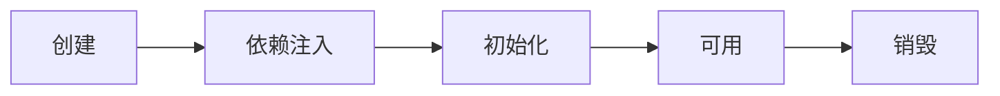

```java
package com.itheima.a03;

import org.slf4j.Logger;
import org.slf4j.LoggerFactory;
import org.springframework.beans.BeansException;
import org.springframework.beans.PropertyValues;
import org.springframework.beans.factory.config.DestructionAwareBeanPostProcessor;
import org.springframework.beans.factory.config.InstantiationAwareBeanPostProcessor;
import org.springframework.stereotype.Component;

@Component
public class MyBeanPostProcessor implements InstantiationAwareBeanPostProcessor, DestructionAwareBeanPostProcessor {

    private static final Logger log = LoggerFactory.getLogger(MyBeanPostProcessor.class);

    @Override
    public void postProcessBeforeDestruction(Object bean, String beanName) throws BeansException {
        if ("lifeCycleBean".equals(beanName)){
            log.debug("<<<<<< 销毁之前执行, 如 @PreDestroy");
        }
    }

    @Override
    public Object postProcessBeforeInstantiation(Class<?> beanClass, String beanName) throws BeansException {
        if ("lifeCycleBean".equals(beanName)){
            log.debug("<<<<<< 实例化之前执行, 这里返回的对象会替换掉原本的 bean");
        }
        return null;
    }

    @Override
    public boolean postProcessAfterInstantiation(Object bean, String beanName) throws BeansException {
        if ("lifeCycleBean".equals(beanName)) {
            log.debug("<<<<<< 实例化之后执行, 这里如果返回 false 会跳过依赖注入阶段");
//            return false;
        }
        return true;
    }

    @Override
    public PropertyValues postProcessProperties(PropertyValues pvs, Object bean, String beanName) throws BeansException {
        if ("lifeCycleBean".equals(beanName)){
            log.debug("<<<<<< 依赖注入阶段执行, 如 @Autowired、@Value、@Resource");
        }
        return pvs;
    }

    @Override
    public Object postProcessBeforeInitialization(Object bean, String beanName) throws BeansException {
        if ("lifeCycleBean".equals(beanName)){
            log.debug("<<<<<< 初始化之前执行, 这里返回的对象会替换掉原本的 bean, 如 @PostConstruct、@ConfigurationProperties");
        }
        return bean;
    }

    @Override
    public Object postProcessAfterInitialization(Object bean, String beanName) throws BeansException {
        if ("lifeCycleBean".equals(beanName)){
            log.debug("<<<<<< 初始化之后执行, 这里返回的对象会替换掉原本的 bean, 如代理增强");
        }
        return bean;
    }
}

```

创建前后的增强

* postProcessBeforeInstantiation
  * 这里返回的对象若不为 null 会替换掉原本的 bean，并且仅会走 postProcessAfterInitialization 流程
* postProcessAfterInstantiation
  * 这里如果返回 false 会跳过依赖注入阶段

依赖注入前的增强

* postProcessProperties
  * 如 @Autowired、@Value、@Resource 

初始化前后的增强

* postProcessBeforeInitialization
  * 这里返回的对象会替换掉原本的 bean
  * 如 @PostConstruct、@ConfigurationProperties
* postProcessAfterInitialization 
  * 这里返回的对象会替换掉原本的 bean
  * 如代理增强

销毁之前的增强

* postProcessBeforeDestruction
  * 如 @PreDestroy 

#### 收获💡

1. Spring bean 生命周期各个阶段
2. 模板设计模式, 指大流程已经固定好了, 通过接口回调（bean 后处理器）在一些关键点前后提供扩展


#### 演示2 - 模板方法设计模式

##### 关键代码

```java
public class TestMethodTemplate {

    public static void main(String[] args) {
        MyBeanFactory beanFactory = new MyBeanFactory();
        beanFactory.addBeanPostProcessor(bean -> System.out.println("解析 @Autowired"));
        beanFactory.addBeanPostProcessor(bean -> System.out.println("解析 @Resource"));
        beanFactory.getBean();
    }

    // 模板方法  Template Method Pattern
    static class MyBeanFactory {
        public Object getBean() {
            Object bean = new Object();
            System.out.println("构造 " + bean);
            System.out.println("依赖注入 " + bean); // @Autowired, @Resource
            for (BeanPostProcessor processor : processors) {
                processor.inject(bean);
            }
            System.out.println("初始化 " + bean);
            return bean;
        }

        private List<BeanPostProcessor> processors = new ArrayList<>();

        public void addBeanPostProcessor(BeanPostProcessor processor) {
            processors.add(processor);
        }
    }
    
    static interface BeanPostProcessor {
        public void inject(Object bean); // 对依赖注入阶段的扩展
    }
}
```


#### 演示3 - bean 后处理器排序

##### 代码参考 

**com.itheima.a03.TestProcessOrder**

#### 收获💡

1. 实现了 PriorityOrdered 接口的优先级最高
2. 实现了 Ordered 接口与加了 @Order 注解的平级, 按数字升序
3. 其它的排在最后


### 4) Bean 后处理器

#### 演示1 - 后处理器作用

- 为bean生命周期各个阶段提供拓展

##### 代码参考 

```java
package com.itheima.a04;

import org.springframework.beans.factory.annotation.AutowiredAnnotationBeanPostProcessor;
import org.springframework.beans.factory.support.DefaultListableBeanFactory;
import org.springframework.boot.context.properties.ConfigurationPropertiesBindingPostProcessor;
import org.springframework.context.annotation.CommonAnnotationBeanPostProcessor;
import org.springframework.context.annotation.ContextAnnotationAutowireCandidateResolver;
import org.springframework.context.support.GenericApplicationContext;

/*
    bean 后处理器的作用
 */
public class A04 {
    public static void main(String[] args) {
        // ⬇️GenericApplicationContext 是一个【干净】的容器
        GenericApplicationContext context = new GenericApplicationContext();

        // ⬇️用原始方法注册三个 bean
        context.registerBean("bean1", Bean1.class);
        context.registerBean("bean2", Bean2.class);
        context.registerBean("bean3", Bean3.class);
        context.registerBean("bean4", Bean4.class);

        context.getDefaultListableBeanFactory().setAutowireCandidateResolver(new ContextAnnotationAutowireCandidateResolver());
        context.registerBean(AutowiredAnnotationBeanPostProcessor.class); // @Autowired @Value

        context.registerBean(CommonAnnotationBeanPostProcessor.class); // @Resource @PostConstruct @PreDestroy

        ConfigurationPropertiesBindingPostProcessor.register(context.getDefaultListableBeanFactory());

        // ⬇️初始化容器
        context.refresh(); // 执行beanFactory后处理器, 添加bean后处理器, 初始化所有单例

        System.out.println(context.getBean(Bean1.class));

        // ⬇️销毁容器
        context.close();

        /*
            学到了什么
                a. @Autowired 等注解的解析属于 bean 生命周期阶段(依赖注入, 初始化)的扩展功能
                b. 这些扩展功能由 bean 后处理器来完成
         */
    }
}

```

```java
package com.itheima.a04;

import org.slf4j.Logger;
import org.slf4j.LoggerFactory;
import org.springframework.beans.factory.annotation.Autowired;
import org.springframework.beans.factory.annotation.Value;

import javax.annotation.PostConstruct;
import javax.annotation.PreDestroy;
import javax.annotation.Resource;

public class Bean1 {
    private static final Logger log = LoggerFactory.getLogger(Bean1.class);

    private Bean2 bean2;

    @Autowired
    public void setBean2(Bean2 bean2) {
        log.debug("@Autowired 生效: {}", bean2);
        this.bean2 = bean2;
    }

    @Autowired
    private Bean3 bean3;

    @Resource
    public void setBean3(Bean3 bean3) {
        log.debug("@Resource 生效: {}", bean3);
        this.bean3 = bean3;
    }

    private String home;

    @Autowired
    public void setHome(@Value("${JAVA_HOME}") String home) {
        log.debug("@Value 生效: {}", home);
        this.home = home;
    }

    @PostConstruct
    public void init() {
        log.debug("@PostConstruct 生效");
    }

    @PreDestroy
    public void destroy() {
        log.debug("@PreDestroy 生效");
    }

    @Override
    public String toString() {
        return "Bean1{" +
               "bean2=" + bean2 +
               ", bean3=" + bean3 +
               ", home='" + home + '\'' +
               '}';
    }
}
```

```java
package com.itheima.a04;

import org.springframework.boot.context.properties.ConfigurationProperties;

/*
    java.home=
    java.version=
 */
@ConfigurationProperties(prefix = "java")
public class Bean4 {

    private String home;

    private String version;

    public String getHome() {
        return home;
    }

    public void setHome(String home) {
        this.home = home;
    }

    public String getVersion() {
        return version;
    }

    public void setVersion(String version) {
        this.version = version;
    }

    @Override
    public String toString() {
        return "Bean4{" +
               "home='" + home + '\'' +
               ", version='" + version + '\'' +
               '}';
    }
}
```

#### 收获💡

1. @Autowired 等注解的解析属于 bean 生命周期阶段（依赖注入, 初始化）的扩展功能，这些扩展功能由 bean 后处理器来完成
2. 每个后处理器各自增强什么功能
   * AutowiredAnnotationBeanPostProcessor 
   * 解析 @Autowired(根据类型注入) 与 @Value(值注入)
   * CommonAnnotationBeanPostProcessor
   *  解析 @Resource(根据名称注入)、@PostConstruct(初始化前)、@PreDestroy(销毁前)
   * ConfigurationPropertiesBindingPostProcessor 
   * 解析 @ConfigurationProperties(配置属性)初始化前解析并执行属性绑定
3. 另外 ContextAnnotationAutowireCandidateResolver 负责获取 @Value 的值，解析 @Qualifier、泛型、@Lazy 等
4. beanFactory不会做的事：

   - 不会主动调用BeanFactory后处理器

   - 不会主动添加Bean后处理器

   - 不会主动初始化单例

   - 不会解析beanFactory还不会解析${}与#{}

#### 演示2 - @Autowired bean 后处理器运行分析

##### 代码参考 

```java
package com.itheima.a04;

import org.springframework.beans.PropertyValues;
import org.springframework.beans.factory.annotation.AutowiredAnnotationBeanPostProcessor;
import org.springframework.beans.factory.annotation.InjectionMetadata;
import org.springframework.beans.factory.config.DependencyDescriptor;
import org.springframework.beans.factory.support.DefaultListableBeanFactory;
import org.springframework.context.annotation.ContextAnnotationAutowireCandidateResolver;
import org.springframework.core.MethodParameter;
import org.springframework.core.env.StandardEnvironment;

import java.lang.reflect.Field;
import java.lang.reflect.Method;

// AutowiredAnnotationBeanPostProcessor 运行分析
public class DigInAutowired {
    public static void main(String[] args) throws Throwable {
        DefaultListableBeanFactory beanFactory = new DefaultListableBeanFactory();
        // 该方法认为bean已经是一个成品的bean对象了，不会再执行创建过程,依赖注入,初始化
        beanFactory.registerSingleton("bean2", new Bean2());
        beanFactory.registerSingleton("bean3", new Bean3());
        // @Value
        beanFactory.setAutowireCandidateResolver(
            new ContextAnnotationAutowireCandidateResolver()
        );
        // 添加 ${} 的解析器
        beanFactory.addEmbeddedValueResolver(
            new StandardEnvironment()::resolvePlaceholders
        ); 

        // 1. 查找哪些属性、方法加了 @Autowired, 这称之为 InjectionMetadata
        AutowiredAnnotationBeanPostProcessor processor = new AutowiredAnnotationBeanPostPro cessor();
        processor.setBeanFactory(beanFactory);

        Bean1 bean1 = new Bean1();
        System.out.println(bean1);
        
        // 执行依赖注入 @Autowired @Value
        processor.postProcessProperties(null, bean1, "bean1"); 
        System.out.println(bean1);
		//通过反射获取findAutowiringMetadata方法
        Method findAutowiringMetadata = AutowiredAnnotationBeanPostProcessor.class.getDeclaredMethod("findAutowiringMetadata", String.class, Class.class, PropertyValues.class);
        //由于该方法私有，所以需要设置Accessible为true
        findAutowiringMetadata.setAccessible(true);
        
        //调用获取到的方法 获取 Bean1 上加了 @Value @Autowired 的成员变量，方法参数信息
        InjectionMetadata metadata = (InjectionMetadata) findAutowiringMetadata.invoke(processor, "bean1", Bean1.class, null);
        System.out.println(metadata);

        // 2. 调用 InjectionMetadata 来进行依赖注入, 注入时按类型查找值
        metadata.inject(bean1, "bean1", null);
        System.out.println(bean1);

        // 3. 如何按类型查找值 Bean对象
        Field bean3 = Bean1.class.getDeclaredField("bean3");
        /*
        上述方法获取到的值会被封装进DependencyDescriptor对象中
        false将该值设置为在执行依赖注入时为可选的，表示如果在注入时找不到该bean也不会报错
        反之则会
        */
        DependencyDescriptor dd1 = new DependencyDescriptor(bean3, false);
        //根据成员变量查找要注入谁
        Object o = beanFactory.doResolveDependency(dd1, null, null, null);
        System.out.println(o);
		
        // 3. 如何按类型查找值 Bean方法
        Method setBean2 = Bean1.class.getDeclaredMethod("setBean2", Bean2.class);
        DependencyDescriptor dd2 =
                new DependencyDescriptor(new MethodParameter(setBean2, 0), true);
        Object o1 = beanFactory.doResolveDependency(dd2, null, null, null);
        System.out.println(o1);
		// 3. 如何按类型查找值 Bean值
        Method setHome = Bean1.class.getDeclaredMethod("setHome", String.class);
        DependencyDescriptor dd3 = new DependencyDescriptor(new MethodParameter(setHome, 0), true);
        Object o2 = beanFactory.doResolveDependency(dd3, null, null, null);
        System.out.println(o2);

    }
}
```

#### 收获💡

1. AutowiredAnnotationBeanPostProcessor.findAutowiringMetadata 用来获取某个 bean 上加了 @Value @Autowired 的成员变量，方法参数的信息，表示为 InjectionMetadata
2. InjectionMetadata 可以完成依赖注入
3. InjectionMetadata 内部根据成员变量，方法参数封装为 DependencyDescriptor 类型
4. 有了 DependencyDescriptor，就可以利用 beanFactory.doResolveDependency 方法进行基于类型的查找


### 5) BeanFactory 后处理器

#### 演示1 - BeanFactory 后处理器的作用

作用:为BeanFactory提供拓展

##### 代码参考

**com.itheima.a05** 包

```java
package com.itheima.a05;

import com.itheima.a05.mapper.Mapper1;
import com.itheima.a05.mapper.Mapper2;
import org.mybatis.spring.mapper.MapperScannerConfigurer;
import org.slf4j.Logger;
import org.slf4j.LoggerFactory;
import org.springframework.context.annotation.ConfigurationClassPostProcessor;
import org.springframework.context.support.GenericApplicationContext;

import java.io.IOException;

/*
    BeanFactory 后处理器的作用
 */
public class A05 {
    private static final Logger log = LoggerFactory.getLogger(A05.class);

    public static void main(String[] args) throws IOException {

        // ⬇️GenericApplicationContext 是一个【干净】的容器
        GenericApplicationContext context = new GenericApplicationContext();
        context.registerBean("config", Config.class);
        // 能够解析@ComponentScan @Bean @Import @ImportResource
        context.registerBean(ConfigurationClassPostProcessor.class);
        // 对应mybatis的@MapperScanner
        context.registerBean(MapperScannerConfigurer.class, bd -> {
            bd.getPropertyValues().add("basePackage", "com.itheima.a05.mapper");
        });
        // 解析 @ComponentScan
        context.registerBean(ComponentScanPostProcessor.class);
        // 解析 @Bean
        context.registerBean(AtBeanPostProcessor.class);
        // 解析 Mapper 接口
        context.registerBean(MapperPostProcessor.class);
        // ⬇️初始化容器
        context.refresh();

        for (String name : context.getBeanDefinitionNames()) {
            System.out.println(name);
        }

        Mapper1 mapper1 = context.getBean(Mapper1.class);
        Mapper2 mapper2 = context.getBean(Mapper2.class);

        // ⬇️销毁容器
        context.close();

        /*
            学到了什么
      a. @ComponentScan, @Bean, @Mapper 等注解的解析属于核心容器(即 BeanFactory)的扩展功能
      b. 这些扩展功能由不同的 BeanFactory 后处理器来完成, 其实主要就是补充了一些 bean 定义
         */
    }
}
```

* ConfigurationClassPostProcessor 可以解析
  * @ComponentScan
  * @Bean
  * @Import
  * @ImportResource
* MapperScannerConfigurer 可以解析
  * Mapper 接口

#### 收获💡

1. @ComponentScan, @Bean, @Mapper 等注解的解析属于核心容器（即 BeanFactory）的扩展功能
2. 这些扩展功能由不同的 BeanFactory 后处理器来完成，其实主要就是补充了一些 bean 定义


#### 演示2 - 模拟解析 @ComponentScan

##### 代码参考 

```java
package com.itheima.a05;

import org.springframework.beans.BeansException;
import org.springframework.beans.factory.config.ConfigurableListableBeanFactory;
import org.springframework.beans.factory.support.AbstractBeanDefinition;
import org.springframework.beans.factory.support.BeanDefinitionBuilder;
import org.springframework.beans.factory.support.BeanDefinitionRegistry;
import org.springframework.beans.factory.support.BeanDefinitionRegistryPostProcessor;
import org.springframework.context.annotation.AnnotationBeanNameGenerator;
import org.springframework.context.annotation.ComponentScan;
import org.springframework.core.annotation.AnnotationUtils;
import org.springframework.core.io.Resource;
import org.springframework.core.io.support.PathMatchingResourcePatternResolver;
import org.springframework.core.type.AnnotationMetadata;
import org.springframework.core.type.classreading.CachingMetadataReaderFactory;
import org.springframework.core.type.classreading.MetadataReader;
import org.springframework.stereotype.Component;

import java.io.IOException;

public class ComponentScanPostProcessor implements BeanDefinitionRegistryPostProcessor {
    @Override // context.refresh
    public void postProcessBeanFactory(ConfigurableListableBeanFactory configurableListableBeanFactory) throws BeansException {

    }

    @Override
    public void postProcessBeanDefinitionRegistry(BeanDefinitionRegistry beanFactory) throws BeansException {
        try {
            ComponentScan componentScan = AnnotationUtils.findAnnotation(Config.class, ComponentScan.class);
            if (componentScan != null) {
                for (String p : componentScan.basePackages()) {
                    System.out.println(p);
                    // com.itheima.a05.component -> classpath*:com/itheima/a05/component/**/*.class
                    String path = "classpath*:" + p.replace(".", "/") + "/**/*.class";
                    System.out.println(path);
                    CachingMetadataReaderFactory factory 
                        = new CachingMetadataReaderFactory();
                    Resource[] resources 
                        = new PathMatchingResourcePatternResolver().getResources(path);
                    AnnotationBeanNameGenerator generator 
                        = new AnnotationBeanNameGenerator();
                    for (Resource resource : resources) {
                        System.out.println(resource);
                        MetadataReader reader = factory.getMetadataReader(resource);
                        System.out.println("类名:" 
                                           + reader.getClassMetadata().getClassName());
                        AnnotationMetadata annotationMetadata 
                            = reader.getAnnotationMetadata();
                        System.out.println("是否加了 @Component:" + annotationMetadata.hasAnnotation(Component.class.getName()));
                        System.out.println("是否加了 @Component 派生:" + annotationMetadata.hasMetaAnnotation(Component.class.getName()));
                        if (annotationMetadata.hasAnnotation(Component.class.getName())
                                || annotationMetadata.hasMetaAnnotation(Component.class.getName())) {
                            AbstractBeanDefinition bd = BeanDefinitionBuilder                                   .genericBeanDefinition(reader.getClassMetadata().getClassName())
                        .getBeanDefinition();
                            String name = generator.generateBeanName(bd, beanFactory);
                            beanFactory.registerBeanDefinition(name, bd);
                        }
                    }
                }
            }
        } catch (IOException e) {
            e.printStackTrace();
        }
    }
}

```

#### 收获💡

1. Spring 操作元数据的工具类 CachingMetadataReaderFactory
2. 通过注解元数据（AnnotationMetadata）获取直接或间接标注的注解信息
3. 通过类元数据（ClassMetadata）获取类名，AnnotationBeanNameGenerator 生成 bean 名
4. 解析元数据是基于 ASM 技术


#### 演示3 - 模拟解析 @Bean

##### 代码参考 

```java
package com.itheima.a05;

import org.springframework.beans.BeansException;
import org.springframework.beans.factory.config.ConfigurableListableBeanFactory;
import org.springframework.beans.factory.support.AbstractBeanDefinition;
import org.springframework.beans.factory.support.BeanDefinitionBuilder;
import org.springframework.beans.factory.support.BeanDefinitionRegistry;
import org.springframework.beans.factory.support.BeanDefinitionRegistryPostProcessor;
import org.springframework.context.annotation.Bean;
import org.springframework.core.io.ClassPathResource;
import org.springframework.core.type.MethodMetadata;
import org.springframework.core.type.classreading.CachingMetadataReaderFactory;
import org.springframework.core.type.classreading.MetadataReader;

import java.io.IOException;
import java.util.Set;

public class AtBeanPostProcessor implements BeanDefinitionRegistryPostProcessor {
    @Override
    public void postProcessBeanFactory(ConfigurableListableBeanFactory configurableListableBeanFactory) throws BeansException {

    }

    @Override
    public void postProcessBeanDefinitionRegistry(BeanDefinitionRegistry beanFactory) throws BeansException {
        try {
            CachingMetadataReaderFactory factory = new CachingMetadataReaderFactory();
            MetadataReader reader = factory.getMetadataReader(new ClassPathResource("com/itheima/a05/Config.class"));
            Set<MethodMetadata> methods = reader.getAnnotationMetadata().getAnnotatedMethods(Bean.class.getName());
            for (MethodMetadata method : methods) {
                System.out.println(method);
                String initMethod = method.getAnnotationAttributes(Bean.class.getName()).get("initMethod").toString();
                BeanDefinitionBuilder builder = BeanDefinitionBuilder.genericBeanDefinition();
                builder.setFactoryMethodOnBean(method.getMethodName(), "config");
                //注:对于构造方法的参数，对于工厂方法的参数，
                //如果要自动装配的话选择的装配模式为AUTOWIRE_CONSTRUCTOR
                builder.setAutowireMode(AbstractBeanDefinition.AUTOWIRE_CONSTRUCTOR);
                if (initMethod.length() > 0) {
                    builder.setInitMethodName(initMethod);
                }
                AbstractBeanDefinition bd = builder.getBeanDefinition();
                beanFactory.registerBeanDefinition(method.getMethodName(), bd);
            }
        } catch (IOException e) {
            e.printStackTrace();
        }
    }
}
```

#### 收获💡

1. 进一步熟悉注解元数据（AnnotationMetadata）获取方法上注解信息


#### 演示4 - 模拟解析 Mapper 接口

##### 代码参考 

```java
package com.itheima.a05;

import org.mybatis.spring.mapper.MapperFactoryBean;
import org.springframework.beans.BeansException;
import org.springframework.beans.factory.config.BeanFactoryPostProcessor;
import org.springframework.beans.factory.config.ConfigurableListableBeanFactory;
import org.springframework.beans.factory.support.AbstractBeanDefinition;
import org.springframework.beans.factory.support.BeanDefinitionBuilder;
import org.springframework.beans.factory.support.BeanDefinitionRegistry;
import org.springframework.beans.factory.support.BeanDefinitionRegistryPostProcessor;
import org.springframework.context.annotation.AnnotationBeanNameGenerator;
import org.springframework.core.io.Resource;
import org.springframework.core.io.support.PathMatchingResourcePatternResolver;
import org.springframework.core.type.ClassMetadata;
import org.springframework.core.type.classreading.CachingMetadataReaderFactory;
import org.springframework.core.type.classreading.MetadataReader;

import java.io.IOException;

public class MapperPostProcessor implements BeanDefinitionRegistryPostProcessor {

    @Override
    public void postProcessBeanDefinitionRegistry(BeanDefinitionRegistry beanFactory) throws BeansException {
        try {
            PathMatchingResourcePatternResolver resolver = new PathMatchingResourcePatternResolver();
            Resource[] resources = resolver.getResources("classpath:com/itheima/a05/mapper/**/*.class");
            AnnotationBeanNameGenerator generator = new AnnotationBeanNameGenerator();
            CachingMetadataReaderFactory factory = new CachingMetadataReaderFactory();
            for (Resource resource : resources) {
                MetadataReader reader = factory.getMetadataReader(resource);
                ClassMetadata classMetadata = reader.getClassMetadata();
                if (classMetadata.isInterface()) {
                    AbstractBeanDefinition bd = BeanDefinitionBuilder.genericBeanDefinition(MapperFactoryBean.class)
                            .addConstructorArgValue(classMetadata.getClassName())
                            .setAutowireMode(AbstractBeanDefinition.AUTOWIRE_BY_TYPE)
                            .getBeanDefinition();
                    AbstractBeanDefinition bd2 = BeanDefinitionBuilder.genericBeanDefinition(classMetadata.getClassName()).getBeanDefinition();
                    String name = generator.generateBeanName(bd2, beanFactory);
                    beanFactory.registerBeanDefinition(name, bd);
                }
            }
        } catch (IOException e) {
            e.printStackTrace();
        }

    }

    @Override
    public void postProcessBeanFactory(ConfigurableListableBeanFactory beanFactory) throws BeansException {

    }
}
```

#### 收获💡

1. Mapper 接口被 Spring 管理的本质：实际是被作为 MapperFactoryBean 注册到容器中
2. Spring 的诡异做法，根据接口生成的 BeanDefinition 仅为根据接口名生成 bean 名


### 6) Aware 接口

#### 演示 - Aware 接口及 InitializingBean 接口

##### 代码参考 

**com.itheima.a06** 包

```java
package com.itheima.a06;

import org.slf4j.Logger;
import org.slf4j.LoggerFactory;
import org.springframework.beans.factory.annotation.AutowiredAnnotationBeanPostProcessor;
import org.springframework.context.annotation.CommonAnnotationBeanPostProcessor;
import org.springframework.context.annotation.ConfigurationClassPostProcessor;
import org.springframework.context.support.GenericApplicationContext;

/**
    Aware 接口及 InitializingBean 接口
 */
public class A06 {
    private static final Logger log = LoggerFactory.getLogger(A06.class);

    public static void main(String[] args) {
        /*
            1. Aware 接口用于注入一些与容器相关信息, 例如
                a. BeanNameAware 注入 bean 的名字
                b. BeanFactoryAware 注入 BeanFactory 容器
                c. ApplicationContextAware 注入 ApplicationContext 容器
                d. EmbeddedValueResolverAware ${}

         */
        GenericApplicationContext context = new GenericApplicationContext();
        context.registerBean("myBean", MyBean.class);
        context.registerBean("myConfig1", MyConfig1.class);
        context.registerBean("myConfig2", MyConfig2.class);
        context.registerBean(AutowiredAnnotationBeanPostProcessor.class);
        context.registerBean(CommonAnnotationBeanPostProcessor.class);
        context.registerBean(ConfigurationClassPostProcessor.class);

        /*
            2. 有同学说: b、c、d 的功能用 @Autowired 就能实现啊, 为啥还要用 Aware 接口呢
            简单地说:
                a. @Autowired 的解析需要用到 bean 后处理器, 属于扩展功能
                b. 而 Aware 接口属于内置功能, 不加任何扩展, Spring 就能识别
            某些情况下, 扩展功能会失效, 而内置功能不会失效

            例1: 你会发现用 Aware 注入 ApplicationContext 成功, 而 @Autowired 注入 ApplicationContext 失败
         */

        /*
            例2: Java 配置类在添加了 bean 工厂后处理器后,
                你会发现用传统接口方式的注入和初始化仍然成功, 而 @Autowired 和 @PostConstruct 的注入和初始化失败
         */

        context.refresh(); // 1. beanFactory 后处理器,  2. 添加 bean 后处理器, 3. 初始化单例
        context.close();

        /*
            学到了什么
                a. Aware 接口提供了一种【内置】 的注入手段, 可以注入 BeanFactory, ApplicationContext
                b. InitializingBean 接口提供了一种【内置】的初始化手段
                c. 内置的注入和初始化不受扩展功能的影响, 总会被执行, 因此 Spring 框架内部的类常用它们
         */
    }
}
```

```java
package com.itheima.a06;

import org.slf4j.Logger;
import org.slf4j.LoggerFactory;
import org.springframework.beans.BeansException;
import org.springframework.beans.factory.BeanNameAware;
import org.springframework.beans.factory.InitializingBean;
import org.springframework.beans.factory.annotation.Autowired;
import org.springframework.context.ApplicationContext;
import org.springframework.context.ApplicationContextAware;

import javax.annotation.PostConstruct;

public class MyBean implements BeanNameAware, ApplicationContextAware, InitializingBean {

    private static final Logger log = LoggerFactory.getLogger(MyBean.class);

    @Override
    public void setBeanName(String name) {
        log.debug("当前bean " + this + " 名字叫:" + name);
    }

    @Override
    public void setApplicationContext(ApplicationContext applicationContext) throws BeansException {
        log.debug("当前bean " + this + " 容器是:" + applicationContext);
    }

    @Override
    public void afterPropertiesSet() throws Exception {
        log.debug("当前bean " + this + " 初始化");
    }

    @Autowired
    public void aaa(ApplicationContext applicationContext) {
        log.debug("当前bean " + this + " 使用@Autowired 容器是:" + applicationContext);
    }

    @PostConstruct
    public void init() {
        log.debug("当前bean " + this + " 使用@PostConstruct 初始化");
    }
}
```

```java
package com.itheima.a06;

import org.slf4j.Logger;
import org.slf4j.LoggerFactory;
import org.springframework.beans.BeansException;
import org.springframework.beans.factory.InitializingBean;
import org.springframework.beans.factory.config.BeanFactoryPostProcessor;
import org.springframework.context.ApplicationContext;
import org.springframework.context.ApplicationContextAware;
import org.springframework.context.annotation.Bean;
import org.springframework.context.annotation.Configuration;

@Configuration
public class MyConfig2 implements InitializingBean, ApplicationContextAware {

    private static final Logger log = LoggerFactory.getLogger(MyConfig2.class);

    @Override
    public void afterPropertiesSet() throws Exception {
        log.debug("初始化");
    }

    @Override
    public void setApplicationContext(ApplicationContext applicationContext) throws BeansException {
        log.debug("注入 ApplicationContext");
    }

    @Bean //  beanFactory 后处理器
    public BeanFactoryPostProcessor processor2() {
        return beanFactory -> {
            log.debug("执行 processor2");
        };
    }
}
```

#### 收获💡

1. Aware 接口提供了一种【内置】 的注入手段，例如
   * BeanNameAware 注入 bean 的名字
   * BeanFactoryAware 注入 BeanFactory 容器
   * ApplicationContextAware 注入 ApplicationContext 容器
   * EmbeddedValueResolverAware 注入 ${} 解析器
2. InitializingBean 接口提供了一种【内置】的初始化手段
3. 对比
   * 内置的注入和初始化不受扩展功能的影响，总会被执行
   * 而扩展功能受某些情况影响可能会失效
   * 因此 Spring 框架内部的类常用内置注入和初始化


#### 配置类 @Autowired 失效分析

Java 配置类不包含 BeanFactoryPostProcessor 的情况

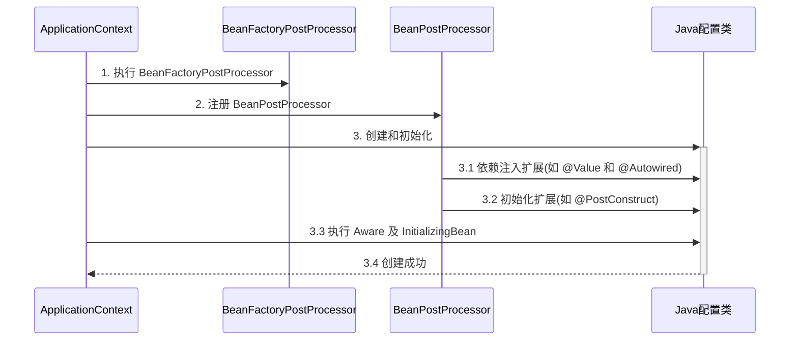

Java 配置类包含 BeanFactoryPostProcessor 的情况，因此要创建其中的 BeanFactoryPostProcessor 必须提前创建 Java 配置类，而此时的 BeanPostProcessor 还未准备好，导致 @Autowired 等注解失效

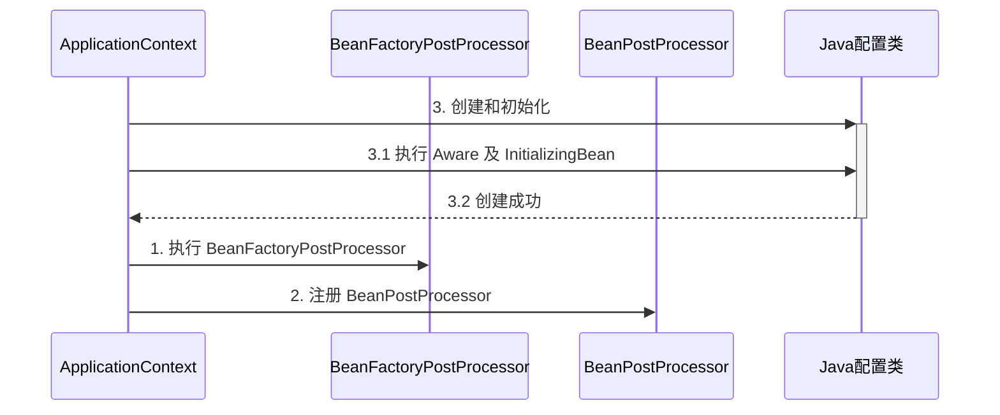

对应代码

```java
@Configuration
public class MyConfig1 {

    private static final Logger log = LoggerFactory.getLogger(MyConfig1.class);

    @Autowired
    public void setApplicationContext(ApplicationContext applicationContext) {
        log.debug("注入 ApplicationContext");
    }

    @PostConstruct
    public void init() {
        log.debug("初始化");
    }

    @Bean //  ⬅️ 注释或添加 beanFactory 后处理器对应上方两种情况
    public BeanFactoryPostProcessor processor1() {
        return beanFactory -> {
            log.debug("执行 processor1");
        };
    }

}
```

> ***注意***
>
> 解决方法：
>
> * 用内置依赖注入和初始化取代扩展依赖注入和初始化
> * 用静态工厂方法代替实例工厂方法，避免工厂对象提前被创建

对应代码

```java
package com.itheima.a06;

import org.slf4j.Logger;
import org.slf4j.LoggerFactory;
import org.springframework.beans.BeansException;
import org.springframework.beans.factory.InitializingBean;
import org.springframework.beans.factory.config.BeanFactoryPostProcessor;
import org.springframework.context.ApplicationContext;
import org.springframework.context.ApplicationContextAware;
import org.springframework.context.annotation.Bean;
import org.springframework.context.annotation.Configuration;

@Configuration
public class MyConfig2 implements InitializingBean, ApplicationContextAware {
private static final Logger log = LoggerFactory.getLogger(MyConfig2.class);

@Override
public void afterPropertiesSet() throws Exception {
    log.debug("初始化");
}

@Override
public void setApplicationContext(ApplicationContext applicationContext) throws BeansException {
    log.debug("注入 ApplicationContext");
}

@Bean //  beanFactory 后处理器
public BeanFactoryPostProcessor processor2() {
    return beanFactory -> {
        log.debug("执行 processor2");
    };
}
}
```
### 7) 初始化与销毁

#### 演示 - 初始化销毁顺序

##### 代码参考 

**初始化**

```java
/**
    初始化和销毁的执行顺序
 */
@SpringBootApplication
public class A07_1 {

    public static void main(String[] args) {
        ConfigurableApplicationContext context = SpringApplication.run(A07_1.class, args);
        context.close();
        /*
            学到了什么
                a. Spring 提供了多种初始化和销毁手段
                b. Spring 的面试有多么地卷
         */
    }

    @Bean(initMethod = "init3")
    public Bean1 bean1() {
        return new Bean1();
    }

    @Bean(destroyMethod = "destroy3")
    public Bean2 bean2() {
        return new Bean2();
    }
}
```

```java
public class Bean1 implements InitializingBean {
    private static final Logger log = LoggerFactory.getLogger(Bean1.class);

    @PostConstruct
    public void init1() {
        log.debug("初始化1");
    }

    @Override
    public void afterPropertiesSet() throws Exception {
        log.debug("初始化2");
    }

    public void init3() {
        log.debug("初始化3");
    }
}
```

**销毁**

```java
public class A07_2 {

    public static void main(String[] args) {
        DefaultListableBeanFactory beanFactory = new DefaultListableBeanFactory();
        beanFactory.registerBeanDefinition(
                "myBean",
                BeanDefinitionBuilder.genericBeanDefinition(MyBean.class)
                        .setDestroyMethodName("destroy")
                        .getBeanDefinition()
        );

        System.out.println(beanFactory.getBean(MyBean.class));
        beanFactory.destroySingletons(); // 销毁之后, 仍可创建新的单例
        System.out.println(beanFactory.getBean(MyBean.class));

    }

    static class MyBean {
        public MyBean() {
            System.out.println("MyBean()");
        }

        public void destroy() {
            System.out.println("destroy()");
        }
    }
}
```

```java
public class Bean2 implements DisposableBean {
    private static final Logger log = LoggerFactory.getLogger(Bean2.class);

    @PreDestroy
    public void destroy1() {
        log.debug("销毁1");
    }

    @Override
    public void destroy() throws Exception {
        log.debug("销毁2");
    }

    public void destroy3() {
        log.debug("销毁3");
    }
}
```

#### 收获💡

Spring 提供了多种初始化手段，除了课堂上讲的 @PostConstruct，@Bean(initMethod) 之外，还可以实现 InitializingBean 接口来进行初始化，如果同一个 bean 用了以上手段声明了 3 个初始化方法，那么它们的执行顺序是

1. @PostConstruct 标注的初始化方法
2. InitializingBean 接口的初始化方法
3. @Bean(initMethod) 指定的初始化方法


与初始化类似，Spring 也提供了多种销毁手段，执行顺序为

1. @PreDestroy 标注的销毁方法
2. DisposableBean 接口的销毁方法
3. @Bean(destroyMethod) 指定的销毁方法


### 8) Scope 

在当前版本的 Spring 和 Spring Boot 程序中，支持五种 Scope

* singleton，容器启动时创建（未设置延迟），容器关闭时销毁
* prototype，每次使用时创建，不会自动销毁，需要调用 DefaultListableBeanFactory.destroyBean(bean) 销毁
* request，每次请求用到此 bean 时创建，请求结束时销毁
* session，每个会话用到此 bean 时创建，会话结束时销毁
* application，web 容器用到此 bean 时创建，容器停止时销毁

有些文章提到有 globalSession 这一 Scope，也是陈旧的说法，目前 Spring 中已废弃


但要注意，如果在 singleton 注入其它 scope 都会有问题，解决方法有

* @Lazy
* @Scope(proxyMode = ScopedProxyMode.TARGET_CLASS)
* ObjectFactory
* ApplicationContext.getBean


#### 演示1 - request, session, application 作用域

##### 代码参考 

```java
@Scope("application")
@Component
public class BeanForApplication {
    private static final Logger log = LoggerFactory.getLogger(BeanForApplication.class);

    @PreDestroy
    public void destroy() {
        log.debug("destroy");
    }
}
```

```java
@Scope("request")
@Component
public class BeanForRequest {
    private static final Logger log = LoggerFactory.getLogger(BeanForRequest.class);

    @PreDestroy
    public void destroy() {
        log.debug("destroy");
    }

}
```

```java
@Scope("session")
@Component
public class BeanForSession {
    private static final Logger log = LoggerFactory.getLogger(BeanForSession.class);

    @PreDestroy
    public void destroy() {
        log.debug("destroy");
    }
}
```

```java
/**
    singleton, prototype, request, session, application

    jdk >= 9 如果反射调用 jdk 中方法
    jdk <= 8 不会有问题

    演示 request, session, application 作用域
    打开不同的浏览器, 刷新 http://localhost:8080/test 即可查看效果
    如果 jdk > 8, 运行时请添加 --add-opens java.base/java.lang=ALL-UNNAMED
    (允许反射调用java的API)
 */
@SpringBootApplication
public class A08 {
    public static void main(String[] args) {
        SpringApplication.run(A08.class, args);
        /*
            学到了什么
                a. 有几种 scope
                b. 在 singleton 中使用其它几种 scope 的方法
                c. 其它 scope 的销毁
                    1. 可以将通过 server.servlet.session.timeout=10s 观察 session bean 的销毁
                    2. ServletContextScope 销毁机制疑似实现有误
         */
    }
}
```

```java
@RestController
public class MyController {
	//单例使用其他域必须使用@Lazy否则失效
    @Lazy
    @Autowired
    private BeanForRequest beanForRequest;

    @Lazy
    @Autowired
    private BeanForSession beanForSession;

    @Lazy
    @Autowired
    private BeanForApplication beanForApplication;

    @GetMapping(value = "/test", produces = "text/html")
    public String test(HttpServletRequest request, HttpSession session) {
        ServletContext sc = request.getServletContext();
        String sb = "<ul>" +
                    "<li>" + "request scope:" + beanForRequest + "</li>" +
                    "<li>" + "session scope:" + beanForSession + "</li>" +
                    "<li>" + "application scope:" + beanForApplication + "</li>" +
                    "</ul>";
        return sb;
    }

}
```

* 打开不同的浏览器, 刷新 http://localhost:8080/test 即可查看效果
* 如果 jdk > 8, 运行时请添加 --add-opens java.base/java.lang=ALL-UNNAMED

#### 收获💡

1. 有几种 scope
2. 在 singleton 中使用其它几种 scope 的方法
3. 其它 scope 的销毁时机
   * 可以将通过 server.servlet.session.timeout=30s 观察 session bean 的销毁
   * ServletContextScope 销毁机制疑似实现有误


#### 分析 - singleton 注入其它 scope 失效


以单例注入多例为例

有一个单例对象 E

```java
@Component
public class E {
    private static final Logger log = LoggerFactory.getLogger(E.class);

    private F f;

    public E() {
        log.info("E()");
    }

    @Autowired
    public void setF(F f) {
        this.f = f;
        log.info("setF(F f) {}", f.getClass());
    }

    public F getF() {
        return f;
    }
}
```

要注入的对象 F 期望是多例

```java
@Component
@Scope("prototype")
public class F {
    private static final Logger log = LoggerFactory.getLogger(F.class);

    public F() {
        log.info("F()");
    }
}
```

测试

```java
E e = context.getBean(E.class);
F f1 = e.getF();
F f2 = e.getF();
System.out.println(f1);
System.out.println(f2);
```

输出

```
com.itheima.demo.cycle.F@6622fc65
com.itheima.demo.cycle.F@6622fc65
```

发现它们是同一个对象，而不是期望的多例对象


对于单例对象来讲，依赖注入仅发生了一次，后续再没有用到多例的 F，因此 E 用的始终是第一次依赖注入的 F

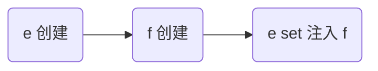

解决

* 仍然使用 @Lazy 生成代理
* 代理对象虽然还是同一个，但当每次**使用代理对象的任意方法**时，由代理创建新的 f 对象

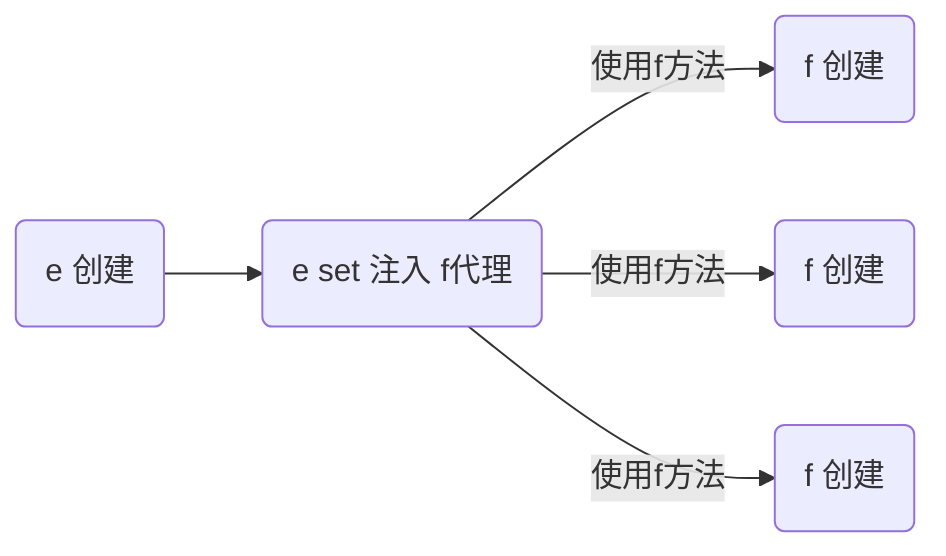

```java
@Component
public class E {

    @Autowired
    @Lazy
    public void setF(F f) {
        this.f = f;
        log.info("setF(F f) {}", f.getClass());
    }

    // ...
}
```

> ***注意***
>
> * @Lazy 加在也可以加在成员变量上，但加在 set 方法上的目的是可以观察输出，加在成员变量上就不行了
> * @Autowired 加在 set 方法的目的类似

输出

```
E: setF(F f) class com.itheima.demo.cycle.F$$EnhancerBySpringCGLIB$$8b54f2bc
F: F()
com.itheima.demo.cycle.F@3a6f2de3
F: F()
com.itheima.demo.cycle.F@56303b57
```

从输出日志可以看到调用 setF 方法时，f 对象的类型是代理类型


#### 演示2 - 4种解决方法

##### 代码参考 

```java
@Component
public class E {

    @Lazy
    @Autowired
    private F1 f1;

    @Autowired
    private F2 f2;

    @Autowired
    private ObjectFactory<F3> f3;

    @Autowired
    private ApplicationContext context;

    public F1 getF1() {
        return f1;
    }

    public F2 getF2() {
        return f2;
    }

    public F3 getF3() {
        return f3.getObject();
    }

    public F4 getF4() {
        return context.getBean(F4.class);
    }
}
```

```java
@Scope("prototype")
@Component
public class F1 {
}
```

```java
@Scope(value = "prototype", proxyMode = ScopedProxyMode.TARGET_CLASS)
@Component
public class F2 {
}
```

```java
@Scope("prototype")
@Component
public class F3 {
}
```

```java
@Scope("prototype")
@Component
public class F4 {
}
```

* 如果 jdk > 8, 运行时请添加 --add-opens java.base/java.lang=ALL-UNNAMED

#### 收获💡

1. 单例注入其它 scope 的四种解决方法
   * @Lazy
   * @Scope(value = "prototype", proxyMode = ScopedProxyMode.TARGET_CLASS)
   * ObjectFactory
   * ApplicationContext
2. 解决方法虽然不同，但理念上殊途同归: 都是推迟其它 scope bean 的获取


## AOP

AOP 底层实现方式之一是代理，由代理结合通知和目标，提供增强功能

除此以外，aspectj 提供了两种另外的 AOP 底层实现：

* 第一种是通过 ajc 编译器在**编译** class 类文件时，就把通知的增强功能，织入到目标类的字节码中

* 第二种是通过 agent 在**加载**目标类时，修改目标类的字节码，织入增强功能
* 作为对比，之前学习的代理是**运行**时生成新的字节码

简单比较的话：

* aspectj 在编译和加载时，修改目标字节码，性能较高
* aspectj 因为不用代理，能突破一些技术上的限制，例如对构造、对静态方法、对 final 也能增强
* 但 aspectj 侵入性较强，且需要学习新的 aspectj 特有语法，因此没有广泛流行


### 9) AOP 实现之 ajc 编译器

代码参考项目 **demo6_advanced_aspectj_01**

```java
package com.itheima.service;

import org.slf4j.Logger;
import org.slf4j.LoggerFactory;
import org.springframework.stereotype.Service;

/**
 * 待增强的目标类
 */
@Service
public class MyService {

    private static final Logger log = LoggerFactory.getLogger(MyService.class);

    public static void foo() {
        log.debug("foo()");
    }
}
```

```java
package com.itheima.aop;

import org.aspectj.lang.annotation.Aspect;
import org.aspectj.lang.annotation.Before;
import org.slf4j.Logger;
import org.slf4j.LoggerFactory;

/**
 * 切面类
 */
@Aspect // ⬅️注意此切面并未被 Spring 管理
public class MyAspect {

    private static final Logger log = LoggerFactory.getLogger(MyAspect.class);

    /**
     * 前置通知方法
     * 匹配的是MyService父方法foo()
     */
    @Before("execution(* com.itheima.service.MyService.foo())")
    public void before() {
        log.debug("before()");
    }
}
```

```java
package com.itheima;

import com.itheima.service.MyService;
import org.slf4j.Logger;
import org.slf4j.LoggerFactory;
import org.springframework.boot.SpringApplication;
import org.springframework.boot.autoconfigure.SpringBootApplication;
import org.springframework.context.ConfigurableApplicationContext;

/**
    注意几点
    1. 版本选择了 java 8, 因为目前的 aspectj-maven-plugin 1.14.0 最高只支持到 java 16
    2. 一定要用 maven 的 compile 来编译, idea 不会调用 ajc 编译器
 */
@SpringBootApplication
public class A09 {

    private static final Logger log = LoggerFactory.getLogger(A09.class);

    public static void main(String[] args) {
       ConfigurableApplicationContext context = SpringApplication.run(A09.class, args);
       MyService service = context.getBean(MyService.class);

       log.debug("service class: {}", service.getClass());
       service.foo();

       context.close();

       new MyService().foo();

        /*
            学到了什么
            1. aop 的原理并非代理一种, 编译器也能玩出花样
         */
    }
}
```

使用插件aspectj-maven-plugin 1.14.0(该编译器通过改动编译后的class文件来达到AOP的目的)

```xml
<plugin>
    <groupId>org.codehaus.mojo</groupId>
    <artifactId>aspectj-maven-plugin</artifactId>
    <version>1.14.0</version>
    <configuration>
        <complianceLevel>1.8</complianceLevel>
        <source>8</source>
        <target>8</target>
        <showWeaveInfo>true</showWeaveInfo>
        <verbose>true</verbose>
        <Xlint>ignore</Xlint>
        <encoding>UTF-8</encoding>
    </configuration>
    <executions>
        <execution>
            <goals>
                <!-- use this goal to weave all your main classes -->
                <goal>compile</goal>
                <!-- use this goal to weave all your test classes -->
                <goal>test-compile</goal>
            </goals>
        </execution>
    </executions>
</plugin>
```

```java
//
// Source code recreated from a .class file by IntelliJ IDEA
// (powered by FernFlower decompiler)
//

package com.itheima.service;

import com.itheima.aop.MyAspect;
import org.slf4j.Logger;
import org.slf4j.LoggerFactory;
import org.springframework.stereotype.Service;
/**
*编译后的MyService
*/
@Service
public class MyService {
    private static final Logger log = LoggerFactory.getLogger(MyService.class);

    public MyService() {
    }

    public static void foo() {
        MyAspect.aspectOf().before();
        log.debug("foo()");
    }
}
```

#### 收获💡

1. 编译器也能修改 class 实现增强
2. 编译器增强能突破代理仅能通过方法重写增强的限制：可以对构造方法、静态方法等实现增强，而代理无法增强

> ***注意***
>
> * 版本选择了 java 8, 因为目前的 aspectj-maven-plugin 1.14.0 最高只支持到 java 16
> * 一定要用 maven 的 compile 来编译, idea 不会调用 ajc 编译器


### 10) AOP 实现之 agent 类加载

代码参考项目 **demo6_advanced_aspectj_02**

```java
package com.itheima.aop;

import org.aspectj.lang.annotation.Aspect;
import org.aspectj.lang.annotation.Before;
import org.slf4j.Logger;
import org.slf4j.LoggerFactory;

/**
 * 切面类
 */
@Aspect // ⬅️注意此切面并未被 Spring 管理
public class MyAspect {

    private static final Logger log = LoggerFactory.getLogger(MyAspect.class);

    @Before("execution(* com.itheima.service.MyService.*())")
    public void before() {
        log.debug("before()");
    }
}
```

```java
package com.itheima.service;

import org.slf4j.Logger;
import org.slf4j.LoggerFactory;
import org.springframework.stereotype.Service;

/**
 * 待增强的目标
 */
@Service
public class MyService {

    private static final Logger log = LoggerFactory.getLogger(MyService.class);

    final public void foo() {
        log.debug("foo()");
        this.bar();
    }

    public void bar() {
        log.debug("bar()");
    }
}
```

```java
package com.itheima;

import com.itheima.service.MyService;
import org.slf4j.Logger;
import org.slf4j.LoggerFactory;
import org.springframework.boot.SpringApplication;
import org.springframework.boot.autoconfigure.SpringBootApplication;
import org.springframework.context.ConfigurableApplicationContext;

/*
    注意几点
    1. 版本选择了 java 8, 因为目前的 aspectj-maven-plugin 1.14.0 最高只支持到 java 16
    2. 运行时需要在 VM options 里加入 -javaagent:C:/Users/manyh/.m2/repository/org/aspectj/aspectjweaver/1.9.7/aspectjweaver-1.9.7.jar
        把其中 C:/Users/manyh/.m2/repository 改为你自己 maven 仓库起始地址
 */
@SpringBootApplication
public class A10 {

    private static final Logger log = LoggerFactory.getLogger(A10.class);

    public static void main(String[] args) {
        ConfigurableApplicationContext context = SpringApplication.run(A10.class, args);
        MyService service = context.getBean(MyService.class);

        // ⬇️MyService 并非代理, 但 foo 方法也被增强了, 做增强的 java agent, 在加载类时, 修改了 class 字节码，
        //即类加载后字节码存于方法区内存，程序运行时java agent将其取出修改其字节码文件起到增强的作用，但是原始字节码文件不会受到修改
        log.debug("service class: {}", service.getClass());
        service.foo();

//        context.close();

        /*
            学到了什么
            1. aop 的原理并非代理一种, agent 也能, 只要字节码变了, 行为就变了
         */
    }
}
```


#### 收获💡

1. 类加载时可以通过 agent 修改 class 实现增强


### 11) AOP 实现之 proxy

#### 演示1 - jdk 动态代理

```java
public class JdkProxyDemo {

    interface Foo {
        void foo();
    }

    static class Target implements Foo {
        public void foo() {
            System.out.println("target foo");
        }
    }

    public static void main(String[] param) {
        // 目标对象
        Target target = new Target();
        // 代理对象
        Foo proxy = (Foo) Proxy.newProxyInstance(
                Target.class.getClassLoader(), new Class[]{Foo.class},
                (p, method, args) -> {
                    System.out.println("proxy before...");
                    Object result = method.invoke(target, args);
                    System.out.println("proxy after...");
                    return result;
                });
        // 调用代理
        proxy.foo();
    }
}
-----------------------------------------详细--------------------------------------------
public class JdkProxyDemo {

    interface Foo {
        void foo();
    }

    static final class Target implements Foo {
        @Override
        public void foo() {
            System.out.println("target foo");
        }
    }

    // jdk 只能针对接口代理
    // cglib
    public static void main(String[] param) throws IOException {
        // 目标对象
        Target target = new Target();
        // loader用来加载在运行期间动态生成的字节码
        ClassLoader loader = JdkProxyDemo.class.getClassLoader();
       	/* 	new Class[]{Foo.class} 将来代理类要实现的接口 
        	代理类调用任何方法时要执行的一些行为(p, method, args) -> {}
        	参数1 表示代理对象自己 参数2 正在执行的方法对象 参数3 方法传过来的实际参数
        */
        Foo proxy = (Foo) Proxy.newProxyInstance(loader, new Class[]{Foo.class}, (p, method, args) -> {
            System.out.println("before...");
            // 目标.方法(参数)
            // 方法.invoke(目标, 参数);
            Object result = method.invoke(target, args);
            System.out.println("after....");
            
            // 让代理也返回目标方法执行的结果
            return result;
        });

        System.out.println(proxy.getClass());

        proxy.foo();

        System.in.read();
    }
}   
```

运行结果

```
proxy before...
target foo
proxy after...
```

#### 收获💡

* jdk 动态代理要求目标**必须**实现接口，生成的代理类实现相同接口，因此代理与目标之间是平级兄弟关系


#### 演示2 - cglib 代理

```java
public class CglibProxyDemo {

    static class Target {
        public void foo() {
            System.out.println("target foo");
        }
    }

    public static void main(String[] param) {
        // 目标对象
        Target target = new Target();
        // 代理对象
        Target proxy = (Target) Enhancer.create(Target.class, 
                (MethodInterceptor) (p, method, args, methodProxy) -> {
            System.out.println("proxy before...");
            Object result = methodProxy.invoke(target, args);
            // 另一种调用方法，不需要目标对象实例
//            Object result = methodProxy.invokeSuper(p, args);
            System.out.println("proxy after...");
            return result;
        });
        // 调用代理
        proxy.foo();
    }
}
-----------------------------------------详细--------------------------------------------
public class CglibProxyDemo {

    static class Target {
        public void foo() {
            System.out.println("target foo");
        }
    }

    // 代理是子类型, 目标是父类型
    public static void main(String[] param) {
//        Target target = new Target();

        Target proxy = (Target) Enhancer.create(Target.class, (MethodInterceptor) (p, method, args, methodProxy) -> {
            System.out.println("before...");
           // Object result = method.invoke(target, args); // 用方法反射调用目标
            // methodProxy 它可以避免反射调用
           // Object result = methodProxy.invoke(target, args); // 内部没有用反射, 需要目标 （spring）
            Object result = methodProxy.invokeSuper(p, args); // 内部没有用反射, 需要代理
            System.out.println("after...");

            return result;
        });

        proxy.foo();

    }
}   
```

运行结果与 jdk 动态代理相同

#### 收获💡

* cglib 不要求目标实现接口，它生成的代理类是目标的子类，因此代理与目标之间是子父关系
* 限制⛔：根据上述分析 final 类或者带有final的方法无法被 cglib 增强


### 12) jdk 动态代理进阶

#### 演示1 - 模拟 jdk 动态代理

```java
public class A12 {

    interface Foo {
        void foo();
        int bar();
    }

    static class Target implements Foo {
        public void foo() {
            System.out.println("target foo");
        }

        public int bar() {
            System.out.println("target bar");
            return 100;
        }
    }

    public static void main(String[] param) {
        // ⬇️1. 创建代理，这时传入 InvocationHandler
        Foo proxy = new $Proxy0(new InvocationHandler() {    
            // ⬇️5. 进入 InvocationHandler
            public Object invoke(Object proxy, Method method, Object[] args) throws Throwable{
                // ⬇️6. 功能增强
                System.out.println("before...");
                // ⬇️7. 反射调用目标方法
                return method.invoke(new Target(), args);
            }
        });
        // ⬇️2. 调用代理方法
        proxy.foo();
        proxy.bar();
    }
}
```

模拟代理实现

```java
import java.lang.reflect.InvocationHandler;
import java.lang.reflect.Method;
import java.lang.reflect.Proxy;
import java.lang.reflect.UndeclaredThrowableException;

// ⬇️这就是 jdk 代理类的源码, 秘密都在里面
public class $Proxy0 extends Proxy implements A12.Foo {

    public $Proxy0(InvocationHandler h) {
        super(h);
    }
    // ⬇️3. 进入代理方法
    public void foo() {
        try {
            // ⬇️4. 回调 InvocationHandler
            h.invoke(this, foo, new Object[0]);
        } catch (RuntimeException | Error e) {
            throw e;
        } catch (Throwable e) {
            throw new UndeclaredThrowableException(e);
        }
    }

    @Override
    public int bar() {
        try {
            Object result = h.invoke(this, bar, new Object[0]);
            return (int) result;
        } catch (RuntimeException | Error e) {
            throw e;
        } catch (Throwable e) {
            throw new UndeclaredThrowableException(e);
        }
    }

    static Method foo;
    static Method bar;
    static {
        try {
            foo = A12.Foo.class.getMethod("foo");
            bar = A12.Foo.class.getMethod("bar");
        } catch (NoSuchMethodException e) {
            throw new NoSuchMethodError(e.getMessage());
        }
    }
}
```

#### 收获💡

代理一点都不难，无非就是利用了多态、反射的知识

1. 方法重写可以增强逻辑，只不过这【增强逻辑】千变万化，不能写死在代理内部
2. 通过接口回调将【增强逻辑】置于代理类之外
3. 配合接口方法反射（是多态调用），就可以再联动调用目标方法
4. 会用 arthas 的 jad 工具反编译代理类
5. 限制⛔：代理增强是借助多态来实现，因此成员变量、静态方法、final 方法均不能通过代理实现


#### 演示2 - 方法反射优化

##### 代码参考 

```java
package com.itheima.a12;

import java.lang.reflect.Field;
import java.lang.reflect.Method;

/**
 * 运行时请添加 --add-opens java.base/java.lang.reflect=ALL-UNNAMED --add-opens java.base/jdk.internal.reflect=ALL-UNNAMED
  */
public class TestMethodInvoke {
    public static void main(String[] args) throws Exception {
        Method foo = TestMethodInvoke.class.getMethod("foo", int.class);
        for (int i = 1; i <= 17; i++) {
            show(i, foo);
            foo.invoke(null, i);
        }
        System.in.read();
    }

    /**
     * 方法反射调用时, 底层 MethodAccessor 的实现类
     * @param i
     * @param foo
     * @throws Exception
     */
    private static void show(int i, Method foo) throws Exception {
        Method getMethodAccessor = Method.class.getDeclaredMethod("getMethodAccessor");
        getMethodAccessor.setAccessible(true);
        Object invoke = getMethodAccessor.invoke(foo);
        if (invoke == null) {
            System.out.println(i + ":" + null);
            return;
        }
        Field delegate = Class.forName("jdk.internal.reflect.DelegatingMethodAccessorImpl").getDeclaredField("delegate");
        delegate.setAccessible(true);
        System.out.println(i + ":" + delegate.get(invoke));
    }

    public static void foo(int i) {
        System.out.println(i + ":" + "foo");
    }
}
```

#### 收获💡

1. 前 16 次反射性能较低
2. 第 17 次调用会生成代理类，优化为非反射调用
3. 会用 arthas 的 jad 工具反编译第 17 次调用生成的代理类

> ***注意***
>
> 运行时请添加 --add-opens java.base/java.lang.reflect=ALL-UNNAMED --add-opens java.base/jdk.internal.reflect=ALL-UNNAMED


### 13) cglib 代理进阶

#### 演示 - 模拟 cglib 代理

##### 代码参考 

```java
package com.itheima.a13;

import org.springframework.cglib.proxy.MethodInterceptor;
import org.springframework.cglib.proxy.MethodProxy;

import java.lang.reflect.Method;

public class A13 {

    public static void main(String[] args) {
        Proxy proxy = new Proxy();
        Target target = new Target();
        proxy.setMethodInterceptor(new MethodInterceptor() {
            @Override
            public Object intercept(Object p, Method method, Object[] args,
                                    MethodProxy methodProxy) throws Throwable {
                System.out.println("before...");
//                return method.invoke(target, args); // 反射调用
                // FastClass
//                return methodProxy.invoke(target, args); // 内部无反射, 结合目标用
                return methodProxy.invokeSuper(p, args); // 内部无反射, 结合代理用
            }
        });

        proxy.save();
        proxy.save(1);
        proxy.save(2L);
    }
}
```

```java
package com.itheima.a13;

import org.springframework.cglib.proxy.MethodInterceptor;
import org.springframework.cglib.proxy.MethodProxy;

import java.lang.reflect.Method;
import java.lang.reflect.UndeclaredThrowableException;

public class Proxy extends Target {

    private MethodInterceptor methodInterceptor;

    public void setMethodInterceptor(MethodInterceptor methodInterceptor) {
        this.methodInterceptor = methodInterceptor;
    }

    static Method save0;
    static Method save1;
    static Method save2;
    static MethodProxy save0Proxy;
    static MethodProxy save1Proxy;
    static MethodProxy save2Proxy;
    static {
        try {
            save0 = Target.class.getMethod("save");
            save1 = Target.class.getMethod("save", int.class);
            save2 = Target.class.getMethod("save", long.class);
            save0Proxy = MethodProxy.create(Target.class, Proxy.class, "()V", "save", "saveSuper");
            save1Proxy = MethodProxy.create(Target.class, Proxy.class, "(I)V", "save", "saveSuper");
            save2Proxy = MethodProxy.create(Target.class, Proxy.class, "(J)V", "save", "saveSuper");
        } catch (NoSuchMethodException e) {
            throw new NoSuchMethodError(e.getMessage());
        }
    }

    // >>>>>>>>>>>>>>>>>>>>>>>>>>>>>>> 带原始功能的方法
    public void saveSuper() {
        super.save();
    }
    public void saveSuper(int i) {
        super.save(i);
    }
    public void saveSuper(long j) {
        super.save(j);
    }
    // >>>>>>>>>>>>>>>>>>>>>>>>>>>>>>> 带增强功能的方法
    @Override
    public void save() {
        try {
            methodInterceptor.intercept(this, save0, new Object[0], save0Proxy);
        } catch (Throwable e) {
            throw new UndeclaredThrowableException(e);
        }
    }

    @Override
    public void save(int i) {
        try {
            methodInterceptor.intercept(this, save1, new Object[]{i}, save1Proxy);
        } catch (Throwable e) {
            throw new UndeclaredThrowableException(e);
        }
    }

    @Override
    public void save(long j) {
        try {
            methodInterceptor.intercept(this, save2, new Object[]{j}, save2Proxy);
        } catch (Throwable e) {
            throw new UndeclaredThrowableException(e);
        }
    }
}
```

```java
package com.itheima.a13;

public class Target {
    public void save() {
        System.out.println("save()");
    }

    public void save(int i) {
        System.out.println("save(int)");
    }

    public void save(long j) {
        System.out.println("save(long)");
    }
}
```

#### 收获💡

和 jdk 动态代理原理差不多

1. 回调的接口换了一下，InvocationHandler 改成了 MethodInterceptor
2. 调用目标时有所改进，见下面代码片段
   1. method.invoke 是反射调用，必须调用到足够次数才会进行优化
   2. methodProxy.invoke 是不反射调用，它会正常（间接）调用目标对象的方法（Spring 采用）
   3. methodProxy.invokeSuper 也是不反射调用，它会正常（间接）调用代理对象的方法，可以省略目标对象


```java
public class A14Application {
    public static void main(String[] args) throws InvocationTargetException {

        Target target = new Target();
        Proxy proxy = new Proxy();
        
        proxy.setCallbacks(new Callback[]{(MethodInterceptor) (p, m, a, mp) -> {
            System.out.println("proxy before..." + mp.getSignature());
            // ⬇️调用目标方法(三种)
//            Object result = m.invoke(target, a);  // ⬅️反射调用
//            Object result = mp.invoke(target, a); // ⬅️非反射调用, 结合目标用
            Object result = mp.invokeSuper(p, a);   // ⬅️非反射调用, 结合代理用
            System.out.println("proxy after..." + mp.getSignature());
            return result;
        }});
        
        // ⬇️调用代理方法
        proxy.save();
    }
}
```

> ***注意***
>
> * 调用 Object 的方法, 后两种在 jdk >= 9 时都有问题, 需要 --add-opens java.base/java.lang=ALL-UNNAMED

### 14) cglib 避免反射调用

#### 演示 - cglib 如何避免反射

##### 代码参考 

```java
package com.itheima.a13;

import org.springframework.cglib.core.Signature;

public class ProxyFastClass {
    static Signature s0 = new Signature("saveSuper", "()V");
    static Signature s1 = new Signature("saveSuper", "(I)V");
    static Signature s2 = new Signature("saveSuper", "(J)V");

    // 获取代理方法的编号
    /*
        Proxy
            saveSuper()              0
            saveSuper(int)           1
            saveSuper(long)          2
        signature 包括方法名字、参数返回值
     */
    public int getIndex(Signature signature) {
        if (s0.equals(signature)) {
            return 0;
        } else if (s1.equals(signature)) {
            return 1;
        } else if (s2.equals(signature)) {
            return 2;
        }
        return -1;
    }

    // 根据方法编号, 正常调用目标对象方法
    public Object invoke(int index, Object proxy, Object[] args) {
        if (index == 0) {
            ((Proxy) proxy).saveSuper();
            return null;
        } else if (index == 1) {
            ((Proxy) proxy).saveSuper((int) args[0]);
            return null;
        } else if (index == 2) {
            ((Proxy) proxy).saveSuper((long) args[0]);
            return null;
        } else {
            throw new RuntimeException("无此方法");
        }
    }

    public static void main(String[] args) {
        ProxyFastClass fastClass = new ProxyFastClass();
        int index = fastClass.getIndex(new Signature("saveSuper", "()V"));
        System.out.println(index);

        fastClass.invoke(index, new Proxy(), new Object[0]);
    }
}
```

```java
package com.itheima.a13;

import org.springframework.cglib.core.Signature;

public class TargetFastClass {
    static Signature s0 = new Signature("save", "()V");
    static Signature s1 = new Signature("save", "(I)V");
    static Signature s2 = new Signature("save", "(J)V");

    // 获取目标方法的编号
    /*
        Target
            save()              0
            save(int)           1
            save(long)          2
        signature 包括方法名字、参数返回值
     */
    public int getIndex(Signature signature) {
        if (s0.equals(signature)) {
            return 0;
        } else if (s1.equals(signature)) {
            return 1;
        } else if (s2.equals(signature)) {
            return 2;
        }
        return -1;
    }

    // 根据方法编号, 正常调用目标对象方法
    public Object invoke(int index, Object target, Object[] args) {
        if (index == 0) {
            ((Target) target).save();
            return null;
        } else if (index == 1) {
            ((Target) target).save((int) args[0]);
            return null;
        } else if (index == 2) {
            ((Target) target).save((long) args[0]);
            return null;
        } else {
            throw new RuntimeException("无此方法");
        }
    }

    public static void main(String[] args) {
        TargetFastClass fastClass = new TargetFastClass();
        int index = fastClass.getIndex(new Signature("save", "(I)V"));
        System.out.println(index);
        fastClass.invoke(index, new Target(), new Object[]{100});
    }
}
```

#### 收获💡

1. 当调用 MethodProxy 的 invoke 或 invokeSuper 方法时, 会动态生成两个类
   * ProxyFastClass 配合代理对象一起使用, 避免反射
   * TargetFastClass 配合目标对象一起使用, 避免反射 (Spring 用的这种)
2. TargetFastClass 记录了 Target 中方法与编号的对应关系
   - save(long) 编号 2
   - save(int) 编号 1
   - save() 编号 0
   - 首先根据方法名和参数个数、类型, 用 switch 和 if 找到这些方法编号
   - 然后再根据编号去调用目标方法, 又用了一大堆 switch 和 if, 但避免了反射
3. ProxyFastClass 记录了 Proxy 中方法与编号的对应关系，不过 Proxy 额外提供了下面几个方法
   * saveSuper(long) 编号 2，不增强，仅是调用 super.save(long)
   * saveSuper(int) 编号 1，不增强, 仅是调用 super.save(int)
   * saveSuper() 编号 0，不增强, 仅是调用 super.save()
   * 查找方式与 TargetFastClass 类似
4. 为什么有这么麻烦的一套东西呢？
   * 避免反射, 提高性能, 代价是一个代理类配两个 FastClass 类, 代理类中还得增加仅调用 super 的一堆方法
   * 用编号处理方法对应关系比较省内存, 另外, 最初获得方法顺序是不确定的, 这个过程没法固定死


### 15) jdk 和 cglib 在 Spring 中的统一

Spring 中对切点、通知、切面的抽象如下

* 切点：接口 Pointcut，典型实现 AspectJExpressionPointcut
* 通知：典型接口为 MethodInterceptor 代表环绕通知
* 切面：Advisor，包含一个 Advice 通知，PointcutAdvisor 包含一个 Advice 通知和一个 Pointcut

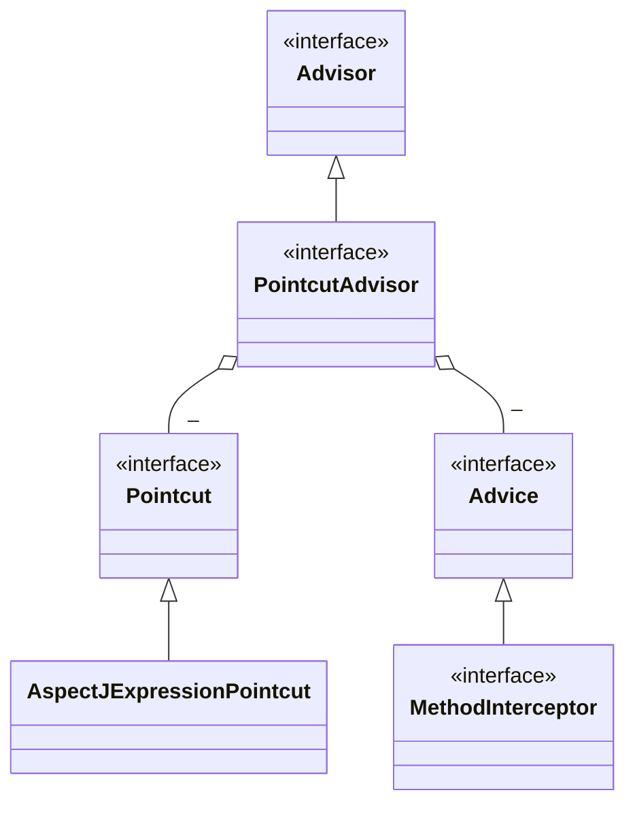

代理相关类图

* AopProxyFactory 根据 proxyTargetClass 等设置选择 AopProxy 实现
* AopProxy 通过 getProxy 创建代理对象
* 图中 Proxy 都实现了 Advised 接口，能够获得关联的切面集合与目标（其实是从 ProxyFactory 取得）
* 调用代理方法时，会借助 ProxyFactory 将通知统一转为环绕通知：MethodInterceptor

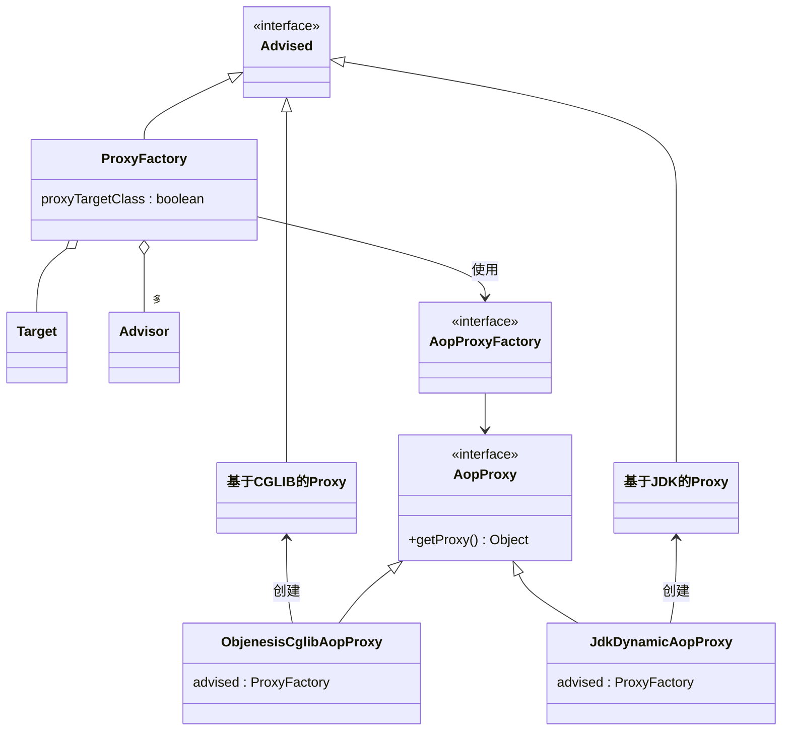


#### 演示 - 底层切点、通知、切面

##### 代码参考

```java
package com.itheima.a15;

import org.aopalliance.intercept.MethodInterceptor;
import org.aopalliance.intercept.MethodInvocation;
import org.aspectj.lang.annotation.After;
import org.aspectj.lang.annotation.Before;
import org.springframework.aop.aspectj.AspectJExpressionPointcut;
import org.springframework.aop.framework.ProxyFactory;
import org.springframework.aop.support.DefaultPointcutAdvisor;

public class A15 {
    static class MyAspect {

        @Before("execution(* foo())")
        public void before(){
            System.out.println("前置增强");
        }
        
        @After("execution(* foo())")
        public void after(){
            System.out.println("后置增强");
        }
    }
    public static void main(String[] args) {
        /*
            两个切面概念
            aspect =
                通知1(advice) +  切点1(pointcut)
                通知2(advice) +  切点2(pointcut)
                通知3(advice) +  切点3(pointcut)
                ...
            advisor = 更细粒度的切面，包含一个通知和切点
         */

        // 1. 备好切点
        AspectJExpressionPointcut pointcut = new AspectJExpressionPointcut();
        pointcut.setExpression("execution(* foo())");
        // 2. 备好通知
        MethodInterceptor advice = invocation -> {
            System.out.println("before...");
            Object result = invocation.proceed(); // 调用目标
            System.out.println("after...");
            return result;
        };
        // 3. 备好切面
        DefaultPointcutAdvisor advisor = new DefaultPointcutAdvisor(pointcut, advice);

        /*
           4. 创建代理
                a. proxyTargetClass = false, 目标实现了接口, 用 jdk 实现
                b. proxyTargetClass = false,  目标没有实现接口, 用 cglib 实现
                c. proxyTargetClass = true, 总是使用 cglib 实现
         */
        Target2 target = new Target2();
        ProxyFactory factory = new ProxyFactory();
        factory.setTarget(target);
        factory.addAdvisor(advisor);
        factory.setInterfaces(target.getClass().getInterfaces());
        factory.setProxyTargetClass(false);
        Target2 proxy = (Target2) factory.getProxy();
        System.out.println(proxy.getClass());
        proxy.foo();
        proxy.bar();
        /*
            学到了什么
                a. Spring 的代理选择规则
                b. 底层的切点实现
                c. 底层的通知实现
                d. ProxyFactory 是用来创建代理的核心实现, 用 AopProxyFactory 选择具体代理实现
                    - JdkDynamicAopProxy
                    - ObjenesisCglibAopProxy
         */
    }

    interface I1 {
        void foo();

        void bar();
    }

    static class Target1 implements I1 {
        @Override
        public void foo() {
            System.out.println("target1 foo");
        }
        @Override
        public void bar() {
            System.out.println("target1 bar");
        }
    }

    static class Target2 {
        public void foo() {
            System.out.println("target2 foo");
        }

        public void bar() {
            System.out.println("target2 bar");
        }
    }
}
```

#### 收获💡

1. 底层的切点实现
2. 底层的通知实现
3. 底层的切面实现
4. ProxyFactory 用来创建代理
   * 如果指定了接口，且 proxyTargetClass = false，使用 JdkDynamicAopProxy
   * 如果没有指定接口，或者 proxyTargetClass = true，使用 ObjenesisCglibAopProxy
     * 例外：如果目标是接口类型或已经是 Jdk 代理，使用 JdkDynamicAopProxy

> ***注意***
>
> * 要区分本章节提到的 MethodInterceptor，它与之前 cglib 中用的的 MethodInterceptor 是不同的接口


### 16) 切点匹配

#### 演示 - 切点匹配

##### 代码参考

```java
package com.itheima.a16;

import org.springframework.aop.aspectj.AspectJExpressionPointcut;
import org.springframework.aop.support.StaticMethodMatcherPointcut;
import org.springframework.core.annotation.MergedAnnotations;
import org.springframework.transaction.annotation.Transactional;

import java.lang.reflect.Method;

public class A16 {
    public static void main(String[] args) throws NoSuchMethodException {
       /*AspectJExpressionPointcut pt1 = new AspectJExpressionPointcut();
       pt1.setExpression("execution(* bar())");
       System.out.println(pt1.matches(T1.class.getMethod("foo"), T1.class));
       System.out.println(pt1.matches(T1.class.getMethod("bar"), T1.class));

       AspectJExpressionPointcut pt2 = new AspectJExpressionPointcut();
       pt2.setExpression("@annotation(org.springframework.transaction.annotation.Transactional)");
       System.out.println(pt2.matches(T1.class.getMethod("foo"), T1.class));
       System.out.println(pt2.matches(T1.class.getMethod("bar"), T1.class));
	  */
        StaticMethodMatcherPointcut pt3 = new StaticMethodMatcherPointcut() {
            @Override
            public boolean matches(Method method, Class<?> targetClass) {
                // 检查方法上是否加了 Transactional 注解
                MergedAnnotations annotations = MergedAnnotations.from(method);
                if (annotations.isPresent(Transactional.class)) {
                    return true;
                }
                // 查看类上是否加了 Transactional 注解
                annotations = MergedAnnotations.from(targetClass, MergedAnnotations.SearchStrategy.TYPE_HIERARCHY);
                if (annotations.isPresent(Transactional.class)) {
                    return true;
                }
                return false;
            }
        };

        System.out.println(pt3.matches(T1.class.getMethod("foo"), T1.class));
        System.out.println(pt3.matches(T1.class.getMethod("bar"), T1.class));
        System.out.println(pt3.matches(T2.class.getMethod("foo"), T2.class));
        System.out.println(pt3.matches(T3.class.getMethod("foo"), T3.class));

        /*
            学到了什么
                a. 底层切点实现是如何匹配的: 调用了 aspectj 的匹配方法
                b. 比较关键的是它实现了 MethodMatcher 接口, 用来执行方法的匹配
         */
    }


    static class T1 {
        @Transactional
        public void foo() {
        }
        public void bar() {
        }
    }

    @Transactional
    static class T2 {
        public void foo() {
        }
    }

    @Transactional
    interface I3 {
        void foo();
    }
    static class T3 implements I3 {
        public void foo() {
        }
    }
}
```

#### 收获💡

1. 常见 aspectj 切点用法
2. aspectj 切点的局限性，实际的 @Transactional 切点实现


### 17) 从 @Aspect 到 Advisor

#### 演示1 - 代理创建器

##### 代码参考

```java
package org.springframework.aop.framework.autoproxy;

import org.aspectj.lang.annotation.Aspect;
import org.aspectj.lang.annotation.Before;
import org.springframework.aop.Advisor;
import org.springframework.aop.aspectj.annotation.AnnotationAwareAspectJAutoProxyCreator;
import org.springframework.context.annotation.Configuration;
import org.springframework.context.annotation.ConfigurationClassPostProcessor;
import org.springframework.context.support.GenericApplicationContext;
import org.springframework.core.annotation.Order;

import java.util.List;

public class A17 {
    public static void main(String[] args) {
        GenericApplicationContext context = new GenericApplicationContext();
        context.registerBean("aspect1", Aspect1.class);
        context.registerBean("config", Config.class);
        context.registerBean(ConfigurationClassPostProcessor.class);
        context.registerBean(AnnotationAwareAspectJAutoProxyCreator.class);
        // BeanPostProcessor
        // 创建 -> (*) 依赖注入 -> 初始化 (*)

        context.refresh();
//        for (String name : context.getBeanDefinitionNames()) {
//            System.out.println(name);
//        }

        /*
            第一个重要方法 findEligibleAdvisors 找到有【资格】的 Advisors
                a. 有【资格】的 Advisor 一部分是低级的, 可以由自己编写, 如下例中的 advisor3
                b. 有【资格】的 Advisor 另一部分是高级的, 由本章的主角解析 @Aspect 后获得
         */
        
        AnnotationAwareAspectJAutoProxyCreator creator = context.getBean(AnnotationAwareAspectJAutoProxyCreator.class);
        List<Advisor> advisors = creator.findEligibleAdvisors(Target2.class, "target2");
        
        /*for (Advisor advisor : advisors) {
            System.out.println(advisor);
        }*/

        /*
            第二个重要方法 wrapIfNecessary
                a. 它内部调用 findEligibleAdvisors, 只要返回集合不空, 则表示需要创建代理
         */
        Object o1 = creator.wrapIfNecessary(new Target1(), "target1", "target1");
        System.out.println(o1.getClass());
        Object o2 = creator.wrapIfNecessary(new Target2(), "target2", "target2");
        System.out.println(o2.getClass());

        ((Target1) o1).foo();
        /*
            学到了什么
                a. 自动代理后处理器 AnnotationAwareAspectJAutoProxyCreator 会帮我们创建代理
                b. 通常代理创建的活在原始对象初始化后执行, 但碰到循环依赖会提前至依赖注入之前执行
                c. 高级的 @Aspect 切面会转换为低级的 Advisor 切面, 理解原理, 大道至简
         */
    }

    static class Target1 {
        public void foo() {
            System.out.println("target1 foo");
        }
    }

    static class Target2 {
        public void bar() {
            System.out.println("target2 bar");
        }
    }

    @Aspect // 高级切面类
    @Order(1)
    static class Aspect1 {
        @Before("execution(* foo())")
        public void before1() {
            System.out.println("aspect1 before1...");
        }

        @Before("execution(* foo())")
        public void before2() {
            System.out.println("aspect1 before2...");
        }
    }

    @Configuration
    static class Config {
        /*@Bean // 低级切面
        public Advisor advisor3(MethodInterceptor advice3) {
            AspectJExpressionPointcut pointcut = new AspectJExpressionPointcut();
            pointcut.setExpression("execution(* foo())");
            DefaultPointcutAdvisor advisor = new DefaultPointcutAdvisor(pointcut, advice3);
            return advisor;
        }
        @Bean
        public MethodInterceptor advice3() {
            return invocation -> {
                System.out.println("advice3 before...");
                Object result = invocation.proceed();
                System.out.println("advice3 after...");
                return result;
            };
        }*/
    }

}
```

#### 收获💡

1. AnnotationAwareAspectJAutoProxyCreator 的作用
   * 将高级 @Aspect 切面统一为低级 Advisor 切面
   * 在合适的时机创建代理
2. findEligibleAdvisors 找到有【资格】的 Advisors
   * 有【资格】的 Advisor 一部分是低级的, 可以由自己编写, 如本例 A17 中的 advisor3
   * 有【资格】的 Advisor 另一部分是高级的, 由解析 @Aspect 后获得
3. wrapIfNecessary
   * 它内部调用 findEligibleAdvisors, 只要返回集合不空, 则表示需要创建代理
   * 它的调用时机通常在原始对象初始化后执行, 但碰到循环依赖会提前至依赖注入之前执行


#### 演示2 - 代理创建时机

##### 代码参考

```java
package org.springframework.aop.framework.autoproxy;

import org.aopalliance.intercept.MethodInterceptor;
import org.aopalliance.intercept.MethodInvocation;
import org.springframework.aop.Advisor;
import org.springframework.aop.aspectj.AspectJExpressionPointcut;
import org.springframework.aop.aspectj.annotation.AnnotationAwareAspectJAutoProxyCreator;
import org.springframework.aop.support.DefaultPointcutAdvisor;
import org.springframework.beans.factory.annotation.Autowired;
import org.springframework.beans.factory.annotation.AutowiredAnnotationBeanPostProcessor;
import org.springframework.context.annotation.Bean;
import org.springframework.context.annotation.CommonAnnotationBeanPostProcessor;
import org.springframework.context.annotation.Configuration;
import org.springframework.context.annotation.ConfigurationClassPostProcessor;
import org.springframework.context.support.GenericApplicationContext;

import javax.annotation.PostConstruct;

public class A17_1 {

    public static void main(String[] args) {
        GenericApplicationContext context = new GenericApplicationContext();
        context.registerBean(ConfigurationClassPostProcessor.class);
        context.registerBean(Config.class);
        context.refresh();
        context.close();
        // 创建 -> (*) 依赖注入 -> 初始化 (*)
        /*
            学到了什么
                a. 代理的创建时机
                    1. 初始化之后 (无循环依赖时)
                    2. 实例创建后, 依赖注入前 (有循环依赖时), 并暂存于二级缓存
                b. 依赖注入与初始化不应该被增强, 仍应被施加于原始对象
         */
    }

    @Configuration
    static class Config {
        @Bean // 解析 @Aspect、产生代理
        public AnnotationAwareAspectJAutoProxyCreator annotationAwareAspectJAutoProxyCreator() {
            return new AnnotationAwareAspectJAutoProxyCreator();
        }

        @Bean // 解析 @Autowired
        public AutowiredAnnotationBeanPostProcessor autowiredAnnotationBeanPostProcessor() {
            return new AutowiredAnnotationBeanPostProcessor();
        }

        @Bean // 解析 @PostConstruct
        public CommonAnnotationBeanPostProcessor commonAnnotationBeanPostProcessor() {
            return new CommonAnnotationBeanPostProcessor();
        }

        @Bean
        public Advisor advisor(MethodInterceptor advice) {
            AspectJExpressionPointcut pointcut = new AspectJExpressionPointcut();
            pointcut.setExpression("execution(* foo())");
            return new DefaultPointcutAdvisor(pointcut, advice);
        }

        @Bean
        public MethodInterceptor advice() {
            return (MethodInvocation invocation) -> {
                System.out.println("before...");
                return invocation.proceed();
            };
        }

        @Bean
        public Bean1 bean1() {
            return new Bean1();
        }

        @Bean
        public Bean2 bean2() {
            return new Bean2();
        }
    }

    static class Bean1 {
        public void foo() {

        }
        public Bean1() {
            System.out.println("Bean1()");
        }
        @Autowired public void setBean2(Bean2 bean2) {
            System.out.println("Bean1 setBean2(bean2) class is: " + bean2.getClass());
        }
        @PostConstruct public void init() {
            System.out.println("Bean1 init()");
        }
    }

    static class Bean2 {
        public Bean2() {
            System.out.println("Bean2()");
        }
        @Autowired public void setBean1(Bean1 bean1) {
            System.out.println("Bean2 setBean1(bean1) class is: " + bean1.getClass());
        }
        @PostConstruct public void init() {
            System.out.println("Bean2 init()");
        }
    }
}
```

#### 收获💡

1. 代理的创建时机
   * 初始化之后 (无循环依赖时)
   * 实例创建后, 依赖注入前 (有循环依赖时), 并暂存于二级缓存
2. 依赖注入与初始化不应该被增强, 仍应被施加于原始对象


#### 演示3 - @Before 对应的低级通知

##### 代码参考

```java
package org.springframework.aop.framework.autoproxy;

import org.aspectj.lang.ProceedingJoinPoint;
import org.aspectj.lang.annotation.Before;
import org.springframework.aop.Advisor;
import org.springframework.aop.aspectj.AspectInstanceFactory;
import org.springframework.aop.aspectj.AspectJExpressionPointcut;
import org.springframework.aop.aspectj.AspectJMethodBeforeAdvice;
import org.springframework.aop.aspectj.SingletonAspectInstanceFactory;
import org.springframework.aop.interceptor.ExposeInvocationInterceptor;
import org.springframework.aop.support.DefaultPointcutAdvisor;

import java.lang.reflect.Method;
import java.util.ArrayList;
import java.util.List;

public class A17_2 {

    static class Aspect {
        @Before("execution(* foo())")
        public void before1() {
            System.out.println("before1");
        }

        @Before("execution(* foo())")
        public void before2() {
            System.out.println("before2");
        }

        public void after() {
            System.out.println("after");
        }

        public void afterReturning() {
            System.out.println("afterReturning");
        }

        public void afterThrowing() {
            System.out.println("afterThrowing");
        }

        public Object around(ProceedingJoinPoint pjp) throws Throwable {
            try {
                System.out.println("around...before");
                return pjp.proceed();
            } finally {
                System.out.println("around...after");
            }
        }
    }

    static class Target {
        public void foo() {
            System.out.println("target foo");
        }
    }

    @SuppressWarnings("all")
    public static void main(String[] args) throws Throwable {

        AspectInstanceFactory factory = new SingletonAspectInstanceFactory(new Aspect());
        // 高级切面转低级切面类
        List<Advisor> list = new ArrayList<>();
        for (Method method : Aspect.class.getDeclaredMethods()) {
            if (method.isAnnotationPresent(Before.class)) {
                // 解析切点
                String expression = method.getAnnotation(Before.class).value();
                AspectJExpressionPointcut pointcut = new AspectJExpressionPointcut();
                pointcut.setExpression(expression);
                // 通知类
                AspectJMethodBeforeAdvice advice = new AspectJMethodBeforeAdvice(method, pointcut, factory);
                // 切面
                Advisor advisor = new DefaultPointcutAdvisor(pointcut, advice);
                list.add(advisor);
            }
        }
        for (Advisor advisor : list) {
            System.out.println(advisor);
        }
        /*
            @Before 前置通知会被转换为下面原始的 AspectJMethodBeforeAdvice 形式, 该对象包含了如下信息
                a. 通知代码从哪儿来
                b. 切点是什么(这里为啥要切点, 后面解释)
                c. 通知对象如何创建, 本例共用同一个 Aspect 对象
            类似的通知还有
                1. AspectJAroundAdvice (环绕通知)
                2. AspectJAfterReturningAdvice
                3. AspectJAfterThrowingAdvice
                4. AspectJAfterAdvice (环绕通知)
         */

    }
}
```

#### 收获💡

1. @Before 前置通知会被转换为原始的 AspectJMethodBeforeAdvice 形式, 该对象包含了如下信息
   1. 通知代码从哪儿来
   2. 切点是什么(这里为啥要切点, 后面解释)
   3. 通知对象如何创建, 本例共用同一个 Aspect 对象
2. 类似的还有
   1. AspectJAroundAdvice (环绕通知)
   2. AspectJAfterReturningAdvice
   3. AspectJAfterThrowingAdvice (环绕通知)
   4. AspectJAfterAdvice (环绕通知)


### 18) 静态通知调用

代理对象调用流程如下（以 JDK 动态代理实现为例）

* 从 ProxyFactory 获得 Target 和环绕通知链，根据他俩创建 MethodInvocation，简称 mi
* 首次执行 mi.proceed() 发现有下一个环绕通知，调用它的 invoke(mi)
* 进入环绕通知1，执行前增强，再次调用 mi.proceed() 发现有下一个环绕通知，调用它的 invoke(mi)
* 进入环绕通知2，执行前增强，调用 mi.proceed() 发现没有环绕通知，调用 mi.invokeJoinPoint() 执行目标方法
* 目标方法执行结束，将结果返回给环绕通知2，执行环绕通知2 的后增强
* 环绕通知2继续将结果返回给环绕通知1，执行环绕通知1 的后增强
* 环绕通知1返回最终的结果

图中不同颜色对应一次环绕通知或目标的调用起始至终结

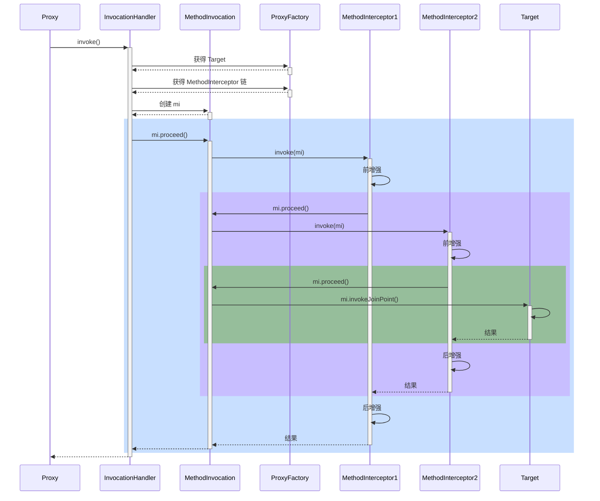


#### 演示1 - 通知调用过程

##### 代码参考

```java
public class A18 {

    static class Aspect {
        @Before("execution(* foo())")
        public void before1() {
            System.out.println("before1");
        }

        @Before("execution(* foo())")
        public void before2() {
            System.out.println("before2");
        }

        public void after() {
            System.out.println("after");
        }

        @AfterReturning("execution(* foo())")
        public void afterReturning() {
            System.out.println("afterReturning");
        }

        @AfterThrowing("execution(* foo())")
        public void afterThrowing(Exception e) {
            System.out.println("afterThrowing " + e.getMessage());
        }

        @Around("execution(* foo())")
        public Object around(ProceedingJoinPoint pjp) throws Throwable {
            try {
                System.out.println("around...before");
                return pjp.proceed();
            } finally {
                System.out.println("around...after");
            }
        }
    }

    static class Target {
        public void foo() {
            System.out.println("target foo");
        }
    }

    @SuppressWarnings("all")
    public static void main(String[] args) throws Throwable {

        AspectInstanceFactory factory = new SingletonAspectInstanceFactory(new Aspect());
        // 1. 高级切面转低级切面类
        List<Advisor> list = new ArrayList<>();
        for (Method method : Aspect.class.getDeclaredMethods()) {
            if (method.isAnnotationPresent(Before.class)) {
                // 解析切点
                String expression = method.getAnnotation(Before.class).value();
                AspectJExpressionPointcut pointcut = new AspectJExpressionPointcut();
                pointcut.setExpression(expression);
                // 通知类
                AspectJMethodBeforeAdvice advice = new AspectJMethodBeforeAdvice(method, pointcut, factory);
                // 切面
                Advisor advisor = new DefaultPointcutAdvisor(pointcut, advice);
                list.add(advisor);
            } else if (method.isAnnotationPresent(AfterReturning.class)) {
                // 解析切点
                String expression = method.getAnnotation(AfterReturning.class).value();
                AspectJExpressionPointcut pointcut = new AspectJExpressionPointcut();
                pointcut.setExpression(expression);
                // 通知类
                AspectJAfterReturningAdvice advice = new AspectJAfterReturningAdvice(method, pointcut, factory);
                // 切面
                Advisor advisor = new DefaultPointcutAdvisor(pointcut, advice);
                list.add(advisor);
            } else if (method.isAnnotationPresent(Around.class)) {
                // 解析切点
                String expression = method.getAnnotation(Around.class).value();
                AspectJExpressionPointcut pointcut = new AspectJExpressionPointcut();
                pointcut.setExpression(expression);
                // 通知类
                AspectJAroundAdvice advice = new AspectJAroundAdvice(method, pointcut, factory);
                // 切面
                Advisor advisor = new DefaultPointcutAdvisor(pointcut, advice);
                list.add(advisor);
            }
        }
        for (Advisor advisor : list) {
            System.out.println(advisor);
        }

        /*
            @Before 前置通知会被转换为下面原始的 AspectJMethodBeforeAdvice 形式, 该对象包含了如下信息
                a. 通知代码从哪儿来
                b. 切点是什么
                c. 通知对象如何创建, 本例共用同一个 Aspect 对象
            类似的通知还有
                1. AspectJAroundAdvice (环绕通知)
                2. AspectJAfterReturningAdvice
                3. AspectJAfterThrowingAdvice (环绕通知)
                4. AspectJAfterAdvice (环绕通知)
         */

        // 2. 通知统一转换为环绕通知 MethodInterceptor
        /*

            其实无论 ProxyFactory 基于哪种方式创建代理, 最后干活(调用 advice)的是一个 MethodInvocation 对象
                a. 因为 advisor 有多个, 且一个套一个调用, 因此需要一个调用链对象, 即 MethodInvocation
                b. MethodInvocation 要知道 advice 有哪些, 还要知道目标, 调用次序如下

                将 MethodInvocation 放入当前线程
                    |-> before1 ----------------------------------- 从当前线程获取 MethodInvocation
                    |                                             |
                    |   |-> before2 --------------------          | 从当前线程获取 MethodInvocation
                    |   |                              |          |
                    |   |   |-> target ------ 目标   advice2    advice1
                    |   |                              |          |
                    |   |-> after2 ---------------------          |
                    |                                             |
                    |-> after1 ------------------------------------
                c. 从上图看出, 环绕通知才适合作为 advice, 因此其他 before、afterReturning 都会被转换成环绕通知
                d. 统一转换为环绕通知, 体现的是设计模式中的适配器模式
                    - 对外是为了方便使用要区分 before、afterReturning
                    - 对内统一都是环绕通知, 统一用 MethodInterceptor 表示

            此步获取所有执行时需要的 advice (静态)
                a. 即统一转换为 MethodInterceptor 环绕通知, 这体现在方法名中的 Interceptors 上
                b. 适配如下
                  - MethodBeforeAdviceAdapter 将 @Before AspectJMethodBeforeAdvice 适配为 MethodBeforeAdviceInterceptor
                  - AfterReturningAdviceAdapter 将 @AfterReturning AspectJAfterReturningAdvice 适配为 AfterReturningAdviceInterceptor
         */
        Target target = new Target();
        ProxyFactory proxyFactory = new ProxyFactory();
        proxyFactory.setTarget(target);
        proxyFactory.addAdvice(ExposeInvocationInterceptor.INSTANCE); // 准备把 MethodInvocation 放入当前线程
        proxyFactory.addAdvisors(list);

        System.out.println(">>>>>>>>>>>>>>>>>>>>>>>>>>>>>>");
        List<Object> methodInterceptorList = proxyFactory.getInterceptorsAndDynamicInterceptionAdvice(Target.class.getMethod("foo"), Target.class);
        for (Object o : methodInterceptorList) {
            System.out.println(o);
        }

        System.out.println(">>>>>>>>>>>>>>>>>>>>>>>>>>>>>>");
        // 3. 创建并执行调用链 (环绕通知s + 目标)
        MethodInvocation methodInvocation = new ReflectiveMethodInvocation(
                null, target, Target.class.getMethod("foo"), new Object[0], Target.class, methodInterceptorList
        );
        methodInvocation.proceed();


        /*
            学到了什么
                a. 无参数绑定的通知如何被调用
                b. MethodInvocation 编程技巧: 拦截器、过滤器等等实现都与此类似
                c. 适配器模式在 Spring 中的体现
         */

    }
}
```

#### 收获💡

代理方法执行时会做如下工作

1. 通过 proxyFactory 的 getInterceptorsAndDynamicInterceptionAdvice() 将其他通知统一转换为 MethodInterceptor 环绕通知
   - MethodBeforeAdviceAdapter 将 @Before AspectJMethodBeforeAdvice 适配为 MethodBeforeAdviceInterceptor
   - AfterReturningAdviceAdapter 将 @AfterReturning AspectJAfterReturningAdvice 适配为 AfterReturningAdviceInterceptor
   - 这体现的是适配器设计模式
2. 所谓静态通知，体现在上面方法的 Interceptors 部分，这些通知调用时无需再次检查切点，直接调用即可
3. 结合目标与环绕通知链，创建 MethodInvocation 对象，通过它完成整个调用


#### 演示2 - 模拟 MethodInvocation

##### 代码参考

```java
package org.springframework.aop.framework;

import org.aopalliance.intercept.MethodInterceptor;
import org.aopalliance.intercept.MethodInvocation;

import java.lang.reflect.AccessibleObject;
import java.lang.reflect.Method;
import java.util.List;

/**
 * 模拟调用链过程, 是一个简单的递归过程
 * 1. proceed() 方法调用链中下一个环绕通知
 * 2. 每个环绕通知内部继续调用 proceed()
 * 3. 调用到没有更多通知了, 就调用目标方法
 */
public class A18_1 {

    static class Target {
        public void foo() {
            System.out.println("Target.foo()");
        }
    }

    static class Advice1 implements MethodInterceptor {
        @Override
        public Object invoke(MethodInvocation invocation) throws Throwable {
            System.out.println("Advice1.before()");
            Object result = invocation.proceed();// 调用下一个通知或目标
            System.out.println("Advice1.after()");
            return result;
        }
    }

    static class Advice2 implements MethodInterceptor {
        @Override
        public Object invoke(MethodInvocation invocation) throws Throwable {
            System.out.println("Advice2.before()");
            Object result = invocation.proceed();// 调用下一个通知或目标
            System.out.println("Advice2.after()");
            return result;
        }
    }


    static class MyInvocation implements MethodInvocation {
        private Object target;  // 目标
        private Method method;  // 目标方法
        private Object[] args;  // 命令参数
        List<MethodInterceptor> methodInterceptorList; // 2 多个通知的集合
        private int count = 1; // 调用次数

        public MyInvocation(Object target, Method method, Object[] args, List<MethodInterceptor> methodInterceptorList) {
            this.target = target;
            this.method = method;
            this.args = args;
            this.methodInterceptorList = methodInterceptorList;
        }

        @Override
        public Method getMethod() {
            return method;
        }

        @Override
        public Object[] getArguments() {
            return args;
        }

        @Override
        public Object proceed() throws Throwable {
            // 调用每一个环绕通知, 调用目标
            if (count > methodInterceptorList.size()) {
                // 调用目标， 返回并结束递归
                return method.invoke(target, args);
            }
            // 逐一调用通知, count + 1
            MethodInterceptor methodInterceptor = methodInterceptorList.get(count++ - 1);
            return methodInterceptor.invoke(this);
        }

        @Override
        public Object getThis() {
            return target;
        }

        @Override
        public AccessibleObject getStaticPart() {
            return method;
        }
    }

    public static void main(String[] args) throws Throwable {
        Target target = new Target();
        List<MethodInterceptor> list = List.of(
                new Advice1(),
                new Advice2()
        );
        MyInvocation invocation = new MyInvocation(target, Target.class.getMethod("foo"), new Object[0], list);
        invocation.proceed();
    }
}
```

#### 收获💡

1. proceed() 方法调用链中下一个环绕通知
2. 每个环绕通知内部继续调用 proceed()
3. 调用到没有更多通知了, 就调用目标方法

MethodInvocation 的编程技巧在实现拦截器、过滤器时能用上


### 19) 动态通知调用

#### 演示 - 带参数绑定的通知方法调用

##### 代码参考

```java
public class A19 {

    @Aspect
    static class MyAspect {
        // 静态通知调用，不带参数绑定，执行时不需要切点
        @Before("execution(* foo(..))")
        public void before1() {
            System.out.println("before1");
        }

        // 动态通知调用，需要参数绑定，执行时还需要切点对象
        @Before("execution(* foo(..)) && args(x)")
        public void before2(int x) {
            System.out.printf("before2(%d)%n", x);
        }
    }

    static class Target {
        public void foo(int x) {
            System.out.printf("target foo(%d)%n", x);
        }
    }

    @Configuration
    static class MyConfig {
        @Bean
        AnnotationAwareAspectJAutoProxyCreator proxyCreator() {
            return new AnnotationAwareAspectJAutoProxyCreator();
        }

        @Bean
        public MyAspect myAspect() {
            return new MyAspect();
        }
    }

    public static void main(String[] args) throws Throwable {
        GenericApplicationContext context = new GenericApplicationContext();
        context.registerBean(ConfigurationClassPostProcessor.class);
        context.registerBean(MyConfig.class);
        context.refresh();

        AnnotationAwareAspectJAutoProxyCreator creator = context.getBean(AnnotationAwareAspectJAutoProxyCreator.class);
        List<Advisor> list = creator.findEligibleAdvisors(Target.class, "target");

        Target target = new Target();
        ProxyFactory factory = new ProxyFactory();
        factory.setTarget(target);
        factory.addAdvisors(list);
        // 获取代理
        Object proxy = factory.getProxy();

        List<Object> interceptorList = factory.getInterceptorsAndDynamicInterceptionAdvice(Target.class.getMethod("foo", int.class), Target.class);
        for (Object o : interceptorList) {
            showDetail(o);
        }

        System.out.println(">>>>>>>>>>>>>>>>>>>>>>>>>>");
        ReflectiveMethodInvocation invocation = new ReflectiveMethodInvocation(
                proxy, target, Target.class.getMethod("foo", int.class), new Object[]{100}, Target.class, interceptorList
        ) {
        };

        invocation.proceed();

        /*
            学到了什么
                a. 有参数绑定的通知调用时还需要切点，对参数进行匹配及绑定
                b. 复杂程度高, 性能比无参数绑定的通知调用低
         */
    }

    public static void showDetail(Object o) {
        try {
            Class<?> clazz = Class.forName("org.springframework.aop.framework.InterceptorAndDynamicMethodMatcher");
            if (clazz.isInstance(o)) {
                Field methodMatcher = clazz.getDeclaredField("methodMatcher");
                methodMatcher.setAccessible(true);
                Field methodInterceptor = clazz.getDeclaredField("interceptor");
                methodInterceptor.setAccessible(true);
                System.out.println("环绕通知和切点：" + o);
                System.out.println("\t切点为：" + methodMatcher.get(o));
                System.out.println("\t通知为：" + methodInterceptor.get(o));
            } else {
                System.out.println("普通环绕通知：" + o);
            }
        } catch (Exception e) {
            e.printStackTrace();
        }
    }
}
```

#### 收获💡

1. 通过 proxyFactory 的 getInterceptorsAndDynamicInterceptionAdvice() 将其他通知统一转换为 MethodInterceptor 环绕通知
2. 所谓动态通知，体现在上面方法的 DynamicInterceptionAdvice 部分，这些通知调用时因为要为通知方法绑定参数，还需再次利用切点表达式
3. 动态通知调用复杂程度高，性能较低


## WEB

### 20) RequestMappingHandlerMapping 与 RequestMappingHandlerAdapter

RequestMappingHandlerMapping 与 RequestMappingHandlerAdapter 俩是一对，分别用来

* 处理 @RequestMapping 映射
* 调用控制器方法、并处理方法参数与方法返回值

#### 演示1 - DispatcherServlet 初始化

##### 代码参考

```java
@Configuration
@ComponentScan
@PropertySource("classpath:application.properties")
@EnableConfigurationProperties({WebMvcProperties.class, ServerProperties.class})
public class WebConfig {
    // ⬅️内嵌 web 容器工厂
    @Bean
    public TomcatServletWebServerFactory tomcatServletWebServerFactory(ServerProperties serverProperties) {
        return new TomcatServletWebServerFactory(serverProperties.getPort());
    }

    // ⬅️创建 DispatcherServlet
    @Bean
    public DispatcherServlet dispatcherServlet() {
        return new DispatcherServlet();
    }

    // ⬅️注册 DispatcherServlet, Spring MVC 的入口
    @Bean
    public DispatcherServletRegistrationBean dispatcherServletRegistrationBean(
            DispatcherServlet dispatcherServlet, WebMvcProperties webMvcProperties) {
        DispatcherServletRegistrationBean registrationBean = new DispatcherServletRegistrationBean(dispatcherServlet, "/");
        registrationBean.setLoadOnStartup(webMvcProperties.getServlet().getLoadOnStartup());
        return registrationBean;
    }

    // 如果用 DispatcherServlet 初始化时默认添加的组件, 并不会作为 bean, 给测试带来困扰
    // ⬅️1. 加入RequestMappingHandlerMapping
    @Bean
    public RequestMappingHandlerMapping requestMappingHandlerMapping() {
        return new RequestMappingHandlerMapping();
    }

    // ⬅️2. 继续加入RequestMappingHandlerAdapter, 会替换掉 DispatcherServlet 默认的 4 个 HandlerAdapter
    @Bean
    public MyRequestMappingHandlerAdapter requestMappingHandlerAdapter() {
        TokenArgumentResolver tokenArgumentResolver = new TokenArgumentResolver();
        YmlReturnValueHandler ymlReturnValueHandler = new YmlReturnValueHandler();
        MyRequestMappingHandlerAdapter handlerAdapter = new MyRequestMappingHandlerAdapter();
        handlerAdapter.setCustomArgumentResolvers(List.of(tokenArgumentResolver));
        handlerAdapter.setCustomReturnValueHandlers(List.of(ymlReturnValueHandler));
        return handlerAdapter;
    }

    public HttpMessageConverters httpMessageConverters() {
        return new HttpMessageConverters();
    }

    // ⬅️3. 演示 RequestMappingHandlerAdapter 初始化后, 有哪些参数、返回值处理器

    // ⬅️3.1 创建自定义参数处理器

    // ⬅️3.2 创建自定义返回值处理器

}
```

```java
public class A20 {
    private static final Logger log = LoggerFactory.getLogger(A20.class);

    public static void main(String[] args) throws Exception {
        AnnotationConfigServletWebServerApplicationContext context =
                new AnnotationConfigServletWebServerApplicationContext(WebConfig.class);

        // 作用 解析 @RequestMapping 以及派生注解，生成路径与控制器方法的映射关系, 在初始化时就生成
        RequestMappingHandlerMapping handlerMapping = context.getBean(RequestMappingHandlerMapping.class);

        // 获取映射结果
        Map<RequestMappingInfo, HandlerMethod> handlerMethods = handlerMapping.getHandlerMethods();
        handlerMethods.forEach((k, v) -> {
            System.out.println(k + "=" + v);
        });

        // 请求来了，获取控制器方法  返回处理器执行链对象
        MockHttpServletRequest request = new MockHttpServletRequest("GET", "/test4");
        request.setParameter("name", "张三");
        request.addHeader("token", "某个令牌");
        MockHttpServletResponse response = new MockHttpServletResponse();
        HandlerExecutionChain chain = handlerMapping.getHandler(request);
        System.out.println(chain);

        System.out.println(">>>>>>>>>>>>>>>>>>>>>");
        // HandlerAdapter 作用: 调用控制器方法
        MyRequestMappingHandlerAdapter handlerAdapter = context.getBean(MyRequestMappingHandlerAdapter.class);
        handlerAdapter.invokeHandlerMethod(request, response, (HandlerMethod) chain.getHandler());

        // 检查响应
        byte[] content = response.getContentAsByteArray();
        System.out.println(new String(content, StandardCharsets.UTF_8));

        /*System.out.println(">>>>>>>>>>>>>>>>>>>>> 所有参数解析器");
        for (HandlerMethodArgumentResolver resolver : handlerAdapter.getArgumentResolvers()) {
            System.out.println(resolver);
        }

        System.out.println(">>>>>>>>>>>>>>>>>>>>> 所有返回值解析器");
        for (HandlerMethodReturnValueHandler handler : handlerAdapter.getReturnValueHandlers()) {
            System.out.println(handler);
        }*/

        /*
        学到了什么
            a. DispatcherServlet 是在第一次被访问时执行初始化, 也可以通过配置修改为 Tomcat 启动后就初始化
            b. 在初始化时会从 Spring 容器中找一些 Web 需要的组件, 如 HandlerMapping、HandlerAdapter 等

        本章介绍两个最为重要的组件
            a. RequestMappingHandlerAdapter, 以 @RequestMapping 作为映射路径
            b. RequestMappingHandlerAdapter, 调用 handler
            c. 控制器的具体方法会被当作 handler
                - handler 的参数和返回值多种多样
                - 需要解析方法参数, 由 HandlerMethodArgumentResolver 来做
                - 需要处理方法返回值, 由 HandlerMethodReturnValueHandler 来做
        */
    }
}
```

```java
public class MyRequestMappingHandlerAdapter extends RequestMappingHandlerAdapter {
    @Override
    public ModelAndView invokeHandlerMethod(HttpServletRequest request, HttpServletResponse response, HandlerMethod handlerMethod) throws Exception {
        return super.invokeHandlerMethod(request, response, handlerMethod);
    }
}
```

#### 收获💡

1. DispatcherServlet 是在第一次被访问时执行初始化, 也可以通过配置修改为 Tomcat 启动后就初始化
2. 在初始化时会从 Spring 容器中找一些 Web 需要的组件, 如 HandlerMapping、HandlerAdapter 等，并逐一调用它们的初始化
3. RequestMappingHandlerMapping 初始化时，会收集所有 @RequestMapping 映射信息，封装为 Map，其中
   * key 是 RequestMappingInfo 类型，包括请求路径、请求方法等信息
   * value 是 HandlerMethod 类型，包括控制器方法对象、控制器对象
   * 有了这个 Map，就可以在请求到达时，快速完成映射，找到 HandlerMethod 并与匹配的拦截器一起返回给 DispatcherServlet
4. RequestMappingHandlerAdapter 初始化时，会准备 HandlerMethod 调用时需要的各个组件，如：
   * HandlerMethodArgumentResolver 解析控制器方法参数
   * HandlerMethodReturnValueHandler 处理控制器方法返回值


#### 演示2 - 自定义参数与返回值处理器

##### 代码参考

```java
// 例如经常需要用到请求头中的 token 信息, 用下面注解来标注由哪个参数来获取它
// token=令牌
@Target(ElementType.PARAMETER)
@Retention(RetentionPolicy.RUNTIME)
public @interface Token {
}
```

```java
public class TokenArgumentResolver implements HandlerMethodArgumentResolver {
    @Override
    // 是否支持某个参数
    public boolean supportsParameter(MethodParameter parameter) {
        Token token = parameter.getParameterAnnotation(Token.class);
        return token != null;
    }

    @Override
    // 解析参数
    public Object resolveArgument(MethodParameter parameter, ModelAndViewContainer mavContainer,
                                  NativeWebRequest webRequest, WebDataBinderFactory binderFactory) throws Exception {
        return webRequest.getHeader("token");
    }
}
```

```java
@Target(ElementType.METHOD)
@Retention(RetentionPolicy.RUNTIME)
public @interface Yml {
}
```

```java
public class YmlReturnValueHandler implements HandlerMethodReturnValueHandler {
    @Override
    public boolean supportsReturnType(MethodParameter returnType) {
        Yml yml = returnType.getMethodAnnotation(Yml.class);
        return yml != null;
    }

    @Override                   //  返回值
    public void handleReturnValue(Object returnValue, MethodParameter returnType,
                                  ModelAndViewContainer mavContainer, NativeWebRequest webRequest) throws Exception {
        // 1. 转换返回结果为 yaml 字符串
        String str = new Yaml().dump(returnValue);

        // 2. 将 yaml 字符串写入响应
        HttpServletResponse response = webRequest.getNativeResponse(HttpServletResponse.class);
        response.setContentType("text/plain;charset=utf-8");
        response.getWriter().print(str);

        // 3. 设置请求已经处理完毕
        mavContainer.setRequestHandled(true);
    }
}
```

#### 收获💡

1. 体会参数解析器的作用
2. 体会返回值处理器的作用


### 21) 参数解析器

#### 演示 - 常见参数解析器

##### 代码参考

```java
/*
    目标: 解析控制器方法的参数值

    常见的参数处理器如下:
        org.springframework.web.method.annotation.RequestParamMethodArgumentResolver@abbc908
        org.springframework.web.method.annotation.RequestParamMapMethodArgumentResolver@44afefd5
        org.springframework.web.servlet.mvc.method.annotation.PathVariableMethodArgumentResolver@9a7a808
        org.springframework.web.servlet.mvc.method.annotation.PathVariableMapMethodArgumentResolver@72209d93
        org.springframework.web.servlet.mvc.method.annotation.MatrixVariableMethodArgumentResolver@2687f956
        org.springframework.web.servlet.mvc.method.annotation.MatrixVariableMapMethodArgumentResolver@1ded7b14
        org.springframework.web.servlet.mvc.method.annotation.ServletModelAttributeMethodProcessor@29be7749
        org.springframework.web.servlet.mvc.method.annotation.RequestResponseBodyMethodProcessor@5f84abe8
        org.springframework.web.servlet.mvc.method.annotation.RequestPartMethodArgumentResolver@4650a407
        org.springframework.web.method.annotation.RequestHeaderMethodArgumentResolver@30135202
        org.springframework.web.method.annotation.RequestHeaderMapMethodArgumentResolver@6a4d7f76
        org.springframework.web.servlet.mvc.method.annotation.ServletCookieValueMethodArgumentResolver@10ec523c
        org.springframework.web.method.annotation.ExpressionValueMethodArgumentResolver@53dfacba
        org.springframework.web.servlet.mvc.method.annotation.SessionAttributeMethodArgumentResolver@79767781
        org.springframework.web.servlet.mvc.method.annotation.RequestAttributeMethodArgumentResolver@78411116
        org.springframework.web.servlet.mvc.method.annotation.ServletRequestMethodArgumentResolver@aced190
        org.springframework.web.servlet.mvc.method.annotation.ServletResponseMethodArgumentResolver@245a060f
        org.springframework.web.servlet.mvc.method.annotation.HttpEntityMethodProcessor@6edaa77a
        org.springframework.web.servlet.mvc.method.annotation.RedirectAttributesMethodArgumentResolver@1e63d216
        org.springframework.web.method.annotation.ModelMethodProcessor@62ddd21b
        org.springframework.web.method.annotation.MapMethodProcessor@16c3ca31
        org.springframework.web.method.annotation.ErrorsMethodArgumentResolver@2d195ee4
        org.springframework.web.method.annotation.SessionStatusMethodArgumentResolver@2d6aca33
        org.springframework.web.servlet.mvc.method.annotation.UriComponentsBuilderMethodArgumentResolver@21ab988f
        org.springframework.web.servlet.mvc.method.annotation.PrincipalMethodArgumentResolver@29314cc9
        org.springframework.web.method.annotation.RequestParamMethodArgumentResolver@4e38d975
        org.springframework.web.servlet.mvc.method.annotation.ServletModelAttributeMethodProcessor@35f8a9d3
 */
public class A21 {

    public static void main(String[] args) throws Exception {
        AnnotationConfigApplicationContext context = new AnnotationConfigApplicationContext(WebConfig.class);
        DefaultListableBeanFactory beanFactory = context.getDefaultListableBeanFactory();
        // 准备测试 Request
        HttpServletRequest request = mockRequest();

        // 要点1. 控制器方法被封装为 HandlerMethod
        HandlerMethod handlerMethod = new HandlerMethod(new Controller(), Controller.class.getMethod("test", String.class, String.class, int.class, String.class, MultipartFile.class, int.class, String.class, String.class, String.class, HttpServletRequest.class, User.class, User.class, User.class));

        // 要点2. 准备对象绑定与类型转换
        ServletRequestDataBinderFactory factory = new ServletRequestDataBinderFactory(null, null);

        // 要点3. 准备 ModelAndViewContainer 用来存储中间 Model 结果
        ModelAndViewContainer container = new ModelAndViewContainer();

        // 要点4. 解析每个参数值
        for (MethodParameter parameter : handlerMethod.getMethodParameters()) {
            // 多个解析器组合
            HandlerMethodArgumentResolverComposite composite = new HandlerMethodArgumentResolverComposite();
            composite.addResolvers(
                    //                                          false 表示必须有 @RequestParam
                    new RequestParamMethodArgumentResolver(beanFactory, false),
                    new PathVariableMethodArgumentResolver(),
                    new RequestHeaderMethodArgumentResolver(beanFactory),
                    new ServletCookieValueMethodArgumentResolver(beanFactory),
                    new ExpressionValueMethodArgumentResolver(beanFactory),
                    new ServletRequestMethodArgumentResolver(),
                    new ServletModelAttributeMethodProcessor(false), // 必须有 @ModelAttribute
                    new RequestResponseBodyMethodProcessor(List.of(new MappingJackson2HttpMessageConverter())),
                    new ServletModelAttributeMethodProcessor(true), // 省略了 @ModelAttribute
                    new RequestParamMethodArgumentResolver(beanFactory, true) // 省略 @RequestParam
            );

            String annotations = Arrays.stream(parameter.getParameterAnnotations()).map(a -> a.annotationType().getSimpleName()).collect(Collectors.joining());
            String str = annotations.length() > 0 ? " @" + annotations + " " : " ";
            parameter.initParameterNameDiscovery(new DefaultParameterNameDiscoverer());

            if (composite.supportsParameter(parameter)) {
                // 支持此参数
                Object v = composite.resolveArgument(parameter, container, new ServletWebRequest(request), factory);
//                System.out.println(v.getClass());
                System.out.println("[" + parameter.getParameterIndex() + "] " + str + parameter.getParameterType().getSimpleName() + " " + parameter.getParameterName() + "->" + v);
                System.out.println("模型数据为：" + container.getModel());
            } else {
                System.out.println("[" + parameter.getParameterIndex() + "] " + str + parameter.getParameterType().getSimpleName() + " " + parameter.getParameterName());
            }
        }

        /*
            学到了什么
                a. 每个参数处理器能干啥
                    1) 看是否支持某种参数
                    2) 获取参数的值
                b. 组合模式在 Spring 中的体现
                c. @RequestParam, @CookieValue 等注解中的参数名、默认值, 都可以写成活的, 即从 ${ } #{ }中获取
         */
    }

    private static HttpServletRequest mockRequest() {
        MockHttpServletRequest request = new MockHttpServletRequest();
        request.setParameter("name1", "zhangsan");
        request.setParameter("name2", "lisi");
        request.addPart(new MockPart("file", "abc", "hello".getBytes(StandardCharsets.UTF_8)));
        Map<String, String> map = new AntPathMatcher().extractUriTemplateVariables("/test/{id}", "/test/123");
        System.out.println(map);
        request.setAttribute(HandlerMapping.URI_TEMPLATE_VARIABLES_ATTRIBUTE, map);
        request.setContentType("application/json");
        request.setCookies(new Cookie("token", "123456"));
        request.setParameter("name", "张三");
        request.setParameter("age", "18");
       /* request.setContent("""
                    {
                        "name":"李四",
                        "age":20
                    }
                """.getBytes(StandardCharsets.UTF_8));*/

        return new StandardServletMultipartResolver().resolveMultipart(request);
    }

    static class Controller {
        public void test(
                @RequestParam("name1") String name1, // name1=张三
                String name2,                        // name2=李四
                @RequestParam("age") int age,        // age=18
                @RequestParam(name = "home", defaultValue = "${JAVA_HOME}") String home1, // spring 获取数据
                @RequestParam("file") MultipartFile file, // 上传文件
                @PathVariable("id") int id,               //  /test/124   /test/{id}
                @RequestHeader("Content-Type") String header,
                @CookieValue("token") String token,
                @Value("${JAVA_HOME}") String home2, // spring 获取数据  ${} #{}
                HttpServletRequest request,          // request, response, session ...
                @ModelAttribute("abc") User user1,          // name=zhang&age=18
                User user2,                          // name=zhang&age=18
                @RequestBody User user3              // json
        ) {
        }
    }

    static class User {
        private String name;
        private int age;

        public String getName() {
            return name;
        }

        public void setName(String name) {
            this.name = name;
        }

        public int getAge() {
            return age;
        }

        public void setAge(int age) {
            this.age = age;
        }

        @Override
        public String toString() {
            return "User{" +
                    "name='" + name + '\'' +
                    ", age=" + age +
                    '}';
        }
    }
}
```

#### 收获💡

1. 初步了解 RequestMappingHandlerAdapter 的调用过程
   1. 控制器方法被封装为 HandlerMethod
   2. 准备对象绑定与类型转换
   3. 准备 ModelAndViewContainer 用来存储中间 Model 结果
   4. 解析每个参数值
2. 解析参数依赖的就是各种参数解析器，它们都有两个重要方法
   * supportsParameter 判断是否支持方法参数
   * resolveArgument 解析方法参数
3. 常见参数的解析
   * @RequestParam
   * 省略 @RequestParam
   * @RequestParam(defaultValue)
   * MultipartFile
   * @PathVariable
   * @RequestHeader
   * @CookieValue
   * @Value
   * HttpServletRequest 等
   * @ModelAttribute
   * 省略 @ModelAttribute
   * @RequestBody
4. 组合模式在 Spring 中的体现
5. @RequestParam, @CookieValue 等注解中的参数名、默认值, 都可以写成活的, 即从 ${ } #{ }中获取


### 22) 参数名解析

#### 演示 - 两种方法获取参数名

##### 代码参考

```java
package com.itheima.a22;

import org.springframework.core.LocalVariableTableParameterNameDiscoverer;
import org.springframework.core.StandardReflectionParameterNameDiscoverer;

import java.lang.reflect.Method;
import java.lang.reflect.Parameter;
import java.util.Arrays;

/**
    目标: 如何获取方法参数名, 注意把 a22 目录添加至模块的类路径
        1. a22 不在 src 是避免 idea 自动编译它下面的类
        2. spring boot 在编译时会加 -parameters
        3. 大部分 IDE 编译时都会加 -g
 */
public class A22 {

    public static void main(String[] args) throws NoSuchMethodException, ClassNotFoundException {
        // 1. 反射获取参数名
        Method foo = Bean2.class.getMethod("foo", String.class, int.class);
        /*for (Parameter parameter : foo.getParameters()) {
            System.out.println(parameter.getName());
        }*/

        // 2. 基于 LocalVariableTable 本地变量表
        LocalVariableTableParameterNameDiscoverer discoverer = new LocalVariableTableParameterNameDiscoverer();
        String[] parameterNames = discoverer.getParameterNames(foo);
        System.out.println(Arrays.toString(parameterNames));

        /*
            学到了什么
                a. 如果编译时添加了 -parameters 可以生成参数表, 反射时就可以拿到参数名
                b. 如果编译时添加了 -g 可以生成调试信息, 但分为两种情况
                    1. 普通类, 会包含局部变量表, 用 asm 可以拿到参数名
                    2. 接口, 不会包含局部变量表, 无法获得参数名 (这也是 MyBatis 在实现 Mapper 接口时为何要提供 @Param 注解来辅助获得参数名)
         */
    }

}
```

#### 收获💡

1. 如果编译时添加了 -parameters 可以生成参数表, 反射时就可以拿到参数名
2. 如果编译时添加了 -g 可以生成调试信息, 但分为两种情况
   * 普通类, 会包含局部变量表, 用 asm 可以拿到参数名
   * 接口, 不会包含局部变量表, 无法获得参数名
     * 这也是 MyBatis 在实现 Mapper 接口时为何要提供 @Param 注解来辅助获得参数名


### 23) 对象绑定与类型转换

#### 底层第一套转换接口与实现

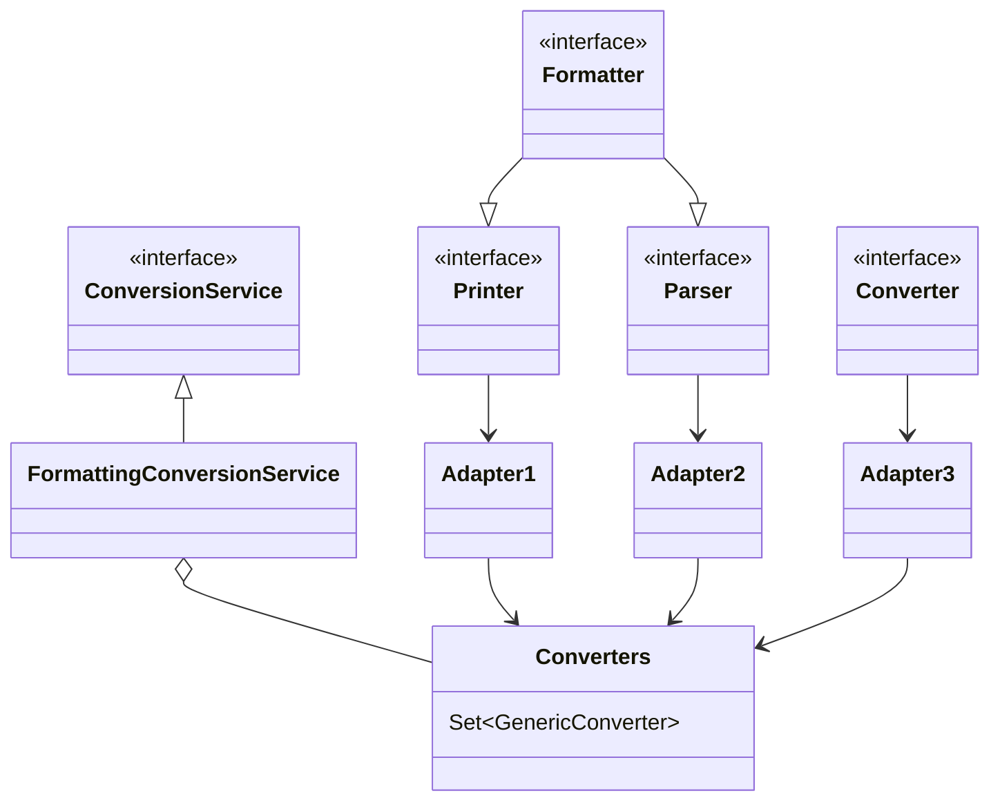

* Printer 把其它类型转为 String
* Parser 把 String 转为其它类型
* Formatter 综合 Printer 与 Parser 功能
* Converter 把类型 S 转为类型 T
* Printer、Parser、Converter 经过适配转换成 GenericConverter 放入 Converters 集合
* FormattingConversionService 利用其它们实现转换


#### 底层第二套转换接口

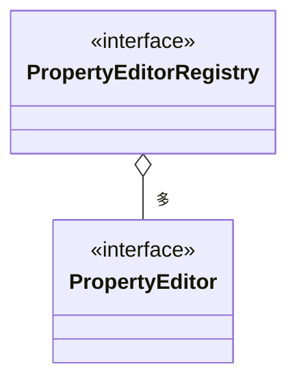

* PropertyEditor 把 String 与其它类型相互转换
* PropertyEditorRegistry 可以注册多个 PropertyEditor 对象
* 与第一套接口直接可以通过 FormatterPropertyEditorAdapter 来进行适配


#### 高层接口与实现

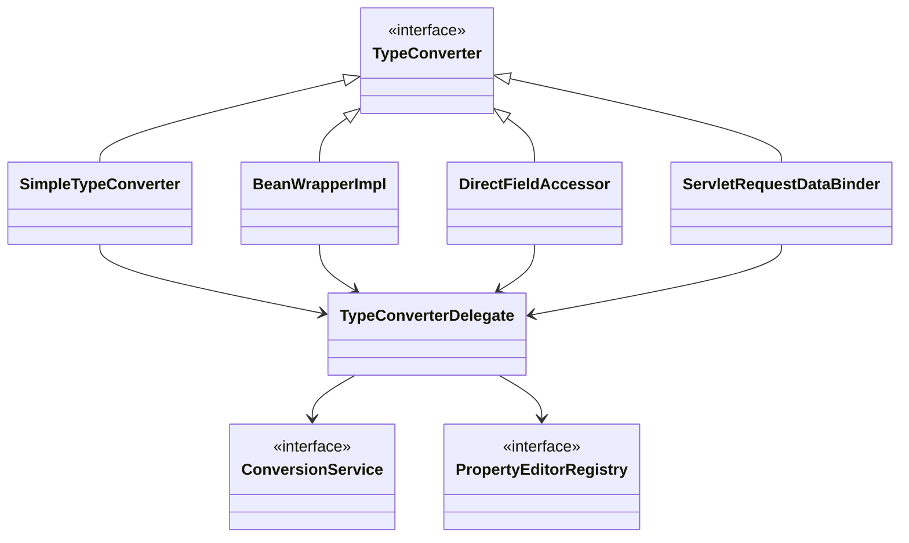

* 它们都实现了 TypeConverter 这个高层转换接口，在转换时，会用到 TypeConverter Delegate 委派ConversionService 与 PropertyEditorRegistry 真正执行转换（Facade 门面模式）
  * 首先看是否有自定义转换器, @InitBinder 添加的即属于这种 (用了适配器模式把 Formatter 转为需要的 PropertyEditor)
  * 再看有没有 ConversionService 转换
  * 再利用默认的 PropertyEditor 转换
  * 最后有一些特殊处理
* SimpleTypeConverter 仅做类型转换
* BeanWrapperImpl 为 bean 的属性赋值，当需要时做类型转换，走 Property
* DirectFieldAccessor 为 bean 的属性赋值，当需要时做类型转换，走 Field
* ServletRequestDataBinder 为 bean 的属性执行绑定，当需要时做类型转换，根据 directFieldAccess 选择走 Property 还是 Field，具备校验与获取校验结果功能


#### 演示1 - 类型转换与数据绑定

##### 代码参考

**SimpleTypeConverter**

```java
public class TestSimpleConverter {
    public static void main(String[] args) {
        // 仅有类型转换的功能
        SimpleTypeConverter typeConverter = new SimpleTypeConverter();
        Integer number = typeConverter.convertIfNecessary("13", int.class);
        Date date = typeConverter.convertIfNecessary("1999/03/04", Date.class);
        System.out.println(number);
        System.out.println(date);
    }
}
```

**BeanWrapperImpl**

```java
public class TestBeanWrapper {
    public static void main(String[] args) {
        // 利用反射原理, 为 bean 的属性赋值
        MyBean target = new MyBean();
        BeanWrapperImpl wrapper = new BeanWrapperImpl(target);
        wrapper.setPropertyValue("a", "10");
        wrapper.setPropertyValue("b", "hello");
        wrapper.setPropertyValue("c", "1999/03/04");
        System.out.println(target);
    }

    static class MyBean {
        private int a;
        private String b;
        private Date c;

        public int getA() {
            return a;
        }

        public void setA(int a) {
            this.a = a;
        }

        public String getB() {
            return b;
        }

        public void setB(String b) {
            this.b = b;
        }

        public Date getC() {
            return c;
        }

        public void setC(Date c) {
            this.c = c;
        }

        @Override
        public String toString() {
            return "MyBean{" +
                    "a=" + a +
                    ", b='" + b + '\'' +
                    ", c=" + c +
                    '}';
        }
    }
}
```

**DirectFieldAccessor**

```java
public class TestFieldAccessor {
    public static void main(String[] args) {
        // 利用反射原理, 为 bean 的属性赋值
        MyBean target = new MyBean();
        DirectFieldAccessor accessor = new DirectFieldAccessor(target);
        accessor.setPropertyValue("a", "10");
        accessor.setPropertyValue("b", "hello");
        accessor.setPropertyValue("c", "1999/03/04");
        System.out.println(target);
    }

    static class MyBean {
        private int a;
        private String b;
        private Date c;

        @Override
        public String toString() {
            return "MyBean{" +
                    "a=" + a +
                    ", b='" + b + '\'' +
                    ", c=" + c +
                    '}';
        }
    }
}
```

**ServletRequestDataBinder**

```java
public class TestDataBinder {

    public static void main(String[] args) {
        // 执行数据绑定
        MyBean target = new MyBean();
        DataBinder dataBinder = new DataBinder(target);
        dataBinder.initDirectFieldAccess();
        MutablePropertyValues pvs = new MutablePropertyValues();
        pvs.add("a", "10");
        pvs.add("b", "hello");
        pvs.add("c", "1999/03/04");
        dataBinder.bind(pvs);
        System.out.println(target);
    }

    static class MyBean {
        private int a;
        private String b;
        private Date c;

        @Override
        public String toString() {
            return "MyBean{" +
                    "a=" + a +
                    ", b='" + b + '\'' +
                    ", c=" + c +
                    '}';
        }
    }
}
```

```java
public class TestServletDataBinder {

    public static void main(String[] args) {
        // web 环境下数据绑定
        MyBean target = new MyBean();
        ServletRequestDataBinder dataBinder = new ServletRequestDataBinder(target);
        MockHttpServletRequest request = new MockHttpServletRequest();
        request.setParameter("a", "10");
        request.setParameter("b", "hello");
        request.setParameter("c", "1999/03/04");

        dataBinder.bind(new ServletRequestParameterPropertyValues(request));

        System.out.println(target);
    }

    static class MyBean {
        private int a;
        private String b;
        private Date c;

        public int getA() {
            return a;
        }

        public void setA(int a) {
            this.a = a;
        }

        public String getB() {
            return b;
        }

        public void setB(String b) {
            this.b = b;
        }

        public Date getC() {
            return c;
        }

        public void setC(Date c) {
            this.c = c;
        }

        @Override
        public String toString() {
            return "MyBean{" +
                   "a=" + a +
                   ", b='" + b + '\'' +
                   ", c=" + c +
                   '}';
        }
    }
}
```

#### 收获💡

基本的类型转换与数据绑定用法

* SimpleTypeConverter
* BeanWrapperImpl
* DirectFieldAccessor
* ServletRequestDataBinder


#### 演示2 - 数据绑定工厂

##### 代码参考

```java
package com.itheima.a23;

import org.springframework.boot.convert.ApplicationConversionService;
import org.springframework.format.annotation.DateTimeFormat;
import org.springframework.format.support.DefaultFormattingConversionService;
import org.springframework.mock.web.MockHttpServletRequest;
import org.springframework.web.bind.ServletRequestParameterPropertyValues;
import org.springframework.web.bind.WebDataBinder;
import org.springframework.web.bind.annotation.InitBinder;
import org.springframework.web.bind.support.ConfigurableWebBindingInitializer;
import org.springframework.web.context.request.ServletWebRequest;
import org.springframework.web.servlet.mvc.method.annotation.ServletRequestDataBinderFactory;

import java.util.Date;

public class TestServletDataBinderFactory {
    public static void main(String[] args) throws Exception {
        MockHttpServletRequest request = new MockHttpServletRequest();
        request.setParameter("birthday", "1999|01|02");
        request.setParameter("address.name", "西安");

        User target = new User();
        // "1. 用工厂, 无转换功能"
//        ServletRequestDataBinderFactory factory = new ServletRequestDataBinderFactory(null, null);
        // "2. 用 @InitBinder 转换"          PropertyEditorRegistry PropertyEditor
//        InvocableHandlerMethod method = new InvocableHandlerMethod(new MyController(), MyController.class.getMethod("aaa", WebDataBinder.class));
//        ServletRequestDataBinderFactory factory = new ServletRequestDataBinderFactory(List.of(method), null);
        // "3. 用 ConversionService 转换"    ConversionService Formatter
//        FormattingConversionService service = new FormattingConversionService();
//        service.addFormatter(new MyDateFormatter("用 ConversionService 方式扩展转换功能"));
//        ConfigurableWebBindingInitializer initializer = new ConfigurableWebBindingInitializer();
//        initializer.setConversionService(service);
//        ServletRequestDataBinderFactory factory = new ServletRequestDataBinderFactory(null, initializer);
        // "4. 同时加了 @InitBinder 和 ConversionService"
//        InvocableHandlerMethod method = new InvocableHandlerMethod(new MyController(), MyController.class.getMethod("aaa", WebDataBinder.class));
//
//        FormattingConversionService service = new FormattingConversionService();
//        service.addFormatter(new MyDateFormatter("用 ConversionService 方式扩展转换功能"));
//        ConfigurableWebBindingInitializer initializer = new ConfigurableWebBindingInitializer();
//        initializer.setConversionService(service);
//
//        ServletRequestDataBinderFactory factory = new ServletRequestDataBinderFactory(List.of(method), initializer);
        // "5. 使用默认 ConversionService 转换"
        ApplicationConversionService service = new ApplicationConversionService();
        ConfigurableWebBindingInitializer initializer = new ConfigurableWebBindingInitializer();
        initializer.setConversionService(service);

        ServletRequestDataBinderFactory factory = new ServletRequestDataBinderFactory(null, initializer);

        WebDataBinder dataBinder = factory.createBinder(new ServletWebRequest(request), target, "user");
        dataBinder.bind(new ServletRequestParameterPropertyValues(request));
        System.out.println(target);
    }

    static class MyController {
        @InitBinder
        public void aaa(WebDataBinder dataBinder) {
            // 扩展 dataBinder 的转换器
            dataBinder.addCustomFormatter(new MyDateFormatter("用 @InitBinder 方式扩展的"));
        }
    }

    public static class User {
        @DateTimeFormat(pattern = "yyyy|MM|dd")
        private Date birthday;
        private Address address;

        public Address getAddress() {
            return address;
        }

        public void setAddress(Address address) {
            this.address = address;
        }

        public Date getBirthday() {
            return birthday;
        }

        public void setBirthday(Date birthday) {
            this.birthday = birthday;
        }

        @Override
        public String toString() {
            return "User{" +
                    "birthday=" + birthday +
                    ", address=" + address +
                    '}';
        }
    }

    public static class Address {
        private String name;

        public String getName() {
            return name;
        }

        public void setName(String name) {
            this.name = name;
        }

        @Override
        public String toString() {
            return "Address{" +
                    "name='" + name + '\'' +
                    '}';
        }
    }
}

```

#### 收获💡

ServletRequestDataBinderFactory 的用法和扩展点

1. 可以解析控制器的 @InitBinder 标注方法作为扩展点，添加自定义转换器
   * 控制器私有范围
2. 可以通过 ConfigurableWebBindingInitializer 配置 ConversionService 作为扩展点，添加自定义转换器
   * 公共范围
3. 同时加了 @InitBinder 和 ConversionService 的转换优先级
   1. 优先采用 @InitBinder 的转换器
   2. 其次使用 ConversionService 的转换器
   3. 使用默认转换器
   4. 特殊处理（例如有参构造）


#### 演示3 - 获取泛型参数

##### 代码参考

**com.itheima.a23.sub** 包

```java
public class TestGenericType {
    public static void main(String[] args) {
        // 小技巧
        // 1. java api
        System.out.println(">>>>>>>>>>>>>>>>>>>>>>>");
        Type type = TeacherDao.class.getGenericSuperclass();
        System.out.println(type);

        if (type instanceof ParameterizedType parameterizedType) {
            System.out.println(parameterizedType.getActualTypeArguments()[0]);
        }

        // 2. spring api 1
        System.out.println(">>>>>>>>>>>>>>>>>>>>>>>");
        Class<?> t = GenericTypeResolver.resolveTypeArgument(TeacherDao.class, BaseDao.class);
        System.out.println(t);

        // 3. spring api 2
        System.out.println(">>>>>>>>>>>>>>>>>>>>>>>");
        System.out.println(ResolvableType.forClass(TeacherDao.class).getSuperType().getGeneric().resolve());
    }

}
```

#### 收获💡

1. java api 获取泛型参数
2. spring api 获取泛型参数


### 24) @ControllerAdvice 之 @InitBinder

#### 演示 - 准备 @InitBinder

**准备 @InitBinder** 在整个 HandlerAdapter 调用过程中所处的位置

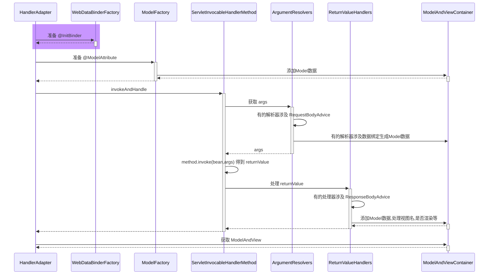

* RequestMappingHandlerAdapter 在图中缩写为 HandlerAdapter
* HandlerMethodArgumentResolverComposite 在图中缩写为 ArgumentResolvers
* HandlerMethodReturnValueHandlerComposite 在图中缩写为 ReturnValueHandlers

```java
@Configuration
public class WebConfig {

    @ControllerAdvice
    static class MyControllerAdvice {
        //帮助我们添加一些自定义的类型转换器的注解 类型转换全局生效
        @InitBinder
        public void binder3(WebDataBinder webDataBinder) {
            webDataBinder.addCustomFormatter(new MyDateFormatter("binder3 转换器"));
        }
        // @ExceptionHandler 处理异常的注解
        
        // @ModelAttribute 补充模型数据的注解
    }

    @Controller
    static class Controller1 {
        //类型转换当前控制器生效
        @InitBinder
        public void binder1(WebDataBinder webDataBinder) {
            webDataBinder.addCustomFormatter(new MyDateFormatter("binder1 转换器"));
        }

        public void foo() {

        }
    }

    @Controller
    static class Controller2 {
        @InitBinder
        public void binder21(WebDataBinder webDataBinder) {
            webDataBinder.addCustomFormatter(new MyDateFormatter("binder21 转换器"));
        }

        @InitBinder
        public void binder22(WebDataBinder webDataBinder) {
            webDataBinder.addCustomFormatter(new MyDateFormatter("binder22 转换器"));
        }

        public void bar() {

        }
    }

}
```

```java
/*
    @InitBinder 的来源
 */
public class A24 {

    private static final Logger log = LoggerFactory.getLogger(A24.class);

    public static void main(String[] args) throws Exception {
        /*
            @InitBinder 的来源有两个
            1. @ControllerAdvice 中 @InitBinder 标注的方法，由 RequestMappingHandlerAdapter 在初始化时解析并记录
            2. @Controller 中 @InitBinder 标注的方法，由 RequestMappingHandlerAdapter 会在控制器方法首次执行时解析并记录
         */

        AnnotationConfigApplicationContext context =
                new AnnotationConfigApplicationContext(WebConfig.class);

        RequestMappingHandlerAdapter handlerAdapter = new RequestMappingHandlerAdapter();
        handlerAdapter.setApplicationContext(context);
        handlerAdapter.afterPropertiesSet();

        log.debug("1. 刚开始...");
        showBindMethods(handlerAdapter);

        Method getDataBinderFactory = RequestMappingHandlerAdapter.class.getDeclaredMethod("getDataBinderFactory", HandlerMethod.class);
        getDataBinderFactory.setAccessible(true);

        log.debug("2. 模拟调用 Controller1 的 foo 方法时 ...");
        getDataBinderFactory.invoke(handlerAdapter, new HandlerMethod(new WebConfig.Controller1(), WebConfig.Controller1.class.getMethod("foo")));
        showBindMethods(handlerAdapter);

        log.debug("3. 模拟调用 Controller2 的 bar 方法时 ...");
        getDataBinderFactory.invoke(handlerAdapter, new HandlerMethod(new WebConfig.Controller2(), WebConfig.Controller2.class.getMethod("bar")));
        showBindMethods(handlerAdapter);

        context.close();

        /*
            学到了什么
                a. Method 对象的获取利用了缓存来进行加速
                b. 绑定器工厂的扩展点(advice 之一), 通过 @InitBinder 扩展类型转换器
         */
    }

    @SuppressWarnings("all")
    private static void showBindMethods(RequestMappingHandlerAdapter handlerAdapter) throws NoSuchFieldException, IllegalAccessException {
        Field initBinderAdviceCache = RequestMappingHandlerAdapter.class.getDeclaredField("initBinderAdviceCache");
        initBinderAdviceCache.setAccessible(true);
        Map<ControllerAdviceBean, Set<Method>> globalMap = (Map<ControllerAdviceBean, Set<Method>>) initBinderAdviceCache.get(handlerAdapter);
        log.debug("全局的 @InitBinder 方法 {}",
                globalMap.values().stream()
                        .flatMap(ms -> ms.stream().map(m -> m.getName()))
                        .collect(Collectors.toList())
        );

        Field initBinderCache = RequestMappingHandlerAdapter.class.getDeclaredField("initBinderCache");
        initBinderCache.setAccessible(true);
        Map<Class<?>, Set<Method>> controllerMap = (Map<Class<?>, Set<Method>>) initBinderCache.get(handlerAdapter);
        log.debug("控制器的 @InitBinder 方法 {}",
                controllerMap.entrySet().stream()
                        .flatMap(e -> e.getValue().stream().map(v -> e.getKey().getSimpleName() + "." + v.getName()))
                        .collect(Collectors.toList())
        );
    }
}
```

#### 收获💡

1. RequestMappingHandlerAdapter 初始化时会解析 @ControllerAdvice 中的 @InitBinder 方法
2. RequestMappingHandlerAdapter 会以类为单位，在该类首次使用时，解析此类的 @InitBinder 方法
3. 以上两种 @InitBinder 的解析结果都会缓存来避免重复解析
4. 控制器方法调用时，会综合利用本类的 @InitBinder 方法和 @ControllerAdvice 中的 @InitBinder 方法创建绑定工厂


### 25) 控制器方法执行流程

#### 图1

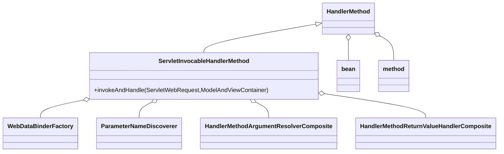

HandlerMethod 需要

* bean 即是哪个 Controller
* method 即是 Controller 中的哪个方法

ServletInvocableHandlerMethod 需要

* WebDataBinderFactory 负责对象绑定、类型转换
* ParameterNameDiscoverer 负责参数名解析
* HandlerMethodArgumentResolverComposite 负责解析参数
* HandlerMethodReturnValueHandlerComposite 负责处理返回值


#### 图2

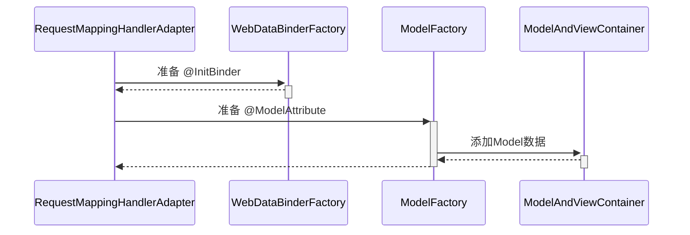

#### 图3

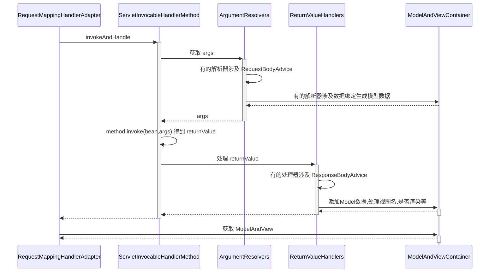


### 26) @ControllerAdvice 之 @ModelAttribute

#### 演示 - 准备 @ModelAttribute

##### 代码参考

**com.itheima.a26** 包

```java
public class A26 {

    public static void main(String[] args) throws Exception {
        AnnotationConfigApplicationContext context =
                new AnnotationConfigApplicationContext(WebConfig.class);

        RequestMappingHandlerAdapter adapter = new RequestMappingHandlerAdapter();
        adapter.setApplicationContext(context);
        adapter.afterPropertiesSet();

        MockHttpServletRequest request = new MockHttpServletRequest();
        request.setParameter("name", "张三");
        /*
            现在可以通过 ServletInvocableHandlerMethod 把这些整合在一起, 并完成控制器方法的调用, 如下
         */
        ServletInvocableHandlerMethod handlerMethod = new ServletInvocableHandlerMethod(
                new Controller1(), Controller1.class.getMethod("foo", User.class));

        ServletRequestDataBinderFactory factory = new ServletRequestDataBinderFactory(null, null);

        handlerMethod.setDataBinderFactory(factory);
        handlerMethod.setParameterNameDiscoverer(new DefaultParameterNameDiscoverer());
        handlerMethod.setHandlerMethodArgumentResolvers(getArgumentResolvers(context));

        ModelAndViewContainer container = new ModelAndViewContainer();

        // 获取模型工厂方法
        Method getModelFactory = RequestMappingHandlerAdapter.class.getDeclaredMethod("getModelFactory", HandlerMethod.class, WebDataBinderFactory.class);
        getModelFactory.setAccessible(true);
        ModelFactory modelFactory = (ModelFactory) getModelFactory.invoke(adapter, handlerMethod, factory);

        // 初始化模型数据
        modelFactory.initModel(new ServletWebRequest(request), container, handlerMethod);

        handlerMethod.invokeAndHandle(new ServletWebRequest(request), container);

        System.out.println(container.getModel());

        context.close();

        /*
            学到了什么
                a. 控制器方法是如何调用的
                b. 模型数据如何产生
                c. advice 之二, @ModelAttribute 补充模型数据
         */
    }

    public static HandlerMethodArgumentResolverComposite getArgumentResolvers(AnnotationConfigApplicationContext context) {
        HandlerMethodArgumentResolverComposite composite = new HandlerMethodArgumentResolverComposite();
        composite.addResolvers(
                new RequestParamMethodArgumentResolver(context.getDefaultListableBeanFactory(), false),
                new PathVariableMethodArgumentResolver(),
                new RequestHeaderMethodArgumentResolver(context.getDefaultListableBeanFactory()),
                new ServletCookieValueMethodArgumentResolver(context.getDefaultListableBeanFactory()),
                new ExpressionValueMethodArgumentResolver(context.getDefaultListableBeanFactory()),
                new ServletRequestMethodArgumentResolver(),
                new ServletModelAttributeMethodProcessor(false),
                new RequestResponseBodyMethodProcessor(List.of(new MappingJackson2HttpMessageConverter())),
                new ServletModelAttributeMethodProcessor(true),
                new RequestParamMethodArgumentResolver(context.getDefaultListableBeanFactory(), true)
        );
        return composite;
    }


}
```

```java
@Configuration
public class WebConfig {

    @ControllerAdvice
    static class MyControllerAdvice {
        @ModelAttribute("a")
        public String aa() {
            return "aa";
        }
    }

    @Controller
    static class Controller1 {
        @ModelAttribute("b")
        public String aa() {
            return "bb";
        }

        @ResponseStatus(HttpStatus.OK)
        public ModelAndView foo(@ModelAttribute("u") User user) {
            System.out.println("foo");
            return null;
        }
    }

    static class User {
        private String name;

        public void setName(String name) {
            this.name = name;
        }

        public String getName() {

            return name;
        }

        @Override
        public String toString() {
            return "User{" +
                    "name='" + name + '\'' +
                    '}';
        }
    }
}
```

**准备 @ModelAttribute** 在整个 HandlerAdapter 调用过程中所处的位置

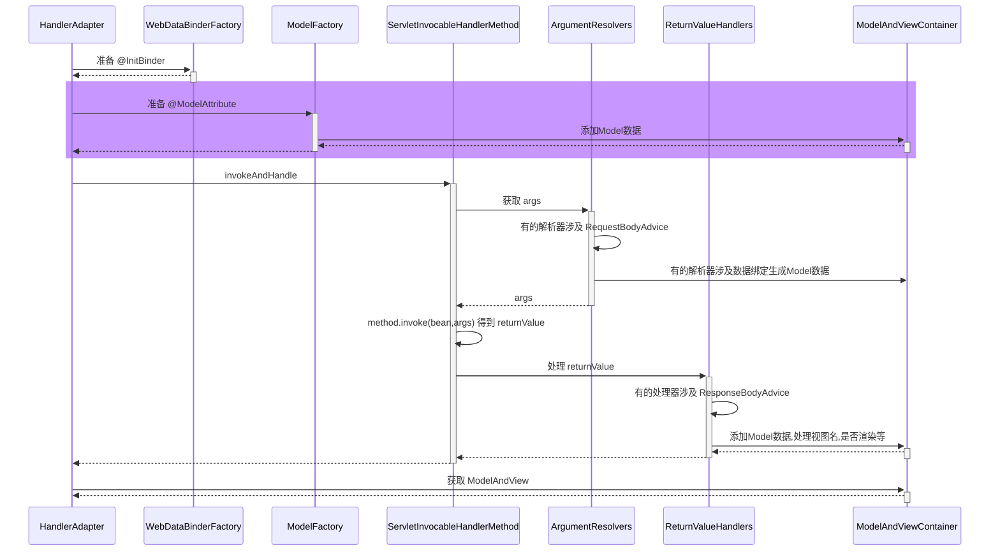

#### 收获💡

1. RequestMappingHandlerAdapter 初始化时会解析 @ControllerAdvice 中的 @ModelAttribute 方法
2. RequestMappingHandlerAdapter 会以类为单位，在该类首次使用时，解析此类的 @ModelAttribute 方法
3. 以上两种 @ModelAttribute 的解析结果都会缓存来避免重复解析
4. 控制器方法调用时，会综合利用本类的 @ModelAttribute 方法和 @ControllerAdvice 中的 @ModelAttribute 方法创建模型工厂


### 27) 返回值处理器

#### 演示 - 常见返回值处理器

##### 代码参考

**com.itheima.a27** 包

```java
/**
 * 目标: 解析控制器方法的返回值
 * 常见的返回值处理器
 * org.springframework.web.servlet.mvc.method.annotation.ModelAndViewMethodReturnValueHandler@4c9e38
 * org.springframework.web.method.annotation.ModelMethodProcessor@5d1e09bc
 * org.springframework.web.servlet.mvc.method.annotation.ViewMethodReturnValueHandler@4bdc8b5d
 * org.springframework.web.servlet.mvc.method.annotation.ResponseBodyEmitterReturnValueHandler@3bcd426c
 * org.springframework.web.servlet.mvc.method.annotation.StreamingResponseBodyReturnValueHandler@5f14a673
 * org.springframework.web.servlet.mvc.method.annotation.HttpEntityMethodProcessor@726a17c4
 * org.springframework.web.servlet.mvc.method.annotation.HttpHeadersReturnValueHandler@5dc3fcb7
 * org.springframework.web.servlet.mvc.method.annotation.CallableMethodReturnValueHandler@c4c0b41
 * org.springframework.web.servlet.mvc.method.annotation.DeferredResultMethodReturnValueHandler@76911385
 * org.springframework.web.servlet.mvc.method.annotation.AsyncTaskMethodReturnValueHandler@5467eea4
 * org.springframework.web.servlet.mvc.method.annotation.ServletModelAttributeMethodProcessor@160396db
 * org.springframework.web.servlet.mvc.method.annotation.RequestResponseBodyMethodProcessor@7a799159
 * org.springframework.web.servlet.mvc.method.annotation.ViewNameMethodReturnValueHandler@40ab8a8
 * org.springframework.web.method.annotation.MapMethodProcessor@6ff37443
 * org.springframework.web.servlet.mvc.method.annotation.ServletModelAttributeMethodProcessor@65cc8228
 */
public class A27 {
    private static final Logger log = LoggerFactory.getLogger(A27.class);

    public static void main(String[] args) throws Exception {
        AnnotationConfigApplicationContext context =
                new AnnotationConfigApplicationContext(WebConfig.class);
        // 1. 测试返回值类型为 ModelAndView
        test1(context);
        // 2. 测试返回值类型为 String 时, 把它当做视图名
        test2(context);
        // 3. 测试返回值添加了 @ModelAttribute 注解时, 此时需找到默认视图名
        test3(context);
        // 4. 测试返回值不加 @ModelAttribute 注解且返回非简单类型时, 此时需找到默认视图名
        test4(context);
        // 5. 测试返回值类型为 ResponseEntity 时, 此时不走视图流程
        test5(context);
        // 6. 测试返回值类型为 HttpHeaders 时, 此时不走视图流程
        test6(context);
        // 7. 测试返回值添加了 @ResponseBody 注解时, 此时不走视图流程
        test7(context);

        /*
            学到了什么
                a. 每个返回值处理器能干啥
                    1) 看是否支持某种返回值
                    2) 返回值或作为模型、或作为视图名、或作为响应体 ...
                b. 组合模式在 Spring 中的体现 + 1
         */
    }

    // 7. 测试返回值添加了 @ResponseBody 注解时, 此时不走视图流程
    private static void test7(AnnotationConfigApplicationContext context) throws Exception {
        Method method = Controller.class.getMethod("test7");
        Controller controller = new Controller();
        Object returnValue = method.invoke(controller); // 获取返回值

        HandlerMethod methodHandle = new HandlerMethod(controller, method);

        ModelAndViewContainer container = new ModelAndViewContainer();
        HandlerMethodReturnValueHandlerComposite composite = getReturnValueHandler();
        MockHttpServletRequest request = new MockHttpServletRequest();
        MockHttpServletResponse response = new MockHttpServletResponse();
        ServletWebRequest webRequest = new ServletWebRequest(request, response);
        if (composite.supportsReturnType(methodHandle.getReturnType())) { // 检查是否支持此类型的返回值
            composite.handleReturnValue(returnValue, methodHandle.getReturnType(), container, webRequest);
            System.out.println(container.getModel());
            System.out.println(container.getViewName());
            if (!container.isRequestHandled()) {
                renderView(context, container, webRequest); // 渲染视图
            } else {
                for (String name : response.getHeaderNames()) {
                    System.out.println(name + "=" + response.getHeader(name));
                }
                System.out.println(new String(response.getContentAsByteArray(), StandardCharsets.UTF_8));
            }
        }
    }

    // 6. 测试返回值类型为 HttpHeaders 时, 此时不走视图流程
    private static void test6(AnnotationConfigApplicationContext context) throws Exception {
        Method method = Controller.class.getMethod("test6");
        Controller controller = new Controller();
        Object returnValue = method.invoke(controller); // 获取返回值

        HandlerMethod methodHandle = new HandlerMethod(controller, method);

        ModelAndViewContainer container = new ModelAndViewContainer();
        HandlerMethodReturnValueHandlerComposite composite = getReturnValueHandler();
        MockHttpServletRequest request = new MockHttpServletRequest();
        MockHttpServletResponse response = new MockHttpServletResponse();
        ServletWebRequest webRequest = new ServletWebRequest(request, response);
        if (composite.supportsReturnType(methodHandle.getReturnType())) { // 检查是否支持此类型的返回值
            composite.handleReturnValue(returnValue, methodHandle.getReturnType(), container, webRequest);
            System.out.println(container.getModel());
            System.out.println(container.getViewName());
            if (!container.isRequestHandled()) {
                renderView(context, container, webRequest); // 渲染视图
            } else {
                for (String name : response.getHeaderNames()) {
                    System.out.println(name + "=" + response.getHeader(name));
                }
                System.out.println(new String(response.getContentAsByteArray(), StandardCharsets.UTF_8));
            }
        }
    }

    // 5. 测试返回值类型为 ResponseEntity 时, 此时不走视图流程
    private static void test5(AnnotationConfigApplicationContext context) throws Exception {
        Method method = Controller.class.getMethod("test5");
        Controller controller = new Controller();
        Object returnValue = method.invoke(controller); // 获取返回值

        HandlerMethod methodHandle = new HandlerMethod(controller, method);

        ModelAndViewContainer container = new ModelAndViewContainer();
        HandlerMethodReturnValueHandlerComposite composite = getReturnValueHandler();
        MockHttpServletRequest request = new MockHttpServletRequest();
        MockHttpServletResponse response = new MockHttpServletResponse();
        ServletWebRequest webRequest = new ServletWebRequest(request, response);
        if (composite.supportsReturnType(methodHandle.getReturnType())) { // 检查是否支持此类型的返回值
            composite.handleReturnValue(returnValue, methodHandle.getReturnType(), container, webRequest);
            System.out.println(container.getModel());
            System.out.println(container.getViewName());
            if (!container.isRequestHandled()) {
                renderView(context, container, webRequest); // 渲染视图
            } else {
                System.out.println(new String(response.getContentAsByteArray(), StandardCharsets.UTF_8));
            }
        }
    }

    // 4. 测试返回值不加 @ModelAttribute 注解且返回非简单类型时, 此时需找到默认视图名
    private static void test4(AnnotationConfigApplicationContext context) throws Exception {
        Method method = Controller.class.getMethod("test4");
        Controller controller = new Controller();
        Object returnValue = method.invoke(controller); // 获取返回值

        HandlerMethod methodHandle = new HandlerMethod(controller, method);

        ModelAndViewContainer container = new ModelAndViewContainer();
        HandlerMethodReturnValueHandlerComposite composite = getReturnValueHandler();
        MockHttpServletRequest request = new MockHttpServletRequest();
        request.setRequestURI("/test4");
        UrlPathHelper.defaultInstance.resolveAndCacheLookupPath(request);
        ServletWebRequest webRequest = new ServletWebRequest(request, new MockHttpServletResponse());
        if (composite.supportsReturnType(methodHandle.getReturnType())) { // 检查是否支持此类型的返回值
            composite.handleReturnValue(returnValue, methodHandle.getReturnType(), container, webRequest);
            System.out.println(container.getModel());
            System.out.println(container.getViewName());
            renderView(context, container, webRequest); // 渲染视图
        }
    }

    // 3. 测试返回值添加了 @ModelAttribute 注解时, 此时需找到默认视图名
    private static void test3(AnnotationConfigApplicationContext context) throws Exception {
        Method method = Controller.class.getMethod("test3");
        Controller controller = new Controller();
        Object returnValue = method.invoke(controller); // 获取返回值

        HandlerMethod methodHandle = new HandlerMethod(controller, method);

        ModelAndViewContainer container = new ModelAndViewContainer();
        HandlerMethodReturnValueHandlerComposite composite = getReturnValueHandler();
        MockHttpServletRequest request = new MockHttpServletRequest();
        request.setRequestURI("/test3");
        UrlPathHelper.defaultInstance.resolveAndCacheLookupPath(request);
        ServletWebRequest webRequest = new ServletWebRequest(request, new MockHttpServletResponse());
        if (composite.supportsReturnType(methodHandle.getReturnType())) { // 检查是否支持此类型的返回值
            composite.handleReturnValue(returnValue, methodHandle.getReturnType(), container, webRequest);
            System.out.println(container.getModel());
            System.out.println(container.getViewName());
            renderView(context, container, webRequest); // 渲染视图
        }
    }

    // 2. 测试返回值类型为 String 时, 把它当做视图名
    private static void test2(AnnotationConfigApplicationContext context) throws Exception {
        Method method = Controller.class.getMethod("test2");
        Controller controller = new Controller();
        Object returnValue = method.invoke(controller); // 获取返回值

        HandlerMethod methodHandle = new HandlerMethod(controller, method);

        ModelAndViewContainer container = new ModelAndViewContainer();
        HandlerMethodReturnValueHandlerComposite composite = getReturnValueHandler();
        ServletWebRequest webRequest = new ServletWebRequest(new MockHttpServletRequest(), new MockHttpServletResponse());
        if (composite.supportsReturnType(methodHandle.getReturnType())) { // 检查是否支持此类型的返回值
            composite.handleReturnValue(returnValue, methodHandle.getReturnType(), container, webRequest);
            System.out.println(container.getModel());
            System.out.println(container.getViewName());
            renderView(context, container, webRequest); // 渲染视图
        }
    }

    // 1. 测试返回值类型为 ModelAndView
    private static void test1(AnnotationConfigApplicationContext context) throws Exception {
        Method method = Controller.class.getMethod("test1");
        Controller controller = new Controller();
        Object returnValue = method.invoke(controller); // 获取返回值

        HandlerMethod methodHandle = new HandlerMethod(controller, method);

        ModelAndViewContainer container = new ModelAndViewContainer();
        HandlerMethodReturnValueHandlerComposite composite = getReturnValueHandler();
        ServletWebRequest webRequest = new ServletWebRequest(new MockHttpServletRequest(), new MockHttpServletResponse());
        if (composite.supportsReturnType(methodHandle.getReturnType())) { // 检查是否支持此类型的返回值
            composite.handleReturnValue(returnValue, methodHandle.getReturnType(), container, webRequest);
            System.out.println(container.getModel());
            System.out.println(container.getViewName());
            renderView(context, container, webRequest); // 渲染视图
        }
    }

    public static HandlerMethodReturnValueHandlerComposite getReturnValueHandler() {
        HandlerMethodReturnValueHandlerComposite composite = new HandlerMethodReturnValueHandlerComposite();
        composite.addHandler(new ModelAndViewMethodReturnValueHandler());
        composite.addHandler(new ViewNameMethodReturnValueHandler());
        composite.addHandler(new ServletModelAttributeMethodProcessor(false));
        composite.addHandler(new HttpEntityMethodProcessor(List.of(new MappingJackson2HttpMessageConverter())));
        composite.addHandler(new HttpHeadersReturnValueHandler());
        composite.addHandler(new RequestResponseBodyMethodProcessor(List.of(new MappingJackson2HttpMessageConverter())));
        composite.addHandler(new ServletModelAttributeMethodProcessor(true));
        return composite;
    }

    @SuppressWarnings("all")
    private static void renderView(AnnotationConfigApplicationContext context, ModelAndViewContainer container,
                                   ServletWebRequest webRequest) throws Exception {
        log.debug(">>>>>> 渲染视图");
        FreeMarkerViewResolver resolver = context.getBean(FreeMarkerViewResolver.class);
        String viewName = container.getViewName() != null ? container.getViewName() : new DefaultRequestToViewNameTranslator().getViewName(webRequest.getRequest());
        log.debug("没有获取到视图名, 采用默认视图名: {}", viewName);
        // 每次渲染时, 会产生新的视图对象, 它并非被 Spring 所管理, 但确实借助了 Spring 容器来执行初始化
        View view = resolver.resolveViewName(viewName, Locale.getDefault());
        view.render(container.getModel(), webRequest.getRequest(), webRequest.getResponse());
        System.out.println(new String(((MockHttpServletResponse) webRequest.getResponse()).getContentAsByteArray(), StandardCharsets.UTF_8));
    }

    static class Controller {
        private static final Logger log = LoggerFactory.getLogger(Controller.class);

        public ModelAndView test1() {
            log.debug("test1()");
            ModelAndView mav = new ModelAndView("view1");
            mav.addObject("name", "张三");
            return mav;
        }

        public String test2() {
            log.debug("test2()");
            return "view2";
        }

        @ModelAttribute
//        @RequestMapping("/test3")
        public User test3() {
            log.debug("test3()");
            return new User("李四", 20);
        }

        public User test4() {
            log.debug("test4()");
            return new User("王五", 30);
        }

        public HttpEntity<User> test5() {
            log.debug("test5()");
            return new HttpEntity<>(new User("赵六", 40));
        }

        public HttpHeaders test6() {
            log.debug("test6()");
            HttpHeaders headers = new HttpHeaders();
            headers.add("Content-Type", "text/html");
            return headers;
        }

        @ResponseBody
        public User test7() {
            log.debug("test7()");
            return new User("钱七", 50);
        }
    }

    // 必须用 public 修饰, 否则 freemarker 渲染其 name, age 属性时失败
    public static class User {
        private String name;
        private int age;

        public User(String name, int age) {
            this.name = name;
            this.age = age;
        }

        public String getName() {
            return name;
        }

        public void setName(String name) {
            this.name = name;
        }

        public int getAge() {
            return age;
        }

        public void setAge(int age) {
            this.age = age;
        }

        @Override
        public String toString() {
            return "User{" +
                    "name='" + name + '\'' +
                    ", age=" + age +
                    '}';
        }
    }
}

```

```java
@Configuration
public class WebConfig {

    @Bean
    public FreeMarkerConfigurer freeMarkerConfigurer() {
        FreeMarkerConfigurer configurer = new FreeMarkerConfigurer();
        configurer.setDefaultEncoding("utf-8");
        configurer.setTemplateLoaderPath("classpath:templates");
        return configurer;
    }

    @Bean // FreeMarkerView 在借助 Spring 初始化时，会要求 web 环境才会走 setConfiguration, 这里想办法去掉了 web 环境的约束
    public FreeMarkerViewResolver viewResolver(FreeMarkerConfigurer configurer) {
        FreeMarkerViewResolver resolver = new FreeMarkerViewResolver() {
            @Override
            protected AbstractUrlBasedView instantiateView() {
                FreeMarkerView view = new FreeMarkerView() {
                    @Override
                    protected boolean isContextRequired() {
                        return false;
                    }
                };
                view.setConfiguration(configurer.getConfiguration());
                return view;
            }
        };
        resolver.setContentType("text/html;charset=utf-8");
        resolver.setPrefix("/");
        resolver.setSuffix(".ftl");
        resolver.setExposeSpringMacroHelpers(false);
        return resolver;
    }
}
```

#### 收获💡

1. 常见的返回值处理器
   * ModelAndView，分别获取其模型和视图名，放入 ModelAndViewContainer
   * 返回值类型为 String 时，把它当做视图名，放入 ModelAndViewContainer
   * 返回值添加了 @ModelAttribute 注解时，将返回值作为模型，放入 ModelAndViewContainer
     * 此时需找到默认视图名
   * 返回值省略 @ModelAttribute 注解且返回非简单类型时，将返回值作为模型，放入 ModelAndViewContainer
     * 此时需找到默认视图名
   * 返回值类型为 ResponseEntity 时
     * 此时走 MessageConverter，并设置 ModelAndViewContainer.requestHandled 为 true
   * 返回值类型为 HttpHeaders 时
     * 会设置 ModelAndViewContainer.requestHandled 为 true
   * 返回值添加了 @ResponseBody 注解时
     * 此时走 MessageConverter，并设置 ModelAndViewContainer.requestHandled 为 true
2. 组合模式在 Spring 中的体现 + 1


### 28) MessageConverter

#### 演示 - MessageConverter 的作用

##### 代码参考

**com.itheima.a28.A28**

```java
package com.itheima.a28;

import com.fasterxml.jackson.annotation.JsonCreator;
import com.fasterxml.jackson.annotation.JsonProperty;
import org.springframework.core.MethodParameter;
import org.springframework.http.MediaType;
import org.springframework.http.converter.json.MappingJackson2HttpMessageConverter;
import org.springframework.http.converter.xml.MappingJackson2XmlHttpMessageConverter;
import org.springframework.mock.http.MockHttpInputMessage;
import org.springframework.mock.http.MockHttpOutputMessage;
import org.springframework.mock.web.MockHttpServletRequest;
import org.springframework.mock.web.MockHttpServletResponse;
import org.springframework.web.HttpMediaTypeNotAcceptableException;
import org.springframework.web.bind.annotation.RequestMapping;
import org.springframework.web.bind.annotation.ResponseBody;
import org.springframework.web.context.request.ServletWebRequest;
import org.springframework.web.method.support.ModelAndViewContainer;
import org.springframework.web.servlet.mvc.method.annotation.RequestResponseBodyMethodProcessor;

import java.io.IOException;
import java.nio.charset.StandardCharsets;
import java.util.List;

public class A28 {
    public static void main(String[] args) throws IOException, NoSuchMethodException, HttpMediaTypeNotAcceptableException {
//        test1();
//        test2();
//        test3();
        test4();

        /*
            学到了什么
                a. MessageConverter 的作用, @ResponseBody 是返回值处理器解析的, 但具体转换工作是 MessageConverter 做的
                b. 如何选择 MediaType
                    - 首先看 @RequestMapping 上有没有指定
                    - 其次看 request 的 Accept 头有没有指定
                    - 最后按 MessageConverter 的顺序, 谁能谁先转换
         */

    }

    private static void test4() throws IOException, HttpMediaTypeNotAcceptableException, NoSuchMethodException {
        MockHttpServletRequest request = new MockHttpServletRequest();
        MockHttpServletResponse response = new MockHttpServletResponse();
        ServletWebRequest webRequest = new ServletWebRequest(request, response);

        request.addHeader("Accept", "application/xml");
        response.setContentType("application/json");

        RequestResponseBodyMethodProcessor processor = new RequestResponseBodyMethodProcessor(
                List.of(
                        new MappingJackson2HttpMessageConverter(), new MappingJackson2XmlHttpMessageConverter()
                ));
        processor.handleReturnValue(
                new User("张三", 18),
                new MethodParameter(A28.class.getMethod("user"), -1),
                new ModelAndViewContainer(),
                webRequest
        );
        System.out.println(new String(response.getContentAsByteArray(), StandardCharsets.UTF_8));
    }

    @ResponseBody
    @RequestMapping(produces = "application/json")
    public User user() {
        return null;
    }

    private static void test3() throws IOException {
        MockHttpInputMessage message = new MockHttpInputMessage("""
                {
                    "name":"李四",
                    "age":20
                }
                """.getBytes(StandardCharsets.UTF_8));
        MappingJackson2HttpMessageConverter converter = new MappingJackson2HttpMessageConverter();
        if (converter.canRead(User.class, MediaType.APPLICATION_JSON)) {
            Object read = converter.read(User.class, message);
            System.out.println(read);
        }
    }

    private static void test2() throws IOException {
        MockHttpOutputMessage message = new MockHttpOutputMessage();
        MappingJackson2XmlHttpMessageConverter converter = new MappingJackson2XmlHttpMessageConverter();
        if (converter.canWrite(User.class, MediaType.APPLICATION_XML)) {
            converter.write(new User("李四", 20), MediaType.APPLICATION_XML, message);
            System.out.println(message.getBodyAsString());
        }
    }

    public static void test1() throws IOException {
        MockHttpOutputMessage message = new MockHttpOutputMessage();
        MappingJackson2HttpMessageConverter converter = new MappingJackson2HttpMessageConverter();
        if (converter.canWrite(User.class, MediaType.APPLICATION_JSON)) {
            converter.write(new User("张三", 18), MediaType.APPLICATION_JSON, message);
            System.out.println(message.getBodyAsString());
        }
    }

    public static class User {
        private String name;
        private int age;

        @JsonCreator
        public User(@JsonProperty("name") String name, @JsonProperty("age") int age) {
            this.name = name;
            this.age = age;
        }

        public String getName() {
            return name;
        }

        public void setName(String name) {
            this.name = name;
        }

        public int getAge() {
            return age;
        }

        public void setAge(int age) {
            this.age = age;
        }

        @Override
        public String toString() {
            return "User{" +
                    "name='" + name + '\'' +
                    ", age=" + age +
                    '}';
        }
    }
}
```

#### 收获💡

1. MessageConverter 的作用
   * @ResponseBody 是返回值处理器解析的
   * 但具体转换工作是 MessageConverter 做的
2. 如何选择 MediaType
   * 首先看 @RequestMapping 上有没有指定
   * 其次看 request 的 Accept 头有没有指定
   * 最后按 MessageConverter 的顺序, 谁能谁先转换


### 29) @ControllerAdvice 之 ResponseBodyAdvice

#### 演示 - ResponseBodyAdvice 增强

##### 代码参考

**com.itheima.a29** 包

```java
public class A29 {

    // {"name":"王五","age":18}
    // {"code":xx, "msg":xx, data: {"name":"王五","age":18} }
    public static void main(String[] args) throws Exception {
        AnnotationConfigApplicationContext context =
                new AnnotationConfigApplicationContext(WebConfig.class);

        ServletInvocableHandlerMethod handlerMethod = new ServletInvocableHandlerMethod(
                context.getBean(WebConfig.MyController.class),
                WebConfig.MyController.class.getMethod("user")
        );
        handlerMethod.setDataBinderFactory(new ServletRequestDataBinderFactory(Collections.emptyList(), null));
        handlerMethod.setParameterNameDiscoverer(new DefaultParameterNameDiscoverer());
        handlerMethod.setHandlerMethodArgumentResolvers(getArgumentResolvers(context));
        handlerMethod.setHandlerMethodReturnValueHandlers(getReturnValueHandlers(context));

        MockHttpServletRequest request = new MockHttpServletRequest();
        MockHttpServletResponse response = new MockHttpServletResponse();
        ModelAndViewContainer container = new ModelAndViewContainer();
        handlerMethod.invokeAndHandle(new ServletWebRequest(request, response), container);

        System.out.println(new String(response.getContentAsByteArray(), StandardCharsets.UTF_8));

        /*
            学到了什么
                a. advice 之三, ResponseBodyAdvice 返回响应体前包装
         */
    }

    public static HandlerMethodArgumentResolverComposite getArgumentResolvers(AnnotationConfigApplicationContext context) {
        HandlerMethodArgumentResolverComposite composite = new HandlerMethodArgumentResolverComposite();
        composite.addResolvers(
                new RequestParamMethodArgumentResolver(context.getDefaultListableBeanFactory(), false),
                new PathVariableMethodArgumentResolver(),
                new RequestHeaderMethodArgumentResolver(context.getDefaultListableBeanFactory()),
                new ServletCookieValueMethodArgumentResolver(context.getDefaultListableBeanFactory()),
                new ExpressionValueMethodArgumentResolver(context.getDefaultListableBeanFactory()),
                new ServletRequestMethodArgumentResolver(),
                new ServletModelAttributeMethodProcessor(false),
                new RequestResponseBodyMethodProcessor(List.of(new MappingJackson2HttpMessageConverter())),
                new ServletModelAttributeMethodProcessor(true),
                new RequestParamMethodArgumentResolver(context.getDefaultListableBeanFactory(), true)
        );
        return composite;
    }

    public static HandlerMethodReturnValueHandlerComposite getReturnValueHandlers(AnnotationConfigApplicationContext context) {
        // 添加 advice
        List<ControllerAdviceBean> annotatedBeans = ControllerAdviceBean.findAnnotatedBeans(context);
        List<Object> collect = annotatedBeans.stream().filter(b -> ResponseBodyAdvice.class.isAssignableFrom(b.getBeanType()))
                .collect(Collectors.toList());

        HandlerMethodReturnValueHandlerComposite composite = new HandlerMethodReturnValueHandlerComposite();
        composite.addHandler(new ModelAndViewMethodReturnValueHandler());
        composite.addHandler(new ViewNameMethodReturnValueHandler());
        composite.addHandler(new ServletModelAttributeMethodProcessor(false));
        composite.addHandler(new HttpEntityMethodProcessor(List.of(new MappingJackson2HttpMessageConverter())));
        composite.addHandler(new HttpHeadersReturnValueHandler());
        composite.addHandler(new RequestResponseBodyMethodProcessor(List.of(new MappingJackson2HttpMessageConverter()), collect));
        composite.addHandler(new ServletModelAttributeMethodProcessor(true));
        return composite;
    }
}
```

```java
@Configuration
public class WebConfig {

    @ControllerAdvice
    static class MyControllerAdvice implements ResponseBodyAdvice<Object> {
        // 满足条件才转换
        public boolean supports(MethodParameter returnType, Class<? extends HttpMessageConverter<?>> converterType) {
            if (returnType.getMethodAnnotation(ResponseBody.class) != null ||
                    AnnotationUtils.findAnnotation(returnType.getContainingClass(), ResponseBody.class) != null) {
//                returnType.getContainingClass().isAnnotationPresent(ResponseBody.class)) {
                return true;
            }
            return false;
        }

        // 将 User 或其它类型统一为 Result 类型
        public Object beforeBodyWrite(Object body, MethodParameter returnType, MediaType selectedContentType, Class<? extends HttpMessageConverter<?>> selectedConverterType, ServerHttpRequest request, ServerHttpResponse response) {
            if (body instanceof Result) {
                return body;
            }
            return Result.ok(body);
        }
    }

    // @Controller
    // @ResponseBody
    @RestController
    public static class MyController {
        public User user() {
            return new User("王五", 18);
        }
    }

    public static class User {
        private String name;
        private int age;

        public User(String name, int age) {
            this.name = name;
            this.age = age;
        }

        public String getName() {
            return name;
        }

        public void setName(String name) {
            this.name = name;
        }

        public int getAge() {
            return age;
        }

        public void setAge(int age) {
            this.age = age;
        }
    }
}
```

```java
@JsonInclude(JsonInclude.Include.NON_NULL)
public class Result {
    private int code;
    private String msg;
    private Object data;

    public int getCode() {
        return code;
    }

    public void setCode(int code) {
        this.code = code;
    }

    public String getMsg() {
        return msg;
    }

    public void setMsg(String msg) {
        this.msg = msg;
    }

    public Object getData() {
        return data;
    }

    public void setData(Object data) {
        this.data = data;
    }

    @JsonCreator
    private Result(@JsonProperty("code") int code, @JsonProperty("data") Object data) {
        this.code = code;
        this.data = data;
    }

    private Result(int code, String msg) {
        this.code = code;
        this.msg = msg;
    }

    public static Result ok() {
        return new Result(200, null);
    }

    public static Result ok(Object data) {
        return new Result(200, data);
    }

    public static Result error(String msg) {
        return new Result(500, "服务器内部错误:" + msg);
    }
}
```

**ResponseBodyAdvice 增强** 在整个 HandlerAdapter 调用过程中所处的位置

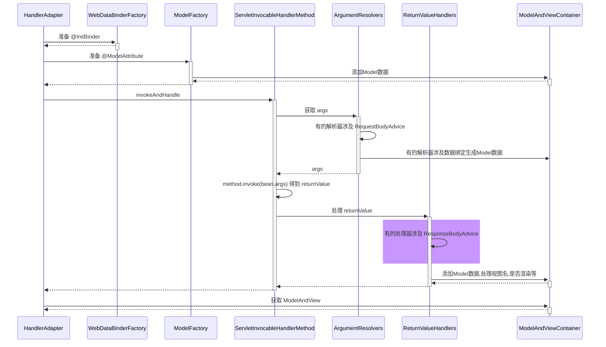

#### 收获💡

1. ResponseBodyAdvice 返回响应体前包装


### 30) 异常解析器

#### 演示 - ExceptionHandlerExceptionResolver

##### 代码参考

```java
public class A30 {
    public static void main(String[] args) throws NoSuchMethodException {
        ExceptionHandlerExceptionResolver resolver = new ExceptionHandlerExceptionResolver();
        resolver.setMessageConverters(List.of(new MappingJackson2HttpMessageConverter()));
        resolver.afterPropertiesSet();

        MockHttpServletRequest request = new MockHttpServletRequest();
        MockHttpServletResponse response = new MockHttpServletResponse();
        // 1.测试 json
//        HandlerMethod handlerMethod = new HandlerMethod(new Controller1(), Controller1.class.getMethod("foo"));
//        Exception e = new ArithmeticException("被零除");
//        resolver.resolveException(request, response, handlerMethod, e);
//        System.out.println(new String(response.getContentAsByteArray(), StandardCharsets.UTF_8));
        // 2.测试 mav
//        HandlerMethod handlerMethod = new HandlerMethod(new Controller2(), Controller2.class.getMethod("foo"));
//        Exception e = new ArithmeticException("被零除");
//        ModelAndView mav = resolver.resolveException(request, response, handlerMethod, e);
//        System.out.println(mav.getModel());
//        System.out.println(mav.getViewName());
        // 3.测试嵌套异常
//        HandlerMethod handlerMethod = new HandlerMethod(new Controller3(), Controller3.class.getMethod("foo"));
//        Exception e = new Exception("e1", new RuntimeException("e2", new IOException("e3")));
//        resolver.resolveException(request, response, handlerMethod, e);
//        System.out.println(new String(response.getContentAsByteArray(), StandardCharsets.UTF_8));

        // 4.测试异常处理方法参数解析
        HandlerMethod handlerMethod = new HandlerMethod(new Controller4(), Controller4.class.getMethod("foo"));
        Exception e = new Exception("e1");
        resolver.resolveException(request, response, handlerMethod, e);
        System.out.println(new String(response.getContentAsByteArray(), StandardCharsets.UTF_8));
        /*
            学到了什么
                a. ExceptionHandlerExceptionResolver 能够重用参数解析器、返回值处理器，实现组件重用
                b. 能够支持嵌套异常
         */
    }

    static class Controller1 {
        public void foo() {

        }

        @ExceptionHandler
        @ResponseBody
        public Map<String, Object> handle(ArithmeticException e) {
            return Map.of("error", e.getMessage());
        }
    }

    static class Controller2 {
        public void foo() {

        }

        @ExceptionHandler
        public ModelAndView handle(ArithmeticException e) {
            return new ModelAndView("test2", Map.of("error", e.getMessage()));
        }
    }

    static class Controller3 {
        public void foo() {

        }

        @ExceptionHandler
        @ResponseBody
        public Map<String, Object> handle(IOException e3) {
            return Map.of("error", e3.getMessage());
        }
    }

    static class Controller4 {
        public void foo() {
        }

        @ExceptionHandler
        @ResponseBody
        public Map<String, Object> handler(Exception e, HttpServletRequest request) {
            System.out.println(request);
            return Map.of("error", e.getMessage());
        }
    }
}
```

#### 收获💡

1. 它能够重用参数解析器、返回值处理器，实现组件重用
2. 它能够支持嵌套异常


### 31) @ControllerAdvice 之 @ExceptionHandler

#### 演示 - 准备 @ExceptionHandler

##### 代码参考

```java
public class A31 {
    public static void main(String[] args) throws NoSuchMethodException {
        MockHttpServletRequest request = new MockHttpServletRequest();
        MockHttpServletResponse response = new MockHttpServletResponse();

       /*
        ExceptionHandlerExceptionResolver resolver = new ExceptionHandlerExceptionResolver();
        resolver.setMessageConverters(List.of(new MappingJackson2HttpMessageConverter()));
        resolver.afterPropertiesSet();
        */
       
        AnnotationConfigApplicationContext context = new AnnotationConfigApplicationContext(WebConfig.class);
        ExceptionHandlerExceptionResolver resolver = context.getBean(ExceptionHandlerExceptionResolver.class);

        HandlerMethod handlerMethod = new HandlerMethod(new Controller5(), Controller5.class.getMethod("foo"));
        Exception e = new Exception("e1");
        resolver.resolveException(request, response, handlerMethod, e);
        System.out.println(new String(response.getContentAsByteArray(), StandardCharsets.UTF_8));
    }

    static class Controller5 {
        public void foo() {

        }
    }
}
```

```java
@Configuration
public class WebConfig {
    @ControllerAdvice
    static class MyControllerAdvice {
        @ExceptionHandler
        @ResponseBody
        public Map<String, Object> handle(Exception e) {
            return Map.of("error", e.getMessage());
        }
    }

    @Bean
    public ExceptionHandlerExceptionResolver resolver() {
        ExceptionHandlerExceptionResolver resolver = new ExceptionHandlerExceptionResolver();
        resolver.setMessageConverters(List.of(new MappingJackson2HttpMessageConverter()));
        return resolver;
    }
}
```

#### 收获💡

1. ExceptionHandlerExceptionResolver 初始化时会解析 @ControllerAdvice 中的 @ExceptionHandler 方法
2. ExceptionHandlerExceptionResolver 会以类为单位，在该类首次处理异常时，解析此类的 @ExceptionHandler 方法
3. 以上两种 @ExceptionHandler 的解析结果都会缓存来避免重复解析


### 32) Tomcat 异常处理

* 我们知道 @ExceptionHandler 只能处理发生在 mvc 流程中的异常，例如控制器内、拦截器内，那么如果是 Filter 出现了异常，如何进行处理呢？

* 在 Spring Boot 中，是这么实现的：
  1. 因为内嵌了 Tomcat 容器，因此可以配置 Tomcat 的错误页面，Filter 与 错误页面之间是通过请求转发跳转的，可以在这里做手脚
  2. 先通过 ErrorPageRegistrarBeanPostProcessor 这个后处理器配置错误页面地址，默认为 `/error` 也可以通过 `${server.error.path}` 进行配置
  3. 当 Filter 发生异常时，不会走 Spring 流程，但会走 Tomcat 的错误处理，于是就希望转发至 `/error` 这个地址
     * 当然，如果没有 @ExceptionHandler，那么最终也会走到 Tomcat 的错误处理
  4. Spring Boot 又提供了一个 BasicErrorController，它就是一个标准 @Controller，@RequestMapping 配置为 `/error`，所以处理异常的职责就又回到了 Spring
  5. 异常信息由于会被 Tomcat 放入 request 作用域，因此 BasicErrorController 里也能获取到
  6. 具体异常信息会由 DefaultErrorAttributes 封装好
  7. BasicErrorController 通过 Accept 头判断需要生成哪种 MediaType 的响应
     * 如果要的不是 text/html，走 MessageConverter 流程
     * 如果需要 text/html，走 mvc 流程，此时又分两种情况
       * 配置了 ErrorViewResolver，根据状态码去找 View
       * 没配置或没找到，用 BeanNameViewResolver 根据一个固定为 error 的名字找到 View，即所谓的 WhitelabelErrorView

> ***评价***
>
> * 一个错误处理搞得这么复杂，就问恶心不？


#### 演示1 - 错误页处理

##### 关键代码

```java
@Bean // ⬅️修改了 Tomcat 服务器默认错误地址, 出错时使用请求转发方式跳转
public ErrorPageRegistrar errorPageRegistrar() {
    return webServerFactory -> webServerFactory.addErrorPages(new ErrorPage("/error"));
}

@Bean // ⬅️TomcatServletWebServerFactory 初始化前用它增强, 注册所有 ErrorPageRegistrar
public ErrorPageRegistrarBeanPostProcessor errorPageRegistrarBeanPostProcessor() {
    return new ErrorPageRegistrarBeanPostProcessor();
}
```

#### 收获💡

1. Tomcat 的错误页处理手段


#### 演示2 - BasicErrorController

##### 关键代码

```java
@Bean // ⬅️ErrorProperties 封装环境键值, ErrorAttributes 控制有哪些错误信息
public BasicErrorController basicErrorController() {
    ErrorProperties errorProperties = new ErrorProperties();
    errorProperties.setIncludeException(true);
    return new BasicErrorController(new DefaultErrorAttributes(), errorProperties);
}

@Bean // ⬅️名称为 error 的视图, 作为 BasicErrorController 的 text/html 响应结果
public View error() {
    return new View() {
        @Override
        public void render(
            Map<String, ?> model, 
            HttpServletRequest request, 
            HttpServletResponse response
        ) throws Exception {
            System.out.println(model);
            response.setContentType("text/html;charset=utf-8");
            response.getWriter().print("""
                    <h3>服务器内部错误</h3>
                    """);
        }
    };
}

@Bean // ⬅️收集容器中所有 View 对象, bean 的名字作为视图名
public ViewResolver viewResolver() {
    return new BeanNameViewResolver();
}
```

#### 收获💡

1. Spring Boot 中 BasicErrorController 如何工作


### 33) BeanNameUrlHandlerMapping 与 SimpleControllerHandlerAdapter

#### 演示 - 本组映射器和适配器

##### 关键代码

```java
@Bean
public BeanNameUrlHandlerMapping beanNameUrlHandlerMapping() {
    return new BeanNameUrlHandlerMapping();
}

@Bean
public SimpleControllerHandlerAdapter simpleControllerHandlerAdapter() {
    return new SimpleControllerHandlerAdapter();
}

@Bean("/c3")
public Controller controller3() {
    return (request, response) -> {
        response.getWriter().print("this is c3");
        return null;
    };
}
```

#### 收获💡

1. BeanNameUrlHandlerMapping，以 / 开头的 bean 的名字会被当作映射路径

2. 这些 bean 本身当作 handler，要求实现 Controller 接口

3. SimpleControllerHandlerAdapter，调用 handler

4. 模拟实现这组映射器和适配器

5. ```
   对比
       a. RequestMappingHandlerAdapter, 以 @RequestMapping 作为映射路径
       b. 控制器的具体方法会被当作 handler
       c. RequestMappingHandlerAdapter, 调用 handler
   ```


### 34) RouterFunctionMapping 与 HandlerFunctionAdapter

#### 演示 - 本组映射器和适配器

##### 关键代码

```java
@Bean
public RouterFunctionMapping routerFunctionMapping() {
    return new RouterFunctionMapping();
}

@Bean
public HandlerFunctionAdapter handlerFunctionAdapter() {
    return new HandlerFunctionAdapter();
}

@Bean
public RouterFunction<ServerResponse> r1() {
    //           ⬇️映射条件   ⬇️handler
    return route(GET("/r1"), request -> ok().body("this is r1"));
}
```

#### 收获💡

1. RouterFunctionMapping, 通过 RequestPredicate 条件映射

2. handler 要实现 HandlerFunction 接口

3. HandlerFunctionAdapter, 调用 handler

4. ```
   对比
       a. RequestMappingHandlerMapping, 以 @RequestMapping 作为映射路径
       b. 控制器的具体方法会被当作 handler
       c. RequestMappingHandlerAdapter, 调用 handler
   ```


### 35) SimpleUrlHandlerMapping 与 HttpRequestHandlerAdapter

#### 演示1 - 本组映射器和适配器

##### 代码参考

**org.springframework.boot.autoconfigure.web.servlet.A35**

##### 关键代码

```java
@Bean
public SimpleUrlHandlerMapping simpleUrlHandlerMapping(ApplicationContext context) {
    SimpleUrlHandlerMapping handlerMapping = new SimpleUrlHandlerMapping();
    Map<String, ResourceHttpRequestHandler> map 
        = context.getBeansOfType(ResourceHttpRequestHandler.class);
    handlerMapping.setUrlMap(map);
    return handlerMapping;
}

@Bean
public HttpRequestHandlerAdapter httpRequestHandlerAdapter() {
    return new HttpRequestHandlerAdapter();
}

@Bean("/**")
public ResourceHttpRequestHandler handler1() {
    ResourceHttpRequestHandler handler = new ResourceHttpRequestHandler();
    handler.setLocations(List.of(new ClassPathResource("static/")));
    return handler;
}

@Bean("/img/**")
public ResourceHttpRequestHandler handler2() {
    ResourceHttpRequestHandler handler = new ResourceHttpRequestHandler();
    handler.setLocations(List.of(new ClassPathResource("images/")));
    return handler;
}
```

#### 收获💡

1. SimpleUrlHandlerMapping 不会在初始化时收集映射信息，需要手动收集
2. SimpleUrlHandlerMapping 映射路径
3. ResourceHttpRequestHandler 作为静态资源 handler
4. HttpRequestHandlerAdapter, 调用此 handler


#### 演示2 - 静态资源解析优化

##### 关键代码

```java
@Bean("/**")
public ResourceHttpRequestHandler handler1() {
    ResourceHttpRequestHandler handler = new ResourceHttpRequestHandler();
    handler.setLocations(List.of(new ClassPathResource("static/")));
    handler.setResourceResolvers(List.of(
        	// ⬇️缓存优化
            new CachingResourceResolver(new ConcurrentMapCache("cache1")),
        	// ⬇️压缩优化
            new EncodedResourceResolver(),
        	// ⬇️原始资源解析
            new PathResourceResolver()
    ));
    return handler;
}
```

#### 收获💡

1. 责任链模式体现
2. 压缩文件需要手动生成


#### 演示3 - 欢迎页

##### 关键代码

```java
@Bean
public WelcomePageHandlerMapping welcomePageHandlerMapping(ApplicationContext context) {
    Resource resource = context.getResource("classpath:static/index.html");
    return new WelcomePageHandlerMapping(null, context, resource, "/**");
}

@Bean
public SimpleControllerHandlerAdapter simpleControllerHandlerAdapter() {
    return new SimpleControllerHandlerAdapter();
}
```

#### 收获💡

1. 欢迎页支持静态欢迎页与动态欢迎页
2. WelcomePageHandlerMapping 映射欢迎页（即只映射 '/'）
   * 它内置的 handler ParameterizableViewController 作用是不执行逻辑，仅根据视图名找视图
   * 视图名固定为 forward:index.html
3. SimpleControllerHandlerAdapter, 调用 handler
   * 转发至 /index.html
   * 处理 /index.html 又会走上面的静态资源处理流程


#### 映射器与适配器小结

1. HandlerMapping 负责建立请求与控制器之间的映射关系
   * RequestMappingHandlerMapping (与 @RequestMapping 匹配)
   * WelcomePageHandlerMapping    (/)
   * BeanNameUrlHandlerMapping    (与 bean 的名字匹配 以 / 开头)
   * RouterFunctionMapping        (函数式 RequestPredicate, HandlerFunction)
   * SimpleUrlHandlerMapping      (静态资源 通配符 /** /img/**)
   * 之间也会有顺序问题, boot 中默认顺序如上

2. HandlerAdapter 负责实现对各种各样的 handler 的适配调用
   * RequestMappingHandlerAdapter 处理：@RequestMapping 方法
     * 参数解析器、返回值处理器体现了组合模式
   * SimpleControllerHandlerAdapter 处理：Controller 接口
   * HandlerFunctionAdapter 处理：HandlerFunction 函数式接口
   * HttpRequestHandlerAdapter 处理：HttpRequestHandler 接口 (静态资源处理)
   * 这也是典型适配器模式体现

3. ResourceHttpRequestHandler.setResourceResolvers 这是典型责任链模式体现

   


### 36) mvc 处理流程

当浏览器发送一个请求 `http://localhost:8080/hello` 后，请求到达服务器，其处理流程是：

1. 服务器提供了 DispatcherServlet，它使用的是标准 Servlet 技术

   * 路径：默认映射路径为 `/`，即会匹配到所有请求 URL，可作为请求的统一入口，也被称之为**前控制器**
     * jsp 不会匹配到 DispatcherServlet
     * 其它有路径的 Servlet 匹配优先级也高于 DispatcherServlet
   * 创建：在 Boot 中，由 DispatcherServletAutoConfiguration 这个自动配置类提供 DispatcherServlet 的 bean
   * 初始化：DispatcherServlet 初始化时会优先到容器里寻找各种组件，作为它的成员变量
     * HandlerMapping，初始化时记录映射关系
     * HandlerAdapter，初始化时准备参数解析器、返回值处理器、消息转换器
     * HandlerExceptionResolver，初始化时准备参数解析器、返回值处理器、消息转换器
     * ViewResolver
2. DispatcherServlet 会利用 RequestMappingHandlerMapping 查找控制器方法

   * 例如根据 /hello 路径找到 @RequestMapping("/hello") 对应的控制器方法

   * 控制器方法会被封装为 HandlerMethod 对象，并结合匹配到的拦截器一起返回给 DispatcherServlet 

   * HandlerMethod 和拦截器合在一起称为 HandlerExecutionChain（调用链）对象
3. DispatcherServlet 接下来会：

   1. 调用拦截器的 preHandle 方法
   2. RequestMappingHandlerAdapter 调用 handle 方法，准备数据绑定工厂、模型工厂、ModelAndViewContainer、将 HandlerMethod 完善为 ServletInvocableHandlerMethod
      * @ControllerAdvice 全局增强点1️⃣：补充模型数据
      * @ControllerAdvice 全局增强点2️⃣：补充自定义类型转换器
      * 使用 HandlerMethodArgumentResolver 准备参数
        * @ControllerAdvice 全局增强点3️⃣：RequestBody 增强
      * 调用 ServletInvocableHandlerMethod 
      * 使用 HandlerMethodReturnValueHandler 处理返回值
        * @ControllerAdvice 全局增强点4️⃣：ResponseBody 增强
      * 根据 ModelAndViewContainer 获取 ModelAndView
        * 如果返回的 ModelAndView 为 null，不走第 4 步视图解析及渲染流程
          * 例如，有的返回值处理器调用了 HttpMessageConverter 来将结果转换为 JSON，这时 ModelAndView 就为 null
        * 如果返回的 ModelAndView 不为 null，会在第 4 步走视图解析及渲染流程
   3. 调用拦截器的 postHandle 方法
   4. 处理异常或视图渲染
      * 如果 1~3 出现异常，走 ExceptionHandlerExceptionResolver 处理异常流程
        * @ControllerAdvice 全局增强点5️⃣：@ExceptionHandler 异常处理
      * 正常，走视图解析及渲染流程
   5. 调用拦截器的 afterCompletion 方法


## Boot

### 37) Boot 骨架项目

如果是 linux 环境，用以下命令即可获取 spring boot 的骨架 pom.xml

```shell
curl -G https://start.spring.io/pom.xml -d dependencies=web,mysql,mybatis -o pom.xml
```

也可以使用 Postman 等工具实现

若想获取更多用法，请参考

```shell
curl https://start.spring.io
```


### 38) Boot War项目

步骤1：创建模块，区别在于打包方式选择 war


接下来勾选 Spring Web 支持


步骤2：编写控制器

```java
@Controller
public class MyController {

    @RequestMapping("/hello")
    public String abc() {
        System.out.println("进入了控制器");
        return "hello";
    }
}
```

步骤3：编写 jsp 视图，新建 webapp 目录和一个 hello.jsp 文件，注意文件名与控制器方法返回的视图逻辑名一致

```
src
	|- main
		|- java
		|- resources
		|- webapp
			|- hello.jsp
```

步骤4：配置视图路径，打开 application.properties 文件

```properties
spring.mvc.view.prefix=/
spring.mvc.view.suffix=.jsp
```

> 将来 prefix + 控制器方法返回值 + suffix 即为视图完整路径


#### 测试

如果用 mvn 插件 `mvn spring-boot:run` 或 main 方法测试

* 必须添加如下依赖，因为此时用的还是内嵌 tomcat，而内嵌 tomcat 默认不带 jasper（用来解析 jsp）

```xml
<dependency>
    <groupId>org.apache.tomcat.embed</groupId>
    <artifactId>tomcat-embed-jasper</artifactId>
    <scope>provided</scope>
</dependency>
```

也可以使用 Idea 配置 tomcat 来测试，此时用的是外置 tomcat

* 骨架生成的代码中，多了一个 ServletInitializer，它的作用就是配置外置 Tomcat 使用的，在外置 Tomcat 启动后，去调用它创建和运行 SpringApplication


#### 启示

对于 jar 项目，若要支持 jsp，也可以在加入 jasper 依赖的前提下，把 jsp 文件置入 `META-INF/resources` 


### 39) Boot 启动过程

阶段一：SpringApplication 构造

1. 记录 BeanDefinition 源
2. 推断应用类型
3. 记录 ApplicationContext 初始化器
4. 记录监听器
5. 推断主启动类

阶段二：执行 run 方法

1. 得到 SpringApplicationRunListeners，名字取得不好，实际是事件发布器

   * 发布 application starting 事件1️⃣

2. 封装启动 args

3. 准备 Environment 添加命令行参数（*）

4. ConfigurationPropertySources 处理（*）

   * 发布 application environment 已准备事件2️⃣

5. 通过 EnvironmentPostProcessorApplicationListener 进行 env 后处理（*）
   * application.properties，由 StandardConfigDataLocationResolver 解析
   * spring.application.json

6. 绑定 spring.main 到 SpringApplication 对象（*）

7. 打印 banner（*）

8. 创建容器

9. 准备容器

   * 发布 application context 已初始化事件3️⃣

10. 加载 bean 定义

    * 发布 application prepared 事件4️⃣

11. refresh 容器

    * 发布 application started 事件5️⃣

12. 执行 runner

    * 发布 application ready 事件6️⃣

    * 这其中有异常，发布 application failed 事件7️⃣

> 带 * 的有独立的示例

#### 演示 - 启动过程

**com.itheima.a39.A39_1** 对应 SpringApplication 构造

```java
@Configuration
public class A39_1 {

    public static void main(String[] args) throws Exception {
        System.out.println("1. 演示获取 Bean Definition 源");
        SpringApplication spring = new SpringApplication(A39_1.class);
        spring.setSources(Set.of("classpath:b01.xml"));
        System.out.println("2. 演示推断应用类型");
        Method deduceFromClasspath = WebApplicationType.class.getDeclaredMethod("deduceFromClasspath");
        deduceFromClasspath.setAccessible(true);
        System.out.println("\t应用类型为:" + deduceFromClasspath.invoke(null));
        System.out.println("3. 演示 ApplicationContext 初始化器");
        spring.addInitializers(applicationContext -> {
            if (applicationContext instanceof GenericApplicationContext gac) {
                gac.registerBean("bean3", Bean3.class);
            }
        });
        System.out.println("4. 演示监听器与事件");
        spring.addListeners(event -> System.out.println("\t事件为:" + event.getClass()));
        System.out.println("5. 演示主类推断");
        Method deduceMainApplicationClass = SpringApplication.class.getDeclaredMethod("deduceMainApplicationClass");
        deduceMainApplicationClass.setAccessible(true);
        System.out.println("\t主类是：" + deduceMainApplicationClass.invoke(spring));

        ConfigurableApplicationContext context = spring.run(args);

        // 创建 ApplicationContext
        // 调用初始化器 对 ApplicationContext 做扩展
        // ApplicationContext.refresh
        for (String name : context.getBeanDefinitionNames()) {
            System.out.println("name: " + name + " 来源：" + context.getBeanFactory().getBeanDefinition(name).getResourceDescription());
        }
        context.close();
        /*
            学到了什么
            a. SpringApplication 构造方法中所做的操作
                1. 可以有多种源用来加载 bean 定义
                2. 应用类型推断
                3. 容器初始化器
                4. 演示启动各阶段事件
                5. 演示主类推断
         */
    }

    static class Bean1 {

    }

    static class Bean2 {

    }

    static class Bean3 {

    }

    @Bean
    public Bean2 bean2() {
        return new Bean2();
    }

    @Bean
    public TomcatServletWebServerFactory servletWebServerFactory() {
        return new TomcatServletWebServerFactory();
    }
}
```

**com.itheima.a39.A39_2** 对应第1步，并演示 7 个事件

```java
public class A39_2 {
    public static void main(String[] args) throws Exception {

        // 添加 app 监听器
        SpringApplication app = new SpringApplication();
        app.addListeners(e -> System.out.println(e.getClass()));

        // 获取事件发送器实现类名
        List<String> names = SpringFactoriesLoader.loadFactoryNames(SpringApplicationRunListener.class, A39_2.class.getClassLoader());
        for (String name : names) {
            System.out.println(name);
            Class<?> clazz = Class.forName(name);
            Constructor<?> constructor = clazz.getConstructor(SpringApplication.class, String[].class);
            SpringApplicationRunListener publisher = (SpringApplicationRunListener) constructor.newInstance(app, args);

            // 发布事件
            DefaultBootstrapContext bootstrapContext = new DefaultBootstrapContext();
            publisher.starting(bootstrapContext); // spring boot 开始启动
            publisher.environmentPrepared(bootstrapContext, new StandardEnvironment()); // 环境信息准备完毕
            GenericApplicationContext context = new GenericApplicationContext();
            publisher.contextPrepared(context); // 在 spring 容器创建，并调用初始化器之后，发送此事件
            publisher.contextLoaded(context); // 所有 bean definition 加载完毕
            context.refresh();
            publisher.started(context); // spring 容器初始化完成(refresh 方法调用完毕)
            publisher.running(context); // spring boot 启动完毕

            publisher.failed(context, new Exception("出错了")); // spring boot 启动出错
        }

        /*
            学到了什么
            a. 如何读取 spring.factories 中的配置
            b. run 方法内获取事件发布器 (得到 SpringApplicationRunListeners) 的过程, 对应步骤中
                1.获取事件发布器
                发布 application starting 事件1️⃣
                发布 application environment 已准备事件2️⃣
                发布 application context 已初始化事件3️⃣
                发布 application prepared 事件4️⃣
                发布 application started 事件5️⃣
                发布 application ready 事件6️⃣
                这其中有异常，发布 application failed 事件7️⃣
         */
    }


}
```

**com.itheima.a39.A39_3** 对应第2、8到12步

```java
// 运行时请添加运行参数 --server.port=8080 debug
public class A39_3 {
    @SuppressWarnings("all")
    public static void main(String[] args) throws Exception {
        SpringApplication app = new SpringApplication();
        app.addInitializers(new ApplicationContextInitializer<ConfigurableApplicationContext>() {
            @Override
            public void initialize(ConfigurableApplicationContext applicationContext) {
                System.out.println("执行初始化器增强...");
            }
        });

        System.out.println(">>>>>>>>>>>>>>>>>>>>>>>> 2. 封装启动 args");
        DefaultApplicationArguments arguments = new DefaultApplicationArguments(args);

        System.out.println(">>>>>>>>>>>>>>>>>>>>>>>> 8. 创建容器");
        GenericApplicationContext context = createApplicationContext(WebApplicationType.SERVLET);

        System.out.println(">>>>>>>>>>>>>>>>>>>>>>>> 9. 准备容器");
        for (ApplicationContextInitializer initializer : app.getInitializers()) {
            initializer.initialize(context);
        }

        System.out.println(">>>>>>>>>>>>>>>>>>>>>>>> 10. 加载 bean 定义");
        DefaultListableBeanFactory beanFactory = context.getDefaultListableBeanFactory();
        AnnotatedBeanDefinitionReader reader1 = new AnnotatedBeanDefinitionReader(beanFactory);
        XmlBeanDefinitionReader reader2 = new XmlBeanDefinitionReader(beanFactory);
        ClassPathBeanDefinitionScanner scanner = new ClassPathBeanDefinitionScanner(beanFactory);

        reader1.register(Config.class);
        reader2.loadBeanDefinitions(new ClassPathResource("b03.xml"));
        scanner.scan("com.itheima.a39.sub");

        System.out.println(">>>>>>>>>>>>>>>>>>>>>>>> 11. refresh 容器");
        context.refresh();

        for (String name : context.getBeanDefinitionNames()) {
            System.out.println("name:" + name + " 来源：" + beanFactory.getBeanDefinition(name).getResourceDescription());
        }

        System.out.println(">>>>>>>>>>>>>>>>>>>>>>>> 12. 执行 runner");
        for (CommandLineRunner runner : context.getBeansOfType(CommandLineRunner.class).values()) {
            runner.run(args);
        }

        for (ApplicationRunner runner : context.getBeansOfType(ApplicationRunner.class).values()) {
            runner.run(arguments);
        }

        /*
            学到了什么
            a. 创建容器、加载 bean 定义、refresh, 对应的步骤

         */
    }

    private static GenericApplicationContext createApplicationContext(WebApplicationType type) {
        GenericApplicationContext context = null;
        switch (type) {
            case SERVLET -> context = new AnnotationConfigServletWebServerApplicationContext();
            case REACTIVE -> context = new AnnotationConfigReactiveWebServerApplicationContext();
            case NONE -> context = new AnnotationConfigApplicationContext();
        }
        return context;
    }

    static class Bean4 {

    }

    static class Bean5 {

    }

    static class Bean6 {

    }

    @Configuration
    static class Config {
        @Bean
        public Bean5 bean5() {
            return new Bean5();
        }

        @Bean
        public ServletWebServerFactory servletWebServerFactory() {
            return new TomcatServletWebServerFactory();
        }

        @Bean
        public CommandLineRunner commandLineRunner() {
            return new CommandLineRunner() {
                @Override
                public void run(String... args) throws Exception {
                    System.out.println("commandLineRunner()..." + Arrays.toString(args));
                }
            };
        }

        @Bean
        public ApplicationRunner applicationRunner() {
            return new ApplicationRunner() {
                @Override
                public void run(ApplicationArguments args) throws Exception {
                    System.out.println("applicationRunner()..." + Arrays.toString(args.getSourceArgs()));
                    System.out.println(args.getOptionNames());
                    System.out.println(args.getOptionValues("server.port"));
                    System.out.println(args.getNonOptionArgs());
                }
            };
        }
    }
}
```

**org.springframework.boot.Step3**

```java
public class Step3 {
    public static void main(String[] args) throws IOException {
        ApplicationEnvironment env = new ApplicationEnvironment(); // 系统环境变量, properties, yaml
        env.getPropertySources().addLast(new ResourcePropertySource(new ClassPathResource("step3.properties")));
        env.getPropertySources().addFirst(new SimpleCommandLinePropertySource(args));
        for (PropertySource<?> ps : env.getPropertySources()) {
            System.out.println(ps);
        }
//        System.out.println(env.getProperty("JAVA_HOME"));

        System.out.println(env.getProperty("server.port"));
    }
}
```

**org.springframework.boot.Step4**

```java
public class Step4 {

    public static void main(String[] args) throws IOException, NoSuchFieldException {
        ApplicationEnvironment env = new ApplicationEnvironment();
        env.getPropertySources().addLast(
                new ResourcePropertySource("step4", new ClassPathResource("step4.properties"))
        );
        ConfigurationPropertySources.attach(env);
        for (PropertySource<?> ps : env.getPropertySources()) {
            System.out.println(ps);
        }

        System.out.println(env.getProperty("user.first-name"));
        System.out.println(env.getProperty("user.middle-name"));
        System.out.println(env.getProperty("user.last-name"));
    }
}
```

**org.springframework.boot.Step5**

```java
/*
    可以添加参数 --spring.application.json={\"server\":{\"port\":9090}} 测试 SpringApplicationJsonEnvironmentPostProcessor
 */
public class Step5 {
    public static void main(String[] args) {
        SpringApplication app = new SpringApplication();
        app.addListeners(new EnvironmentPostProcessorApplicationListener());

        /*List<String> names = SpringFactoriesLoader.loadFactoryNames(EnvironmentPostProcessor.class, Step5.class.getClassLoader());
        for (String name : names) {
            System.out.println(name);
        }*/

        EventPublishingRunListener publisher = new EventPublishingRunListener(app, args);
        ApplicationEnvironment env = new ApplicationEnvironment();
        System.out.println(">>>>>>>>>>>>>>>>>>>>>>>>> 增强前");
        for (PropertySource<?> ps : env.getPropertySources()) {
            System.out.println(ps);
        }
        publisher.environmentPrepared(new DefaultBootstrapContext(), env);
        System.out.println(">>>>>>>>>>>>>>>>>>>>>>>>> 增强后");
        for (PropertySource<?> ps : env.getPropertySources()) {
            System.out.println(ps);
        }

    }

    private static void test1() {
        SpringApplication app = new SpringApplication();
        ApplicationEnvironment env = new ApplicationEnvironment();

        System.out.println(">>>>>>>>>>>>>>>>>>>>>>>>> 增强前");
        for (PropertySource<?> ps : env.getPropertySources()) {
            System.out.println(ps);
        }
        ConfigDataEnvironmentPostProcessor postProcessor1 = new ConfigDataEnvironmentPostProcessor(new DeferredLogs(), new DefaultBootstrapContext());
        postProcessor1.postProcessEnvironment(env, app);
        System.out.println(">>>>>>>>>>>>>>>>>>>>>>>>> 增强后");
        for (PropertySource<?> ps : env.getPropertySources()) {
            System.out.println(ps);
        }
        RandomValuePropertySourceEnvironmentPostProcessor postProcessor2 = new RandomValuePropertySourceEnvironmentPostProcessor(new DeferredLog());
        postProcessor2.postProcessEnvironment(env, app);
        System.out.println(">>>>>>>>>>>>>>>>>>>>>>>>> 增强后");
        for (PropertySource<?> ps : env.getPropertySources()) {
            System.out.println(ps);
        }
        System.out.println(env.getProperty("server.port"));
        System.out.println(env.getProperty("random.int"));
        System.out.println(env.getProperty("random.int"));
        System.out.println(env.getProperty("random.int"));
        System.out.println(env.getProperty("random.uuid"));
        System.out.println(env.getProperty("random.uuid"));
        System.out.println(env.getProperty("random.uuid"));
    }
}
```

**org.springframework.boot.Step6**

```java
public class Step6 {
    // 绑定 spring.main 前缀的 key value 至 SpringApplication, 请通过 debug 查看
    public static void main(String[] args) throws IOException {
        SpringApplication application = new SpringApplication();
        ApplicationEnvironment env = new ApplicationEnvironment();
        env.getPropertySources().addLast(new ResourcePropertySource("step4", new ClassPathResource("step4.properties")));
        env.getPropertySources().addLast(new ResourcePropertySource("step6", new ClassPathResource("step6.properties")));

//        User user = Binder.get(env).bind("user", User.class).get();
//        System.out.println(user);

//        User user = new User();
//        Binder.get(env).bind("user", Bindable.ofInstance(user));
//        System.out.println(user);

        System.out.println(application);
        Binder.get(env).bind("spring.main", Bindable.ofInstance(application));
        System.out.println(application);
    }

    static class User {
        private String firstName;
        private String middleName;
        private String lastName;

        public String getFirstName() {
            return firstName;
        }

        public void setFirstName(String firstName) {
            this.firstName = firstName;
        }

        public String getMiddleName() {
            return middleName;
        }

        public void setMiddleName(String middleName) {
            this.middleName = middleName;
        }

        public String getLastName() {
            return lastName;
        }

        public void setLastName(String lastName) {
            this.lastName = lastName;
        }

        @Override
        public String toString() {
            return "User{" +
                    "firstName='" + firstName + '\'' +
                    ", middleName='" + middleName + '\'' +
                    ", lastName='" + lastName + '\'' +
                    '}';
        }
    }
}
```

**org.springframework.boot.Step7**

```java
public class Step7 {
    public static void main(String[] args) {
        ApplicationEnvironment env = new ApplicationEnvironment();
        SpringApplicationBannerPrinter printer = new SpringApplicationBannerPrinter(
                new DefaultResourceLoader(),
                new SpringBootBanner()
        );
        // 测试文字 banner
//        env.getPropertySources().addLast(new MapPropertySource("custom", Map.of("spring.banner.location","banner1.txt")));
        // 测试图片 banner
//        env.getPropertySources().addLast(new MapPropertySource("custom", Map.of("spring.banner.image.location","banner2.png")));
        // 版本号的获取
        System.out.println(SpringBootVersion.getVersion());
        printer.print(env, Step7.class, System.out);
    }
}
```

#### 收获💡

1. SpringApplication 构造方法中所做的操作
   * 可以有多种源用来加载 bean 定义
   * 应用类型推断
   * 添加容器初始化器
   * 添加监听器
   * 演示主类推断
2. 如何读取 spring.factories 中的配置
3. 从配置中获取重要的事件发布器：SpringApplicationRunListeners
4. 容器的创建、初始化器增强、加载 bean 定义等
5. CommandLineRunner、ApplicationRunner 的作用
6. 环境对象
   1. 命令行 PropertySource
   2. ConfigurationPropertySources 规范环境键名称
   3. EnvironmentPostProcessor 后处理增强
      * 由 EventPublishingRunListener 通过监听事件2️⃣来调用
   4. 绑定 spring.main 前缀的 key value 至 SpringApplication
7. Banner 


### 40) Tomcat 内嵌容器

Tomcat 基本结构

```
Server
└───Service
    ├───Connector 连接器 (协议, 端口)
    └───Engine 
        └───Host(虚拟主机 localhost)
            ├───Context1 (应用1, 可以设置虚拟路径, / 即 url 起始路径; 项目磁盘路径, 即 docBase )
            │   │   index.html
            │   └───WEB-INF
            │       │   web.xml (servlet, filter, listener) 3.0
            │       ├───classes (servlet, controller, service ...)
            │       ├───jsp
            │       └───lib (第三方 jar 包)
            └───Context2 (应用2)
                │   index.html
                └───WEB-INF
                        web.xml
```

#### 演示1 - Tomcat 内嵌容器

##### 关键代码

```java
public static void main(String[] args) throws LifecycleException, IOException {
    // 1.创建 Tomcat 对象
    Tomcat tomcat = new Tomcat();
    tomcat.setBaseDir("tomcat");

    // 2.创建项目文件夹, 即 docBase 文件夹
    File docBase = Files.createTempDirectory("boot.").toFile();
    docBase.deleteOnExit();

    // 3.创建 Tomcat 项目, 在 Tomcat 中称为 Context
    Context context = tomcat.addContext("", docBase.getAbsolutePath());

    // 4.编程添加 Servlet
    context.addServletContainerInitializer(new ServletContainerInitializer() {
        @Override
        public void onStartup(Set<Class<?>> c, ServletContext ctx) throws ServletException {
            HelloServlet helloServlet = new HelloServlet();
            ctx.addServlet("aaa", helloServlet).addMapping("/hello");
        }
    }, Collections.emptySet());

    // 5.启动 Tomcat
    tomcat.start();

    // 6.创建连接器, 设置监听端口
    Connector connector = new Connector(new Http11Nio2Protocol());
    connector.setPort(8080);
    tomcat.setConnector(connector);
}
```


#### 演示2 - 集成 Spring 容器

##### 关键代码

```java
WebApplicationContext springContext = getApplicationContext();

// 4.编程添加 Servlet
context.addServletContainerInitializer(new ServletContainerInitializer() {
    @Override
    public void onStartup(Set<Class<?>> c, ServletContext ctx) throws ServletException {
        // ⬇️通过 ServletRegistrationBean 添加 DispatcherServlet 等
        for (ServletRegistrationBean registrationBean : 
             springContext.getBeansOfType(ServletRegistrationBean.class).values()) {
            registrationBean.onStartup(ctx);
        }
    }
}, Collections.emptySet());
```


### 41) Boot 自动配置

#### AopAutoConfiguration

Spring Boot 是利用了自动配置类来简化了 aop 相关配置

* AOP 自动配置类为 `org.springframework.boot.autoconfigure.aop.AopAutoConfiguration`
* 可以通过 `spring.aop.auto=false` 禁用 aop 自动配置
* AOP 自动配置的本质是通过 `@EnableAspectJAutoProxy` 来开启了自动代理，如果在引导类上自己添加了 `@EnableAspectJAutoProxy` 那么以自己添加的为准
* `@EnableAspectJAutoProxy` 的本质是向容器中添加了 `AnnotationAwareAspectJAutoProxyCreator` 这个 bean 后处理器，它能够找到容器中所有切面，并为匹配切点的目标类创建代理，创建代理的工作一般是在 bean 的初始化阶段完成的


#### DataSourceAutoConfiguration

* 对应的自动配置类为：org.springframework.boot.autoconfigure.jdbc.DataSourceAutoConfiguration
* 它内部采用了条件装配，通过检查容器的 bean，以及类路径下的 class，来决定该 @Bean 是否生效

简单说明一下，Spring Boot 支持两大类数据源：

* EmbeddedDatabase - 内嵌数据库连接池
* PooledDataSource - 非内嵌数据库连接池

PooledDataSource 又支持如下数据源

* hikari 提供的 HikariDataSource
* tomcat-jdbc 提供的 DataSource
* dbcp2 提供的 BasicDataSource
* oracle 提供的 PoolDataSourceImpl

如果知道数据源的实现类类型，即指定了 `spring.datasource.type`，理论上可以支持所有数据源，但这样做的一个最大问题是无法订制每种数据源的详细配置（如最大、最小连接数等）


#### MybatisAutoConfiguration

* MyBatis 自动配置类为 `org.mybatis.spring.boot.autoconfigure.MybatisAutoConfiguration`
* 它主要配置了两个 bean
  * SqlSessionFactory - MyBatis 核心对象，用来创建 SqlSession
  * SqlSessionTemplate - SqlSession 的实现，此实现会与当前线程绑定
  * 用 ImportBeanDefinitionRegistrar 的方式扫描所有标注了 @Mapper 注解的接口
  * 用 AutoConfigurationPackages 来确定扫描的包
* 还有一个相关的 bean：MybatisProperties，它会读取配置文件中带 `mybatis.` 前缀的配置项进行定制配置

@MapperScan 注解的作用与 MybatisAutoConfiguration 类似，会注册 MapperScannerConfigurer 有如下区别

* @MapperScan 扫描具体包（当然也可以配置关注哪个注解）
* @MapperScan 如果不指定扫描具体包，则会把引导类范围内，所有接口当做 Mapper 接口
* MybatisAutoConfiguration 关注的是所有标注 @Mapper 注解的接口，会忽略掉非 @Mapper 标注的接口

这里有同学有疑问，之前介绍的都是将具体类交给 Spring 管理，怎么到了 MyBatis 这儿，接口就可以被管理呢？

* 其实并非将接口交给 Spring 管理，而是每个接口会对应一个 MapperFactoryBean，是后者被 Spring 所管理，接口只是作为 MapperFactoryBean 的一个属性来配置


#### TransactionAutoConfiguration

* 事务自动配置类有两个：
  * `org.springframework.boot.autoconfigure.jdbc.DataSourceTransactionManagerAutoConfiguration`
  * `org.springframework.boot.autoconfigure.transaction.TransactionAutoConfiguration`

* 前者配置了 DataSourceTransactionManager 用来执行事务的提交、回滚操作
* 后者功能上对标 @EnableTransactionManagement，包含以下三个 bean
  * BeanFactoryTransactionAttributeSourceAdvisor 事务切面类，包含通知和切点
  * TransactionInterceptor 事务通知类，由它在目标方法调用前后加入事务操作
  * AnnotationTransactionAttributeSource 会解析 @Transactional 及事务属性，也包含了切点功能
* 如果自己配置了 DataSourceTransactionManager 或是在引导类加了 @EnableTransactionManagement，则以自己配置的为准


#### ServletWebServerFactoryAutoConfiguration

* 提供 ServletWebServerFactory


#### DispatcherServletAutoConfiguration

* 提供 DispatcherServlet
* 提供 DispatcherServletRegistrationBean


#### WebMvcAutoConfiguration

* 配置 DispatcherServlet 的各项组件，提供的 bean 见过的有
  * 多项 HandlerMapping
  * 多项 HandlerAdapter
  * HandlerExceptionResolver


#### ErrorMvcAutoConfiguration

* 提供的 bean 有 BasicErrorController


#### MultipartAutoConfiguration

* 它提供了 org.springframework.web.multipart.support.StandardServletMultipartResolver
* 该 bean 用来解析 multipart/form-data 格式的数据


#### HttpEncodingAutoConfiguration

* POST 请求参数如果有中文，无需特殊设置，这是因为 Spring Boot 已经配置了 org.springframework.boot.web.servlet.filter.OrderedCharacterEncodingFilter
* 对应配置 server.servlet.encoding.charset=UTF-8，默认就是 UTF-8
* 当然，它只影响非 json 格式的数据


#### 演示 - 自动配置类原理

##### 关键代码

假设已有第三方的两个自动配置类

```java
@Configuration // ⬅️第三方的配置类
static class AutoConfiguration1 {
    @Bean
    public Bean1 bean1() {
        return new Bean1();
    }
}

@Configuration // ⬅️第三方的配置类
static class AutoConfiguration2 {
    @Bean
    public Bean2 bean2() {
        return new Bean2();
    }
}
```

提供一个配置文件 META-INF/spring.factories，key 为导入器类名，值为多个自动配置类名，用逗号分隔

```properties
MyImportSelector=\
AutoConfiguration1,\
AutoConfiguration2
```

> ***注意***
>
> * 上述配置文件中 MyImportSelector 与 AutoConfiguration1，AutoConfiguration2 为简洁均省略了包名，自己测试时请将包名根据情况补全

引入自动配置

```java
@Configuration // ⬅️本项目的配置类
@Import(MyImportSelector.class)
static class Config { }

static class MyImportSelector implements DeferredImportSelector {
    // ⬇️该方法从 META-INF/spring.factories 读取自动配置类名，返回的 String[] 即为要导入的配置类
    public String[] selectImports(AnnotationMetadata importingClassMetadata) {
        return SpringFactoriesLoader
            .loadFactoryNames(MyImportSelector.class, null).toArray(new String[0]);
    }
}
```

#### 收获💡

1. 自动配置类本质上就是一个配置类而已，只是用 META-INF/spring.factories 管理，与应用配置类解耦
2. @Enable 打头的注解本质是利用了 @Import
3. @Import 配合 DeferredImportSelector 即可实现导入，selectImports 方法的返回值即为要导入的配置类名
4. DeferredImportSelector 的导入会在最后执行，为的是让其它配置优先解析


### 42) 条件装配底层

条件装配的底层是本质上是 @Conditional 与 Condition，这两个注解。引入自动配置类时，期望满足一定条件才能被 Spring 管理，不满足则不管理，怎么做呢？

比如条件是【类路径下必须有 dataSource】这个 bean ，怎么做呢？

首先编写条件判断类，它实现 Condition 接口，编写条件判断逻辑

```java
static class MyCondition1 implements Condition { 
    // ⬇️如果存在 Druid 依赖，条件成立
    public boolean matches(ConditionContext context, AnnotatedTypeMetadata metadata) {
        return ClassUtils.isPresent("com.alibaba.druid.pool.DruidDataSource", null);
    }
}
```

其次，在要导入的自动配置类上添加 `@Conditional(MyCondition1.class)`，将来此类被导入时就会做条件检查

```java
@Configuration // 第三方的配置类
@Conditional(MyCondition1.class) // ⬅️加入条件
static class AutoConfiguration1 {
    @Bean
    public Bean1 bean1() {
        return new Bean1();
    }
}
```

分别测试加入和去除 druid 依赖，观察 bean1 是否存在于容器

```xml
<dependency>
    <groupId>com.alibaba</groupId>
    <artifactId>druid</artifactId>
    <version>1.1.17</version>
</dependency>
```

优化后的代码

```java
static class MyCondition implements Condition { // 存在 Druid 依赖
    @Override
    public boolean matches(ConditionContext context, AnnotatedTypeMetadata metadata) {
        Map<String, Object> attributes = metadata.getAnnotationAttributes(ConditionalOnClass.class.getName());
        String className = attributes.get("className").toString();
        boolean exists = (boolean) attributes.get("exists");
        boolean present = ClassUtils.isPresent(className, null);
        return exists ? present : !present;
    }
}

@Retention(RetentionPolicy.RUNTIME)
@Target({ElementType.METHOD, ElementType.TYPE})
@Conditional(MyCondition.class)
@interface ConditionalOnClass {
    boolean exists(); // true 判断存在 false 判断不存在

    String className(); // 要判断的类名
}

@Configuration // 第三方的配置类
@ConditionalOnClass(className = "com.alibaba.druid.pool.DruidDataSource", exists = false)
static class AutoConfiguration1 {
    @Bean
    public Bean1 bean1() {
        return new Bean1();
    }
}

@Configuration // 第三方的配置类
@ConditionalOnClass(className = "com.alibaba.druid.pool.DruidDataSource", exists = true)
static class AutoConfiguration2 {
    @Bean
    public Bean2 bean2() {
        return new Bean2();
    }
}
```

#### 收获💡

1. 学习一种特殊的 if - else


## 其它

### 43) FactoryBean

#### 演示 - FactoryBean

##### 代码参考

**com.itheima.a43** 包

```java
@ComponentScan
public class A43 {

    public static void main(String[] args) {
        AnnotationConfigApplicationContext context = new AnnotationConfigApplicationContext(A43.class);

        Bean1 bean1 = (Bean1) context.getBean("bean1");
        Bean1 bean2 = (Bean1) context.getBean("bean1");
        Bean1 bean3 = (Bean1) context.getBean("bean1");
        System.out.println(bean1);
        System.out.println(bean2);
        System.out.println(bean3);

        System.out.println(context.getBean(Bean1.class));

        System.out.println(context.getBean(Bean1FactoryBean.class));
        System.out.println(context.getBean("&bean1"));

        context.close();

        /*
            学到了什么: 一个在 Spring 发展阶段中重要, 但目前已经很鸡肋的接口 FactoryBean 的使用要点
            说它鸡肋有两点:
                1. 它的作用是用制造创建过程较为复杂的产品, 如 SqlSessionFactory, 但 @Bean 已具备等价功能
                2. 使用上较为古怪, 一不留神就会用错
                    a. 被 FactoryBean 创建的产品
                        - 会认为创建、依赖注入、Aware 接口回调、前初始化这些都是 FactoryBean 的职责, 这些流程都不会走
                        - 唯有后初始化的流程会走, 也就是产品可以被代理增强
                        - 单例的产品不会存储于 BeanFactory 的 singletonObjects 成员中, 而是另一个 factoryBeanObjectCache 成员中
                    b. 按名字去获取时, 拿到的是产品对象, 名字前面加 & 获取的是工厂对象
            就说恶心不?

            但目前此接口的实现仍被大量使用, 想被全面废弃很难
         */
    }

}
```

#### 收获💡

1. 它的作用是用制造创建过程较为复杂的产品, 如 SqlSessionFactory, 但 @Bean 已具备等价功能
2. 使用上较为古怪, 一不留神就会用错
   1. 被 FactoryBean 创建的产品
      * 会认为创建、依赖注入、Aware 接口回调、前初始化这些都是 FactoryBean 的职责, 这些流程都不会走
      * 唯有后初始化的流程会走, 也就是产品可以被代理增强
      * 单例的产品不会存储于 BeanFactory 的 singletonObjects 成员中, 而是另一个 factoryBeanObjectCache 成员中
   2. 按名字去获取时, 拿到的是产品对象, 名字前面加 & 获取的是工厂对象


### 44) @Indexed 原理

真实项目中，只需要加入以下依赖即可

```xml
<dependency>
    <groupId>org.springframework</groupId>
    <artifactId>spring-context-indexer</artifactId>
    <optional>true</optional>
</dependency>
```


#### 演示 - @Indexed

##### 代码参考

**com.itheima.a44** 包

```java
/**
    做这个试验前, 先在 target/classes 创建 META-INF/spring.components, 内容为

    com.itheima.a44.Bean1=org.springframework.stereotype.Component
    com.itheima.a44.Bean2=org.springframework.stereotype.Component

    做完实现建议删除, 避免影响其它组件扫描的结果

    真实项目中, 这个步骤可以自动完成, 加入以下依赖
    <dependency>
        <groupId>org.springframework</groupId>
        <artifactId>spring-context-indexer</artifactId>
        <optional>true</optional>
    </dependency>
 */
public class A44 {
    public static void main(String[] args) throws IOException, NoSuchMethodException, InvocationTargetException, IllegalAccessException {
        DefaultListableBeanFactory beanFactory = new DefaultListableBeanFactory();
        // 组件扫描的核心类
        ClassPathBeanDefinitionScanner scanner = new ClassPathBeanDefinitionScanner(beanFactory);

        scanner.scan(A44.class.getPackageName());

        for (String name : beanFactory.getBeanDefinitionNames()) {
            System.out.println(name);
        }

        /*
            学到了什么
                a. @Indexed 的原理, 在编译时就根据 @Indexed 生成 META-INF/spring.components 文件
                扫描时
                1. 如果发现 META-INF/spring.components 存在, 以它为准加载 bean definition
                2. 否则, 会遍历包下所有 class 资源 (包括 jar 内的)
         */
    }
}
```

#### 收获💡

1. 在编译时就根据 @Indexed 生成 META-INF/spring.components 文件
2. 扫描时
   * 如果发现 META-INF/spring.components 存在, 以它为准加载 bean definition
   * 否则, 会遍历包下所有 class 资源 (包括 jar 内的)
3. 解决的问题，在编译期就找到 @Component 组件，节省运行期间扫描 @Component 的时间


### 45) 代理进一步理解

#### 演示 - 代理

##### 代码参考

**com.itheima.a45** 包

#### 收获💡

1. spring 代理的设计特点

   * 依赖注入和初始化影响的是原始对象
     * 因此 cglib 不能用 MethodProxy.invokeSuper()

   * 代理与目标是两个对象，二者成员变量并不共用数据

2. static 方法、final 方法、private 方法均无法增强

   * 进一步理解代理增强基于方法重写


### 46) @Value 装配底层

#### 按类型装配的步骤

1. 查看需要的类型是否为 Optional，是，则进行封装（非延迟），否则向下走
2. 查看需要的类型是否为 ObjectFactory 或 ObjectProvider，是，则进行封装（延迟），否则向下走
3. 查看需要的类型（成员或参数）上是否用 @Lazy 修饰，是，则返回代理，否则向下走
4. 解析 @Value 的值
   1. 如果需要的值是字符串，先解析 ${ }，再解析 #{ }
   2. 不是字符串，需要用 TypeConverter 转换
5. 看需要的类型是否为 Stream、Array、Collection、Map，是，则按集合处理，否则向下走
6. 在 BeanFactory 的 resolvableDependencies 中找有没有类型合适的对象注入，没有向下走
7. 在 BeanFactory 及父工厂中找类型匹配的 bean 进行筛选，筛选时会考虑 @Qualifier 及泛型
8. 结果个数为 0 抛出 NoSuchBeanDefinitionException 异常 
9. 如果结果 > 1，再根据 @Primary 进行筛选
10. 如果结果仍 > 1，再根据成员名或变量名进行筛选
11. 结果仍 > 1，抛出 NoUniqueBeanDefinitionException 异常


#### 演示 - @Value 装配过程

##### 代码参考

```java
// 本章节作为第四讲的延续
@Configuration
@SuppressWarnings("all")
public class A46 {

    public static void main(String[] args) throws Exception {
        AnnotationConfigApplicationContext context = new AnnotationConfigApplicationContext(A46.class);
        DefaultListableBeanFactory be anFactory = context.getDefaultListableBeanFactory();

        ContextAnnotationAutowireCandidateResolver resolver = new ContextAnnotationAutowireCandidateResolver();
        resolver.setBeanFactory(beanFactory);

//        test1(context, resolver, Bean1.class.getDeclaredField("home"));
//        test2(context, resolver, Bean1.class.getDeclaredField("age"));
//        test3(context, resolver, Bean2.class.getDeclaredField("bean3"));
        test3(context, resolver, Bean4.class.getDeclaredField("value"));
    }

    private static void test3(AnnotationConfigApplicationContext context, ContextAnnotationAutowireCandidateResolver resolver, Field field) {
        DependencyDescriptor dd1 = new DependencyDescriptor(field, false);
        // 获取 @Value 的内容
        String value = resolver.getSuggestedValue(dd1).toString();
        System.out.println(value);

        // 解析 ${}
        value = context.getEnvironment().resolvePlaceholders(value);
        System.out.println(value);
        System.out.println(value.getClass());

        // 解析 #{} @bean3
        Object bean3 = context.getBeanFactory().getBeanExpressionResolver().evaluate(value, new BeanExpressionContext(context.getBeanFactory(), null));

        // 类型转换
        Object result = context.getBeanFactory().getTypeConverter().convertIfNecessary(bean3, dd1.getDependencyType());
        System.out.println(result);
    }

    private static void test2(AnnotationConfigApplicationContext context, ContextAnnotationAutowireCandidateResolver resolver, Field field) {
        DependencyDescriptor dd1 = new DependencyDescriptor(field, false);
        // 获取 @Value 的内容
        String value = resolver.getSuggestedValue(dd1).toString();
        System.out.println(value);

        // 解析 ${}
        value = context.getEnvironment().resolvePlaceholders(value);
        System.out.println(value);
        System.out.println(value.getClass());
        Object age = context.getBeanFactory().getTypeConverter().convertIfNecessary(value, dd1.getDependencyType());
        System.out.println(age.getClass());
    }

    private static void test1(AnnotationConfigApplicationContext context, ContextAnnotationAutowireCandidateResolver resolver, Field field) {
        DependencyDescriptor dd1 = new DependencyDescriptor(field, false);
        // 获取 @Value 的内容
        String value = resolver.getSuggestedValue(dd1).toString();
        System.out.println(value);

        // 解析 ${}
        value = context.getEnvironment().resolvePlaceholders(value);
        System.out.println(value);
    }

    public class Bean1 {
        @Value("${JAVA_HOME}")
        private String home;
        @Value("18")
        private int age;
    }

    public class Bean2 {
        @Value("#{@bean3}") // SpringEL       #{SpEL}
        private Bean3 bean3;
    }

    @Component("bean3")
    public class Bean3 {
    }

    static class Bean4 {
        @Value("#{'hello, ' + '${JAVA_HOME}'}")
        private String value;
    }
}
```

#### 收获💡

1. ContextAnnotationAutowireCandidateResolver 作用之一，获取 @Value 的值
2. 了解 ${ } 对应的解析器
3. 了解 #{ } 对应的解析器
4. TypeConvert 的一项体现


### 47) @Autowired 装配底层

#### 演示 - @Autowired 装配过程

##### 代码参考

```java
@Configuration
public class A47_1 {
    public static void main(String[] args) throws NoSuchFieldException, NoSuchMethodException {
        AnnotationConfigApplicationContext context = new AnnotationConfigApplicationContext(A47_1.class);
        DefaultListableBeanFactory beanFactory = context.getDefaultListableBeanFactory();
        System.out.println(">>>>>>>>>>>>>>>>>>>>>>>>>>>>>>>>>>>>>>>>");
        // 1. 根据成员变量的类型注入
        DependencyDescriptor dd1 = new DependencyDescriptor(Bean1.class.getDeclaredField("bean2"), false);
        System.out.println(beanFactory.doResolveDependency(dd1, "bean1", null, null));
        System.out.println(">>>>>>>>>>>>>>>>>>>>>>>>>>>>>>>>>>>>>>>>");
        // 2. 根据参数的类型注入
        Method setBean2 = Bean1.class.getDeclaredMethod("setBean2", Bean2.class);
        DependencyDescriptor dd2 = new DependencyDescriptor(new MethodParameter(setBean2, 0), false);
        System.out.println(beanFactory.doResolveDependency(dd2, "bean1", null, null));
        System.out.println(">>>>>>>>>>>>>>>>>>>>>>>>>>>>>>>>>>>>>>>>");
        // 3. 结果包装为 Optional<Bean2>
        DependencyDescriptor dd3 = new DependencyDescriptor(Bean1.class.getDeclaredField("bean3"), false);
        if (dd3.getDependencyType() == Optional.class) {
            dd3.increaseNestingLevel();
            Object result = beanFactory.doResolveDependency(dd3, "bean1", null, null);
            System.out.println(Optional.ofNullable(result));
        }
        System.out.println(">>>>>>>>>>>>>>>>>>>>>>>>>>>>>>>>>>>>>>>>");
        // 4. 结果包装为 ObjectProvider,ObjectFactory
        DependencyDescriptor dd4 = new DependencyDescriptor(Bean1.class.getDeclaredField("bean4"), false);
        if (dd4.getDependencyType() == ObjectFactory.class) {
            dd4.increaseNestingLevel();
            ObjectFactory objectFactory = new ObjectFactory() {
                @Override
                public Object getObject() throws BeansException {
                    return beanFactory.doResolveDependency(dd4, "bean1", null, null);
                }
            };
            System.out.println(objectFactory.getObject());
        }
        System.out.println(">>>>>>>>>>>>>>>>>>>>>>>>>>>>>>>>>>>>>>>>");
        // 5. 对 @Lazy 的处理
        DependencyDescriptor dd5 = new DependencyDescriptor(Bean1.class.getDeclaredField("bean2"), false);
        ContextAnnotationAutowireCandidateResolver resolver = new ContextAnnotationAutowireCandidateResolver();
        resolver.setBeanFactory(beanFactory);
        Object proxy = resolver.getLazyResolutionProxyIfNecessary(dd5, "bean1");
        System.out.println(proxy);
        System.out.println(proxy.getClass());
        /*
            学到了什么
                1. Optional 及 ObjectFactory 对于内嵌类型的处理, 源码参考 ResolvableType
                2. ObjectFactory 懒惰的思想
                3. @Lazy 懒惰的思想
            下一节, 继续学习 doResolveDependency 内部处理
         */
    }

    static class Bean1 {
        @Autowired
        @Lazy
        private Bean2 bean2;

        @Autowired
        public void setBean2(Bean2 bean2) {
            this.bean2 = bean2;
        }

        @Autowired
        private Optional<Bean2> bean3;
        @Autowired
        private ObjectFactory<Bean2> bean4;
    }

    @Component("bean2")
    static class Bean2 {
        /*@Override
        public String toString() {
            return super.toString();
        }*/
    }
}
```

```java
package com.itheima.a47;

import org.springframework.beans.factory.BeanFactoryUtils;
import org.springframework.beans.factory.annotation.Autowired;
import org.springframework.beans.factory.annotation.Qualifier;
import org.springframework.beans.factory.config.BeanDefinition;
import org.springframework.beans.factory.config.BeanDefinitionHolder;
import org.springframework.beans.factory.config.DependencyDescriptor;
import org.springframework.beans.factory.support.DefaultListableBeanFactory;
import org.springframework.beans.factory.support.RootBeanDefinition;
import org.springframework.context.ConfigurableApplicationContext;
import org.springframework.context.annotation.AnnotationConfigApplicationContext;
import org.springframework.context.annotation.Configuration;
import org.springframework.context.annotation.ContextAnnotationAutowireCandidateResolver;
import org.springframework.stereotype.Component;

import java.lang.reflect.Field;
import java.util.ArrayList;
import java.util.List;
import java.util.Map;

@SuppressWarnings("all")
@Configuration
public class A47_2 {
    public static void main(String[] args) throws NoSuchFieldException, IllegalAccessException {
        AnnotationConfigApplicationContext context = new AnnotationConfigApplicationContext(A47_2.class);
        DefaultListableBeanFactory beanFactory = context.getDefaultListableBeanFactory();
        System.out.println(">>>>>>>>>>>>>>>>>>>>>>>>>>>>> 1. 数组类型");
        testArray(beanFactory);
        System.out.println(">>>>>>>>>>>>>>>>>>>>>>>>>>>>> 2. List 类型");
        testList(beanFactory);
        System.out.println(">>>>>>>>>>>>>>>>>>>>>>>>>>>>> 3. applicationContext");
        testApplicationContext(beanFactory);
        System.out.println(">>>>>>>>>>>>>>>>>>>>>>>>>>>>> 4. 泛型");
        testGeneric(beanFactory);
        System.out.println(">>>>>>>>>>>>>>>>>>>>>>>>>>>>> 5. @Qualifier");
        testQualifier(beanFactory);
        /*
            学到了什么
                1. 如何获取数组元素类型
                2. Spring 如何获取泛型中的类型
                3. 特殊对象的处理, 如 ApplicationContext, 并注意 Map 取值时的类型匹配问题 (另见  TestMap)
                4. 谁来进行泛型匹配 (另见 TestGeneric)
                5. 谁来处理 @Qualifier
                6. 刚开始都只是按名字处理, 等候选者确定了, 才会创建实例
         */
    }

    private static void testQualifier(DefaultListableBeanFactory beanFactory) throws NoSuchFieldException {
        DependencyDescriptor dd5 = new DependencyDescriptor(Target.class.getDeclaredField("service"), true);
        Class<?> type = dd5.getDependencyType();
        ContextAnnotationAutowireCandidateResolver resolver = new ContextAnnotationAutowireCandidateResolver();
        resolver.setBeanFactory(beanFactory);
        for (String name : BeanFactoryUtils.beanNamesForTypeIncludingAncestors(beanFactory, type)) {
            BeanDefinition bd = beanFactory.getMergedBeanDefinition(name);
            //                                                             @Qualifier("service2")
            if (resolver.isAutowireCandidate(new BeanDefinitionHolder(bd, name), dd5)) {
                System.out.println(name);
                System.out.println(dd5.resolveCandidate(name, type, beanFactory));
            }
        }
    }

    private static void testGeneric(DefaultListableBeanFactory beanFactory) throws NoSuchFieldException {
        DependencyDescriptor dd4 = new DependencyDescriptor(Target.class.getDeclaredField("dao"), true);
        Class<?> type = dd4.getDependencyType();
        ContextAnnotationAutowireCandidateResolver resolver = new ContextAnnotationAutowireCandidateResolver();
        resolver.setBeanFactory(beanFactory);
        for (String name : BeanFactoryUtils.beanNamesForTypeIncludingAncestors(beanFactory, type)) {
            BeanDefinition bd = beanFactory.getMergedBeanDefinition(name);
            // 对比 BeanDefinition 与 DependencyDescriptor 的泛型是否匹配
            if (resolver.isAutowireCandidate(new BeanDefinitionHolder(bd, name), dd4)) {
                System.out.println(name);
                System.out.println(dd4.resolveCandidate(name, type, beanFactory));
            }
        }
    }

    private static void testApplicationContext(DefaultListableBeanFactory beanFactory) throws NoSuchFieldException, IllegalAccessException {
        DependencyDescriptor dd3 = new DependencyDescriptor(Target.class.getDeclaredField("applicationContext"), true);

        Field resolvableDependencies = DefaultListableBeanFactory.class.getDeclaredField("resolvableDependencies");
        resolvableDependencies.setAccessible(true);
        Map<Class<?>, Object> dependencies = (Map<Class<?>, Object>) resolvableDependencies.get(beanFactory);
//        dependencies.forEach((k, v) -> {
//            System.out.println("key:" + k + " value: " + v);
//        });
        for (Map.Entry<Class<?>, Object> entry : dependencies.entrySet()) {
            // 左边类型                      右边类型
            if (entry.getKey().isAssignableFrom(dd3.getDependencyType())) {
                System.out.println(entry.getValue());
                break;
            }
        }
    }

    private static void testList(DefaultListableBeanFactory beanFactory) throws NoSuchFieldException {
        DependencyDescriptor dd2 = new DependencyDescriptor(Target.class.getDeclaredField("serviceList"), true);
        if (dd2.getDependencyType() == List.class) {
            Class<?> resolve = dd2.getResolvableType().getGeneric().resolve();
            System.out.println(resolve);
            List<Object> list = new ArrayList<>();
            String[] names = BeanFactoryUtils.beanNamesForTypeIncludingAncestors(beanFactory, resolve);
            for (String name : names) {
                Object bean = dd2.resolveCandidate(name, resolve, beanFactory);
                list.add(bean);
            }
            System.out.println(list);
        }
    }

    private static void testArray(DefaultListableBeanFactory beanFactory) throws NoSuchFieldException {
        DependencyDescriptor dd1 = new DependencyDescriptor(Target.class.getDeclaredField("serviceArray"), true);
        if (dd1.getDependencyType().isArray()) {
            Class<?> componentType = dd1.getDependencyType().getComponentType();
            System.out.println(componentType);
            String[] names = BeanFactoryUtils.beanNamesForTypeIncludingAncestors(beanFactory, componentType);
            List<Object> beans = new ArrayList<>();
            for (String name : names) {
                System.out.println(name);
                Object bean = dd1.resolveCandidate(name, componentType, beanFactory);
                beans.add(bean);
            }
            Object array = beanFactory.getTypeConverter().convertIfNecessary(beans, dd1.getDependencyType());
            System.out.println(array);
        }
    }

    static class Target {
        @Autowired
        private Service[] serviceArray;
        @Autowired
        private List<Service> serviceList;
        @Autowired
        private ConfigurableApplicationContext applicationContext;
        @Autowired
        private Dao<Teacher> dao;
        @Autowired
        @Qualifier("service2")
        private Service service;
    }

    interface Dao<T> {

    }

    @Component("dao1")
    static class Dao1 implements Dao<Student> {
    }

    @Component("dao2")
    static class Dao2 implements Dao<Teacher> {
    }

    static class Student {

    }

    static class Teacher {

    }

    interface Service {

    }

    @Component("service1")
    static class Service1 implements Service {

    }

    @Component("service2")
    static class Service2 implements Service {

    }

    @Component("service3")
    static class Service3 implements Service {

    }
}
```

```java
@Configuration
public class A47_3 {
    public static void main(String[] args) throws NoSuchFieldException {
        AnnotationConfigApplicationContext context = new AnnotationConfigApplicationContext(A47_3.class);
        DefaultListableBeanFactory beanFactory = context.getDefaultListableBeanFactory();
        testPrimary(beanFactory);
        testDefault(beanFactory);

        /*
            学到了什么
                1. @Primary 的处理, 其中 @Primary 会在 @Bean 解析或组件扫描时被解析 (另见 TestPrimary)
                2. 最后的防线, 通过属性或参数名匹配
         */
    }

    private static void testDefault(DefaultListableBeanFactory beanFactory) throws NoSuchFieldException {
        DependencyDescriptor dd = new DependencyDescriptor(Target2.class.getDeclaredField("service3"), false);
        Class<?> type = dd.getDependencyType();
        for (String name : BeanFactoryUtils.beanNamesForTypeIncludingAncestors(beanFactory, type)) {
            if (name.equals(dd.getDependencyName())) {
                System.out.println(name);
            }
        }
    }

    private static void testPrimary(DefaultListableBeanFactory beanFactory) throws NoSuchFieldException {
        DependencyDescriptor dd = new DependencyDescriptor(Target1.class.getDeclaredField("service"), false);
        Class<?> type = dd.getDependencyType();
        for (String name : BeanFactoryUtils.beanNamesForTypeIncludingAncestors(beanFactory, type)) {
            if (beanFactory.getMergedBeanDefinition(name).isPrimary()) {
                System.out.println(name);
            }
        }
    }

    static class Target1 {
        @Autowired
        private Service service;
    }

    static class Target2 {
        @Autowired
        private Service service3;
    }

    interface Service {

    }

    @Component("service1")
    static class Service1 implements Service {

    }

    @Component("service2")
    static class Service2 implements Service {

    }

    @Component("service3")
    static class Service3 implements Service {

    }
}
```

#### 收获💡

1. @Autowired 本质上是根据成员变量或方法参数的类型进行装配
2. 如果待装配类型是 Optional，需要根据 Optional 泛型找到 bean，再封装为 Optional 对象装配
3. 如果待装配的类型是 ObjectFactory，需要根据 ObjectFactory 泛型创建 ObjectFactory 对象装配
   * 此方法可以延迟 bean 的获取
4. 如果待装配的成员变量或方法参数上用 @Lazy 标注，会创建代理对象装配
   * 此方法可以延迟真实 bean 的获取
   * 被装配的代理不作为 bean
5. 如果待装配类型是数组，需要获取数组元素类型，根据此类型找到多个 bean 进行装配
6. 如果待装配类型是 Collection 或其子接口，需要获取 Collection 泛型，根据此类型找到多个 bean
7. 如果待装配类型是 ApplicationContext 等特殊类型
   * 会在 BeanFactory 的 resolvableDependencies 成员按类型查找装配
   * resolvableDependencies 是 map 集合，key 是特殊类型，value 是其对应对象
   * 不能直接根据 key 进行查找，而是用 isAssignableFrom 逐一尝试右边类型是否可以被赋值给左边的 key 类型
8. 如果待装配类型有泛型参数
   * 需要利用 ContextAnnotationAutowireCandidateResolver 按泛型参数类型筛选
9. 如果待装配类型有 @Qualifier
   * 需要利用 ContextAnnotationAutowireCandidateResolver 按注解提供的 bean 名称筛选
10. 有 @Primary 标注的 @Component 或 @Bean 的处理
11. 与成员变量名或方法参数名同名 bean 的处理


### 48) 事件监听器

#### 演示 - 事件监听器

##### 代码参考

```java
// 事件解耦例子
@Configuration
public class A48_1 {
    public static void main(String[] args) {
        AnnotationConfigApplicationContext context = new AnnotationConfigApplicationContext(A48_1.class);
        context.getBean(MyService.class).doBusiness();
        context.close();
    }

    static class MyEvent extends ApplicationEvent {
        public MyEvent(Object source) {
            super(source);
        }
    }

    @Component
    static class MyService {
        private static final Logger log = LoggerFactory.getLogger(MyService.class);
        @Autowired
        private ApplicationEventPublisher publisher; // applicationContext

        public void doBusiness() {
            log.debug("主线业务");
            // 主线业务完成后需要做一些支线业务，下面是问题代码
            publisher.publishEvent(new MyEvent("MyService.doBusiness()"));
        }
    }

    //    @Component
    static class SmsApplicationListener implements ApplicationListener<MyEvent> {
        private static final Logger log = LoggerFactory.getLogger(SmsApplicationListener.class);

        @Override
        public void onApplicationEvent(MyEvent event) {
            log.debug("发送短信");
        }
    }

    @Component
    static class EmailApplicationListener implements ApplicationListener<MyEvent> {
        private static final Logger log = LoggerFactory.getLogger(EmailApplicationListener.class);

        @Override
        public void onApplicationEvent(MyEvent event) {
            log.debug("发送邮件");
        }
    }

}
```

```java
@Configuration
public class A48_2 {
    public static void main(String[] args) {
        AnnotationConfigApplicationContext context = new AnnotationConfigApplicationContext(A48_2.class);
        context.getBean(MyService.class).doBusiness();
        context.close();
    }

    static class MyEvent extends ApplicationEvent {
        public MyEvent(Object source) {
            super(source);
        }
    }

    @Component
    static class MyService {
        private static final Logger log = LoggerFactory.getLogger(MyService.class);
        @Autowired
        private ApplicationEventPublisher publisher; // applicationContext

        public void doBusiness() {
            log.debug("主线业务");
            // 主线业务完成后需要做一些支线业务，下面是问题代码
            publisher.publishEvent(new MyEvent("MyService.doBusiness()"));
        }
    }

    @Component
    static class SmsService {
        private static final Logger log = LoggerFactory.getLogger(SmsService.class);

        @EventListener
        public void listener(MyEvent myEvent) {
            log.debug("发送短信");
        }
    }

    @Component
    static class EmailService {
        private static final Logger log = LoggerFactory.getLogger(EmailService.class);

        @EventListener
        public void listener(MyEvent myEvent) {
            log.debug("发送邮件");
        }
    }

    @Bean
    public ThreadPoolTaskExecutor executor() {
        ThreadPoolTaskExecutor executor = new ThreadPoolTaskExecutor();
        executor.setCorePoolSize(3);
        executor.setMaxPoolSize(10);
        executor.setQueueCapacity(100);
        return executor;
    }

    @Bean
    public SimpleApplicationEventMulticaster applicationEventMulticaster(ThreadPoolTaskExecutor executor) {
        SimpleApplicationEventMulticaster multicaster = new SimpleApplicationEventMulticaster();
        multicaster.setTaskExecutor(executor);
        return multicaster;
    }

}
```

```java
@Configuration
public class A48_3 {
    public static void main(String[] args) {
        AnnotationConfigApplicationContext context = new AnnotationConfigApplicationContext(A48_3.class);
        context.getBean(MyService.class).doBusiness();
        context.close();
    }

    @Bean
    public SmartInitializingSingleton smartInitializingSingleton(ConfigurableApplicationContext context) {
        return () -> {
            for (String name : context.getBeanDefinitionNames()) {
                Object bean = context.getBean(name);
                for (Method method : bean.getClass().getMethods()) {
                    if (method.isAnnotationPresent(MyListener.class)) {
                        context.addApplicationListener((event) -> {
                            System.out.println(event);
                            Class<?> eventType = method.getParameterTypes()[0];// 监听器方法需要的事件类型
                            if (eventType.isAssignableFrom(event.getClass())) {
                                try {
                                    method.invoke(bean, event);
                                } catch (Exception e) {
                                    e.printStackTrace();
                                }
                            }
                        });
                    }
                }
            }
        };
    }

    @Component
    static class MyService {
        private static final Logger log = LoggerFactory.getLogger(MyService.class);
        @Autowired
        private ApplicationEventPublisher publisher; // applicationContext

        public void doBusiness() {
            log.debug("主线业务");
            // 主线业务完成后需要做一些支线业务，下面是问题代码
            publisher.publishEvent(new MyEvent("MyService.doBusiness()"));
        }
    }

    @Component
    static class SmsService {
        private static final Logger log = LoggerFactory.getLogger(SmsService.class);

        @MyListener
        public void listener(MyEvent myEvent) {
            log.debug("发送短信");
        }
    }

    @Component
    static class EmailService {
        private static final Logger log = LoggerFactory.getLogger(EmailService.class);

        @MyListener
        public void listener(MyEvent myEvent) {
            log.debug("发送邮件");
        }
    }

    @Retention(RetentionPolicy.RUNTIME)
    @Target(ElementType.METHOD)
    @interface MyListener {
    }

    static class MyEvent extends ApplicationEvent {
        public MyEvent(Object source) {
            super(source);
        }
    }
}
```

#### 收获💡

事件监听器的两种方式

1. 实现 ApplicationListener 接口
   * 根据接口泛型确定事件类型
2. @EventListener 标注监听方法
   * 根据监听器方法参数确定事件类型
   * 解析时机：在 SmartInitializingSingleton（所有单例初始化完成后），解析每个单例 bean


### 49) 事件发布器

#### 演示 - 事件发布器

##### 代码参考

```java
@Configuration
public class A49 {
    public static void main(String[] args) {
        AnnotationConfigApplicationContext context = new AnnotationConfigApplicationContext(A49.class);
        context.getBean(MyService.class).doBusiness();
        context.close();
    }

    static class MyEvent extends ApplicationEvent {
        public MyEvent(Object source) {
            super(source);
        }
    }

    @Component
    static class MyService {
        private static final Logger log = LoggerFactory.getLogger(MyService.class);
        @Autowired
        private ApplicationEventPublisher publisher; // applicationContext

        public void doBusiness() {
            log.debug("主线业务");
            // 主线业务完成后需要做一些支线业务，下面是问题代码
            publisher.publishEvent(new MyEvent("MyService.doBusiness()"));
        }
    }

    @Component
    static class SmsApplicationListener implements ApplicationListener<MyEvent> {
        private static final Logger log = LoggerFactory.getLogger(SmsApplicationListener.class);

        @Override
        public void onApplicationEvent(MyEvent event) {
            log.debug("发送短信");
        }
    }

    @Component
    static class EmailApplicationListener implements ApplicationListener<MyEvent> {
        private static final Logger log = LoggerFactory.getLogger(EmailApplicationListener.class);

        @Override
        public void onApplicationEvent(MyEvent event) {
            log.debug("发送邮件");
        }
    }

    @Bean
    public ThreadPoolTaskExecutor executor() {
        ThreadPoolTaskExecutor executor = new ThreadPoolTaskExecutor();
        executor.setCorePoolSize(3);
        executor.setMaxPoolSize(10);
        executor.setQueueCapacity(100);
        return executor;
    }

    @Bean
    public ApplicationEventMulticaster applicationEventMulticaster(ConfigurableApplicationContext context, ThreadPoolTaskExecutor executor) {
        return new AbstractApplicationEventMulticaster() {
            private List<GenericApplicationListener> listeners = new ArrayList<>();

            // 收集监听器
            public void addApplicationListenerBean(String name) {
                ApplicationListener listener = context.getBean(name, ApplicationListener.class);
                System.out.println(listener);
                // 获取该监听器支持的事件类型
                ResolvableType type = ResolvableType.forClass(listener.getClass()).getInterfaces()[0].getGeneric();
                System.out.println(type);

                // 将原始的 listener 封装为支持事件类型检查的 listener
                GenericApplicationListener genericApplicationListener = new GenericApplicationListener() {
                    // 是否支持某事件类型                真实的事件类型
                    public boolean supportsEventType(ResolvableType eventType) {
                        return type.isAssignableFrom(eventType);
                    }

                    public void onApplicationEvent(ApplicationEvent event) {
                        executor.submit(() -> listener.onApplicationEvent(event));
                    }
                };

                listeners.add(genericApplicationListener);
            }

            // 发布事件
            public void multicastEvent(ApplicationEvent event, ResolvableType eventType) {
                for (GenericApplicationListener listener : listeners) {
                    if (listener.supportsEventType(ResolvableType.forClass(event.getClass()))) {
                        listener.onApplicationEvent(event);
                    }
                }
            }
        };
    }

    abstract static class AbstractApplicationEventMulticaster implements ApplicationEventMulticaster {

        @Override
        public void addApplicationListener(ApplicationListener<?> listener) {

        }

        @Override
        public void addApplicationListenerBean(String listenerBeanName) {

        }

        @Override
        public void removeApplicationListener(ApplicationListener<?> listener) {

        }

        @Override
        public void removeApplicationListenerBean(String listenerBeanName) {

        }

        @Override
        public void removeApplicationListeners(Predicate<ApplicationListener<?>> predicate) {

        }

        @Override
        public void removeApplicationListenerBeans(Predicate<String> predicate) {

        }

        @Override
        public void removeAllListeners() {

        }

        @Override
        public void multicastEvent(ApplicationEvent event) {

        }

        @Override
        public void multicastEvent(ApplicationEvent event, ResolvableType eventType) {

        }
    }
}
```

```java
// 演示事件发布器实现要点
public class TestEventPublisher {
    public static void main(String[] args) {
        GenericApplicationContext context = new GenericApplicationContext();
        context.registerBean("applicationEventMulticaster", MyApplicationEventMulticaster.class);
        context.refresh();

        context.publishEvent(new Object());
        context.publishEvent("aaaa");
        context.publishEvent(new Bean1());
    }

    interface Inter {

    }

    static class Bean1 implements Inter {

    }

    static class MyApplicationEventMulticaster implements ApplicationEventMulticaster {

        private List<ApplicationListener> listeners = new ArrayList<>();

        {
            listeners.add(new GenericApplicationListener() {
                @Override
                public void onApplicationEvent(ApplicationEvent event) {
                    if (event instanceof PayloadApplicationEvent payloadApplicationEvent) {
                        System.out.println(payloadApplicationEvent.getPayload());
                    }
                }

                @Override
                public boolean supportsEventType(ResolvableType eventType) {
                    System.out.println(eventType);
                    // eventType --> PayloadApplicationEvent<Object>, PayloadApplicationEvent<String>
                    return (Inter.class.isAssignableFrom(eventType.getGeneric().toClass()));
                }
            });
        }

        @Override
        public void addApplicationListener(ApplicationListener<?> listener) {

        }

        @Override
        public void addApplicationListenerBean(String listenerBeanName) {

        }

        @Override
        public void removeApplicationListener(ApplicationListener<?> listener) {

        }

        @Override
        public void removeApplicationListenerBean(String listenerBeanName) {

        }

        @Override
        public void removeApplicationListeners(Predicate<ApplicationListener<?>> predicate) {

        }

        @Override
        public void removeApplicationListenerBeans(Predicate<String> predicate) {

        }

        @Override
        public void removeAllListeners() {

        }

        @Override
        public void multicastEvent(ApplicationEvent event) {
            multicastEvent(event, null);
        }

        @SuppressWarnings("all")
        @Override
        public void multicastEvent(ApplicationEvent event, ResolvableType eventType) {
            listeners.stream().filter(applicationListener -> {
                if (eventType == null) {
                    return false;
                }
                if (applicationListener instanceof GenericApplicationListener genericApplicationListener) {
                    return genericApplicationListener.supportsEventType(eventType);
                }
                return false;
            })
                    .forEach(applicationListener -> {
                        applicationListener.onApplicationEvent(event);
                    });
        }
    }
}
```

#### 收获💡

事件发布器模拟实现

1. addApplicationListenerBean 负责收集容器中的监听器
   * 监听器会统一转换为 GenericApplicationListener 对象，以支持判断事件类型
2. multicastEvent 遍历监听器集合，发布事件
   * 发布前先通过 GenericApplicationListener.supportsEventType 判断支持该事件类型才发事件
   * 可以利用线程池进行异步发事件优化
3. 如果发送的事件对象不是 ApplicationEvent 类型，Spring 会把它包装为 PayloadApplicationEvent 并用泛型技术解析事件对象的原始类型
   * 视频中未讲解

